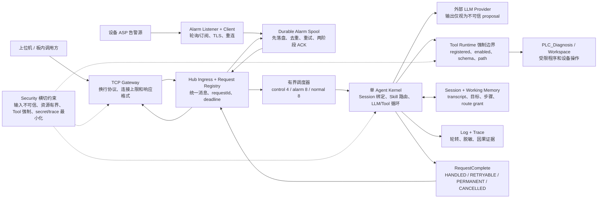
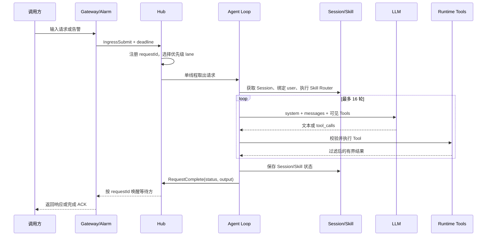
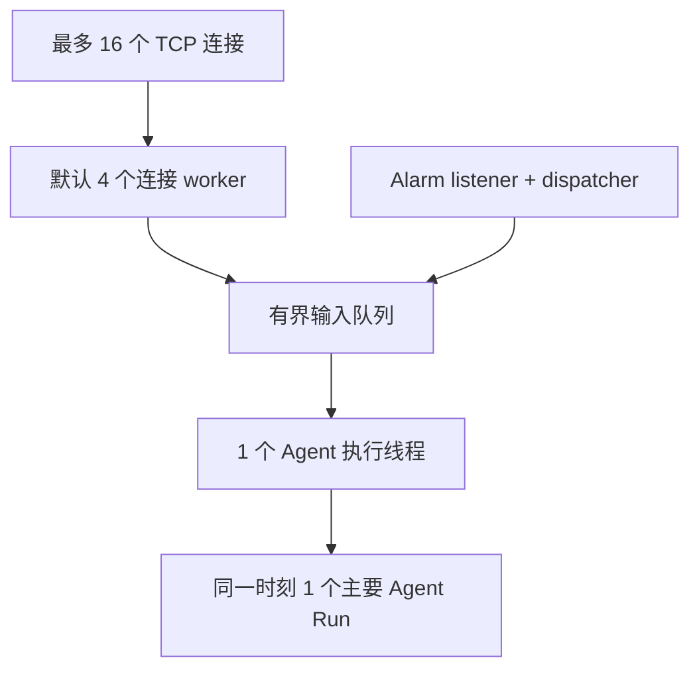

# LiteCrab 当前 Agent 总体架构

本文描述当前代码实际运行的模块，而不是未来框架设想。SD5091 上正式运行单元只有 `litecrab_server`；配置和 Skills 由板端目录提供。

## 1. 总体组件

## 2. 模块和代码映射

| 模块 | 主要代码 | 当前职责 |
|---|---|---|
| Config/Main | `src/config/config.c`、`src/main.c` | 合并配置、初始化模块、信号停机 |
| Gateway | `src/gateway/tcp_line.c` | TCP 行协议、连接池、网络请求转换 |
| Hub | `src/hub/hub.c` | 三通道调度、同步响应、取消和 deadline |
| Kernel | `src/kernel/kernel.c`、`src/kernel/llm.c` | 单 Agent 主循环、上下文、模型调用、Tool 迭代 |
| Skill | `src/kernel/skill.c` | Skill Registry、Router、Run 状态和恢复 |
| Runtime | `src/runtime/runtime.c`、`builtin_tools.c` | Tool schema、参数校验、执行和过滤 |
| Session | `src/session/session.c`、`working_memory.c` | 对话、用户归属、工作状态和持久化 |
| Alarm | `src/alarm/*` | ASP 接入、告警解析、spool、重试和 ACK |
| Observability | `src/observability/observability.c` | 文本日志、Trace、轮转和 flush |
| JSON Utility | `src/util/json.c` | 严格 JSON 校验、零拷贝 token、类型提取和有界 JSON 构建 |

## 3. 一次请求的完整执行流

## 4. 当前核心不变量

- 输入、队列、响应、Session、日志、告警和 Tool 输出都有固定容量或截止时间。
- 所有同步响应按 `requestId` 定向交付；客户端离开后迟到响应被释放。
- 告警必须先持久化，再交给 Agent；Agent 未完成时重启可以恢复。
- Gateway 连接线程、Agent 线程和告警线程都可 join，不使用 detached 常驻线程。
- Tool 只能通过 Runtime 注册表执行；参数必须匹配 Tool schema。
- Skill 正文只在选中后通过 `skill_read` 加载，普通基础请求不暴露 Skill Tool。
- 持久 Session 绑定首次 `userId`，临时连接 Session 不写 Flash。
- 正式安装树只包含 `litecrab_server`，运行数据落在板端 workspace。

## 5. 当前并发模型

连接并发不等于 Agent Run 并发。当前单 Agent 线程降低了状态竞争，但慢 LLM 或 Skill 会造成队头阻塞；三通道 Scheduler 只能决定下一个请求，不能抢占正在运行的请求。

## 6. 完成和错误语义

| 状态 | 产生条件 | 调用方行为 |
|---|---|---|
| `HANDLED` | 最终文本不是 `ERROR:` | TCP 返回结果；告警进入两阶段 ACK |
| `RETRYABLE` | LLM、deadline、Session 容量、取消等暂态失败 | TCP 返回错误；告警受限重试 |
| `PERMANENT` | 其他确定性 `ERROR:` | TCP 返回错误；告警进 dead-letter |
| `CANCELLED` | 停机取消 | 保留未完成责任，后续恢复 |

当前分类仍依赖文本前缀，后续应改为结构化完成结果。对告警而言，`HANDLED` 只表示 Agent 已处理消息，不表示设备故障已消失。

## 7. 启动和停机

启动顺序：Config → Log/Trace → Agent/Runtime/Session/Skill → Alarm → Gateway。

停机顺序：停止 Gateway accept → 取消同步请求并 join 连接 worker → Alarm quiesce → 停止 Agent/LLM/Runtime → 停止 Alarm dispatcher → 关闭日志。

板内其他进程是 LiteCrab 的进程 Owner，负责拉起、关闭、重启和连续失败退避。该管理接口目前尚未落地，不能依赖 LiteCrab 自己在停止状态下提供管理能力。

## 8. 现阶段主要问题

1. `shell` Tool 尚未使用 `exec_program` 的完整资源隔离，正式部署前应禁用或整改。
2. TCP 没有认证，默认 loopback 不能直接等同于可安全远程访问。
3. Skill 缺少跨告警、跨重试的持久 remediation ledger，外部修改可能重复发生。
4. Agent 单线程、固定连接池和整块 LLM 响应缓存仍是过渡架构。
5. health/metrics、板内管理 API、告警聚合和 dead-letter 管理 API 未完成。
6. WSL 测试不能代替 SD5091 上的断电、磁盘满、网络风暴和 72 小时 soak。

各模块细节从 [`current_architecture_index.md`](current_architecture_index.md) 进入。
