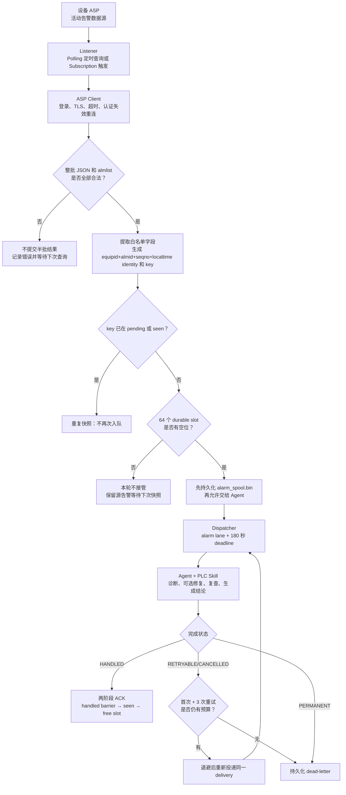
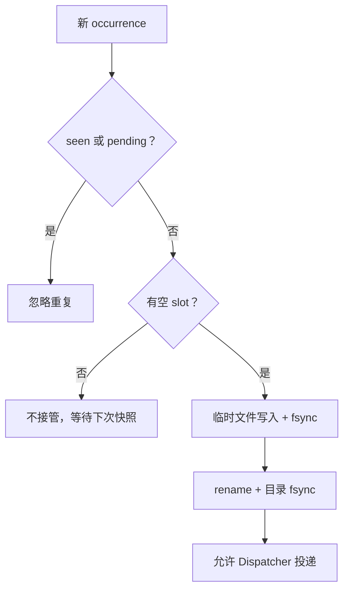
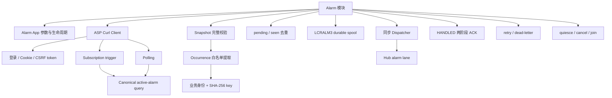
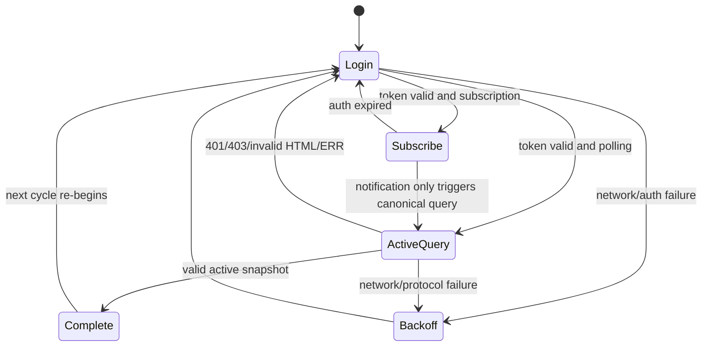
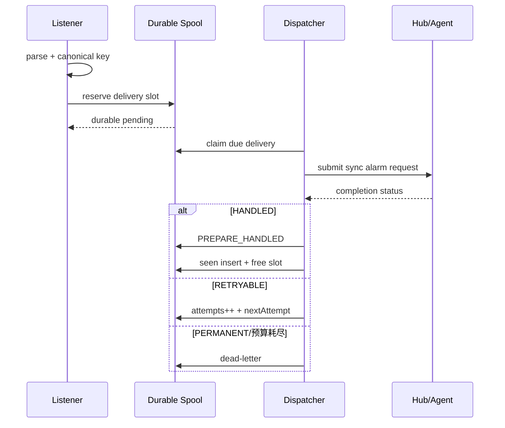

# Alarm 模块架构设计

## 1. 职责边界

Alarm 模块负责从 ASP 接收活动告警、生成稳定身份、持久化、去重、投递 Agent、等待完成状态、重试和重启恢复。它不负责判断根因、修改设备参数、验证物理故障是否消除或回滚 Skill 操作。



## 2. 子模块

| 子模块 | 文件 | 实现 |
|---|---|---|
| App 适配 | `alarm_app.c` | 默认值、CLI、凭据检查、创建/销毁 Client 和 Service |
| HTTP Client | `asp_client.c` | libcurl 请求、TLS/CA、认证过期和取消 |
| Polling | `polling/polling.c` | 活动告警接口路径、字段白名单、身份 key |
| Subscription | `subscription/subscription.c` | 订阅接口路径，与 polling 共用后续投递 |
| Parser | `alarm_notify.c` | JSON 验证和 canonical SHA-256 key |
| Service | `alarm_service.c` | listener、dispatcher、spool、ACK、重试、dead-letter |

## 3. 接收和重连

- 默认 polling 间隔 5 秒，subscription 响应结束后快速重新建立。
- I/O tick 默认 100 ms，便于检查取消。
- 网络或认证错误从 1 秒开始指数退避，最高 60 秒。
- 收到快照后先验证整个 `almlist`；任何 occurrence 缺关键字段时拒绝整批，避免部分接收。
- 每条告警提取给 Agent 的白名单摘要，不持久化完整 ASP raw body。

## 4. Durable spool

路径默认为 `<workspace>/.crab/alarm/alarm_spool.bin`，格式版本 `LCRALM3`。固定保存 64 个 delivery slot和 1,024 个 seen key。



spool 不可写时不会把责任交给 Agent，Dispatcher 只重试持久化且不消耗 Agent attempt。

## 5. 投递、ACK 和恢复

告警以 high priority、同步响应、180 秒 deadline 提交 Hub。初始执行加 3 次重试，总计最多 4 次；Agent retry 默认间隔 1 秒。

`HANDLED` 使用两阶段提交：先持久化 `handled=1` 作为 replay barrier，再把 key 加入 seen、释放 slot 并持久化。第一阶段完成后即使进程中断，重启也只补 ACK，不再运行 Skill。

未收到 `HANDLED` 时属于 at-least-once：重启会再次执行 Agent。因此 Skill 的外部写操作必须自行幂等。

## 6. 停机

1. `Quiesce` 阻止新接收和新投递。
2. 取消 listener 当前 HTTP 操作。
3. 取消正在等待的 Agent request。
4. 5 秒内 join listener。
5. 设置 stopping 并 join dispatcher。
6. 未 ACK delivery 保留在 spool，供下次启动恢复。

## 7. 完成语义

`HANDLED` 只表示 Agent 已产生非 `ERROR:` 的最终结果，不表示告警已消失。参数写入成功而活动告警仍存在时，Step 4 可以完成消息 ACK，但 Skill 必须把“问题修复未通过”写入总结并停止后续自动修改。

## 8. 当前限制

- 不聚合同设备/同修复目标的不同告警，可能触发同一参数连续修改。
- 未完成 Skill 的 at-least-once 重放可能重复副作用，缺少 mutation ledger。
- dead-letter 没有查询、重放、清理 API，会持续占用 slot。
- 固定 64 条队列没有 overflow health 指标或风暴摘要。
- Agent 完成分类依赖自然语言 `ERROR:` 前缀。
- listener 重连是指数退避，Agent delivery retry 当前是固定 1 秒，两者不要混淆。

## 9. 关键测试

- `tests/test_alarm.c`：spool、ACK barrier、重启恢复、dead-letter和停机。
- `tests/test_alarm_e2e.py`：polling/subscription 到 Agent 的完整链路。
- 实际轨迹分析见 [`../deployment/sd5091_long_running/alarm_trace_20260911_003858_analysis.md`](../deployment/sd5091_long_running/alarm_trace_20260911_003858_analysis.md)。

## 10. 完整子功能结构



## 11. 配置与 App 适配

`AlarmAppOptions` 把 Alarm 是否启用和 `AlarmConfig` 与通用 Config 分离。默认值和 CLI 包括模式、base URL、用户名、密码、CA、insecure TLS 以及启停开关。正式启动要求 base URL、user 和 password 完整；spool 目录未显式指定时由 `main` 派生为 `<workspace>/.crab/alarm`。

| 子功能 | 实现 |
|---|---|
| 默认配置 | polling、io tick 100 ms、poll 5 s、long poll 120 s、delivery retry 1 s |
| Client 工厂 | `AspAlarmClientCurlCreate` 校验 URL/凭据并初始化 libcurl multi/easy |
| Service 创建 | `AlarmServiceInit` 校验 vtable、创建 mutex/monotonic condition、加载 spool |
| 启动 | 先 dispatcher，后 listener；listener 创建失败会停止已启动 dispatcher |
| 停机 | App 先 Quiesce，再由主程序停止 Agent，最后 Stop dispatcher |
| Secret 清理 | client destroy 和 service destroy 对内存中的 password 清零 |

## 12. ASP Client 子模块



| 子功能 | 当前实现 |
|---|---|
| HTTP engine | libcurl multi；`begin` 只发起，不阻塞登录 |
| 登录 | POST `/action/login`，cookie engine 留存 cookie，响应中提取 token |
| 授权 | 后续 GET 使用 `x-csrf-token`；token 含 CR/LF 时拒绝 |
| Polling | 固定活动告警 URL；一次完成后等待 poll interval |
| Subscription | 长轮询只作为变化触发，收到通知后必须再查活动告警 |
| TLS | 默认校验证书和主机；可配 CA；`insecureTls` 仅供明确授权的设备环境 |
| 网络限制 | connect 5 s；普通请求 15 s；subscription 使用 long-poll deadline |
| 响应限制 | body 最大 64 KiB；禁止跟随 redirect |
| 可取消 | atomic cancelled + 100 ms 内 multi poll 返回检查 |
| 重连 | listener 从 1 s 指数退避至 60 s；成功后重置 |

## 13. Snapshot 与 occurrence 解析

活动响应必须同时满足：根 JSON、`errcode` 为 OK/0、`almlist` 为数组。Service 先遍历整个数组验证每一项，再第二遍接收；任一 occurrence 缺少关键字段会拒绝整批，避免半批进入 durable spool。

每条 occurrence 的稳定业务身份为：

```text
equipid + almid + seqno + localtime
```

这四项组成 canonical JSON，再由 `AlarmNotifyParse` 生成 SHA-256 key。描述、建议和位置变化不会改变同一次 occurrence 的 key；`localtime` 变化表示新发生。

转交 Agent 的白名单字段包括 alarm ID/name/reason/reason code、equipment ID/type/name、sequence、level、time、选中的 subReason/subRepair。控制字符转空格，每个字段有字节上限；完整 ASP raw body 只在当前请求内短暂存在，不写 spool、不传给 Agent。

## 14. 内存与磁盘结构

```text
AlarmService
├── listener / dispatcher + running flags
├── quiescing / stopping
├── sequence / activeRequestId
├── Delivery[64]
│   ├── used / deadLetter / handled / attempts / nextMs
│   ├── delivery id
│   └── AlarmNotify(key + message)
└── seen[1024] + seenCount + seenNext

AlarmSpoolFile (LCRALM3)
├── magic/version/recordCount/seenCount/seenNext
├── AlarmSpoolRecord[64]
└── seen keys[1024]
```

seen 满后使用环形覆盖，不是无限历史。Delivery slot 满时不接管新 occurrence，依赖下次活动快照再次发现；这保证“未持久化就不确认接收”，但当前缺少明确 overflow metric。

## 15. Durable spool 和 ACK 状态机

```mermaid
stateDiagram-v2
    [*] --> NewOccurrence
    NewOccurrence --> Ignored: key in seen or pending
    NewOccurrence --> Pending: free slot + spool saved
    NewOccurrence --> Deferred: queue full
    Pending --> Pending: spool unavailable; no Agent attempt consumed
    Pending --> InFlight: attempts++ + sync Ingress
    InFlight --> HandledBarrier: completion HANDLED
    HandledBarrier --> Acked: seen updated + slot freed + second fsync
    HandledBarrier --> HandledBarrier: persistence retry only; no Skill replay
    InFlight --> Pending: retryable/timeout/Ingress busy
    InFlight --> DeadLetter: permanent completion
    Pending --> DeadLetter: four total attempts exhausted
    DeadLetter --> [*]: retained in spool
    Acked --> [*]
```



spool 写法为 0600 临时文件→完整写入→`fsync(file)`→rename→`fsync(directory)`。HANDLED 第一次保存 `handled=1`，形成 replay barrier；第二次更新 seen 并释放 slot。第二次失败会还原 slot 为 handled 状态，后续只重试持久化，不再调用 Agent。

## 16. Dispatcher 子功能

| 条件 | 行为 |
|---|---|
| `handled=1` | 只运行 ACK finalize |
| `attempts >= 4` | 标记 dead-letter 并持久化 |
| spool 当前不可写 | 延迟 1 秒；不增加 attempts，不提交 Hub |
| 可以投递 | attempts++，high priority、sync、`alarm:asp`、Session=delivery id、deadline 180 s |
| completion HANDLED | 两阶段 ACK |
| completion PERMANENT | 立即 dead-letter |
| RETRYABLE、timeout、cancel | `nextMs=now+retryDelay` 后重试 |
| Ingress lane/registry busy | 同上，属于一次已计数尝试 |

Alarm retry 固定 1 秒；它和 ASP listener 的 1～60 秒指数重连是两套不同机制。

## 17. Step 4 与 Skill 的责任边界

Alarm/Step 4 只判断 Agent 请求是否完成，不判断 PLC 修复是否真的消除故障。Skill 输出“参数写入成功，但活动告警仍存在”是一个完整、可交付的诊断结论，因此 Kernel 分类为 HANDLED，Alarm 可以 ACK 该 occurrence。

后续是否继续尝试其他原因、是否回滚已经写入的参数、是否允许再次修改，必须由 PLC_Diagnosis 的原因分支和未来 mutation ledger 决定。Alarm 不应在看见告警仍存在后自行重放同一修复，否则可能造成重复递增。

## 18. 恢复与尚缺能力

- 重启加载 spool；普通 pending 重新执行，属于 at-least-once。
- handled barrier 记录只补 ACK，不重放 Skill。
- dead-letter 永久占用 slot，尚无查看、重放或清理 API。
- 没有按设备/修复目标聚合告警，两个不同 occurrence 可能触发同一参数修改。
- 没有全局 mutation ledger，Skill 外部写操作仍需自身保证幂等。
- spool 没有 checksum；通过 magic/version/固定尺寸识别，不足以发现所有位翻转。

## 19. 能力设计与示例

### 19.1 ALM-01：从 ASP 获得同一语义的活动告警快照

Polling 和 Subscription 只决定“何时触发查询”，随后都进入同一个活动告警解析与投递链。Client 负责登录、HTTP/TLS、超时和认证过期；Parser 负责确认整批 JSON 有效并提取白名单字段。

设计要求是整批先验证后提交。若响应包含 20 条告警但第 12 条结构损坏，本轮不能先提交前 11 条再失败，否则重试时会形成难以解释的半批状态。

### 19.2 ALM-02：为一次告警 occurrence 生成稳定身份

业务身份由 `equipid + almid + seqno + localtime` 组成，canonical 内容再生成稳定 key。相同 occurrence 在重复轮询中命中 pending 或 seen 索引，不会重复创建 delivery；字段发生变化则视为新的 occurrence。

示例：同一活动告警连续出现在 12 次 polling 结果中，只形成一个 pending delivery。若设备产生新 seqno，即使 almid 相同，也形成新的 delivery。

### 19.3 ALM-03：先落盘再投递

新 occurrence 必须先写入固定大小 spool slot 并同步元数据，随后 Dispatcher 才能提交 Hub。这保证服务在“发现告警”与“Agent 开始处理”之间崩溃时，重启仍能找到未完成责任。



### 19.4 ALM-04：通过两阶段 HANDLED ACK 避免错误丢失

HANDLED 后不能先释放 delivery 再记录 seen，否则中间崩溃会让同一告警再次成为全新任务。当前流程先持久化准备状态，再写 seen 并释放 slot；恢复代码能够识别中间状态并完成收敛。

这里的 ACK 只表示“Agent 已处理这条消息并给出结论”。例如 PLC 参数写入成功但目标告警仍存在，Agent 的结论仍可被可靠保存并 ACK；物理告警是否清除不由 spool 判断。

### 19.5 ALM-05：对暂态失败执行有界重试

`RETRYABLE` 才进入退避。单条 delivery 最多执行首次尝试加 3 次重试，并受 180 秒总 deadline 约束。资源满、Agent 暂态失败或等待超时可以重试；确定性协议/业务错误进入 dead-letter。

“Agent 诊断失败，可重试”不是指设备修复失败就自动再改一次参数，而是 Agent 请求由于 LLM 暂态错误、Hub 容量、deadline 或服务取消等原因没有形成可靠结论。是否再次执行具有副作用的修复由 Skill 自己约束。

### 19.6 ALM-06：重启恢复和停机责任

启动时扫描 spool，恢复 pending、重试、prepared handled 和 dead-letter 元数据。停机先 quiesce listener，禁止新 delivery，再取消或等待正在分发的请求，最后 join dispatcher。未完成 delivery 保留在 spool，不能因进程退出被标记 handled。

### 19.7 失败场景示例

| 场景 | Alarm 模块动作 | Skill/调用方动作 |
|---|---|---|
| ASP 临时不可达 | Client 重连，不生成空快照 | 无 |
| spool 已满 | 拒绝新增并记录资源错误 | 运维处理积压/dead-letter |
| LLM 请求超时且未执行写入 | 标记 retryable，按预算重投 | Skill 下一次重新诊断 |
| 写入成功、告警仍存在 | 接收 Agent 的处理结论并完成 ACK | Skill 停止二次递增，报告问题未修复 |
| 写入结果不确定 | Alarm 不自行判断和回滚 | Skill 先 readback，再决定停止/补偿 |

## 20. 能力状态

| 能力 | 状态 | 当前边界 |
|---|---|---|
| Polling/Subscription、解析和稳定 identity | 已实现 | 缺少告警聚合策略 |
| durable spool、恢复和两阶段 ACK | 已实现 | 单文件固定容量 |
| completion 驱动的有界重试 | 已实现 | 分类来源仍含文本启发式 |
| dead-letter 持久状态 | 已实现 | 无正式查询/重放管理 API |
| 设备修复、回滚和二次尝试 | 不属于本模块 | 由 PLC Skill 负责 |

## 21. 测试对应关系

- `tests/test_alarm.c`：解析、身份、整批拒绝、去重、spool、两阶段 ACK、持久化失败、retry/dead-letter、重启和停机。
- `tests/test_alarm_e2e.py`：polling/subscription、登录、活动查询、Hub、Agent、Skill 和 ACK。
- `tests/test_long_running_stress.py`：告警压力、超时和进程生命周期。
