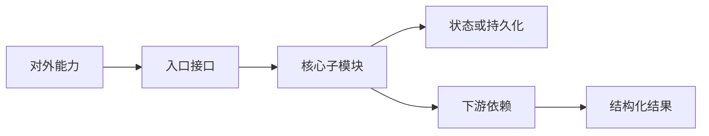

# LiteCrab 架构设计文档规范

## 1. 文档目的

本规范用于区分“代码索引”和“架构设计”。模块文档不能只列出文件、函数和流程，必须回答以下问题：模块为什么存在、对外提供什么能力、能力由哪些子模块协作完成、数据和状态由谁持有、失败后系统处于什么状态，以及调用方如何正确使用。

## 2. 每份模块文档必须包含的内容

| 章节 | 必须回答的问题 |
|---|---|
| 设计目标 | 模块解决什么问题；当前版本不解决什么问题 |
| 能力清单 | 调用方能够使用哪些能力；每项能力的输入、输出和成功条件是什么 |
| 架构边界 | 上游、下游、可信边界和禁止跨越的职责是什么 |
| 子模块结构 | 子模块如何分工、依赖方向如何、状态由谁拥有 |
| 接口与数据 | 对外接口、关键结构、持久化格式和容量限制是什么 |
| 正常执行流 | 一次成功调用如何经过各子模块 |
| 异常执行流 | 参数错误、资源满、超时、取消、重启时如何收敛 |
| 使用示例 | 给出真实输入、内部变化、输出和调用方后续动作 |
| 约束与演进 | 哪些能力已经实现，哪些只是目标，当前风险是什么 |
| 实现和验证 | 对应源文件、配置、测试和可观测事件在哪里 |

## 3. 功能点描述模板

每个功能点至少按下面六个维度展开，不使用一句话表格代替设计说明：

1. **使用场景**：谁在什么条件下需要该能力。
2. **输入契约**：必填字段、默认值、大小或格式限制。
3. **处理规则**：关键判断、状态变化、顺序和所有权转移。
4. **输出契约**：成功结果、失败分类及调用方动作。
5. **设计理由**：为什么采用当前结构，以及它避免什么问题。
6. **示例**：至少给出一个正常例子；重要副作用能力还要给出失败例子。

## 4. 图示规范

- 组件图表达职责和依赖，不把函数调用顺序塞进组件图。
- 时序图表达调用顺序、等待点和返回路径。
- 状态图表达可恢复状态和合法迁移。
- 失败流程必须画出“失败后由谁负责、是否重试、状态是否保留”。
- 图中的名称应与正文术语、代码结构和状态枚举一致。

## 5. 当前实现与目标设计的标识

模块文档使用以下三种状态，禁止把计划能力描述成已经落地：

| 标识 | 含义 |
|---|---|
| 已实现 | 当前代码存在强制执行点，并且至少有单元或集成验证 |
| 部分实现 | 主流程存在，但缺少持久化、安全、管理或异常闭环 |
| 未实现 | 仅为后续架构目标，不应成为当前部署依赖 |

## 6. 审查标准

文档审查必须同时通过四类一致性检查：

1. 文档内部的组件图、流程图、功能描述和限制不互相冲突。
2. 对外能力和当前代码、配置、测试保持一致。
3. 当前实现与长期目标分开描述。
4. 同一个跨模块状态只有一个权威 Owner，例如 Request 状态归 Hub、Session 归 Session Manager、告警交付状态归 Alarm spool、物理修复流程归 PLC Skill。

