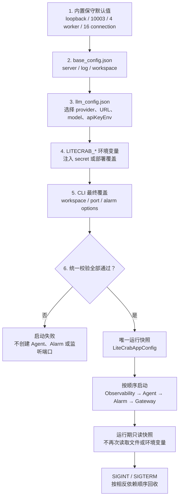
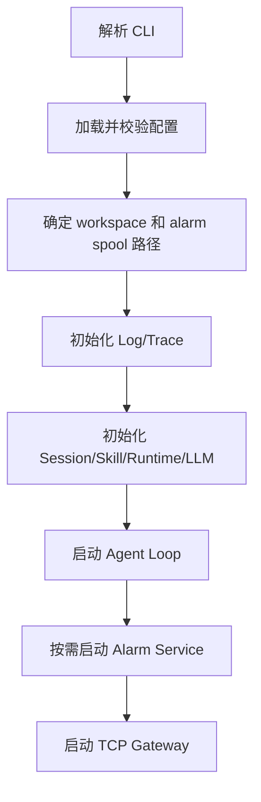
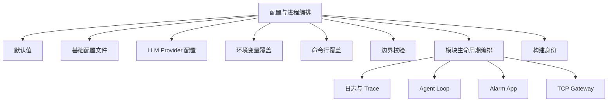
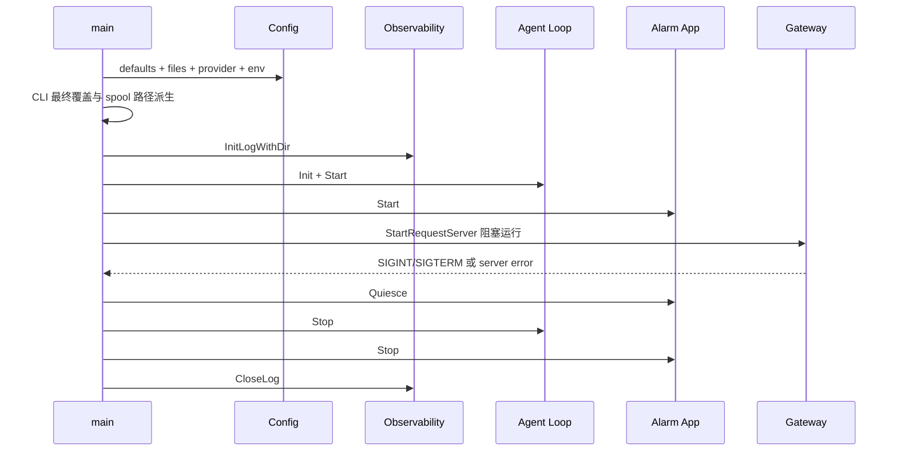
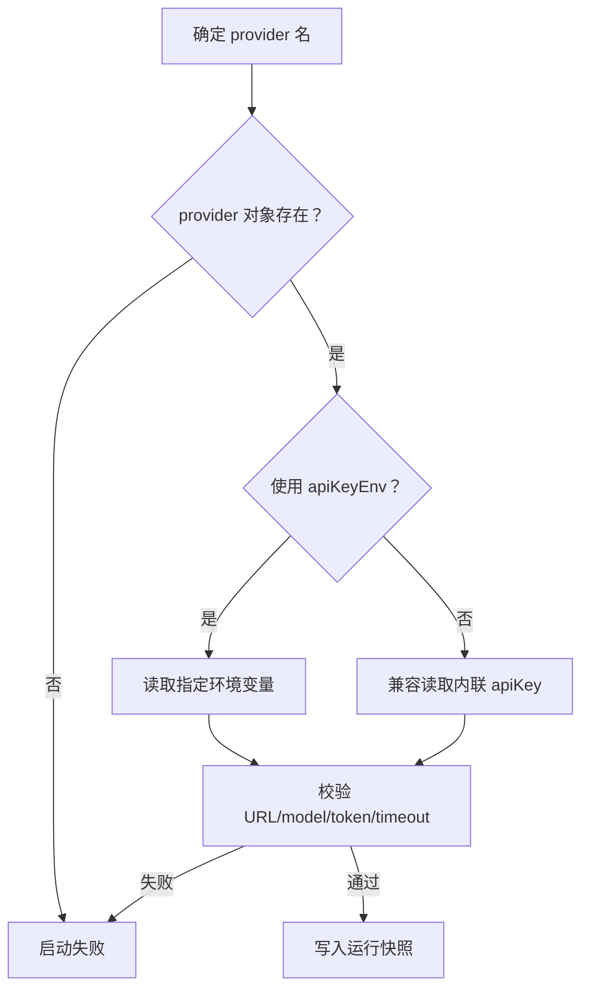

# Config 与进程编排模块架构设计

## 1. 职责

Config 模块把程序默认值、基础配置、LLM Provider、环境变量和命令行覆盖合并成 `LiteCrabAppConfig`。`main` 根据最终配置按固定顺序启动和停止各模块。



## 2. 子功能和实现

| 子功能 | 实现方式 | 关键代码 |
|---|---|---|
| 默认配置 | `LiteCrabConfigDefaults` 填入 loopback、10003、30 秒、4 worker、16 connection 等 | `src/config/config.c` |
| JSON 加载 | 解析 base 和 LLM JSON；字段缺失沿用默认值 | `load_base`、`load_llm` |
| Provider 选择 | `llm.default` 或 `--llm-provider` 选择对象 | `LiteCrabConfigLoadProvider` |
| 密钥注入 | Provider 支持 `apiKeyEnv`；也兼容环境变量覆盖 | `load_llm`、`env_text` |
| 严格校验 | 校验端口、容量、超时、URL、模型和远程绑定策略 | `validate` |
| 告警参数 | `AlarmAppParseArg` 单独解析模式、地址、凭据、CA | `src/alarm/alarm_app.c` |
| 启动元数据 | 编译时写入 Git revision 和 UTC build time，启动时记录 | `CMakeLists.txt`、`src/main.c` |

## 3. 启动流



## 4. 使用

```sh
./litecrab_server \
  --config config/base_config.json \
  --llm-config config/llm_config.json \
  --llm-provider provider_name \
  --workspace /mnt/home/enspire/litecrab \
  --no-alarm
```

常用环境变量：`LITECRAB_WORKSPACE`、`LITECRAB_LOG_DIR`、`LITECRAB_BASE_URL`、`LITECRAB_API_KEY`、`LITECRAB_MODEL`、`LITECRAB_REASONING_EFFORT`、`LITECRAB_PORT`、`LITECRAB_ALARM_URL`、`LITECRAB_ALARM_USER`、`LITECRAB_ALARM_PASSWORD`。

## 5. 限制

- `log.level` 当前未参与过滤，只读取日志目录。
- 不支持运行时热重载；配置变化需要由板内 Owner 重启进程。
- 告警配置尚未纳入统一 JSON 配置结构。
- 本地 `config/llm_config.json` 不应保存真实密钥，应使用 `apiKeyEnv` 并轮换已暴露凭据。

## 6. 关键文件

- `include/litecrab/config.h`
- `src/config/config.c`
- `include/litecrab/alarm_app.h`
- `src/alarm/alarm_app.c`
- `src/main.c`

## 7. 完整子功能结构



| 子功能 | 输入 | 内部实现 | 输出/副作用 | 失败处理 |
|---|---|---|---|---|
| 默认值初始化 | 空的 `LiteCrabAppConfig` | `LiteCrabConfigDefaults` 清零后写入保守默认值 | 可直接运行的配置快照 | 空指针直接返回 |
| JSON 文件读取 | 文件路径 | 最大 1 MiB；严格校验根节点为 object；再生成 token 数组 | `ParsedFile` | 文件、尺寸、JSON 或内存异常返回配置错误 |
| 基础配置合并 | `base_config.json` | 读取 `server`、`log`、`workspace_root` | 覆盖对应默认值 | 字段类型不正确时部分字段保持默认；关键布尔值错误直接失败 |
| LLM Provider 选择 | LLM 配置、可选 provider 名 | 优先 CLI provider，否则使用 `llm.default`；兼容 provider 根对象形式 | URL、key、model 和采样参数 | Provider 不存在或不是 object 时启动失败 |
| Secret 间接引用 | `apiKeyEnv` | 从指定环境变量取值 | API key 进入进程内配置 | 环境变量不存在时启动失败 |
| 固定环境变量覆盖 | `LITECRAB_*` | 在两个配置文件之后覆盖 | workspace/log/LLM/port 最终值 | port 当前使用 `atoi`，最终由统一校验兜底 |
| CLI 覆盖 | `--workspace`、`--port` 等 | `main` 在配置装载后覆盖 | 最终运行参数 | 未知参数、缺值、非法端口退出码 2 |
| Alarm 参数隔离 | `--alarm-*` | 委托 `AlarmAppParseArg`，不混入通用 Config 结构 | `AlarmAppOptions` | 参数无效则打印 usage 并退出 |
| 配置校验 | 合并后的快照 | 调用 Gateway bind policy，再校验端口、并发、请求和 LLM 范围 | 通过后才初始化模块 | 任一不变量失败，进程不进入半启动状态 |
| 构建身份 | CMake 注入值 | `LITECRAB_BUILD_REVISION`、`LITECRAB_BUILD_TIME_UTC` | 启动日志可定位二进制版本 | 未注入时显示 `unknown` |

## 8. 配置数据结构

```text
LiteCrabAppConfig
├── RequestServerConfig server
│   ├── listenIp / listenPort / backlog
│   ├── recvTimeoutMs / sendTimeoutMs / maxReqBytes
│   ├── workerThreads / maxConnections
│   └── allowUnauthenticatedRemote
├── workspaceRoot
├── logDir
├── llmBaseUrl / llmApiKey / llmModel / reasoningEffort
└── LlmConfig llm
    ├── 指向上面字符串缓冲区的指针
    └── maxTokens / temperature / stream / timeoutMs
```

`LlmConfig` 中的字符串是指向 `LiteCrabAppConfig` 内部定长缓冲区的指针。配置装载完必须重新绑定这些指针；不能把 `LiteCrabAppConfig` 当作可随意浅复制并长期脱离原对象使用的独立结构。

## 9. 合并优先级和字段范围


| 层级 | 当前支持字段 |
|---|---|
| 默认值 | 全部 server、workspace、log 和 LLM 参数 |
| base config | `server.*`、`log.dir`/兼容 `log.filename`、`workspace_root` |
| LLM config | provider 的 `baseUrl/url`、`apiKey/api_key/apiKeyEnv`、`modelName/model`；`llm` 下的 max tokens、temperature、stream、timeout、reasoning effort |
| 环境变量 | `LITECRAB_WORKSPACE`、`LITECRAB_LOG_DIR`、`LITECRAB_BASE_URL`、`LITECRAB_API_KEY`、`LITECRAB_MODEL`、`LITECRAB_REASONING_EFFORT`、`LITECRAB_PORT` |
| CLI | 通用配置路径/provider/workspace/port，以及 Alarm 专用参数 |

## 10. 校验不变量

| 配置项 | 当前约束 |
|---|---|
| listen address | 必须是 IPv4；非 loopback 必须显式设置 `allow_unauthenticated_remote=true` |
| port | 1～65535 |
| request | 最大 16 KiB |
| worker | 1～8 |
| connection | 不小于 worker，且不超过 64 |
| socket timeout | 100～600000 ms |
| LLM URL | 只接受 `http://` 或 `https://` |
| LLM max tokens | 1～1048576 |
| temperature | 0～2 |
| LLM timeout | 1 ms～1 小时 |

## 11. 进程生命周期实现



启动采用顺序提交：日志失败时不启动 Agent；Agent 失败时关闭日志；Alarm 失败时先停止 Agent；Gateway 返回后先阻止告警新增和取消活动告警请求，再停止 Agent，最后 join Alarm dispatcher。外部守护进程的拉起、停止与连续失败退避不在本二进制内实现。

## 12. 能力设计与示例

### 12.1 CFG-01：生成唯一、可审计的运行配置快照

**使用场景。** 运维人员通过配置文件部署通用参数，同时用环境变量注入密钥、用 CLI 临时覆盖端口或 workspace。下游模块不能各自读取环境变量，否则同一进程会出现多份配置解释。

**输入契约。** 输入依次为编译内默认值、base JSON、LLM Provider JSON、固定名称环境变量和 CLI。后层只覆盖自己声明的字段；缺失字段继承前层值。配置文件最大 1 MiB，根必须是 JSON object。

**处理与输出。** Config 在单线程启动阶段构造一份 `LiteCrabAppConfig`，完成字符串缓冲区写入、指针重绑定和统一校验后才交给 Main。此后运行中的模块只读取该快照，不再回查文件或环境变量。

**成功条件。** Provider、URL、模型、端口、容量和绑定策略全部有效。任一关键字段非法时进程在创建工作线程和监听 socket 之前退出，避免“部分模块已经启动”的不确定状态。

示例：base 文件设置端口 `10003`，环境变量设置 `LITECRAB_PORT=10004`，CLI 再传入 `--port 10005`，最终 Gateway 只监听 `10005`。启动日志中的配置摘要和后续模块使用值必须一致。

### 12.2 CFG-02：安全地选择 LLM Provider 和注入密钥

Provider 选择不是简单读取一个 URL，而是一次完整配置解析：先确定 provider 名，再从对应对象读取 endpoint、model、采样参数和认证方式。推荐配置 `apiKeyEnv`，使 JSON 只保存环境变量名，真实 key 仅进入进程内存。



失败示例：provider 引用了 `SILICONFLOW_API_KEY`，但进程环境中不存在该变量。正确行为是启动失败并报告配置错误，而不是携带空 key 启动后不断重试远端请求。

### 12.3 CFG-03：按事务式顺序启动和回收模块

Main 把模块启动看作顺序提交过程。每成功初始化一层，就记录对应清理责任；后续步骤失败时按相反方向回收已创建资源。这样可以保证端口绑定失败、Alarm 凭据缺失或 Agent 初始化失败时，不残留后台线程和打开文件。

| 失败位置 | 已获得资源 | 必须执行的回收 |
|---|---|---|
| Log/Trace 初始化 | 无或部分文件句柄 | 关闭已打开句柄 |
| Agent 初始化/启动 | Log/Trace | 销毁 Kernel、Session、Runtime，再关闭日志 |
| Alarm 启动 | Agent、Log/Trace | 停止 Agent，销毁 Alarm Client，关闭日志 |
| Gateway 运行中退出 | Agent、Alarm、Log/Trace | quiesce Alarm、取消请求、join Agent/Alarm、关闭日志 |

### 12.4 CFG-04：为外部进程 Owner 提供明确的生命周期边界

LiteCrab 只响应启动参数和 `SIGINT/SIGTERM`，不自行实现“守护自己”。板内另一个进程或以后预留的管理接口负责 start/stop/restart/backoff。连续启动失败时的退避必须发生在外部 Owner 中，因为 LiteCrab 尚未运行时不可能通过自身接口重新拉起自己。

一个典型调用是：Owner 构造环境变量与 CLI → 启动 `litecrab_server` → 监听退出状态 → 正常停止不重启，异常退出按 1/2/4/8 秒有上限退避。退避算法是目标外部接口的责任，不是当前二进制已经实现的能力。

## 13. 设计判定

| 能力 | 状态 | 判定 |
|---|---|---|
| 分层配置合并和统一快照 | 已实现 | Config API 与测试均覆盖 |
| Provider 选择与 `apiKeyEnv` | 已实现 | 当前仍兼容明文 key |
| 启动失败逆序回收 | 已实现 | Main 具有分支清理路径 |
| 运行时热重载 | 未实现 | 需要外部 Owner 重启 |
| 外部 start/stop/backoff 管理 API | 未实现 | 仅定义责任边界和预留方向 |

## 14. 测试对应关系

- `tests/test_main.c`：配置默认值、文件装载、provider、环境变量、参数范围和启动组件。
- `tests/test_security.c` / `tests/test_security_e2e.py`：loopback 默认值和远程暴露显式开关。
- `tests/test_deployment_contract.py`：正式安装树只包含 `bin/litecrab_server`，配置和 Skill 从安装树外读取。

- `config/base_config.example.json`
