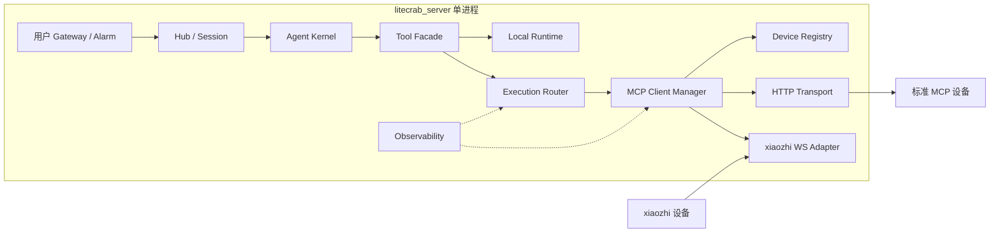
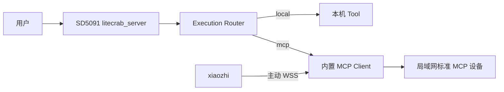
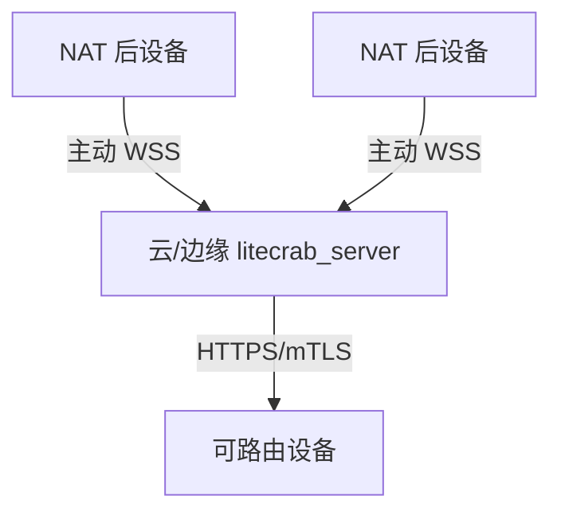
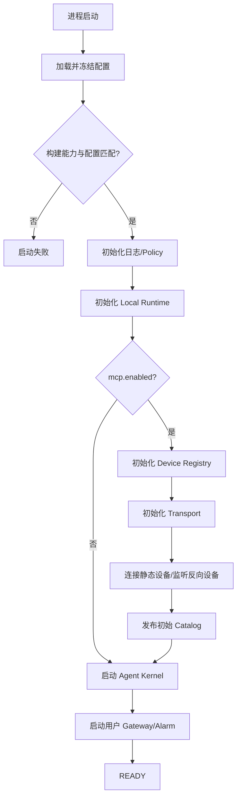
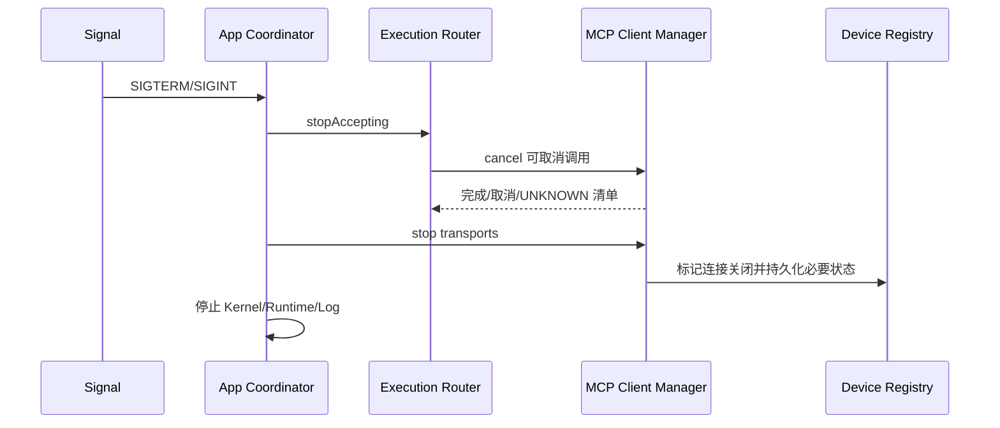

# MCP 角色、进程与部署拓扑

## 1. 子功能目标

本子功能决定 MCP 模块在什么进程中运行、不同部署环境启动哪些模块、模块失败是否影响 Agent 主功能，以及如何安全启停。部署位置可以变化，但角色不变：LiteCrab 是 MCP Host，并在进程内创建 MCP Client；设备是 MCP Server。

当前网络 MCP 调用方向固定为 `LiteCrab -> 已登记设备`。

## 2. 单进程模块架构



MCP 是 `litecrab_server` 的可选编译和启动模块，不新增 Go sidecar、Python 服务或本机 RPC。MCP 模块不可用时，本地 Runtime 仍能工作。

## 3. 运行角色

| 运行单元 | 语言 | 位置 | 必要性 | 职责 |
|---|---|---|---:|---|
| `litecrab_server` | C11 | SD5091/边缘 PC/云主机 | 必需 | Agent、本地 Tool、MCP Host/Client |
| 标准设备 MCP Server | C11 或设备原生语言 | Linux/SD5091 设备 | 按设备 | 暴露和执行设备 Tool |
| xiaozhi MCP Server | ESP-IDF C++ | ESP32 | 按设备 | 暴露屏幕、音量、摄像头等 Tool |
| 进程 Owner | systemd/板端 supervisor | Agent 所在主机 | 生产必需 | 拉起、停止、退避重启、资源限制 |

## 4. 部署拓扑

### 4.1 SD5091 本机 Tool


此拓扑不需要 MCP。构建时可关闭 MCP，运行行为退化为当前 Agent。

### 4.2 SD5091 控制其他设备



本机能力仍走 local；只有其他设备的能力走 MCP，避免本机 HTTP 回环和重复业务实现。

### 4.3 无云局域网

Agent 运行在一台 Linux PC、WSL 主机或 SD5091；设备使用局域网地址接入。没有云服务器不影响 MCP。若使用 WSL，必须确认设备能访问 Windows 转发后的监听端口。

### 4.4 云/边缘中心



标准 HTTP 设备必须可从 Agent 主机路由到达；NAT 后设备使用反向连接适配器。

## 5. 启动流程



`mcp.required=false` 时，MCP 初始化失败只把 MCP 模块标记为 degraded，Agent 仍以本地 Tool 启动；`required=true` 时失败阻止 READY。

## 6. 停机流程



写操作已经送达但未确认结果时记录 `UNKNOWN`。停机流程不能把 UNKNOWN 改成失败并触发自动重试。

## 7. 线程与资源基线

MCP 首期使用有界线程/连接模型：一个连接管理线程、HTTP 调用使用受限 worker、反向连接使用固定上限，不为每个请求无限创建线程。

建议初始值：

| 项目 | SD5091 初始值 |
|---|---:|
| 静态设备 | 8 |
| 反向连接 | 8 |
| 全局 MCP 在途调用 | 4 |
| 单设备在途调用 | 1 |
| Tool 总数 | 128 |
| MCP 请求/结果 | 各 256 KiB |

最终数值必须经过 SD5091 真机 RSS、FD、线程和长稳测试后固化。

## 8. 配置示例

```json
{
  "mcp": {
    "enabled": true,
    "required": false,
    "max_inflight": 4,
    "reverse": {
      "enabled": true,
      "listen_ip": "0.0.0.0",
      "listen_port": 8444
    }
  }
}
```

## 9. 验收

- MCP 关闭时只运行本地 Tool，行为与当前版本一致。
- MCP optional 初始化失败时 Agent 仍能 READY。
- MCP required 初始化失败时进程拒绝 READY。
- 单设备故障不影响本地 Tool 和其他设备。
- 停机期间不接受新调用，线程可 join，无 detached 常驻线程。
- SD5091 上单进程完成启动、重连、停机和资源高水位测试。

## 10. 当前状态

未实现。当前 `main.c` 固定启动 Agent、Alarm 和 TCP Server，尚无 MCP 组件启动分支。

