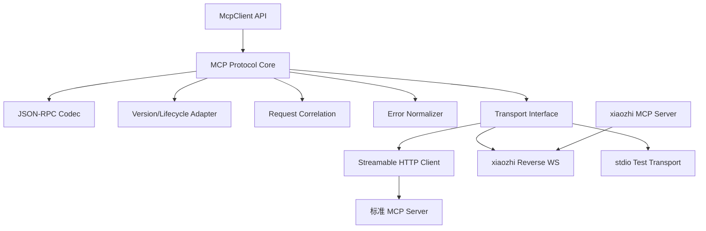
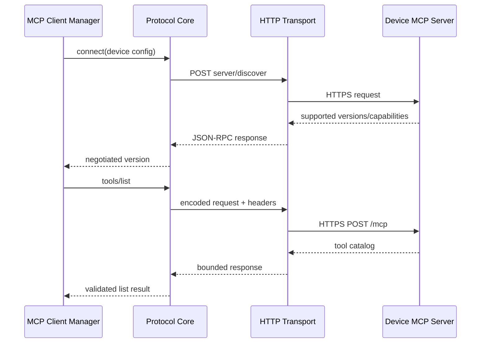
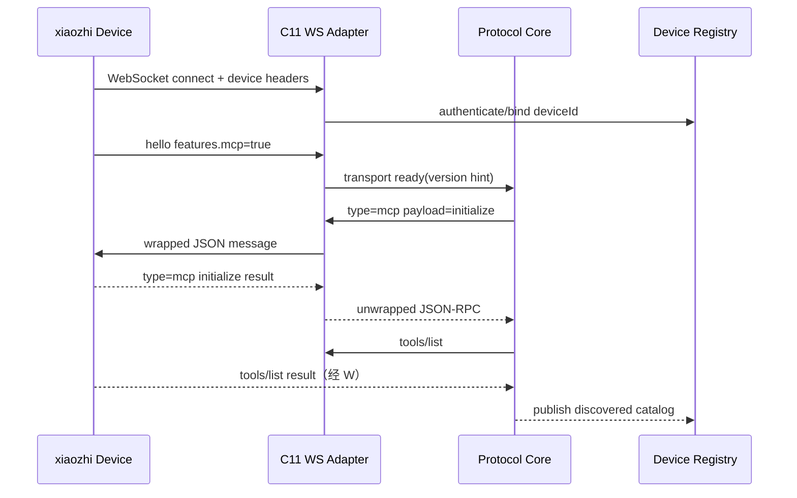
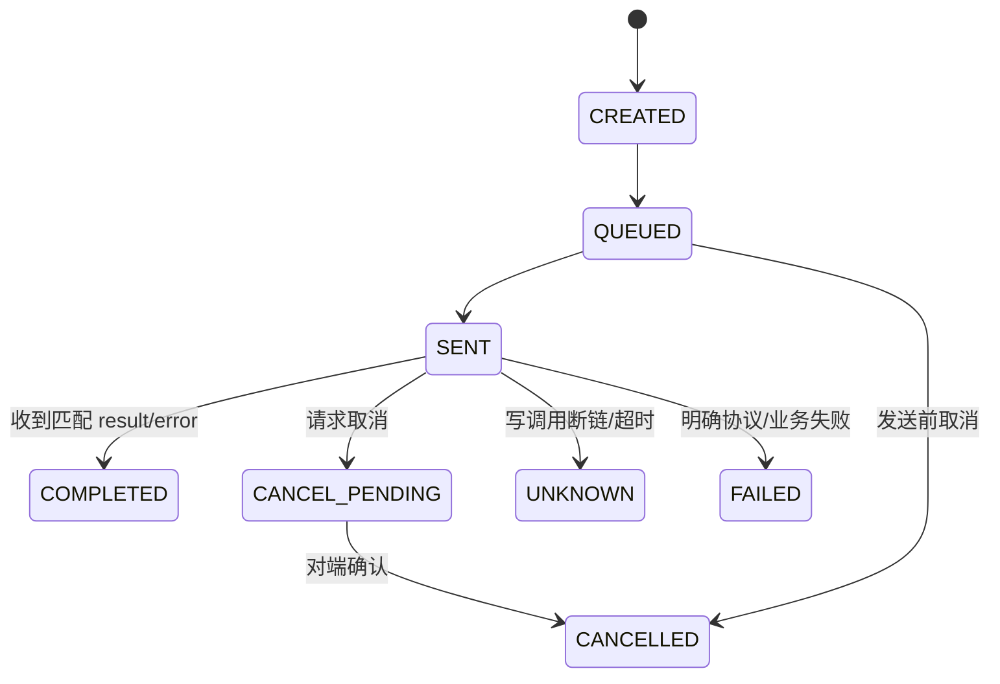

# MCP 协议与传输架构

## 1. 子功能目标

本模块在 C11 中实现有界的 MCP Client 协议核心，并把标准 Streamable HTTP 与 xiaozhi 反向 WebSocket 隔离为不同 Transport。业务 Provider、Capability Catalog 和 Agent Kernel 不处理协议版本差异。

## 2. 组件架构



`McpTransport` 只负责发送和接收完整 MCP 消息，不解析 Tool 业务字段；Protocol Core 不直接操作 socket、curl 或 TLS。

## 3. C 接口边界

```c
typedef struct McpTransport McpTransport;
typedef struct McpClient McpClient;

typedef struct {
    int (*start)(McpTransport*);
    int (*send)(McpTransport*, const char* json, size_t len, int64_t deadline_ms);
    int (*cancel)(McpTransport*, uint64_t request_id);
    void (*stop)(McpTransport*);
} McpTransportOps;
```

Transport 接收缓冲由 Transport 持有；完成消息通过回调移交 Protocol Core。所有回调必须说明线程上下文和内存所有权。

## 4. 协议版本策略

| 对端 | 首选版本 | 生命周期 |
|---|---|---|
| 新标准设备 | `2026-07-28` | `server/discover`，请求级元数据 |
| 兼容标准设备 | `2025-11-25` | `initialize` + initialized |
| xiaozhi 固件 | `2024-11-05` | 旧版 initialize |

实现使用版本表和函数指针选择编码/生命周期，不在业务代码散落版本判断。对端返回未知版本时拒绝连接并记录支持列表。

## 5. 标准 HTTP 调用流程



HTTP Transport 复用现有 libcurl/OpenSSL 静态依赖。必须校验证书、主机名、Content-Type、响应长度、HTTP 状态和 Header/body 一致性；禁止从 Tool 参数接收 endpoint。

## 6. xiaozhi 反向 WebSocket 流程



Adapter 只处理 WebSocket 帧、`type=mcp` 外层、连接身份和 JSON-RPC requestId 关联。用户媒体和聊天消息交给其他 handler，不进入 MCP Protocol Core。

## 7. 请求关联状态机



关联表固定容量，key 为内部 64 位 requestId；旧 xiaozhi 的数字 id 由连接内序列生成。收到未知、重复或已完成 id 时丢弃并记录计数。

## 8. 消息限制

| 边界 | 行为 |
|---|---|
| 非 UTF-8/非法 JSON | 协议失败，必要时关闭连接 |
| JSON 深度/Token 超限 | 拒绝，不扩容 |
| 单消息超限 | 中止读取并标记对端异常 |
| tools/list 分页过多 | 达到页数/总字节上限后隔离设备 |
| 重复 JSON-RPC id | 拒绝或忽略，不覆盖关联项 |
| 未协商先调用 | 标准旧版本返回生命周期错误 |

## 9. 测试

- JSON-RPC request/result/error/notification 编解码向量。
- 三种协议版本生命周期互操作。
- HTTP 分片、chunked、空响应、错误 Content-Type 和超大响应。
- WebSocket masked frame、分片、ping/pong、close、畸形长度。
- xiaozhi `type=mcp` 包装、分页、断线和重复 id。
- fuzz JSON parser、frame parser 和版本协商入口。

## 10. 当前状态

未实现。LiteCrab 当前 TCP 换行协议不是 MCP Transport；xiaozhi 固件可作为 Adapter 互操作参考。

