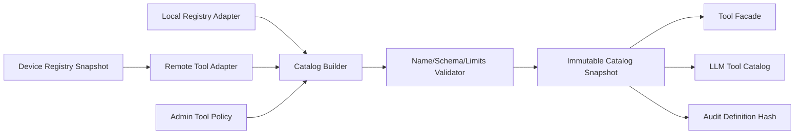
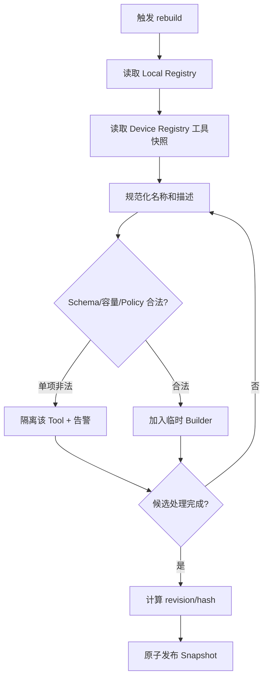
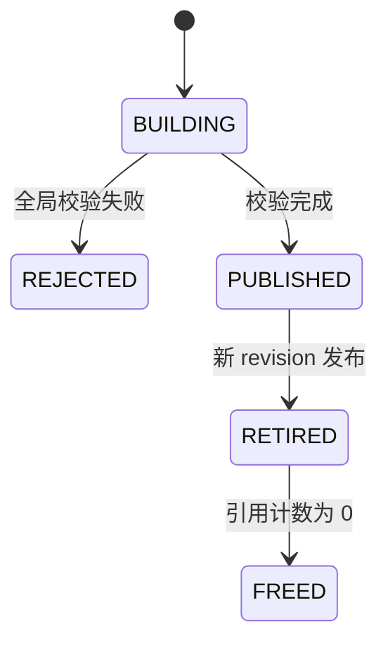

# Capability Catalog 架构

## 1. 子功能目标

Capability Catalog 把现有本地 `CrabToolRegistry` 和多个设备的 MCP Tool 合并成 Agent 可见的稳定目录。它负责定义、别名、Schema、来源和版本，不执行 Tool，也不判断网络健康。

## 2. 组件架构



目录构建是完整事务：所有候选项先在临时 Builder 中验证，通过后原子发布新快照。不能边解析边修改 Agent 正在使用的目录。

## 3. 数据模型

```c
typedef enum {
    CAP_PROVIDER_LOCAL,
    CAP_PROVIDER_MCP
} CapabilityProviderKind;

typedef struct {
    char public_name[128];
    char provider_id[64];
    char remote_name[128];
    CapabilityProviderKind provider_kind;
    CapabilityRisk risk;
    uint32_t timeout_ms;
    uint8_t enabled;
    uint8_t schema_hash[32];
} CapabilityEntry;
```

Schema 与描述存入有界 arena，由 Snapshot 持有；`CapabilityEntry` 只保存 slice/offset 或受控固定字段。Snapshot 使用引用计数或代际 slot，避免更新后在途 Run 持有悬空指针。

## 4. 目录生成流程



设备某一个 Tool 非法不一定隔离整台设备；身份漂移、目录总量攻击或大量恶意 Schema 才将设备置为 QUARANTINED。

## 5. 命名策略

本地工具保持当前稳定名称。远端工具默认 publicName：

```text
device.<device_alias>.<tool_alias>
```

例如：

```text
remoteName: self.audio_speaker.set_volume
publicName: device.office_speaker.set_volume
```

映射表保存原名，调用时不能根据 publicName 字符串反向猜测。alias 只能由管理员配置或受控注册生成，设备不能自行占用其他设备命名空间。

## 6. Schema 与描述处理

- inputSchema 根必须为 object。
- 限制 Schema 总字节、深度、properties、oneOf/anyOf 分支和正则长度。
- 不加载网络外部 `$ref`。
- 设备 description 是不可信文本，限制长度并允许管理员覆盖。
- annotations 仅作显示信息，不能决定授权和自动重试。
- 无 outputSchema 时仍对实际结果执行字节和 JSON 深度限制。

## 7. 快照生命周期



Agent Run 创建时记录 catalogRevision；同一 Run 的后续 Tool Call 必须使用同一快照。设备离线后，新 Run 不再看到对应工具；旧 Run 调用时 Router 返回 UNAVAILABLE。

## 8. 容量与并发

目录写入只由 Catalog Coordinator 串行执行，读取使用不可变快照，无需全局长锁。达到设备数、工具数或 arena 上限时拒绝新增项，不驱逐在途 Run 所用快照。

## 9. 验收

- 本地 Tool 名、Schema 和行为不回归。
- 两台设备同名 Tool 能映射为不同 publicName。
- 非法 Schema、超长描述、外部 `$ref` 被隔离。
- 更新目录期间并发调用不崩溃、不读悬空内存。
- 相同输入得到确定排序和相同 revision hash。
- 设备离线后新旧 Run 行为符合快照规则。

## 10. 当前状态

未实现。当前 `CrabToolRegistry` 是固定容量本地数组，没有 Provider、远端名称、定义 hash 或目录 revision。

