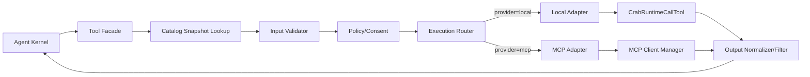
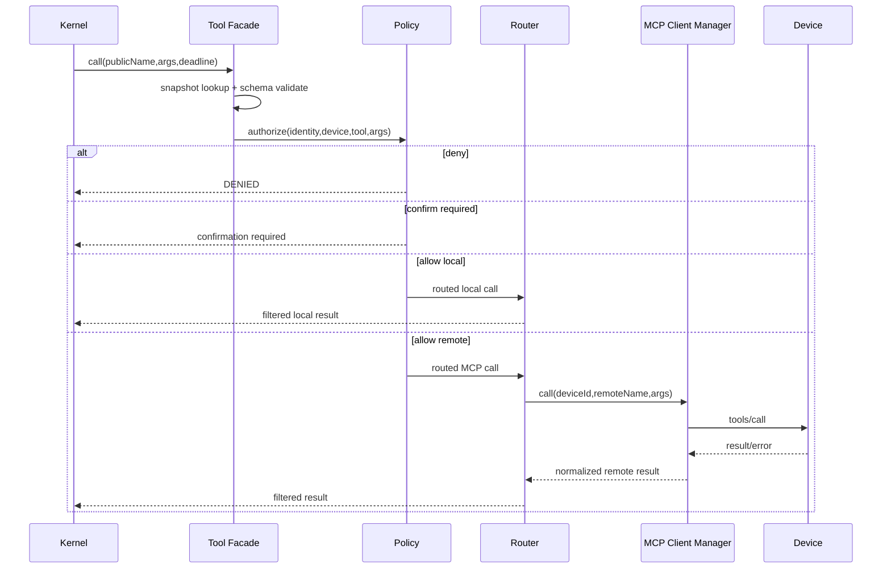
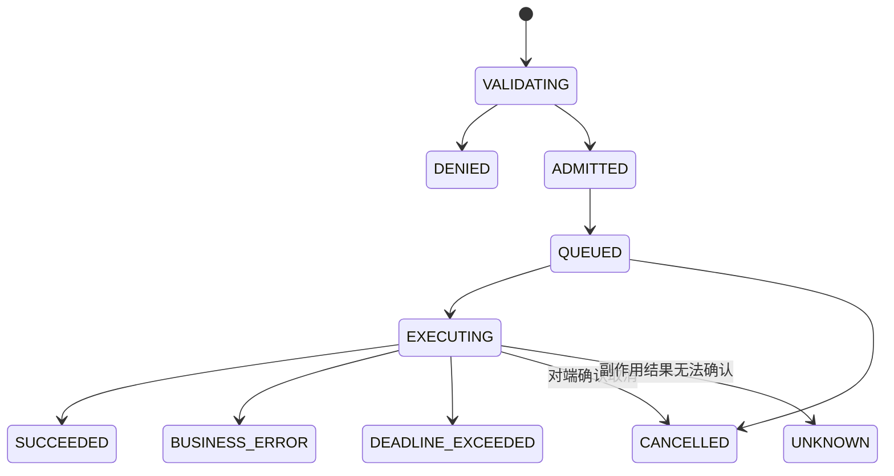

# Tool Execution Router 架构

## 1. 子功能目标

Execution Router 是 Agent Kernel 调用 Tool 的唯一执行入口。它保持当前 Runtime 的校验和输出边界，并在不让 Kernel 感知网络的前提下选择本地或 MCP Provider。

## 2. 组件架构



Policy 在路由前执行，Provider 不能通过改变返回信息绕过授权。远端结果进入 Kernel 前必须经过与本地结果等价的过滤和容量限制。

## 3. 调用数据

```text
RoutedCall
  requestId
  traceId
  operationId（写调用）
  catalogRevision
  publicName
  providerId
  remoteName
  arguments
  callerIdentity
  deadlineMs
  riskClass
```

Router 不重新查询“最新目录”；它按 RoutedCall 指定的 revision 查找，从而保证一次 Agent Run 的工具定义稳定。

## 4. 主调用流程



## 5. 调用状态机



## 6. 统一终态

| 终态 | 含义 | 自动重试 |
|---|---|---:|
| SUCCEEDED | 明确完成 | 否 |
| BUSINESS_ERROR | Provider 明确业务失败 | 仅显式策略 |
| DENIED | Policy/确认拒绝 | 否 |
| INVALID_ARGUMENT | 参数或 Schema 不合法 | 否 |
| UNAVAILABLE | 发送前确定不可达 | 只读可限次 |
| RESOURCE_EXHAUSTED | 队列/并发/容量已满 | 只读可退避 |
| DEADLINE_EXCEEDED | 总期限耗尽 | 取决于是否送达 |
| CANCELLED | 已确认未继续执行 | 否 |
| UNKNOWN | 设备可能已产生副作用 | 禁止盲重试 |

## 7. Deadline 分配

```text
总 deadline
  ├─ admission/queue budget
  ├─ transport connect/send budget
  ├─ provider execution budget
  └─ response/filter budget
```

每层使用剩余绝对 deadline，不创建新的完整超时。排队时已经过期的请求不发送到设备。

## 8. 幂等、取消和重试

- readonly：只有发送前失败或明确未执行时才能自动重试。
- mutating/destructive：必须携带 operationId，断链后先查询状态。
- JSON-RPC requestId 只做消息关联，不是业务幂等键。
- 取消必须等待 Provider 确认；否则终态为 UNKNOWN。
- 不在 HTTP、Protocol 和 Router 三层重复重试，只由 Router 策略统一决定。

## 9. 背压与隔离

Router 持有全局和每设备 semaphore。单设备队列满时只拒绝该设备调用；本地 Tool 使用独立预算。熔断打开后不再向故障设备排队，只允许受控健康探测。

## 10. 验收

- local/mcp 相同契约产生语义等价结果。
- 设备离线不阻塞本地 Tool。
- deadline 在排队、连接和执行各阶段都能收敛。
- 写调用断链得到 UNKNOWN，且不会自动重发。
- 队列/并发满时快速返回，不出现无界内存。
- Result 经过过滤后才进入 LLM 上下文。

## 11. 当前状态

未实现。当前 Runtime 在注册表查找后直接执行本地函数。
