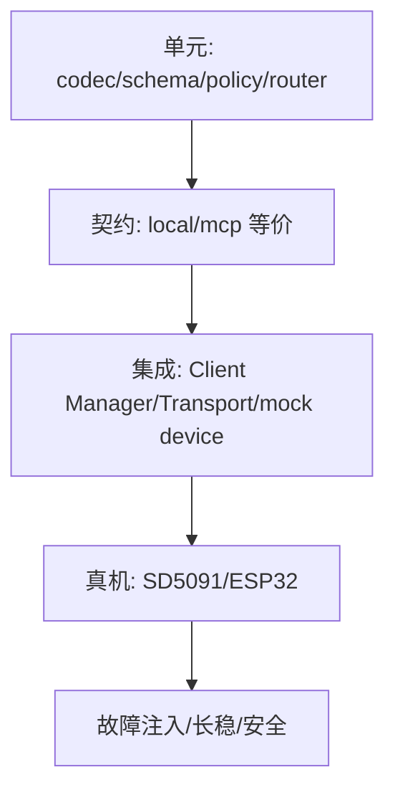

# MCP 实施与测试计划

## 1. 里程碑

### M0：统一能力契约

新增 CapabilityEntry、ToolBinding、RoutedCall、NormalizedResult；本地 Tool 通过 Local Adapter 回归，网络端口保持关闭。

### M1：C11 MCP Client MVP

在 `litecrab_server` 内实现 C11 Protocol Core、MCP Client Manager 和 stdio mock MCP Server。Agent 能发现并调用一个只读 echo/status 工具。

### M2：标准设备

实现 Streamable HTTP Client、Device Registry、现代协议和 `2025-11-25` 兼容；接入一个 Linux/SD5091 mock 设备。

### M3：xiaozhi

实现反向 WSS 和 `2024-11-05` Adapter，发现固件工具并调用只读状态/安全音量工具。

### M4：安全闭环

mTLS/设备 Token、Host/Origin、ACL、确认、限流、SSRF 防护、审计。完成前不开放写 PLC、升级、重启和 Shell。

### M5：可靠性和长任务

operationId、UNKNOWN、Tasks/Job、重启恢复、故障注入、容量和 72 小时长稳。

## 2. 测试层级



## 3. 兼容矩阵

| 协议/传输 | 必测 |
|---|---|
| 2026-07-28 Streamable HTTP | discover、list、call、headers、cache、stateless |
| 2025-11-25 Streamable HTTP | initialize、session、list、call |
| 2024-11-05 xiaozhi WS | 外层封装、分页、断线、旧 id |
| stdio | 子进程退出、stdout 污染、stderr 日志 |

## 4. 必测场景

- 恶意/超深 Schema、重复名称、Tool 数超限。
- 未认证设备、证书错配、Origin/Host 错误和 Token 重放。
- 发送前断网、送达后断网、执行中超时、结果返回前重启。
- 只读重试、写操作 operationId、UNKNOWN 不重试。
- 单设备熔断不影响本地 Tool 和其他设备。
- Agent Run 固定 catalogRevision，目录更新不改变在途调用。
- 日志/Trace 秘密扫描和正文最小化。

## 5. 交付文件

```text
src/mcp/protocol.c
src/mcp/client.c
src/mcp/device_registry.c
src/mcp/transport_http.c
src/mcp/transport_xiaozhi.c
include/litecrab/mcp.h
config/mcp/*.example.json
scripts/build_device_mcp_sd5091.sh
scripts/run_local_all_in_one.sh
tests/mcp/
```

全部 5091 侧代码使用 C11 并进入现有 CMake 构建。具体目录可在实现时调整，但职责和独立测试边界不得合并消失。

## 6. 当前状态

未开始实施。每完成一个里程碑必须更新本文状态、代码链接、实际命令和未验证硬件项。
