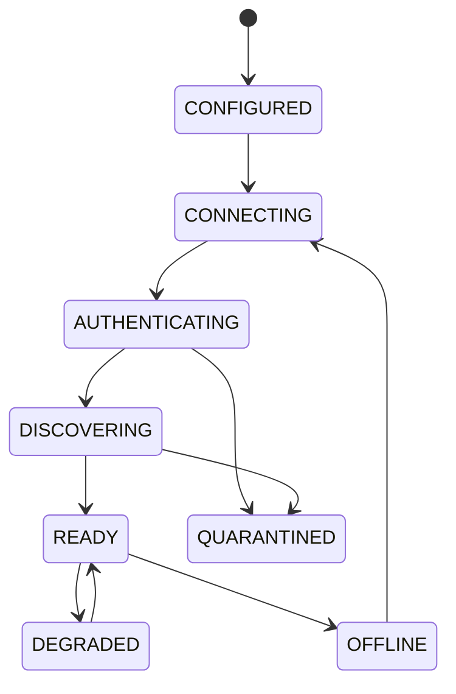

# Device Registry 与 MCP Client Manager 设计

## 1. Device Registry 状态

```text
DeviceRecord
  deviceId
  alias
  identityFingerprint
  transport
  endpoint/connectionRef
  protocolVersion
  connectionState
  healthState
  lastSeen
  catalogRevision
  toolDefinitionHashes
  circuitBreakerState
```

deviceId 不随 IP、连接或展示名称变化。设备记录来源分为静态配置、受控注册和反向认证连接；模型不能创建记录。

## 2. 生命周期



认证失败、身份漂移、恶意 Schema 进入 QUARANTINED；普通网络失败进入 OFFLINE/DEGRADED。

## 3. 进程内接口

Execution Router 通过 C API 调用 MCP Client Manager：

```text
McpClientManagerHealth
McpDeviceList
McpToolSnapshotGet
McpToolCall
McpToolCancel
McpOperationGet
```

调用结构带 requestId、traceId、deadline 和 catalogRevision，使用明确的内存所有权和固定容量。接口不接受 Agent/模型提供任意 MCP URL。

## 4. 直连设备

MCP Client Manager 从配置读取 HTTPS `/mcp` 地址，通过 mTLS 认证，协商协议版本，获取目录并周期刷新。DNS、IP 和证书变更都必须经过策略复核。

## 5. 反向设备

设备主动连接 WSS，C11 xiaozhi Adapter 完成认证后把 connectionRef 绑定 deviceId。相同设备重复连接采用单主策略：新连接只有在认证成功和旧连接关闭/租约过期后接管。

每连接维护有界 request map、发送队列和 heartbeat/idle deadline。连接断开后未送达调用为 UNAVAILABLE；已送达写调用为 UNKNOWN。

## 6. 目录刷新

首次 READY 必须成功发现最小目录。后续按 TTL、设备通知或管理员触发刷新。新目录先完整校验，再原子替换；部分解析成功不能覆盖旧的健康快照。

## 7. 健康和熔断

连续传输失败打开单设备熔断器；半开只允许健康/只读探测。MCP Client Manager 全局限制连接数、每设备并发、总在途请求和目录字节。

## 8. 持久化

静态配置和设备身份绑定持久化；活动连接和临时 catalog cache 可重建。operationId/UNKNOWN 状态需要 durable store，不能只存在内存。

## 9. 当前状态

未实现。首期建议先完成一个静态配置的标准 HTTP 设备，再增加反向注册和动态设备管理。
