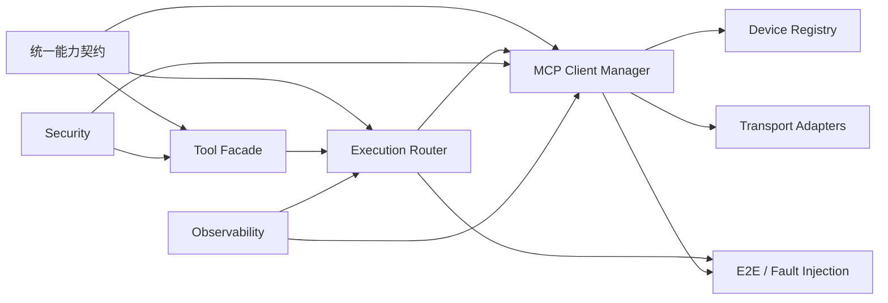

# LiteCrab MCP 设备接入子功能设计

## 1. 使用方式

本目录是 [`mcp_dual_mode_agent_architecture.md`](../mcp_dual_mode_agent_architecture.md) 的子功能设计集。目录名暂时保留用于兼容历史链接，正文不再采用“双模式 Agent”作为架构核心。

统一设计基线：LiteCrab 是 MCP Host，内置 C11 MCP Client Manager，设备是 MCP Server；用户消息和设备事件不伪装为 MCP Tool。

所有文档均为目标设计，当前状态为尚未实施。

## 2. 文档导航

| 顺序 | 子功能 | 文档 | 核心输出 |
|---|---|---|---|
| 1 | 角色与部署 | [01_deployment_modes.md](01_deployment_modes.md) | 进程角色、云/边/本地拓扑、启停 |
| 2 | 协议与传输 | [02_protocol_and_transport.md](02_protocol_and_transport.md) | 现代/旧版 MCP、HTTP、stdio、反向连接 |
| 3 | 能力目录 | [03_capability_registry.md](03_capability_registry.md) | Catalog、别名、Schema、快照 |
| 4 | 执行路由 | [04_execution_router.md](04_execution_router.md) | local/remote、错误、超时、幂等 |
| 5 | Tool 契约与长操作 | [05_tool_contracts_and_long_operations.md](05_tool_contracts_and_long_operations.md) | 输入输出、异步操作、幂等 |
| 6 | 配置开关 | [06_configuration_and_switches.md](06_configuration_and_switches.md) | 构建、启动、运行时策略 |
| 7 | 安全 | [07_security.md](07_security.md) | 设备身份、mTLS、授权、确认、SSRF |
| 8 | 可观测与运维 | [08_observability_operations.md](08_observability_operations.md) | trace、metric、health、升级 |
| 9 | 交付与测试 | [09_delivery_and_tests.md](09_delivery_and_tests.md) | 里程碑、兼容矩阵、验收门槛 |
| 10 | 用户消息边界 | [10_user_message_relay.md](10_user_message_relay.md) | 对话/告警/MCP 分流原则 |
| 11 | 设备注册与连接管理 | [11_device_registry_and_client_manager.md](11_device_registry_and_client_manager.md) | 设备生命周期、直连与反向连接 |

## 3. 实现依赖

先稳定能力契约和结果语义，再接网络设备。首个联网版本必须同时具备身份、限流、Schema 校验和审计。

## 4. 共同术语

- **Tool Facade**：Agent Kernel 唯一依赖的工具目录与调用接口。
- **Capability Catalog**：本地和远端工具合并后的不可变目录快照。
- **Provider**：本地 Runtime 或某个远端设备。
- **MCP Client Manager**：`litecrab_server` 内置的 C11 模块，管理 MCP Client 和 Transport。
- **Device Registry**：设备身份、连接、健康和目录 revision 的状态 Owner。
- **publicName**：模型可见的全局 Tool 别名。
- **remoteName**：设备 MCP Server 上的原始 Tool 名。
- **operationId**：写操作幂等和审计标识。
- **UNKNOWN**：请求可能已在设备执行，但调用方无法确认结果。
