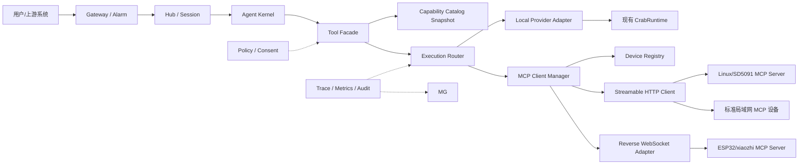
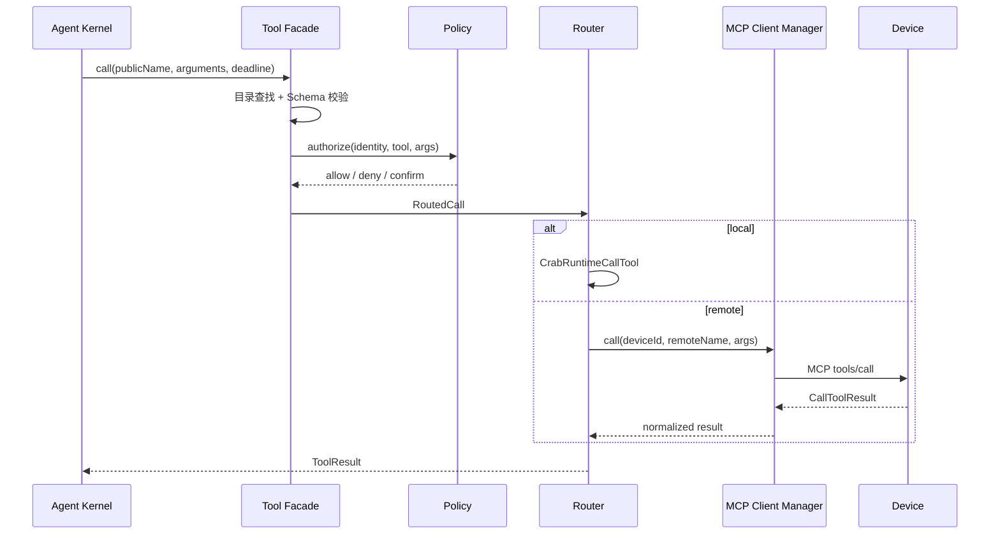

# LiteCrab MCP 设备接入总体架构

## 1. 文档定位

本文基于 MCP 官方 Host / Client / Server 模型重新设计 LiteCrab 的设备接入架构，不延续早期“双模式 Agent”方案。目录名和文件名暂时保留，只为避免历史链接失效。

本文描述目标架构，不代表当前代码已经实现。当前 `litecrab_server` 仍只有 TCP 用户入口、本地 Tool Runtime、Agent、Session、Skill、Alarm 和 Observability；MCP Client Manager、设备注册表、协议适配和远端 Tool 路由均需新增。

基线协议为 MCP `2026-07-28`。实现必须兼容仍采用 `initialize` 生命周期的 `2025-11-25` 及 xiaozhi 固件使用的 `2024-11-05`，但新增设备不得继续以旧版本为默认协议。

## 2. 目标与非目标

### 2.1 目标

- LiteCrab 作为 MCP Host，通过 MCP Client 发现和调用多个设备的能力。
- Linux、SD5091 等设备优先提供标准 Streamable HTTP MCP Server。
- ESP32、NAT 后设备通过可插拔反向连接适配器接入，不污染标准 MCP 核心。
- 本地 Tool 与远端 MCP Tool 对 Agent Kernel 呈现统一目录、统一调用结果和统一安全策略。
- 用户消息、告警事件和 MCP Tool 调用保持独立入口、队列和错误语义。
- MCP Host、MCP Client、连接管理和协议适配均以 C11 模块集成到 `litecrab_server`，不引入 Go、Python 或额外运行时。
- 支持云端、局域网边缘主机和完全无云的一体部署。

### 2.2 非目标

- 不把 MCP 当作用户聊天协议或设备事件总线。
- 不允许 MCP 绕过现有 Runtime 的参数、路径、输出和审计约束。
- 不把任意设备上报的 Tool 描述直接暴露给模型。
- 不在第一阶段实现 Prompts、Resources、Sampling、MCP Apps 等非必要功能。
- 不承诺断网后自动重试有副作用的调用。

## 3. 标准角色

| 角色 | 本方案中的实现 | 职责 |
|---|---|---|
| MCP Host | LiteCrab Agent | 决定向模型暴露哪些工具并发起调用 |
| MCP Client | LiteCrab 内置 MCP Client Manager | 协议协商、发现、调用、取消和结果归一 |
| MCP Server | 设备端服务/固件 | 暴露设备能力并执行调用 |
“设备接入 Agent”的含义是设备作为 MCP Server、LiteCrab 作为 MCP Host/Client。网络 MCP 调用方向固定为 LiteCrab 调用已登记设备。

## 4. 总体架构



### 4.1 进程与语言

第一版保持 SD5091 上只有一个正式进程 `litecrab_server`。在现有 C11 代码内新增可选 MCP 模块：

```text
src/mcp/protocol.c            JSON-RPC/MCP 生命周期与版本兼容
src/mcp/client.c              tools/list、tools/call、取消和请求关联
src/mcp/transport_http.c      Streamable HTTP Client
src/mcp/transport_xiaozhi.c   xiaozhi WebSocket 反向连接适配
src/mcp/device_registry.c     设备身份、连接、健康和目录 revision
src/mcp/catalog_adapter.c     远端 Tool 到 Capability Catalog 的转换
```

模块复用现有 OpenSSL、libcurl、pthread 和有界 JSON Utility；不得引入 Go、Python、JVM 或动态插件运行时。MCP 模块关闭或初始化失败时，本地 Tool、Session 和告警持久化仍可独立运行。

xiaozhi 设备侧继续使用 ESP-IDF C++ 的 `McpServer`、`Protocol` 和 cJSON，无需改写成 Go。这里的“全部用 C 实现”指 5091/LiteCrab 侧采用 C11，设备固件保持当前 C/C++ 技术栈。

## 5. 核心模块

| 模块 | 状态 Owner | 核心职责 | 禁止职责 |
|---|---|---|---|
| Tool Facade | 一次 Agent Run 可见工具集 | 给 Kernel 提供稳定目录和调用接口 | 不处理网络 |
| Capability Catalog | 版本化目录快照 | 合并本地/远端工具、别名、Schema、策略元数据 | 不执行调用 |
| Execution Router | 一次调用状态 | 选择 Provider、deadline、取消、错误归一 | 不实现设备业务 |
| MCP Client Manager | MCP Client 生命周期 | 协议版本、HTTP、反向连接、调用关联 | 不运行模型决策 |
| Device Registry | 设备连接与目录状态 | 设备身份、端点、在线状态、目录 revision | 不信任设备自报权限 |
| Policy/Consent | 授权决策 | 身份、工具、参数、风险、人工确认 | 不执行工具 |
| Device MCP Server | 设备调用状态 | Schema 校验、有界执行、设备副作用 | 不保存 Agent 对话 |

## 6. Capability Catalog

现有 `CrabToolRegistry` 保留为本地 Provider 的来源，但在其上增加统一目录：

```text
CapabilityEntry
  publicName        Agent 看到的稳定名称
  description       经管理员覆盖/清洗后的描述
  inputSchema       JSON Schema 2020-12 的受限子集或完整 Schema
  outputSchema      可选
  providerKind      local | mcp
  providerId        local-runtime | device-id
  remoteName        MCP Server 上的真实工具名
  risk              readonly | mutating | destructive
  timeoutMs
  enabled
  catalogRevision
```

远端工具默认命名为 `device.<alias>.<tool_alias>`。目录保存 publicName 到 `(deviceId, remoteName)` 的映射，不能直接修改设备原始名称。冲突、非法名称、过深 Schema、外部 `$ref` 和超限描述必须拒绝或隔离。

每次 Agent Run 绑定一个不可变目录快照。设备上线、离线或 Tool 列表变化只生成新 revision，不修改正在执行的 Run。

## 7. Execution Router



调用终态至少包含：`SUCCEEDED`、`BUSINESS_ERROR`、`DENIED`、`INVALID_ARGUMENT`、`UNAVAILABLE`、`DEADLINE_EXCEEDED`、`CANCELLED`、`UNKNOWN`。

有副作用调用在请求已送达后连接中断时必须进入 `UNKNOWN`，不能伪装为失败并自动重试。写操作应把 `operationId` 纳入工具参数或设备端幂等存储。

## 8. 协议与传输

### 8.1 标准设备

- 使用 MCP `2026-07-28` Streamable HTTP。
- 每个请求包含协议版本、方法和工具名头，并校验其与 JSON-RPC body 一致。
- 优先无状态处理；业务状态使用显式资源句柄或 operationId。
- `server/discover`、`tools/list`、`tools/call` 为首期必需。
- 长任务在双方支持时采用 Tasks extension；否则使用显式 `job.start/get/cancel` 工具组。

### 8.2 本机开发

stdio 只用于测试工具 Server 和协议兼容，不用于设备跨机接入。stdio 的 stdout 只能输出协议消息，日志写 stderr。

### 8.3 ESP32 和 NAT 设备

设备无法被 Agent 主动访问时，由设备发起 WSS 长连接。Reverse Adapter 负责把连接抽象为 MCP Client Transport，同时保持 JSON-RPC 和 Tool 生命周期。该链路属于自定义 Transport，不宣称为标准 Streamable HTTP。

xiaozhi 兼容适配器需要支持其 `type=mcp` 外层封装和 `2024-11-05` 初始化流程。新设备不复制该封装，优先实现标准 HTTP Server；只有 NAT/防火墙确实要求时才使用反向 Transport。

## 9. 用户消息与事件边界

用户文本、语音会话、告警和设备状态事件不是 Tool 调用：

| 数据 | 通道 | 原因 |
|---|---|---|
| 用户消息 | Gateway → Hub | 需要 Session、回复路由和对话语义 |
| 告警事件 | Alarm → durable spool → Hub | 需要先落盘、去重和 ACK |
| 设备能力发现/调用 | MCP | 标准工具契约 |
| 设备遥测流 | 专用 telemetry/event channel | 高频、持续数据不适合 tools/call |

若某设备同时承载用户语音和 MCP，允许复用一个物理 WebSocket，但逻辑消息类型、队列、配额和处理器必须分离。

## 10. 安全架构

- 标准设备优先使用 mTLS；证书身份映射到固定 deviceId，禁止设备自报身份覆盖。
- 设备连接使用设备身份认证，不引入面向外部用户的授权服务。
- Streamable HTTP 校验 Host 和 Origin；本地端点只绑定 loopback。
- 设备地址来自管理员配置或受控注册流程，LLM/Prompt 不能提供任意 URL，防止 SSRF。
- 设备返回的工具名、描述、Schema、annotations 和结果都视为不可信输入。
- readonly、mutating、destructive 分级；写 PLC、升级、重启等必须显式授权，必要时人工确认。
- 限制请求字节、Schema 深度、工具数、目录大小、输出字节、并发、队列和超时。
- Token、私钥、音频和完整工具结果不得默认进入日志或模型上下文。

## 11. 部署拓扑

### 11.1 云/边缘中心

```text
Reverse Proxy / Identity
          |
litecrab_server
  ├─ Agent / Local Runtime
  ├─ MCP Client Manager
  ├─ Device Registry
  └─ LLM Provider
```

标准设备由内置 MCP Client 主动访问；NAT 设备主动连接 LiteCrab 的反向 WebSocket 入口。生产环境只需管理 `litecrab_server` 一个正式进程。

### 11.2 无云局域网

在一台 Linux PC、WSL 主机或边缘盒子上运行单个 `litecrab_server`，按配置启用内置 MCP Client Manager。设备使用局域网地址接入。没有云服务器不影响 MCP；完全离线时只需另外保证 LLM 能在本地使用。

### 11.3 SD5091 一体部署

`litecrab_server` 和内置 MCP 模块作为一个进程运行在 SD5091。本机 PLC 等能力继续走 Local Provider，不通过 HTTP 回环；其他设备能力才通过 MCP Client Manager。构建时关闭 MCP 后，产物退化为当前仅本地 Tool 的 Agent。

## 12. 目标配置

```json
{
  "mcp": {
    "enabled": true,
    "catalog": {
      "maxDevices": 32,
      "maxToolsPerDevice": 64,
      "refreshSeconds": 300
    },
    "devices": [
      {
        "id": "sd5091-01",
        "alias": "power_room_1",
        "transport": "streamable-http",
        "url": "https://192.168.8.10:8443/mcp",
        "tlsProfile": "factory-ca"
      }
    ],
    "reverseGateway": {
      "enabled": true,
      "listen": "0.0.0.0:8444"
    }
  }
}
```

凭据只使用环境变量引用或受保护文件。配置解析后冻结；动态变化进入 Device Registry 和 Catalog revision，不原地改写启动配置。

## 13. 目标脚本与运行单元

以下文件是实施阶段应新增的交付物，目前尚不存在：

```text
scripts/run_agent_host.sh
scripts/healthcheck_mcp.sh
scripts/build_device_mcp_sd5091.sh
scripts/install_device_mcp.sh
scripts/run_device_mcp.sh
scripts/run_local_all_in_one.sh
```

云/边缘主机运行：

```sh
./build-wsl/litecrab_server \
  --config config/agent-host.json \
  --llm-config config/llm_config.json \
  --workspace .
```

Linux/SD5091 设备运行：

```sh
./litecrab-device-mcp --config config/device-mcp.json
```

ESP32 没有运行时脚本，构建和刷写后由固件自动连接 Gateway。

## 14. 分阶段实施

1. **M0 契约**：定义 CapabilityEntry、RoutedCall、ToolResult 和本地 Provider Adapter。
2. **M1 C Client MVP**：C11 MCP Protocol/Client、stdio mock 和一个只读远端工具。
3. **M2 标准设备**：Streamable HTTP、Device Registry、目录刷新、超时和健康检查。
4. **M3 xiaozhi 兼容**：反向 WebSocket、旧版本协商、Tool 别名。
5. **M4 安全闭环**：mTLS、ACL、Origin/Host、确认、限流、审计。
6. **M5 长任务与可靠性**：Tasks/Job、operationId、UNKNOWN、故障注入和长稳。

每个里程碑必须可独立运行和回滚。M1～M3 只开放 mock/只读工具；安全闭环完成前禁止暴露 PLC 写入、重启、升级和 Shell 类工具。

## 15. 验收门槛

- 同一远端工具可被发现、校验、调用并得到结构化结果。
- 设备离线不会阻塞本地 Tool；错误明确为 `UNAVAILABLE`。
- 目录冲突、恶意 Schema、超限输出和伪造身份均被拒绝。
- 有副作用调用断链后进入 `UNKNOWN`，不会隐式重复执行。
- 标准 `2026-07-28`、旧版 `2025-11-25` 和 xiaozhi `2024-11-05` 分别有兼容测试。
- 本地单进程、局域网设备、SD5091/ESP32 真机均完成 E2E。
- 日志不包含密钥、私钥或未经配置允许的正文。
- 当前架构文档在功能落地后同步更新为真实代码链接和运行命令。

## 16. 当前状态

状态：**设计完成，尚未实施**。

现有可复用代码包括 `CrabToolRegistry`、`CrabRuntimeCallTool`、Hub requestId/deadline、Session、Alarm spool、Observability 和配置加载。新增实现不得改变现有本地 Tool 的安全边界，也不得把当前无认证 TCP Gateway 直接作为 MCP 公网入口。

## 17. 标准与实现基线

- [MCP 2026-07-28 发布说明](https://blog.modelcontextprotocol.io/posts/2026-07-28/)
- [MCP 2025-11-25 Streamable HTTP 规范](https://modelcontextprotocol.io/specification/2025-11-25/basic/transports)
- [MCP Tools 规范](https://modelcontextprotocol.io/specification/2025-11-25/server/tools)
- [MCP Authorization 规范](https://modelcontextprotocol.io/specification/2025-11-25/basic/authorization)
- [xiaozhi MCP Server 参考实现](https://github.com/zhangchubing-zh/xiaozhi-esp32)

实现时以仓库锁定的协议 Schema、官方规范和 conformance tests 为准；C 实现必须通过协议向量和互操作测试，不得仅根据本文示例猜测协议细节。
