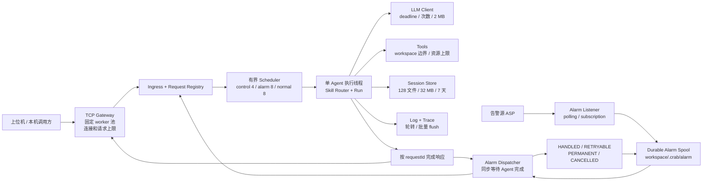
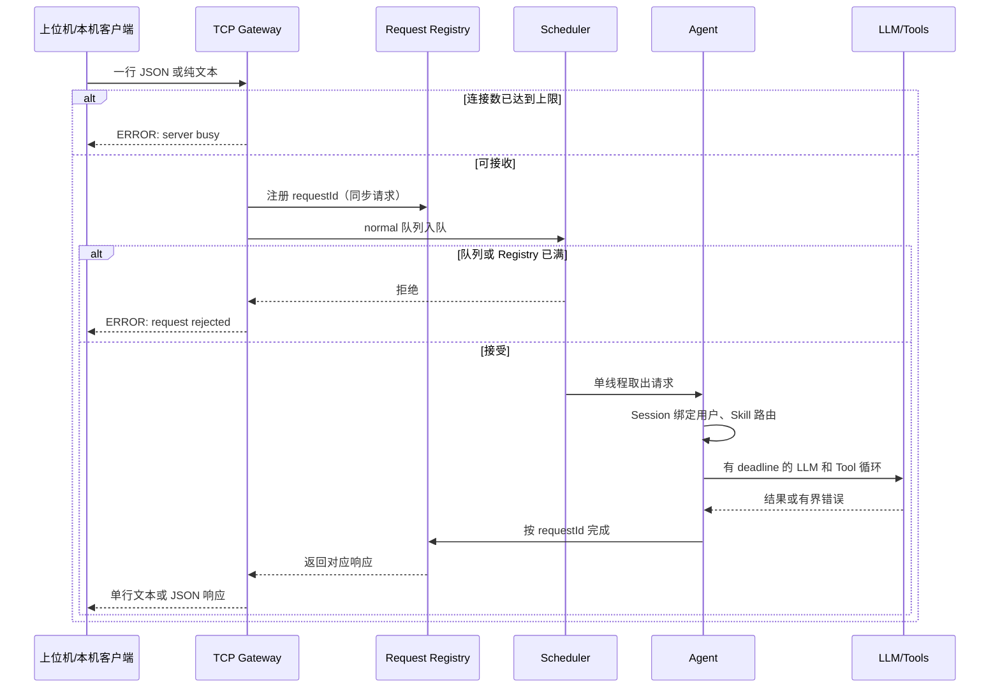
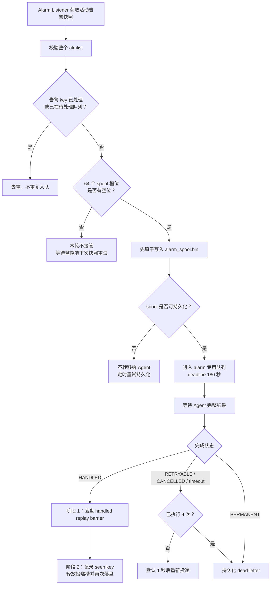
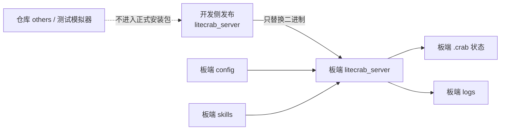
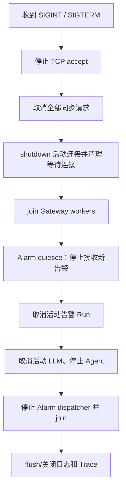
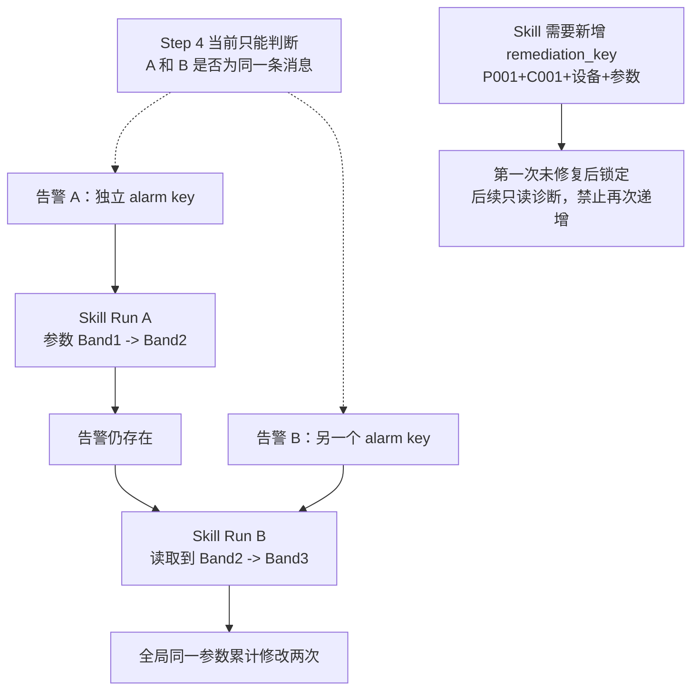

# SD5091 当前实现功能、执行流程与使用指南

状态：当前代码实现说明，不等同于 SD5091 真机验收报告  
对应提交：`47a4b711a993`（`feat: 实现 SD5091 Step 0-4 长期运行保障`）  
适用分支：`feature/sd5091-long-running-step0-4`  
更新日期：2026-09-11

## 1. 先读结论

这次修改不是增加了五个需要分别启动的程序。Step 0～4 是同一个 `litecrab_server` 内部逐层增加的长期运行保护：

1. Step 0 约束部署边界和默认安全配置。
2. Step 1 给连接、请求、队列、响应和退出增加容量及生命周期。
3. Step 2 给 LLM、Tool、目录扫描和子进程增加资源上限。
4. Step 3 给 Session、日志和 Trace 增加磁盘治理。
5. Step 4 给告警增加持久化投递、完成回执、重试和重启恢复。

正式部署包仍然只有一个二进制程序：

```text
bin/litecrab_server
```

`config/` 和 `skills/` 由板端预先放置，不编入或复制进正式安装包。仓库里的 `others/` 只服务于开发、联调或旧测试，正式程序的安装和启动不依赖它。

当前版本已经从“能运行”提升为“主要路径具有明确上限并可恢复的过渡版本”，但还不能把 WSL 测试通过理解成已经满足 5091 的 7×24 小时上线条件。最重要的未解决问题是：

- Skill 对有副作用的修复操作还没有跨告警、跨重试的全局幂等保护；同一参数仍可能被不同告警连续修改。
- 内置 `shell` Tool 尚未复用 `exec_program` 的 CPU、内存、时间和进程组保护。
- TCP Gateway 没有身份认证，默认只能安全地绑定 loopback；直接开放给上位机需要额外隔离或认证层。
- 板内进程管理接口、health/metrics、告警风暴聚合和 dead-letter 管理接口尚未完成。
- 仍需在 SD5091 上完成断电、磁盘满、网络异常和 72 小时 soak 验收。

## 2. 修改前后最直观的区别

| 领域 | 修改前的主要风险 | 当前已经实现 | 使用者能看到的结果 |
|---|---|---|---|
| 正式产物 | 安装内容和开发目录边界不明确 | CMake 安装树只产生 `bin/litecrab_server` | 更新程序时只替换一个二进制；配置和 Skills 留在板上 |
| TCP 连接 | 每连接 detached 线程，数量无上限 | 固定可 join worker 池，默认 4 worker、16 connection | 超过容量立即返回 `ERROR: server busy`，不会继续创建线程 |
| 请求响应 | FIFO 和共享响应队列可能阻塞或串错 | 32 槽 Request Registry，按 `requestId` 定向完成 | 超时或断开的请求会释放槽位，迟到响应被丢弃 |
| 请求优先级 | 告警和普通请求共用 FIFO | control、alarm、normal 三条独立有界队列 | control 优先；普通请求与告警按当前 2:1 规则交替，告警不会无限饿死 |
| LLM | 大响应、慢连接和重试可能长期占用资源 | 2 MB wire 上限、32 KB header、请求 deadline、调用次数限制 | 超限或不完整 SSE 明确失败；重试不能越过请求截止时间 |
| Tool | 目录或子进程可能无限消耗资源 | Walker、`exec_program` 增加时间、条目、内存、CPU、FD 和输出限制 | 大目录被截断；超时或输出洪泛的进程组被回收 |
| Session | 文件数量和总大小长期增长 | 128 文件、32 MB、7 天 TTL、LRU、原子落盘 | 旧 Session 会被回收；连接临时 Session 不写 Flash |
| 日志与 Trace | 每条强制刷盘且文件不轮转 | 2 MB × 4 代轮转、批量 flush、Trace 输入默认关闭 | 降低写放大和敏感 Prompt 落盘风险 |
| 告警投递 | 进入 Agent 队列就当作成功，重启可能丢失 | 先写 durable spool，再投递；Agent 完成后两阶段 ACK | 未完成告警可在重启后恢复；ACK 中断不会重复执行 Skill |
| 停机 | 活动连接、LLM、告警线程可能拖住退出 | 取消请求、关闭活动 FD、quiesce 告警、join 线程 | `SIGTERM`/`SIGINT` 进入有界退出流程 |

## 3. 当前总体架构



需要特别注意：Gateway 可以同时接收多个连接，但当前只有一个 Agent 执行线程。固定连接池解决的是连接和线程失控问题，不代表多个 LLM/Skill Run 会并行执行。

## 4. 上位机请求是怎么执行的



关键语义：

- 每条 TCP 请求必须以换行符结束。
- 一个 TCP 连接可以连续发送多条请求。
- 没有显式 `sessionId` 时，Gateway 为连接生成 `tmp:sess-*` 临时 Session；这种 Session 不落盘。
- 显式 `sessionId` 用于跨连接恢复会话，但不能使用保留前缀 `tmp:`。
- 同一个持久 Session 第一次绑定 `userId` 后，其他 `userId` 不能接管。
- 默认网络请求 deadline 使用 `recv_timeout_ms`，当前示例值为 30 秒。
- 客户端超时或断开后，Request Registry 槽位被取消；Agent 的迟到响应不再进入无人消费的公共队列。

## 5. 告警是怎么可靠投递的



### 5.1 `HANDLED` 不代表物理告警已经消失

Step 4 管理的是“告警消息有没有被 Agent 完整处理并形成结果”，不是“设备故障是否已经修好”。

当前完成状态是根据 Agent 最终文本分类的：

| Agent 最终结果 | Step 4 状态 | 投递层动作 |
|---|---|---|
| 正常文本，不以 `ERROR:` 开头 | `HANDLED` | 两阶段 ACK，不再重复投递该告警 key |
| LLM 失败、请求超时、Session 容量不足等暂态错误 | `RETRYABLE` | 最多初始 1 次加 3 次重试 |
| 其他以 `ERROR:` 开头的确定错误 | `PERMANENT` | 进入 dead-letter |
| 停机取消 | `CANCELLED` | 保留并等待恢复或后续重试 |

因此，“Skill 修改参数成功，但复查告警仍存在”的结果，只要最终输出不是 `ERROR:`，在 Step 4 看来仍可能是 `HANDLED`。含义是诊断流程已经完成，不是故障已经消除。这符合 Step 4 与 Skill 的职责分离，但当前使用字符串前缀分类不够稳健，后续应改为结构化结果。

### 5.2 为什么重启后有时会重新运行 Skill，有时不会

- Agent 尚未给出 `HANDLED`：spool 中仍是未完成投递，重启后会重新投递，属于 at-least-once。
- `handled` replay barrier 已经落盘，但第二阶段 ACK 尚未完成：重启后只重试 ACK 持久化，不再运行 Skill。
- 已完成第二阶段 ACK：key 进入去重历史，投递槽释放。

这可以避免“Agent 已明确完成，但 ACK 写盘中断”导致的重复执行；但不能避免“Skill 已产生部分外部副作用，随后 Agent 超时或崩溃”造成的再次执行。因此有副作用的 Skill 仍必须自己实现幂等保护。

## 6. Step 0～4 分别增加了什么

### 6.1 Step 0：部署边界、默认配置和可审计启动

功能：

- 默认监听 `127.0.0.1:10003`。
- 未显式设置 `allow_unauthenticated_remote=true` 时，拒绝绑定非 loopback 地址。
- 默认接收/发送超时从 10 分钟缩短为 30 秒。
- 单请求最大 16 KB，默认 4 个 worker、最多 16 个连接。
- 启动日志记录 Git revision、UTC 构建时间、workspace 和关键容量。
- Trace 默认不保存发给 LLM 的完整 messages；只有显式设置 `LITECRAB_TRACE_LOG_LLM_INPUT=1` 才开启。
- `cmake --install` 只安装 `bin/litecrab_server`。

主要文件：

- `CMakeLists.txt`
- `config/base_config.example.json`
- `src/config/config.c`
- `src/main.c`
- `src/observability/observability.c`

当前边界：板内进程的 `status/start/stop/restart` 仍由板上已有进程负责，LiteCrab 只响应 `SIGINT`/`SIGTERM` 并预留未来接入边界。

### 6.2 Step 1：有界连接、Scheduler 和定向响应

功能：

- 用固定、可 join 的连接 worker 池替换每连接 detached 线程。
- `max_connections` 同时计算排队连接和正在处理的连接。
- 满载连接立即收到 `ERROR: server busy`。
- 停机时关闭监听 FD、shutdown 活动连接、清空待处理连接并 join worker。
- 新增 32 槽 Request Registry，响应按 `requestId` 定向交付。
- 新增 control、alarm、normal 三条队列：容量分别为 4、8、8。
- control 始终优先；当前代码在 normal 和 alarm 同时存在时先处理最多两个 normal，再处理一个 alarm。
- 请求使用单调时钟绝对 deadline；超时或取消状态向 Agent、LLM 和 Tool 循环传播。

主要文件：

- `include/litecrab/gateway.h`
- `include/litecrab/hub.h`
- `src/gateway/tcp_line.c`
- `src/hub/hub.c`
- `src/kernel/kernel.c`

当前边界：这是目标架构允许的固定池过渡实现，不是最终 epoll Reactor；生产请求已使用 Registry，但旧 outbound API 仍因兼容测试而保留。

### 6.3 Step 2：LLM、Tool 和子进程资源上限

LLM 侧：

- HTTP wire 响应最大 2 MB。
- HTTP header 最大 32 KB，并在 `Content-Length` 已知超限时提前拒绝。
- 流式 SSE 必须收到有效事件和 `[DONE]`，截断流不再被当成成功。
- LLM Tool 参数采用倍增缓冲，避免每个小片段都 `realloc`。
- 普通请求最多 8 次 LLM 调用，高优先级告警最多 12 次。
- HTTP 暂态失败最多尝试 4 次，采用约 2、4、8 秒指数退避并加入抖动；剩余 deadline 不足时停止重试。

Agent/Tool 侧：

- Agent 最多 16 轮 Tool 迭代。
- 普通请求最多执行 16 个 Tool 调用，高优先级请求最多 24 个。
- 单次 LLM 响应最多解析 8 个 Tool call。
- `grep`/`glob` 的目录遍历最多 10,000 项、30 秒、递归深度 128。
- `grep` 最多累计扫描 8 MB，并跳过受保护的 Skill 指令文件。
- `exec_program` 只允许运行 workspace 内的真实可执行文件，不经过 shell。
- `exec_program` 子进程限制：CPU 15 秒、地址空间 64 MB、FD 32、输出文件 4 MB。
- wall timeout 默认 30 秒，可传 1～120 秒；超时先发 SIGTERM，再对整个进程组 SIGKILL。
- stdout/stderr 合计达到 256 KB 时终止整个进程组。

主要文件：

- `include/litecrab/kernel.h`
- `src/kernel/kernel.c`
- `src/kernel/llm.c`
- `src/runtime/builtin_tools.c`

当前边界：LLM 响应仍先完整缓存在 2 MB 内，再进行 SSE 解析；`exec_program` 仍由主进程 fork，不是常驻独立 Helper；内置 `shell` Tool 尚未获得相同保护。

### 6.4 Step 3：Session、日志和 Trace 治理

Session：

- 内存 Session cache 最多 32 个。
- 单会话历史最多 24 KB、32 条消息。
- 磁盘 Session 最多 128 个、总计 32 MB、TTL 7 天。
- 保存前清理临时文件、过期文件和最老的未引用 Session。
- 使用临时文件写入、`fsync`、`rename`、目录 `fsync` 实现原子提交。
- Gateway 自动生成的 `tmp:sess-*` 只存在于内存，不写入 Flash。

日志和 Trace：

- `litecrab.log` 和 Trace 使用 2 MB 阈值及 4 代轮转策略。
- 普通日志按 16 条或 1 秒批量 flush；ERROR/WARN/failed 立即 flush。
- Trace 按 16 条或 1 秒批量 flush；anomaly 和 `trace_end` 立即 flush。
- 启动时清理过多的历史 `agent_trace_*` 文件。
- LLM 输入默认不写入 Trace，减少敏感数据和磁盘占用。

主要文件：

- `src/session/session.c`
- `src/observability/observability.c`

当前边界：日志仍在业务线程同步写入；Session、Skill、Run 和 spool 尚未合并成统一 Storage Manager。

### 6.5 Step 4：可靠告警、恢复和有界退出

功能：

- 支持 polling 和 subscription 两种告警接收模式。
- 对完整活动告警快照先校验再逐条接收，避免半个错误快照造成部分入队。
- 告警 key 用于待处理去重和已处理去重。
- 最多保存 64 条投递记录和 1,024 个 seen key。
- spool 使用临时文件、`fsync`、`rename`、目录 `fsync` 原子保存。
- spool 不可写时不把责任转交给 Agent。
- 告警通过高优先级 lane 投递，并同步等待最多 180 秒。
- 支持 `HANDLED`、`RETRYABLE`、`PERMANENT`、`CANCELLED` 四种完成状态。
- `HANDLED` 使用两阶段 replay barrier，防止 ACK 写盘中断后重复运行 Skill。
- 可重试失败最多执行 4 次，耗尽后持久化为 dead-letter。
- 监听端网络/认证失败使用 1 秒开始、最高 60 秒的指数退避重连。
- Dispatcher 使用条件变量等待最近 due time，不再每 25 ms 空轮询。
- 停机先停止接收新告警，再取消活动告警请求，最后 join 告警线程。

主要文件：

- `include/litecrab/alarm.h`
- `src/alarm/alarm_service.c`
- `src/main.c`

当前边界：没有同设备告警风暴聚合、spool overflow 指标和 dead-letter 管理 API；Step 4 不判断修复是否有效，也不回滚 Skill 已修改的设备参数。

## 7. 如何构建和得到正式产物

### 7.1 WSL 本机构建与测试

```sh
cd /mnt/d/项目/能源agent/code/LiteCrab_0829

cmake -S . -B build \
  -DLITECRAB_ENABLE_STATIC_LINK=OFF \
  -DBUILD_TESTING=ON

cmake --build build -j2
ctest --test-dir build --output-on-failure
```

当前分支最近一次全量 WSL CTest 结果为 14/14 通过。它只能证明 x86_64 WSL 的功能和资源测试通过，不能替代 ARM 板端验证。

### 7.2 安装契约验证

```sh
cmake --install build --prefix dist
find dist -type f -print
```

期望只有：

```text
dist/bin/litecrab_server
```

### 7.3 SD5091 交叉编译

```sh
cmake -S . -B build-5091 \
  -DCMAKE_TOOLCHAIN_FILE=aarch32-toolchain.cmake \
  -DLITECRAB_ENABLE_STATIC_LINK=ON \
  -DLITECRAB_BUILD_TESTS=OFF \
  -DSD5091_SYSROOT=/opt/sd5091-sysroot

cmake --build build-5091 -j2
```

交叉产物必须验证为 ELF32、ARM、EABI5 hard-float，并且 `readelf -d` 不出现 `NEEDED`。

## 8. 板端目录应该怎么放

推荐板端结构：

```text
/mnt/home/enspire/litecrab/
├── litecrab_server             # 唯一正式程序产物
├── config/
│   ├── base_config.json        # 板端维护
│   └── llm_config.json         # 板端维护，禁止提交真实密钥
├── skills/                     # 板端维护
│   └── <skill>/
│       ├── SKILL.md
│       └── scripts/...
├── logs/                       # 运行时生成
└── .crab/                      # 运行时状态
    ├── alarm/alarm_spool.bin
    ├── sessions/*.lcs
    └── raw/...
```



`workspace` 必须指向同时包含 `skills/` 且允许创建 `.crab/` 的板端目录。配置和 Skills 更新应由板内管理流程负责，而不是每次程序启动时从二进制旁复制。

## 9. 如何配置

### 9.1 基础配置

```json
{
  "server": {
    "listen_ip": "127.0.0.1",
    "allow_unauthenticated_remote": false,
    "listen_port": 10003,
    "backlog": 32,
    "recv_timeout_ms": 30000,
    "send_timeout_ms": 30000,
    "max_req_bytes": 16384,
    "worker_threads": 4,
    "max_connections": 16
  },
  "log": {
    "dir": "/mnt/home/enspire/litecrab/logs",
    "level": "INFO"
  },
  "workspace_root": "/mnt/home/enspire/litecrab"
}
```

有效范围：

| 参数 | 默认值 | 允许范围/说明 |
|---|---:|---|
| `listen_ip` | `127.0.0.1` | 非 loopback 必须显式允许未认证远程访问 |
| `listen_port` | 10003 | 1～65535 |
| `recv_timeout_ms` | 30000 | 100～600000 |
| `send_timeout_ms` | 30000 | 100～600000 |
| `max_req_bytes` | 16384 | 1～16384 |
| `worker_threads` | 4 | 1～8 |
| `max_connections` | 16 | 不小于 worker，最大 64 |

注意：当前代码读取 `log.dir`，但没有真正根据 `log.level` 过滤日志；`level` 暂时只是配置占位。

### 9.2 LLM 配置与密钥

优先使用 `apiKeyEnv`，不要把真实 API Key 写入仓库：

```json
{
  "llm": {
    "default": "provider_name",
    "provider_name": {
      "baseUrl": "https://example.invalid/v1/chat/completions",
      "apiKeyEnv": "LITECRAB_PROVIDER_API_KEY",
      "modelName": "model-name"
    },
    "max_tokens": 2048,
    "temperature": 0.2,
    "stream": true,
    "timeout_ms": 60000
  }
}
```

```sh
export LITECRAB_PROVIDER_API_KEY='从板端安全存储注入'
```

当前仓库的本地 `config/llm_config.json` 含明文凭据，这是必须处理的安全问题：相关凭据应立即轮换，文件改用 `apiKeyEnv` 或仅保留无密钥示例，并确认历史提交中是否也包含旧凭据。

### 9.3 配置优先级


告警配置单独遵循“默认值与告警环境变量，再由告警命令行参数覆盖”。密码推荐使用 `LITECRAB_ALARM_PASSWORD`，避免出现在进程命令行中。

## 10. 如何启动和调用

### 10.1 不启用告警，仅接收上位机/本机请求

```sh
cd /mnt/home/enspire/litecrab

./litecrab_server \
  --config config/base_config.json \
  --llm-config config/llm_config.json \
  --llm-provider provider_name \
  --workspace /mnt/home/enspire/litecrab \
  --no-alarm
```

### 10.2 启用 polling 告警

```sh
export LITECRAB_ALARM_USER='installer'
export LITECRAB_ALARM_PASSWORD='从板端安全存储注入'

./litecrab_server \
  --config config/base_config.json \
  --llm-config config/llm_config.json \
  --workspace /mnt/home/enspire/litecrab \
  --alarm-mode polling \
  --alarm-base-url https://192.168.8.10 \
  --alarm-ca-file /mnt/home/enspire/litecrab/config/alarm-ca.pem
```

只有在隔离联调环境且确认风险时才使用 `--alarm-insecure-tls`。

### 10.3 启用 subscription 告警

将上面的模式改成：

```sh
--alarm-mode subscription
```

### 10.4 发送 TCP 请求

普通文本：

```sh
printf '%s\n' '读取当前设备状态' | busybox nc 127.0.0.1 10003
```

带持久 Session 的 JSON：

```sh
printf '%s\n' \
  '{"userId":"operator-1","sessionId":"station-1","content":"检查当前告警"}' \
  | busybox nc 127.0.0.1 10003
```

保留 Markdown 换行的 JSON 响应：

```sh
printf '%s\n' \
  '{"userId":"operator-1","sessionId":"station-1","responseFormat":"json","content":"输出诊断报告"}' \
  | busybox nc 127.0.0.1 10003
```

上位机直接访问有两种方式：

1. 推荐由板内已有管理进程代理或转发到 `127.0.0.1:10003`。
2. 直接绑定板卡网卡地址时，必须同时设置 `allow_unauthenticated_remote=true`；这只是显式接受风险，不会增加认证。必须依靠隔离管理网、防火墙或外部认证代理限制来源。

### 10.5 停止

```sh
kill -TERM <litecrab-pid>
```

当前有界退出顺序：



板端最终应由既有进程 Owner 调用和监督该流程，并实现连续启动失败时的退避；当前 LiteCrab 自身没有可被远程调用的 `start/stop/restart` 管理 API。

## 11. 运行时上限速查

| 对象 | 当前上限 |
|---|---:|
| TCP worker | 默认 4，最大 8 |
| TCP 总连接 | 默认 16，最大 64 |
| TCP 单请求 | 16 KB |
| 同步 Request Registry | 32 |
| control/alarm/normal 队列 | 4 / 8 / 8 |
| Agent 执行线程 | 1 |
| Agent Tool 迭代 | 16 轮 |
| 普通/高优先级 Tool 总调用 | 16 / 24 |
| 普通/高优先级 LLM 总调用 | 8 / 12 |
| 单次 LLM 响应 Tool calls | 8 |
| LLM HTTP wire/header | 2 MB / 32 KB |
| LLM 最终文本 | 64 KB |
| 送回 LLM 的单 Tool 输出 | 16 KB |
| Walker 条目/时间/深度 | 10,000 / 30 秒 / 128 |
| grep 累计扫描 | 8 MB |
| `exec_program` CPU/内存/FD/文件 | 15 秒 / 64 MB / 32 / 4 MB |
| `exec_program` wall/output | 默认 30 秒（1～120 秒）/ 256 KB |
| Session 内存 cache | 32 |
| 单 Session 历史 | 24 KB / 32 条消息 |
| Session 磁盘 | 128 文件 / 32 MB / 7 天 |
| 日志与 Trace | 2 MB × 4 代 |
| Alarm spool | 64 条 |
| Alarm seen key | 1,024 |
| Alarm Agent deadline | 180 秒 |
| Alarm Agent 投递次数 | 初始 1 次 + 重试 3 次 |

## 12. 当前还存在的问题

### 12.1 上板前必须处理

| 优先级 | 问题 | 影响 | 建议 |
|---|---|---|---|
| P0 | `config/llm_config.json` 存在明文 API 凭据 | 凭据泄露和被滥用 | 立即轮换；改用 `apiKeyEnv`；检查 Git 历史 |
| P0 | `shell` Tool 没有 `exec_program` 的 rlimit、wall timeout 和进程组回收 | 命令可长期阻塞、扩大内存或留下子进程 | 正式版禁用 `shell`，或让它完全复用受限执行器 |
| P0 | Skill 修复没有跨告警/跨重试的 remediation ledger | 同一参数可能 Band1→Band2→Band3；部分成功后重试可能重复产生副作用 | 按 Skill、设备、参数、动作建立持久幂等键和锁定状态 |
| P0 | TCP 远程访问没有认证 | 任何可达客户端都能伪造 `userId` 并触发 Agent | 默认 loopback；通过板内管理进程代理，或增加认证和来源限制 |

### 12.2 架构仍是过渡状态

| 问题 | 当前表现 | 后续方向 |
|---|---|---|
| Agent 单线程 | 一个慢 LLM/Skill 会阻塞后续请求，包括告警 | 引入可取消 Run Coordinator；谨慎评估并行度和板端内存 |
| 固定连接池而非 Reactor | 已有上限，但每个活动连接仍占一个 worker | 最终迁移到 epoll Reactor，同时保持 RequestContext 接口 |
| 告警和 normal 的当前比例 | 两个 normal 后处理一个 alarm，告警不是严格抢占 | 根据真机业务优先级验证权重，必要时调整为告警优先并保留 normal 防饿死 |
| 告警完成状态靠文本前缀 | Skill 文案变化可能造成错误分类 | 使用结构化 completion code，不解析自然语言 |
| at-least-once 仍会重跑未完成 Skill | 外部修改成功但响应丢失时可能再次修改 | Skill 侧持久化 mutation intent、readback 和结果，重试先查账本 |
| spool 固定 64 条 | 告警风暴或 dead-letter 累积后无空槽 | 增加同设备摘要、overflow health、dead-letter 查询/清理 API |
| LLM 仍整块缓存 | 2 MB 内有界，但峰值内存仍高 | 改为完全增量 HTTP/SSE 解析 |
| `exec_program` 不是独立 Helper | 主进程仍直接 fork；无法安全实现所有隔离策略 | 使用预启动 Helper 或专用执行服务；真机校准限制 |
| 未限制 Tool 子进程数量 | 进程组最终可回收，但短时间 fork 风暴仍可能冲击系统 | Helper/cgroup/板端专用 UID；不能错误使用共享 UID 的小 `RLIMIT_NPROC` |
| 同步日志 | 慢盘可能阻塞业务线程 | 独立有界 Log Sink，写失败上报 health |
| 存储治理分散 | Session、Skill、Run、spool 各自管理 | 合并 Storage Manager、总配额和统一清理策略 |
| 没有 health/metrics 管理协议 | 板内 Owner 缺少稳定探针 | 定义只读状态接口：队列深度、RSS、FD、最老未 ACK、dead-letter 等 |
| 没有进程管理 API | 上位机不能直接安全拉起/关闭 Agent | 由独立板内进程实现，LiteCrab 停止时接口仍必须可用 |
| `log.level` 未生效 | 配置了级别仍输出全部日志 | 实现日志级别过滤或删除误导性配置项 |

### 12.3 已知的告警修复语义问题

不同 `seqno`、时间或原因的告警会生成不同投递 key。即使它们最终操作同一个设备参数，Step 4 也会把它们作为独立消息处理。这是投递去重与修复幂等之间的区别：



这个问题不应通过 Step 4 无限重投或回滚解决。Step 4 负责可靠交付，Skill 负责根因证据、修改幂等、效果验证和是否允许再次操作。

## 13. 测试覆盖了什么，没覆盖什么

当前 CTest 包含 14 项：基础单元、安全、告警单元、TCP E2E、Transfer Station、Agent 路由矩阵、Resolver、Session 重启、UI Session 传输、安全 E2E、polling/subscription 告警 E2E、长期运行压力和单二进制部署契约。

重点验证包括：

- 连接满载明确 busy，连接 churn 后 FD/线程回落。
- 并发请求只产生成功、拒绝或超时等有界结果。
- 临时连接 Session 不写 Flash。
- LLM 卡住时 `SIGTERM` 能有界退出。
- 多轮启动/停止不遗留监听状态。
- 告警未完成重启恢复、完成 ACK 后不重跑、失败耗尽进入 dead-letter。
- 安装树只有一个二进制，并能读取安装树外的板端 config 和 Skills。

仍必须在 SD5091 完成：

1. ARM 静态二进制的 glibc/NSS、DNS、TLS、CA 和时钟兼容性。
2. PLC Diagnosis 在 64 MB 地址空间、15 秒 CPU 和 256 KB 输出下的真实功能及高水位。
3. spool、Session 在每个 `fsync`/`rename` 点 kill -9 或断电后的恢复。
4. 告警风暴、LLM 长时间离线、磁盘满和网络反复断开。
5. 板内 Owner 的 status/start/stop/restart 和连续失败退避。
6. 至少 72 小时 soak，并持续记录 RSS、FD、线程、磁盘、队列深度和最老未 ACK 时间。

## 14. 本次修改文件地图

| 功能组 | 修改文件 |
|---|---|
| 构建与正式产物 | `CMakeLists.txt` |
| 配置 | `config/base_config.example.json`、`src/config/config.c` |
| Gateway | `include/litecrab/gateway.h`、`src/gateway/tcp_line.c` |
| Scheduler/Registry | `include/litecrab/hub.h`、`src/hub/hub.c` |
| Agent/LLM | `include/litecrab/kernel.h`、`src/kernel/kernel.c`、`src/kernel/llm.c` |
| Tool 资源限制 | `src/runtime/builtin_tools.c` |
| Session 治理 | `src/session/session.c` |
| 日志与 Trace | `src/observability/observability.c` |
| 告警可靠投递 | `include/litecrab/alarm.h`、`src/alarm/alarm_service.c`、`src/main.c` |
| 单元与 E2E | `tests/test_main.c`、`tests/test_alarm.c`、`tests/test_tcp_e2e.py`、`tests/test_alarm_e2e.py` |
| 新增长期测试 | `tests/test_long_running_stress.py`、`tests/test_deployment_contract.py` |
| 分阶段设计和实现状态 | `docs/deployment/sd5091_long_running/*.md` |

## 15. 推荐阅读顺序

1. 本文：先理解当前真实实现、使用方法和剩余问题。
2. [`sd5091_long_running/IMPLEMENTATION_STATUS.md`](sd5091_long_running/IMPLEMENTATION_STATUS.md)：查看实现与目标之间的短清单。
3. [`sd5091_long_running_architecture.md`](sd5091_long_running_architecture.md)：理解完整目标架构和设计原则。
4. [`sd5091_long_running/sd5091_long_running_stage_index.md`](sd5091_long_running/sd5091_long_running_stage_index.md)：按 Step 0～4 深入每一阶段。
5. [`sd5091_long_running/alarm_trace_20260911_003858_analysis.md`](sd5091_long_running/alarm_trace_20260911_003858_analysis.md)：查看实际告警轨迹为何会对同一参数累计修改两次。
