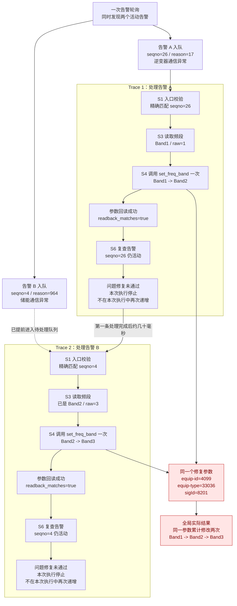
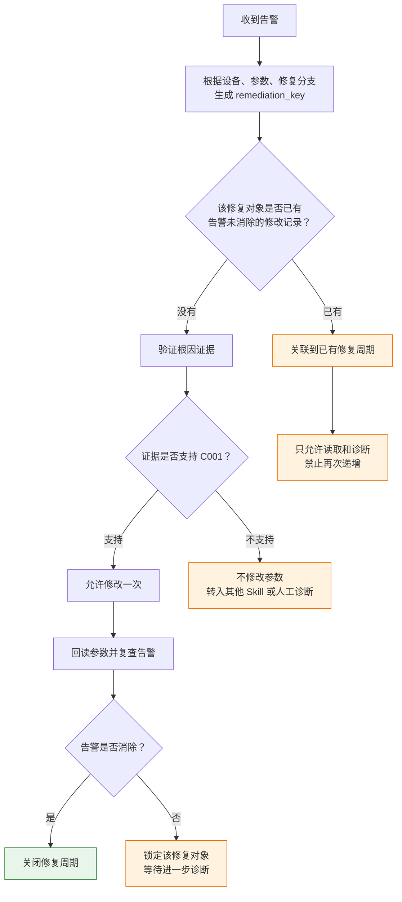

# 告警轨迹 `20260911_003858` 图文分析

用途：保存本次轨迹审查的完整结论，同时作为后续技术解释的图文风格参考。

原始轨迹文件名：`logs/agent_trace_20260911_003858.jsonl`。该运行日志不作为仓库文档附件提交；分析结论和关键证据已完整保存在本文。

## 结论

**整个轨迹中确实修改了两次频段，但不是同一次执行修改两次，而是两个不同告警分别触发了一次修改。**

“已停止且未二次递增”只描述第二条轨迹内部没有再次调用修改工具。放到整个告警处理周期看，这句话容易误导，因为频段实际已经：

```text
Band1 -> Band2 -> Band3
```

证据如下：

| 轨迹 | 处理的告警 | 修改前 | 修改后 | 本轨迹写入次数 | 复查结果 |
|---|---|---:|---:|---:|---|
| Trace 1 | seqno=26、reason=17，逆变器通信异常 | Band1 / raw=1 | Band2 / raw=3 | 1 | 告警仍存在 |
| Trace 2 | seqno=4、reason=964，储能通信异常 | Band2 / raw=3 | Band3 / raw=23 | 1 | 告警仍存在 |
| 总计 | 两个不同告警 | Band1 | Band3 | **2** | 两个问题均未验证修复 |

轨迹中的两次 `set_freq_band` 分别位于 JSONL 第 37 行和第 100 行。

## 两条轨迹的执行流



## 是否符合预期

从当前代码规则来看，流程是“符合现有机制”的：

- 两个告警的 `seqno`、时间、原因不同，所以被当成两个独立告警入队。
- 每次 P001 执行只允许修改一次。
- 因此 Trace 1 修改一次后停止，Trace 2 又获得一次独立的修改机会。

但从长期运行和安全目标来看，**不符合预期**。主要有三个问题：

### 1. “每次最多修改一次”约束范围太小

当前限制只作用于单次 Skill 执行，没有覆盖同一设备、同一参数、同一故障周期。第一条告警失败后，第二条已排队告警仍然可以修改相同参数。

### 2. 第二条告警缺少选择 C001 的充分依据

`reason=964` 给出的可能原因偏向线缆或电池故障，但执行流仍然选择了修改频段。轨迹体现的是“只有 C001 可执行，所以执行 C001”，而不是“证据确认频段配置错误，所以执行 C001”。

### 3. 写入成功不等于问题修复成功

两次轨迹都只是确认参数写入和回读成功，告警均未消失。此时不应该继续自动试探下一个频段，否则可能把一个正确参数连续改坏。

## “未二次递增”的准确含义

这句话实际表达的是：

> 在当前 Trace 2 内，`set_freq_band` 只调用一次；复查告警仍存在后，没有在同一 Trace 2 中继续从 Band3 改到下一个值。

它不代表：

> 从整个故障发生开始只修改了一次。

更准确的总结应该写成：

> 本次执行仅写入一次并停止；但检测到同一修复参数在前序告警处理中已由 Band1 修改为 Band2，本次又修改为 Band3，因此本故障处理周期累计修改两次。

## 建议的正确处理逻辑

这部分主要应由 Skill 的修复状态管理负责，而不是 Step 4 的告警投递重试逻辑：



建议锁定键至少包含：

```text
P001 + C001 + equip-id=4099 + equip-type=33036 + sigId=8201
```

这样即使收到不同 `seqno` 的相关告警，只要它们最终要修改同一个参数，后续执行也只能复查和诊断，不能继续从 Band2 自动递增到 Band3。

另外，第二条轨迹已经出现 `skill_complete`，但文件中没有它对应的 `trace_end` 和告警处理完成记录。因此能够确认第二次参数写入发生了，但不能仅凭这个文件确认第二条告警的 Step 4 ACK/收尾已经完整完成。

## 后续解释风格约定

后续对轨迹、阶段实现和异常行为的解释优先沿用本文结构：

1. 先给出明确结论，区分“单次执行”和“全局行为”。
2. 用证据表列出关键标识、状态变化、调用次数和最终结果。
3. 用 Mermaid 流程图展示执行顺序、分支、跨轨迹影响和风险点。
4. 分开说明“是否符合当前实现”和“是否符合业务/安全预期”。
5. 明确问题应由哪个层次处理，避免混淆 Step 4 投递职责与 Skill 修复职责。
6. 给出目标状态机或伪代码级改进方向，并标出仍无法从现有证据确认的部分。
