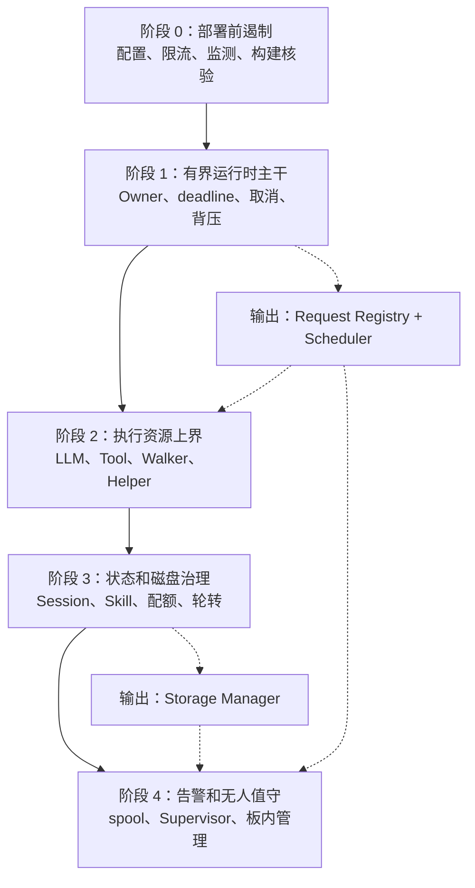
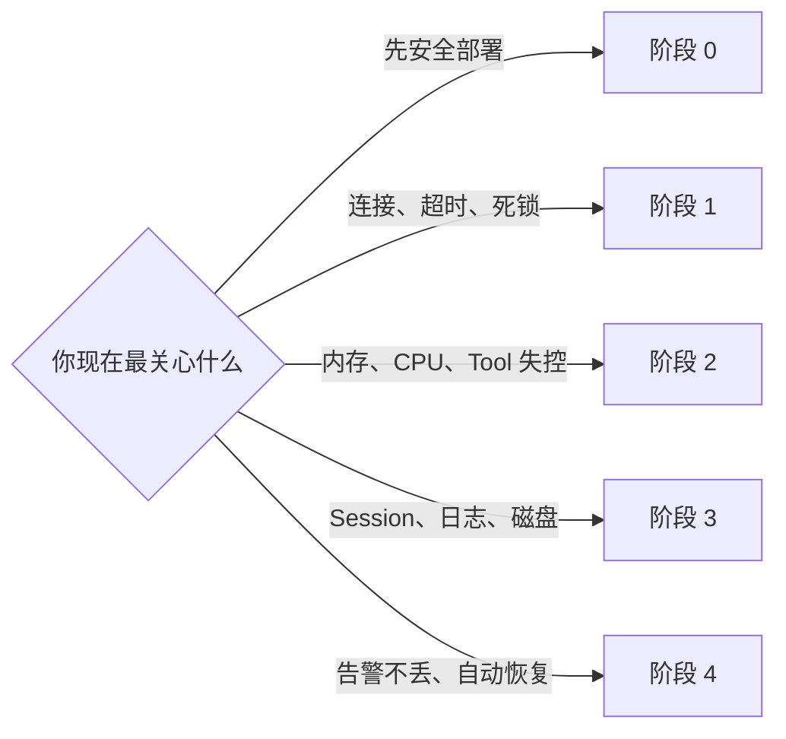

# SD5091 长期运行实施路线索引

本文档集是 [`sd5091_long_running_architecture.md`](../sd5091_long_running_architecture.md) 第 12 章的工程化展开。主文档定义问题、原则和目标架构；本目录说明每个阶段具体做什么、如何流转、改哪些文件、关键伪代码及如何验收。

如果需要先整体理解“当前到底实现了什么、怎么运行、还存在什么问题”，请先阅读 [`sd5091_current_implementation_guide.md`](../sd5091_current_implementation_guide.md)。

当前代码落地程度、过渡实现与必须留到真机的项目见 [`IMPLEMENTATION_STATUS.md`](IMPLEMENTATION_STATUS.md)。

告警执行轨迹的图文分析示例及后续解释风格约定见 [`alarm_trace_20260911_003858_analysis.md`](alarm_trace_20260911_003858_analysis.md)。

> 文档中的“新增文件”是建议的目标结构，不表示当前仓库已经实现。实际落地时允许合并小文件，但模块职责、资源边界和阶段依赖不应被弱化。

## 阶段文件

| 阶段 | 文件 | 核心交付 | 进入下一阶段的硬门槛 |
|---|---|---|---|
| 0 | [`stage_0_predeployment_containment.md`](stage_0_predeployment_containment.md) | 缩小暴露面、外部限流与监控、可核验构建产物 | 部署配置可审计，异常进程可拉起，资源异常可发现 |
| 1 | [`stage_1_bounded_runtime_backbone.md`](stage_1_bounded_runtime_backbone.md) | Reactor/固定池、Request Registry、分级 Scheduler、Response Sink | 慢连接、断开、超时不会遗留线程、FD 或孤儿响应 |
| 2 | [`stage_2_execution_resource_bounds.md`](stage_2_execution_resource_bounds.md) | 增量 LLM 解析、Run Budget、BoundedWalker、Executor Helper | 任意输入及故障路径具有确定的时间、内存、CPU、输出上界 |
| 3 | [`stage_3_state_and_storage_governance.md`](stage_3_state_and_storage_governance.md) | 统一 Session 生命周期、配额、checkpoint、日志轮转 | Session/日志持续 churn 时内存和磁盘保持在预算内 |
| 4 | [`stage_4_alarm_and_unattended_operation.md`](stage_4_alarm_and_unattended_operation.md) | Durable Alarm Spool、板内进程管理接口、监督、有界退出、回滚 | 忙碌、重启、离线和告警风暴下关键告警仍可恢复、可审计 |

## 总体依赖与执行顺序

```text
阶段 0（可立即实施，降低风险）
   |
   v
阶段 1（建立请求 Owner、deadline、取消与背压）
   |
   v
阶段 2（把预算传入 LLM、Tool、Walker、Helper）
   |
   v
阶段 3（把 Session、Skill、Run、存储挂到统一生命周期）
   |
   v
阶段 4（以 Scheduler、Registry、Storage 为基础实现可靠告警和监督）
```



### 阅读导航图



阶段 0 可提前合入原文第 13 章的局部修复，但不能据此跳过阶段 1。阶段 2 的 `ResourceBudget` 必须复用阶段 1 的绝对 deadline 和 cancellation；阶段 4 的告警预留通道必须复用阶段 1 的 Scheduler，告警 spool 必须复用阶段 3 的 Storage Manager。

## 一致性与合理性审查结论

### 与主文档一致

- 五个阶段与主文档第 12 章逐项对应，没有增加新的产品功能或改变阶段目标。
- 资源默认值沿用主文档：16 个连接、普通队列 8、重型 Run 并发 1、LLM 响应 2 MB、Tool 输出 256 KB、Session 32 MB、日志/Trace/spool 各自预算等。
- 请求路径统一为 `Gateway -> Request Registry -> Scheduler -> Run Coordinator -> Response Sink`，与主文档第 5、6、16 章一致。
- 告警采用“先持久化、处理后 ACK”，不再把“进入 Agent 输入队列”当作完成，与第 11.2 节一致。
- 所有运行时 deadline 使用单调时钟；墙上时间仅用于日志和持久化元数据，与第 6.3 节一致。

### 对实施前源码基线的校核

以下条目记录方案形成时的源码证据，不是当前工作树现状。对应修复和仍保留的实现边界见 [`IMPLEMENTATION_STATUS.md`](IMPLEMENTATION_STATUS.md)。

- `src/gateway/tcp_line.c` 基线为每连接 `pthread_create` 后 `pthread_detach`；当前已替换为可 join 固定连接池。
- `src/hub/hub.c` 基线入/出队列均为 16 槽 FIFO且 outbound 可永久阻塞；当前请求响应已由 Registry 定向完成，旧 outbound 仅保留兼容接口和测试。
- `src/kernel/llm.c` 基线最大缓存 16 MB；当前 wire 上限降为 2 MB并增加协议完整性检查，完全增量 SSE 仍是目标差距。
- `src/session/session.c` 与 `src/kernel/skill.c` 基线分别维护状态容量；当前已完成 Session 磁盘治理，跨模块统一 Owner 仍待完成。
- `src/observability/observability.c` 基线无轮转且默认保存 LLM 输入；当前已默认关闭输入并加入 2 MB × 4 轮转，同步 producer 仍待演进为独立 Log Sink。
- `src/alarm/alarm_service.c` 基线入队即释放且每 25 ms 唤醒；当前已改为 durable spool、完成回执、两阶段 ACK barrier 和按 due time 条件等待。

### 设计取舍审查

- 阶段 1 选择单 Reactor 作为目标方案；若交付周期要求先上固定线程池，也必须保持连接上限、可 join、统一 RequestContext 和 ResponseSink，后续切换 Reactor 不改变上层接口。
- 阶段 2 的 Executor Helper 是进程隔离边界，不应退化为主进程里零散添加 `setrlimit`；多线程进程直接 `fork` 后可安全调用的函数受限，Helper 能降低死锁和清理风险。
- 阶段 3 不引入重量数据库，继续使用二进制快照并增加索引、配额与原子提交，符合 SD5091 内存和部署约束。
- 阶段 4 才实现完整 Supervisor，但阶段 1 必须先提供基础 health/metrics，否则阶段 4 无可观测输入。
- LiteCrab 的实际启动、停止和重启由板内其他进程负责；PC 只监测或调用板内预留的管理接口。接口必须由独立板内管理进程承载，不能依赖已停止的 LiteCrab 自身。

## 跨阶段不变量

实施过程中应持续满足以下不变量：

1. 每个异步对象只有一个明确 Owner，且完成、取消、销毁路径可追踪。
2. 请求只有一个绝对 deadline，任何子操作只能消费剩余时间。
3. 容量不足时拒绝或降级，不通过扩大无界缓存掩盖背压。
4. control/alarm 的预留容量不能被 normal 请求占用。
5. 普通客户端断开后，不再产生必须等待消费的响应对象。
6. 持久化写失败有确定次数和降级结果，不允许无限重试。
7. 所有工作线程和 Helper 都由 Shutdown Coordinator 等待或终止。
