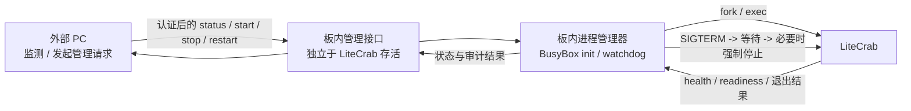
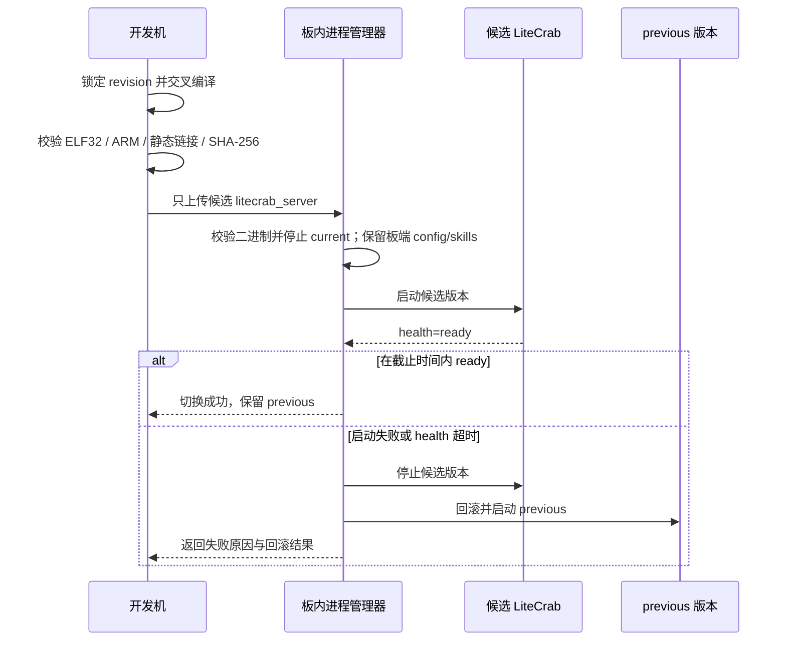
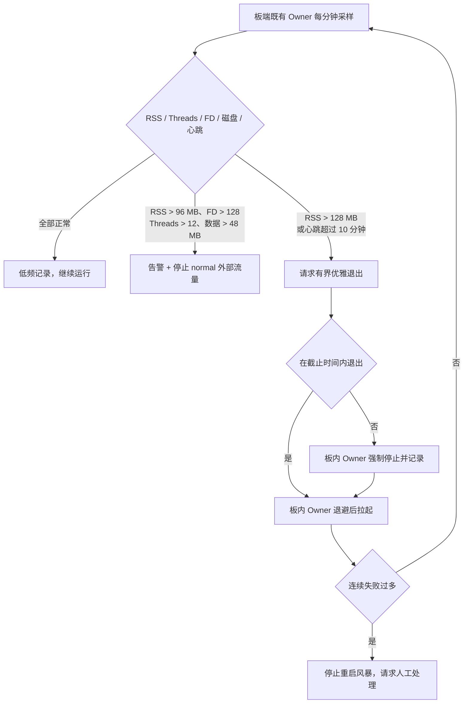

# 阶段 0：部署前遏制措施

## 1. 文件介绍

本文件将主文档第 12 章“阶段 0”展开为可执行的部署基线。正式交付物只有 `litecrab_server` 一个二进制；配置和 Skills 由板端预置，板端既有进程负责启停。本仓库不交付 BusyBox init、watchdog、部署脚本或配置/Skills 副本。

阶段 0 是临时安全网，不是长期运行改造完成的标志。它无法解决孤儿响应堵塞、FIFO 无真实优先级、Session/Skill 生命周期分裂等结构性问题。

## 2. 功能与交付物

### 2.1 网络暴露收敛

- `listen_ip` 固定为 `127.0.0.1`，保持 `allow_unauthenticated_remote=false`。
- PC Transfer Station 或本地代理负责身份认证、最大并发、单来源限流和请求体上限。
- TCP 接收/发送超时由 600 秒先降至 30 秒；LLM 总超时仍由 LLM 配置独立控制。
- 代理容量不得超过 LiteCrab 可承受的并发；建议连接并发先限制为 8，留出 health 与运维余量。

### 2.2 日志、Trace 与磁盘遏制

- 默认设置 `LITECRAB_TRACE_LOG_LLM_INPUT=0`，并修正源码默认值与注释不一致的问题。
- 外部轮转主日志和 Trace，清理策略必须按文件数和总容量双重限制。
- 外部监控 `logs`、`.crab/sessions` 与文件系统可用空间；接近阈值时先禁止新普通请求，再清理过期诊断文件。
- 不直接删除当前正在写入的文件；使用 rename 后再删除旧文件，或在进程重启窗口处理。

### 2.3 可核验构建与部署

- 每次部署从指定 Git revision 重新交叉编译。
- 二进制内嵌 revision 和构建时间；开发侧在交付前记录并核验 revision、编译器和二进制 SHA-256，但这些记录不是正式板端交付文件。
- 自动检查产物是 `ELF32`、`EM_ARM`、hard-float 且没有 `NEEDED` 动态依赖。
- 只上传候选 `litecrab_server`；不得覆盖、打包或修改板端已有的 `config/` 和 `skills/`。具体替换/回滚由板端既有升级机制负责。

### 2.4 板内进程管理与 PC 侧监测

- LiteCrab 的启动、停止和重启只能由板内既有其他进程执行；LiteCrab 仓库只实现可被该 Owner 发送 `SIGTERM` 的有界退出，不实现或交付进程 Owner。
- 外部 PC 只采集状态、产生告警或向板内管理进程发送请求，不直接拉起或关闭 LiteCrab。
- 后续预留板内受控管理接口，至少支持 `status/start/stop/restart`；其中 `start/restart` 必须由独立于 LiteCrab 的板内管理进程执行，LiteCrab 自身只需在运行时响应有界的优雅退出请求。
- 每分钟采集 RSS、VmSize、Threads、FD、CPU、磁盘和最近健康心跳。
- RSS 超过 128 MB 时可保护性重启，但必须先记录原因；不能用定时重启代替根因修复。

## 3. 执行流

```text
开发机锁定 revision
  -> 只交叉编译 litecrab_server
  -> 在开发侧校验 ELF/静态链接/hash
  -> 只上传候选二进制
  -> 板端既有 Owner 使用板端 config/ 和 skills/ 启动
  -> loopback health + 资源基线检查
  -> 成功：保留 current 与 previous
     失败：停止候选版本并回滚 previous

运行期间：
板内既有进程 Owner -> 采集 /proc 与目录用量
         -> 正常：记录低频样本
         -> 接近阈值：告警并拒绝外部新流量
         -> 进程退出/无心跳：退避后拉起
         -> 连续失败：停止重启风暴并请求人工处理

外部 PC -> 读取监测结果或调用板内预留管理接口
        -> 板内管理进程鉴权、校验并执行 start/stop/restart
```

### 3.1 进程管理边界图

这张图强调“谁能真正操作进程”：PC 是请求来源，不是 LiteCrab 的进程 Owner。



### 3.2 安全部署与回滚时序图



### 3.3 阈值处置图



## 4. 需要修改或新增的文件

| 文件 | 动作 | 修改内容 |
|---|---|---|
| `config/base_config.example.json` | 修改 | 示例超时改为 30000 ms；补充仅 loopback 部署注释对应文档 |
| `config/llm_config.example.json` | 核验 | `max_tokens` 保持 1024～2048，timeout 与阶段 0 策略一致 |
| `src/config/config.c` | 修改 | 默认 TCP recv/send timeout 从 600000 改为 30000；校验范围 |
| `src/gateway/tcp_line.c` | 修改 | fallback 默认值同步为 30000，避免绕过配置加载时回到 600 秒 |
| `src/observability/observability.c` | 修改 | `g_traceLogLlmInput` 默认值改为 0，保持显式环境变量才能开启 |
| `src/main.c` | 修改 | 启动时打印 revision、配置摘要和数据目录容量检查结果 |
| `CMakeLists.txt` | 修改 | 注入 Git revision/build id；`install` 只产生 `bin/litecrab_server` |
| `tests/test_deployment_contract.py` | 新增 | 验证安装树只有一个二进制，并使用板端外置 config/workspace/skills 启停 |
| `include/litecrab/management.h` | 后续预留 | LiteCrab 运行时状态和有界优雅退出请求协议；不承担停止后的自启动 |
| 板内进程管理器实现 | 后续新增 | 对 PC 暴露受控 `status/start/stop/restart` 接口并成为实际进程 Owner |
| `docs/deployment/sd5091_deployment.md` | 修改 | 引用实际脚本，删除仅后台启动等同于监督的歧义 |
| `tests/test_config_limits.c` 或 `tests/test_main.c` | 修改 | 验证安全默认值及越界配置拒绝 |

## 5. 关键伪代码

### 5.1 单二进制构建与交付前校验

```sh
revision = git rev-parse HEAD
require clean-or-explicitly-recorded source state

cmake configure --toolchain armhf --static --revision revision
cmake build litecrab_server

assert file(binary) contains "ELF 32-bit" and "ARM"
assert readelf_header(binary).machine == "ARM"
assert readelf_dynamic(binary) has no NEEDED entry

record_build_evidence_off_board(revision, buildTimeUtc, compilerVersion, binarySha256)
assert install_tree == ["bin/litecrab_server"]
```

### 5.2 watchdog

```sh
board_watchdog loop every 60 seconds:
    now = monotonic_seconds_from_proc_uptime() // 退避/窗口/存活时长禁止使用墙上时间
    pid = read_validated_pidfile()
    if process_missing(pid):
        restart_with_exponential_backoff()
        continue

    sample = read_proc_status(pid) + count_fds(pid) + directory_sizes()
    append_bounded_metrics(sample)

    if rss > 96MB or fd > 128 or threads > 12 or data > 48MB:
        raise_alert(sample)
        ask_proxy_to_stop_normal_admission()

    if rss > 128MB or heartbeat_stale > 10min:
        request_graceful_stop(10s)
        force_stop_if_needed()
        restart_with_backoff()
```

### 5.3 安全部署/回滚

```text
upload litecrab_server.new
verify off-board recorded sha256
stop current with bounded wait
board_upgrade_mechanism_replace_binary_only()
start with board-owned --config/--llm-config/--workspace
if health not ready within deadline:
    stop release-N
    set current = previous
    start previous
```

## 6. 功能描述与行为边界

- 对外请求必须先经过代理，LiteCrab 只接受本机来源。
- 超过代理并发或速率限制的请求得到明确 busy/429，而不是排队到 LiteCrab。
- 诊断 Trace 默认不保存完整 LLM 输入；临时开启必须有人工记录和自动失效时间。
- 板端既有 Owner 的保护性重启是最后手段；触发时必须保存最近资源样本和退出原因。
- watchdog 的重启窗口、退避和稳定运行时长使用 `/proc/uptime` 单调时间；NTP 或人工校时只能改变审计时间戳，不能清零连续失败计数。
- PC 侧管理请求必须落到板内管理进程执行；LiteCrab 已停止时不能依赖 LiteCrab 自身接口完成启动。
- 开发侧二进制 hash 校验失败、产物不是 ARM32 或存在动态依赖时禁止发布；hash 记录不随正式产物打包。

## 7. 验证与完成标准

- 配置测试证明未显式配置时绑定 loopback，TCP 超时为约 30 秒，远程未认证绑定被拒绝。
- 在候选二进制上自动验证 ELF32/ARM/静态链接和 revision；安装契约测试证明正式安装树只有该二进制。
- 真机联调时验证：杀死进程后板端既有 Owner 按退避策略恢复；错误配置不会形成每秒重启风暴。该能力不由 LiteCrab 仓库交付。
- 人工制造日志/Trace 增长，外部策略能将总量限制在约定范围。
- 监控至少能输出 RSS、VmSize、Threads、FD、CPU、日志和 Session 目录大小。

## 8. 一致性与合理性检查

- 与主文档阶段 0 的八项措施逐项一致，未宣称解决阶段 1～4 的结构问题。
- 将默认 TCP 超时同时修改 `config.c` 和 `tcp_line.c` 是必要的；只改示例配置会保留 fallback 风险。
- 代理并发建议用 8 而不是直接占满主文档的 16 个连接上限，给健康检查和运维连接留余量，属于保守实现，不改变 16 的服务内部目标上限。
- 当前 `observability.c` 的注释称默认关闭而变量为 1，修为 0 与主文档第 13 章完全一致。
- 阶段 0 由 LiteCrab 进程之外的板内脚本执行磁盘清理，无法保证正在写文件的原子性，因此只作为过渡；正式轮转仍放在阶段 3。
- 将进程 Owner 放在板内是必要约束：PC 可以作为控制请求来源，但不能成为实际执行 `fork/exec/signal` 的主体；预留接口属于板内管理平面。
