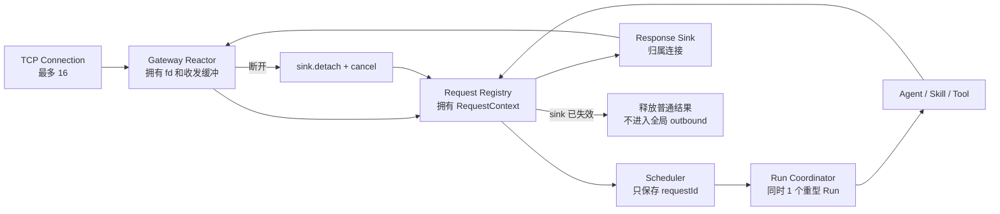
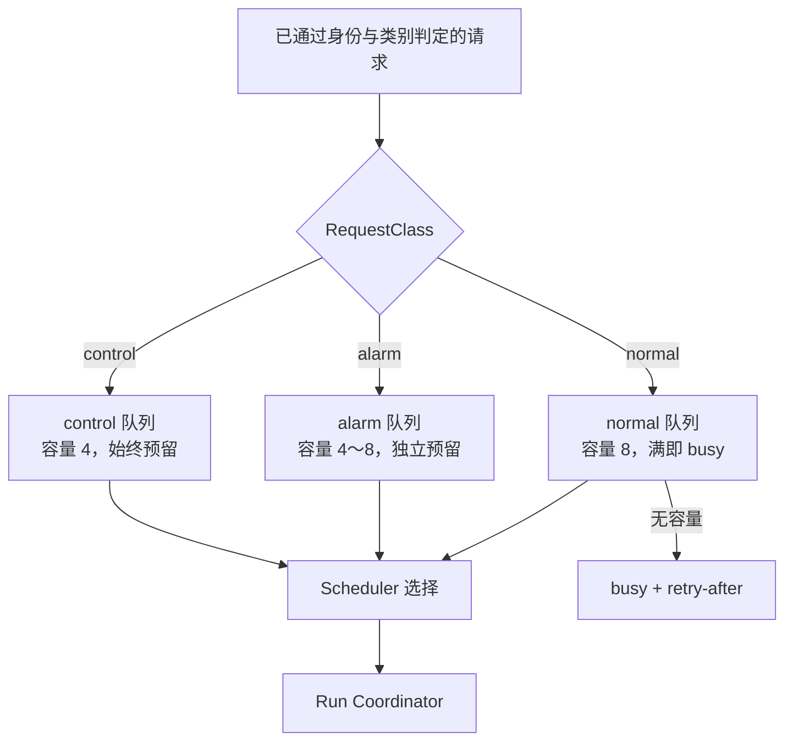
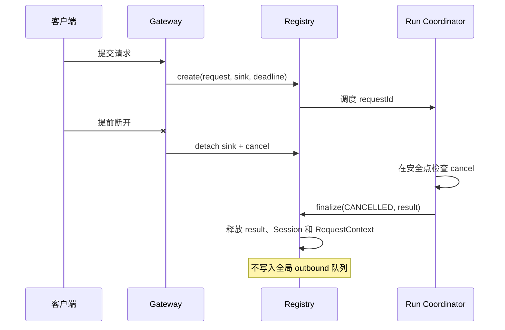

# 阶段 1：建立有界运行时主干

## 1. 文件介绍

本阶段建立 `Gateway -> Request Registry -> Scheduler -> Run Coordinator -> Response Sink` 主干，解决当前最危险的两个 P0 问题：一连接一 detached 线程，以及调用方超时后 Agent 仍向全局出队列写入导致永久阻塞。

目标不是简单替换队列，而是给每个请求建立唯一 Owner、状态、绝对 deadline、取消令牌和响应归属。

## 2. 功能与模块职责

### 2.1 Gateway Reactor

- 单线程 `poll`/`epoll` 管理监听 socket 和最多 16 个连接。
- Connection Table 保存 fd、解析状态、输入/输出缓冲、空闲截止时间和当前请求引用。
- 输入一行达到 `max_req_bytes` 前没有换行时返回 `request_too_large` 并关闭。
- 输出支持部分写；单连接输出缓冲有上限，慢读客户端不能拖住其他连接。
- 满载时 accept 后发送简短 `busy` 并关闭；`EMFILE` 使用预留 fd 技巧或退避，不退出服务。

### 2.2 Request Registry

- 容量固定，建议 `connections + queued + running + async results` 分开配置，初值不超过 32 个上下文。
- 状态只允许：`ACCEPTED -> QUEUED -> RUNNING -> COMPLETED`，任一中间态可进入 `CANCELLED/TIMED_OUT/FAILED`。
- Registry 持有请求内容、SessionHandle、ResourceBudget 和 ResponseSink 引用；其他模块只持受控引用或 request id。
- 客户端断开：detach sink；仍排队的 normal 请求取消；运行中的请求设置 cancellation，由安全点结束。

### 2.3 分级 Bounded Scheduler

- `control` 容量 4，供 health、cancel、shutdown 使用。
- `alarm` 容量 4～8，阶段 1 先提供预留通道，阶段 4 再接 durable spool。
- `normal` 容量 8，满时立即返回 busy/retry-after。
- 采用“control 始终优先；alarm 与 normal 加权”策略，避免 normal 饿死，也不让告警被普通请求占满。

### 2.4 Run Coordinator

- SD5091 同时只执行 1 个重型 Run。
- 从 Scheduler 领取 RequestContext，把状态转为 RUNNING，再调用现有 Agent/Skill/Tool 主循环。
- 在 LLM 前后、每个 Tool 前后、每轮迭代和持久化前检查 deadline/cancellation。
- 阶段 1 先提供预算接口；具体字节、扫描和子进程预算在阶段 2 实现。

### 2.5 Response Sink

- 同步 TCP 响应属于连接的 sink，不再进入全局 outbound FIFO。
- 连接仍存在时把结果挂到对应连接的有界发送缓冲；连接已断开则普通结果直接销毁。
- 仅明确要求异步查询的请求写入有配额 Result Store；不得把所有同步结果都持久化。

### 2.6 基础 health 与 metrics

- 公开本地 control 请求：`health`、`metrics_snapshot`、`cancel(requestId)`。
- 指标至少包含连接数、各队列长度、Registry 各状态数、当前 Run、超时、取消、discarded response、线程、FD 和 RSS。
- health 状态为 `ready/degraded/overloaded/stopping`。

## 3. 执行流

### 3.1 正常同步请求

```text
Reactor 收到完整请求行
  -> admission：连接/请求/normal 队列是否有容量
  -> Registry.create(deadline, sink, session)
  -> Scheduler.enqueue(normal, requestId)
  -> Run Coordinator dequeue
  -> Registry: QUEUED -> RUNNING
  -> Agent 执行并检查 cancel/deadline
  -> Registry.complete(result)
  -> ResponseSink.attach(result)
  -> Reactor 部分写直至完成
  -> Registry.remove + Session release
```

### 3.2 客户端提前断开

```text
Reactor 检测 HUP/error
  -> sink.detach()
  -> 若 ACCEPTED/QUEUED 且 class=normal：Scheduler.remove + Registry.cancel
  -> 若 RUNNING：cancel token = true
  -> 执行器在安全点结束
  -> complete 发现 sink detached：销毁普通结果
  -> Registry.remove + Session release
```

### 3.3 deadline 到期

```text
Reactor/Scheduler/Run 任一处发现 monotonic_now >= deadline
  -> CAS state -> TIMED_OUT
  -> 设置 cancellation
  -> 若 sink 可用，排入短小 timeout 响应
  -> 从 Scheduler 移除或让 Run 在最近安全点终止
  -> 统一 cleanup
```

### 3.4 overload

```text
control 请求：使用预留 control 槽
alarm 请求：使用预留 alarm 槽
normal 请求：normal 队列或 Registry 无容量
  -> 不创建长期对象
  -> 返回 busy + retry-after
  -> metrics.admission_rejected++
```

### 3.5 阶段 1 组件与所有权图



### 3.6 三类队列与预留容量图



### 3.7 断开与超时不再形成孤儿响应



## 4. 需要修改或新增的文件

| 文件 | 动作 | 修改内容 |
|---|---|---|
| `include/litecrab/gateway.h` | 重构 | `RequestServer` 生命周期、ConnectionConfig、start/stop/join、sink 回调 |
| `src/gateway/tcp_line.c` | 重构 | 删除 per-connection detached thread，改 Reactor + Connection Table + 部分读写 |
| `include/litecrab/request.h` | 新增 | RequestId、RequestState、RequestClass、CancellationToken、RequestContext |
| `src/runtime/request_registry.c` | 新增 | 固定容量 Registry、状态转换、引用和统一 cleanup |
| `include/litecrab/scheduler.h` | 新增 | 三通道 enqueue/dequeue/cancel/admission API |
| `src/runtime/scheduler.c` | 新增 | control/alarm/normal 有界队列与公平策略 |
| `include/litecrab/response_sink.h` | 新增 | sink attach/detach/complete/discard 接口 |
| `src/gateway/response_sink.c` | 新增 | TCP sink 与有界发送缓冲实现 |
| `include/litecrab/hub.h` | 兼容性修改 | Ingress 接入 Scheduler；弃用 outbound queue API |
| `src/hub/hub.c` | 重构/逐步删除 | 移除阻塞式 outbound；旧入口薄适配到 Registry/Scheduler |
| `include/litecrab/kernel.h` | 修改 | Agent 执行入口接收 RequestContext；Run Coordinator API |
| `src/kernel/kernel.c` | 重构 | `agent_main` 从 Scheduler 取任务；`finish_request` 直接完成所属 sink |
| `include/litecrab/metrics.h` | 新增 | 计数器、gauge、health snapshot |
| `src/observability/metrics.c` | 新增 | `/proc` 轻量采样和组件指标 |
| `src/main.c` | 修改 | 明确初始化/启动顺序和 stop/join；信号处理只设置标志/唤醒 |
| `src/config/config.c`、`config/base_config.example.json` | 修改 | 连接、Registry、三队列容量和 request deadline 配置 |
| `CMakeLists.txt` | 修改 | 纳入新模块和测试 |
| `tests/test_gateway_reactor.c` | 新增 | 连接上限、partial I/O、slowloris、EMFILE、stop/join |
| `tests/test_request_lifecycle.c` | 新增 | 状态机、取消、deadline、断开、sink discard |
| `tests/test_scheduler.c` | 新增 | 容量预留、公平性、取消和 overload |
| `tests/test_tcp_e2e.py` | 扩展 | orphan timeout、连接 churn、断开后继续服务 |

## 5. 关键数据结构与伪代码

```c
typedef struct {
    uint64_t id;
    RequestClass class;
    atomic_int state;
    int64_t accepted_at_ms;
    int64_t deadline_ms;
    CancellationToken cancel;
    ResponseSinkRef sink;
    SessionHandle session;
    ResourceBudget budget;
    char *input;
} RequestContext;
```

### 5.1 admission 与入队

```c
on_request_line(connection, input):
    class = classify(input)  // 客户端不能任意伪造 alarm/control
    deadline = monotonic_now() + configured_timeout(class)

    if !scheduler_has_capacity(class) or !registry_has_capacity():
        connection_queue_small_error("busy", retry_after_ms)
        metrics.admission_rejected[class]++
        return

    ctx = registry_create(class, deadline, connection.sink, input)
    if !ctx or !scheduler_try_enqueue(class, ctx.id):
        registry_fail_and_remove(ctx, BUSY)
        connection_queue_small_error("busy", retry_after_ms)
        return
```

### 5.2 Run Coordinator

```c
run_loop():
    while !stopping:
        id = scheduler_dequeue_next()
        ctx = registry_acquire(id)
        if !ctx: continue
        if expired(ctx) or cancelled(ctx):
            finalize(ctx, TIMED_OUT_OR_CANCELLED)
            continue
        if !transition(ctx, QUEUED, RUNNING): continue

        result = agent_run(ctx)  // 每个阻塞边界使用 remaining_ms(ctx)
        if cancelled(ctx): finalize(ctx, CANCELLED)
        else if expired(ctx): finalize(ctx, TIMED_OUT)
        else if result.error: finalize(ctx, FAILED)
        else finalize(ctx, COMPLETED, result)
```

### 5.3 完成与销毁

```c
finalize(ctx, terminal, result):
    if !transition_to_terminal_once(ctx, terminal):
        free(result)
        return

    sink = response_sink_lock(ctx.sink)
    if sink.connected and terminal_requires_reply(ctx):
        if !sink.try_attach(result):
            metrics.responses_discarded++
            free(result)
    else:
        free(result)

    session_release(ctx.session)
    registry_remove_when_unreferenced(ctx.id)
```

### 5.4 Reactor 主循环

```c
while !server.stopping:
    events = poll(listener + connection_fds, nearest_deadline)
    if listener readable:
        accept_until_eagain()
        if table_full: send_busy_then_close()
    for event in events:
        if readable: bounded_read_and_frame(event.connection)
        if writable: flush_bounded_output(event.connection)
        if hup/error: detach_sink_and_cancel(event.connection)
    expire_idle_connections()
    expire_request_deadlines()
```

## 6. 功能描述与错误语义

- `busy`：系统有能力运行但对应服务等级没有容量，客户端可按 `retry_after_ms` 重试。
- `timeout`：请求统一绝对 deadline 已耗尽；后续 LLM/Tool 不得继续启动。
- `cancelled`：客户端断开、显式取消或 shutdown 触发；不是业务失败。
- `failed`：在预算内执行结束但组件返回错误。
- `overloaded` health：拒绝 normal，但 control 和 alarm 预留槽仍可用。
- 任一终态最多提交一次；重复完成只释放调用者持有的结果。

## 7. 迁移策略

1. 先引入 RequestContext、Registry 和 Scheduler 单元测试，旧 Gateway 通过适配层提交。
2. 将 `kernel.c::finish_request` 改为 `RequestComplete`，彻底停止生产 outbound 消息。
3. 删除/禁用 `MessageBusPushOutbound` 后做 timeout orphan 压测，证明 Agent 不再被响应阻塞。
4. 最后将 Gateway 换成 Reactor；若先用固定线程池，接口与容量语义保持不变。
5. 清理旧 outbound API 和按 requestId 线性扫描逻辑。

## 8. 验证与完成标准

- 100,000 次连接 churn 后线程和 FD 回到基线，Connection Table 无泄漏。
- 16 个 slowloris 占满时，新连接得到确定 busy，服务不退出；释放后可继续请求。
- 连续制造超过旧 outbound 容量 16 的客户端超时，Agent 仍能处理第 17 个及后续请求。
- 分别在排队、LLM 前、Tool 前、响应发送阶段取消，请求都进入单一终态并释放 Session 引用。
- normal 队列满时 health/cancel 仍可执行；alarm 有独立容量。
- shutdown 后所有线程 join，Registry/Connection/Scheduler 均为空或记录明确的强制清理数。

## 9. 一致性与合理性检查

- 模块、容量与执行路径对应主文档第 5～7、11.3、11.4 和阶段 1，没有提前引入阶段 2～4 的完整实现。
- Response Sink 直接归属请求，消除了主文档 3.2 描述的 orphan outbound 根因；仅给旧队列加超时不够，因为 Agent 仍可能堆积无消费者结果。
- Reactor 输出缓冲也必须有界，否则只是把线程风险换成每连接内存风险。
- alarm/control 分类必须由可信 ingress source 决定，不能信任网络 JSON 的 priority 字段，否则普通客户端可占用预留槽。
- `RequestContext` 的 Registry 容量不应简单等于 normal 队列容量，因为还包含运行中和正在发送的请求；但总量仍必须硬限制。
- 阶段 1 的 health 是进程内基础状态，BusyBox 自动恢复和完整 watchdog 放在阶段 4，阶段划分与原文一致。
