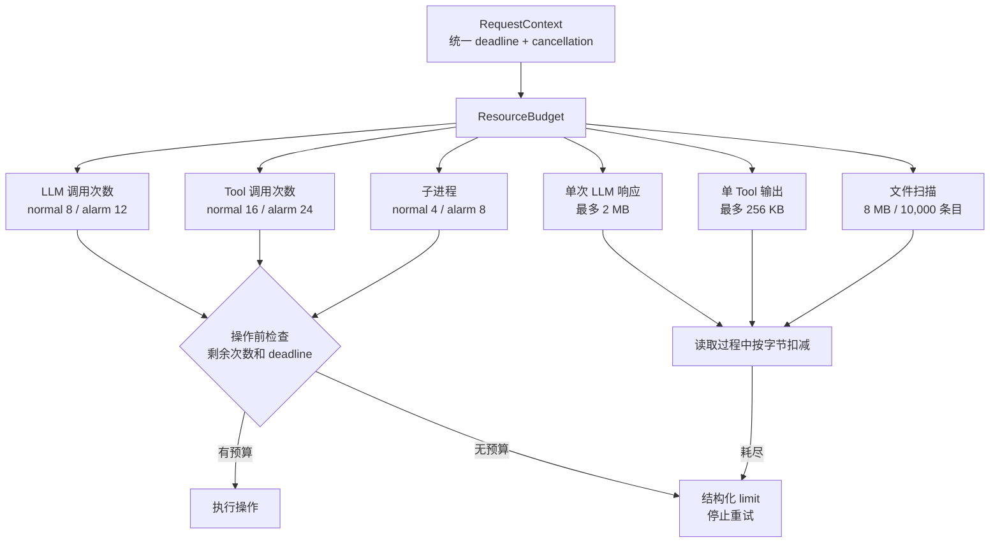
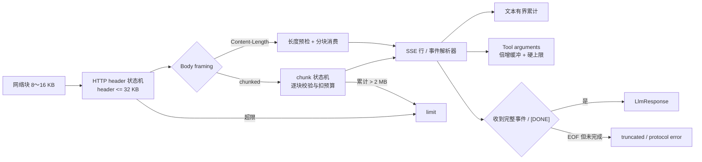
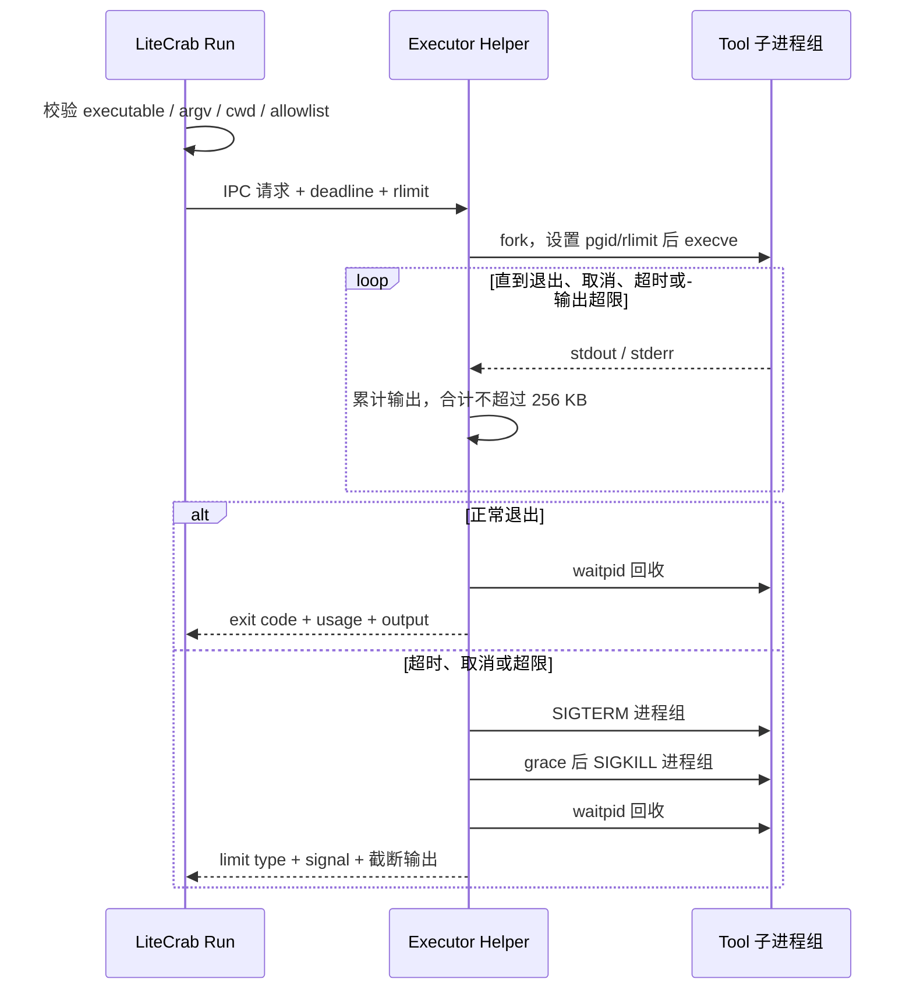

# 阶段 2：限制执行峰值

## 1. 文件介绍

本阶段把阶段 1 的统一 deadline/cancellation 扩展为可计量的 Run Resource Budget，并将其贯穿 LLM、文件遍历和子进程执行。目标是让合法大输入、网络故障、输出洪泛、目录树膨胀和异常子进程都具有确定上界。

本阶段不增加重型 Run 并发；SD5091 初始仍保持 1 个重型 Run，以可预测内存换取稳定性。

## 2. 功能与模块职责

### 2.1 Run Resource Budget

每个 Run 从 RequestContext 获得独立预算：

| 预算 | normal 初值 | alarm 初值 | 消费位置 |
|---|---:|---:|---|
| 总 deadline | 120 秒 | 180 秒 | Scheduler、LLM、Tool、Response |
| LLM 调用 | 8 | 12 | 每次实际发起网络请求前 |
| Tool 调用 | 16 | 24 | 每个 Tool dispatch 前 |
| 单次 LLM 响应 | 2 MB | 2 MB | HTTP/SSE parser |
| 单 Tool 输出 | 256 KB | 256 KB | Tool/Helper output reader |
| 文件扫描累计字节 | 8 MB | 8 MB | BoundedWalker/grep |
| 文件条目 | 10,000 | 10,000 | BoundedWalker |
| 子进程 | 4 | 8 | Executor client |

预算由可信运行时代码扣减。LLM、Skill 或 Tool 返回内容不能修改预算；配置只能在经过验证的安全范围内调整。

### 2.2 增量 HTTP/chunked/SSE parser

- 网络读取块固定在 8～16 KB，不保存完整 wire response。
- HTTP header 设置小型硬上限，例如 32 KB；header 未完成即超限则失败。
- Content-Length 超过 2 MB 在读 body 前拒绝；chunked 在每块到达时累计扣减。
- SSE 按行/事件增量解析，遇到 `[DONE]` 完成；对端关闭但无完整事件或结束标志时返回 truncated。
- 文本与 tool arguments 分开限额；Tool arguments 使用 `length/capacity/max` 倍增缓冲。
- connect、TLS handshake、read idle 和 total deadline 分别记录，但均不能超过 `remaining_ms(request)`。
- retry backoff 带 jitter；休眠前比较剩余 deadline，预算不足则不开始下一次尝试。

### 2.3 BoundedWalker

- `grep`、`glob`、Skill 扫描和未来索引统一复用遍历器。
- 限制深度、条目、累计读取字节、匹配结果、deadline 和取消。
- 命中结果上限后立即停止，不继续遍历剩余目录。
- 使用 `lstat/openat` 并明确符号链接策略，避免越出 workspace 或形成循环。
- 每处理一批条目检查 cancellation 并让出执行权。

### 2.4 Executor Helper

- 主进程与 Helper 通过 Unix domain socket 或双向 pipe 传递定长 header + 有界 payload。
- 主进程提交 executable、argv、cwd、环境白名单和预算，不提交 shell 字符串。
- Helper 设置独立进程组、`RLIMIT_CPU/AS/NOFILE/FSIZE`，再 exec allowlist 中的程序。不能直接把 `RLIMIT_NPROC` 设为很小的值，因为它按真实 UID 统计；只有 Helper 使用独立 UID 或 cgroup/pid namespace 时才设置进程数硬上限。
- stdout/stderr 非阻塞读取，合计达到 256 KB 立即停止接收并终止整个进程组。
- wall timeout：先 SIGTERM，短 grace 后 SIGKILL；必须回收 leader 和可发现的后代。
- Helper 崩溃时当前执行返回 `executor_unavailable`，由后续 Supervisor/当前轻量管理逻辑重建；不得在请求中无限重启。

### 2.5 线程栈校准

- 在 ARM 真机用栈涂色、编译器支持或采样方法测量高水位。
- 根据高水位 + 安全余量为 Reactor、Run、Alarm、Log、Helper client 显式设置栈大小。
- 在测量前不盲目压低栈，避免把虚拟内存问题变成栈溢出。

## 3. 执行流

### 3.1 LLM 调用

```text
Run Coordinator
  -> budget.begin_llm_call()：检查次数与 remaining deadline
  -> connect/TLS（各自 timeout <= remaining）
  -> 发送请求
  -> 增量解析 header -> chunk/content -> SSE event
  -> 每批字节扣减 llmResponseBytes
  -> 累积 text/tool args，各自检查上限
  -> 完整结束：返回 LlmResponse
  -> 超限/取消/截断：关闭连接，返回结构化 limit/cancel/protocol 错误
  -> 仅可重试错误：检查调用次数和剩余 deadline 后退避
```

### 3.2 文件 Tool

```text
Tool dispatch -> BoundedWalker.open(workspace, budget)
  -> 读取下一批目录项
  -> entryBudget--，检查深度/排除/符号链接
  -> grep 读取文件前预扣或逐块扣 scanBytes
  -> visit 回调追加结果并扣 outputBytes
  -> 达到结果上限：立即 STOP_SUCCESS_TRUNCATED
  -> deadline/cancel/预算耗尽：STOP_LIMIT，返回已截断标志与消费量
```

### 3.3 子进程 Tool

```text
主进程验证 executable allowlist、argv、cwd
  -> budget.childProcesses--
  -> 向 Helper 发送 request + limits + deadline
  -> Helper fork child，设置 pgid/rlimit/minimal env
  -> execve
  -> Helper poll stdout/stderr/pid/deadline
  -> 正常退出：回传 exit code + usage
  -> 输出超限/超时/取消：SIGTERM process group -> grace -> SIGKILL
  -> waitpid 回收 -> 回传 limit type、signal、截断输出和 usage
```

### 3.4 Run Budget 消费图



### 3.5 LLM 增量解析图



### 3.6 Executor Helper 隔离图



## 4. 需要修改或新增的文件

| 文件 | 动作 | 修改内容 |
|---|---|---|
| `include/litecrab/budget.h` | 新增 | ResourceBudget、消费 API、limit reason、remaining time |
| `src/runtime/budget.c` | 新增 | 原子/单 Owner 预算扣减、结构化错误 |
| `include/litecrab/request.h` | 修改 | RequestContext 持有预算与取消令牌 |
| `include/litecrab/kernel.h` | 修改 | LLM API 接收 budget/cancel；响应上限元数据 |
| `src/kernel/kernel.c` | 修改 | 每轮 LLM/Tool 前后消费预算和检查取消 |
| `src/kernel/llm.c` | 重构 | 增量 HTTP/chunk/SSE parser、分层 timeout、bounded grow buffer |
| `src/kernel/http_stream.c` | 新增（建议） | HTTP 状态机，便于独立 fuzz/unit test |
| `src/kernel/sse_parser.c` | 新增（建议） | SSE 行/事件状态机与完成语义 |
| `include/litecrab/bounded_walker.h` | 新增 | 遍历配置、visitor、停止原因 |
| `src/runtime/bounded_walker.c` | 新增 | 共享有界遍历器 |
| `src/runtime/builtin_tools.c` | 重构 | grep/glob 使用 walker；exec_program 改为 Helper client |
| `include/litecrab/executor.h` | 新增 | 结构化执行请求/结果协议 |
| `src/executor/executor_client.c` | 新增 | 主进程 IPC、deadline/cancel、Helper 重连 |
| `src/executor/executor_helper.c` | 新增 | rlimit、process group、输出捕获、回收 |
| `src/main.c` | 修改 | Helper 启停和失败处理；最终由阶段 4 Supervisor 接管 |
| `src/config/config.c` | 修改 | 预算与 rlimit 配置解析和安全范围校验 |
| `config/base_config.example.json` | 修改 | 给出 SD5091 默认预算 |
| `CMakeLists.txt` | 修改 | 构建 Helper 和 parser/walker 测试 |
| `tests/test_llm_stream.c` | 新增 | partial header/chunk/SSE、2 MB、缺 `[DONE]`、取消 |
| `tests/test_budget.c` | 新增 | 每种预算边界和组合消费 |
| `tests/test_bounded_walker.c` | 新增 | 深目录、海量文件、符号链接、早停 |
| `tests/test_executor.c` | 新增 | 输出洪泛、孙进程、SIGTERM 忽略、rlimit、崩溃恢复 |

## 5. 关键伪代码

### 5.1 预算消费

```c
LimitResult budget_consume(ResourceBudget *b, Kind kind, uint64_t amount) {
    if (cancelled(b->cancel)) return LIMIT_CANCELLED;
    if (monotonic_now_ms() >= b->deadline_ms) return LIMIT_DEADLINE;
    uint64_t *remaining = select_counter(b, kind);
    if (amount > *remaining) return LIMIT_EXHAUSTED(kind);
    *remaining -= amount;
    return LIMIT_OK;
}
```

### 5.2 增量接收

```c
while !parser.complete:
    timeout = min(read_idle_timeout, remaining_ms(ctx))
    n = connection_read(block, sizeof block, timeout)
    if n == TIMEOUT: return LLM_READ_TIMEOUT
    if n == EOF and !parser.complete: return LLM_TRUNCATED
    if budget_consume(LLM_RESPONSE_BYTES, n) != OK: return LLM_LIMIT

    for event in http_parser_feed(block, n):
        if event.header_complete and declared_length > 2MB: return LLM_LIMIT
        if event.body_bytes:
            for sse_event in sse_feed(event.body_bytes):
                append_text_bounded(sse_event.delta)
                append_tool_args_geometric_bounded(sse_event.tool_delta)
```

### 5.3 Helper 限制

```c
child_main(request):
    setpgid(0, 0)
    setrlimit(RLIMIT_CPU, request.cpu_seconds)
    setrlimit(RLIMIT_AS, request.address_space_bytes)
    setrlimit(RLIMIT_NOFILE, 32)
    // 不在共享 UID 下设置小值 RLIMIT_NPROC；用专用 UID/cgroup 限制进程数
    setrlimit(RLIMIT_FSIZE, 4MB)
    close_all_except(stdin, stdout, stderr)
    chdir(validated_workspace_cwd)
    execve(validated_executable, argv, minimal_env)

helper_monitor(pid):
    poll(output_fds, child_exit, cancel_fd, deadline)
    if output_total > 256KB or cancelled or expired:
        killpg(pid, SIGTERM)
        wait grace
        killpg(pid, SIGKILL)
    waitpid(pid)
    return structured_result()
```

## 6. 功能描述与返回语义

- 预算耗尽返回 `limit`，并包含 `kind/allowed/used/truncated`；不能伪装为普通成功。
- 已达到 grep/glob 结果上限可以返回 `success + truncated=true`，前提是没有超出安全预算。
- HTTP 对端正常关闭不等于 SSE 完成；必须看到协议定义的完整消息/结束条件。
- Tool stdout 和 stderr 合计受限，同时保留各自截断标志。
- `shell` 继续默认禁用；allowlist 基于可解析的真实路径和 Skill manifest，不以“workspace 内可执行”作为授权。

## 7. 验证与完成标准

- 对 HTTP parser 做分片边界矩阵与 fuzz：每个字节位置都可能拆包，内存峰值不随 wire response 无界增长。
- 2 MB+1 字节响应立即得到 limit；chunk 声明、实际长度和结束符异常均安全失败。
- 连续 Tool argument 小分片不出现 O(n²) realloc 行为；用扩容次数断言或性能测试验证。
- 百万文件/深目录/符号链接循环场景在条目、字节或 deadline 上界停止。
- 子进程输出洪泛、fork/exec 失败、超时、忽略 SIGTERM、产生孙进程时均能回收且输出不超过 256 KB。
- ARM 真机测得各线程栈高水位并记录安全余量；72 小时前置压力测试无栈溢出。

## 8. 一致性与合理性检查

- 预算值、增量解析、BoundedWalker、Executor Helper 和 ARM 栈测量均逐项对应主文档第 8、9、12 章阶段 2。
- “单次 LLM 响应 2 MB”与 `max_tokens` 不是同一维度：前者限制 wire/body 字节，后者限制模型生成 token，两个限制都保留是合理的。
- 预算在实际操作前扣减，避免失败重试绕过调用次数；但网络响应字节按实际读取扣减，避免仅凭 Content-Length 信任对端。
- Helper 的 `RLIMIT_AS=64 MB` 必须在 PLC 程序真机测量后校准，文档把它标为初值而非不可变常量，与原文一致。
- Helper 崩溃重建在本阶段只保证有界尝试，完整心跳、退避和监督属于阶段 4，避免职责重复。
