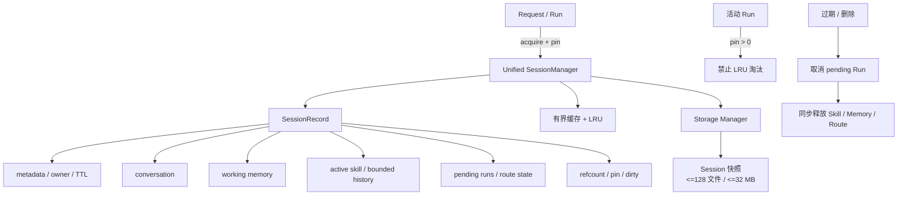
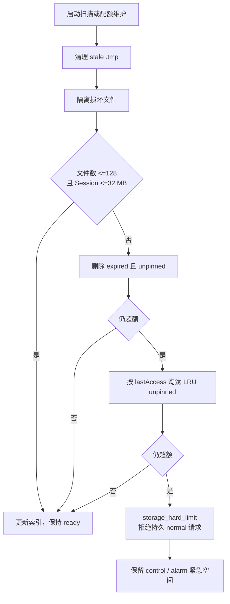
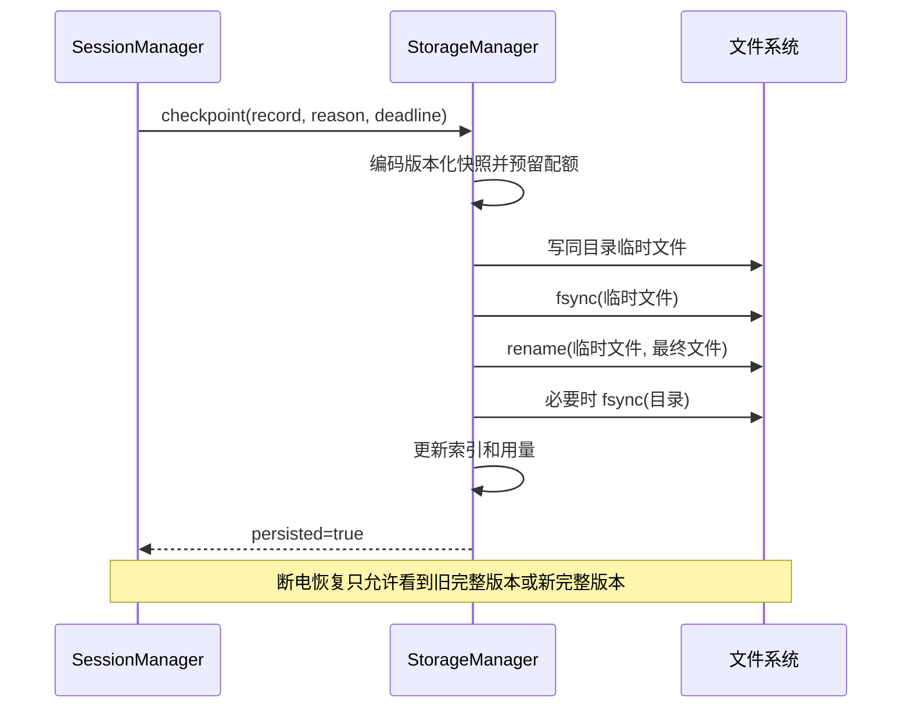
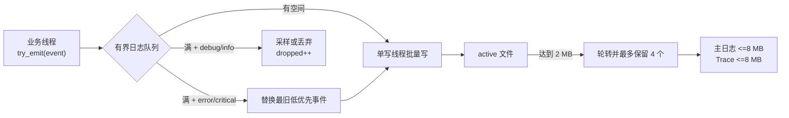

# 阶段 3：统一状态和磁盘治理

## 1. 文件介绍

本阶段统一 Session、Working Memory、Skill active state、挂起 Run 和路由状态的生命周期，并为 Session、日志、Trace 和持久化写入建立配额、TTL、轮转、checkpoint 与磁盘满降级策略。

目标是在超过 1000 个 Session 的 churn 和持续日志写入下，内存槽位、文件数、总磁盘和闪存写入频率仍然可预测。

## 2. 功能与模块职责

### 2.1 Unified SessionManager

`SessionRecord` 成为相关运行状态的唯一 Owner：

```text
SessionRecord
  metadata / owner user
  conversation
  working memory
  active skill + bounded history
  pending runs / route state
  refcount / pin count
  last access / expiry
  dirty flags / checkpoint state
```

核心不变量：

- 活动 Run 获取 pin；pin Session 不参与 LRU 淘汰。
- pin 总数和每 Session pending Run 数有上限；超过时拒绝新 Run。
- Session 删除、过期或显式关闭时，pending Run 转为 cancelled，临时 Skill 状态一并释放。
- `Acquire/Release` 只管理引用；“连接关闭”不等价于“删除持久 Session”。
- Skill API 不再通过独立的 32 槽全局数组按当前 Session 隐式寻址。

### 2.2 Storage Manager 与 Session 配额

- 启动扫描 `.crab/sessions`，验证文件头/checksum，清理遗留 `.tmp.<pid>`，建立轻量索引。
- 文件数上限 128，总预算 32 MB，非 pin 默认 TTL 7 天，均可配置但有安全上限。
- 配额回收顺序：损坏/临时遗留 -> 已过期 -> 最久未访问且未 pin。
- 临时连接生成的 Session 默认不落盘；只有客户端提供稳定、校验通过的 `sessionId` 才持久化。
- 原子写：同目录临时文件 -> 写入/校验 -> `fsync(file)` -> rename -> 必要时 `fsync(directory)`。

### 2.3 checkpoint/journal

- `completed`、`waiting_input`、告警 ACK 关联状态等关键边界立即 checkpoint。
- 同一 Run 内普通消息/Working Memory 更新只标 dirty，由最短 checkpoint 间隔合并。
- shutdown 在总 deadline 内批量 flush；超过 deadline 留下可识别的非优雅标志，不无限等待。
- 若断电恢复要求覆盖每一步 Tool 状态，再引入小型 append-only journal；journal 有大小上限并定期 compact 成快照。

### 2.4 Bounded Log/Trace Sink

- 单写线程 + 有界内存队列；业务线程提交结构化事件后立即返回。
- 队列满：保留 critical/error、资源阈值和生命周期事件；采样/丢弃 debug，并累积 dropped counter。
- 批量写，按字节或时间 flush；critical 可请求立即 flush，但不能让任意业务日志永久阻塞。
- 主日志：2 MB × 4，总 8 MB；Trace：2 MB × 4，总 8 MB。
- 常态 Trace 保存 hash、长度、token、状态、错误码和脱敏摘要；完整 LLM 输入默认关闭且有自动失效时间。

### 2.5 磁盘满降级

- 达到软阈值：停止 debug Trace、提高采样率、触发过期回收。
- 达到硬阈值：拒绝需要持久 Session 的新 normal 请求；保留 control 和 alarm 最小写入空间。
- ENOSPC 后不紧密重试；记录内存计数和最近一次错误时间，按退避探测恢复。
- Session checkpoint 失败必须暴露给 Run/health，不能继续报告“已持久化”。

## 3. 执行流

### 3.1 Session 获取和运行

```text
Request Registry 解析稳定 sessionId
  -> SessionManager.acquire(id, persistence_policy)
  -> 缓存命中：refcount++ / lastAccess 更新
  -> 未命中：查 Storage index 并加载，或创建临时/持久记录
  -> 无空闲槽：淘汰 expired/LRU unpinned；仍无容量则 busy
  -> Run 开始：pin++，挂入 pendingRuns
  -> 更新 conversation/skill/memory：mark dirty
  -> 关键状态：schedule/force checkpoint
  -> Run 终态：移出 pendingRuns，pin--
  -> Request cleanup：refcount--
```

### 3.2 配额维护

```text
Storage maintenance 被事件或低频 timer 唤醒
  -> 读取当前索引总文件数/字节数
  -> 清理 stale temp 和 quarantine corruption
  -> 删除 expired unpinned
  -> 若仍超额，按 lastAccess 删除 LRU unpinned
  -> 若仍超额，设置 storage_hard_limit/degraded
  -> 不删除 pinned 或正在 checkpoint 的文件
```

### 3.3 日志写入与轮转

```text
producer.try_emit(event)
  -> 队列有空间：按优先级入队
  -> 队列满：高优先事件可替换最旧低优先事件；否则 dropped++

log writer
  -> 批量取事件并写 active file
  -> 达到 2 MB：flush + fsync policy + rename generations
  -> 保留最多 4 个文件并更新用量
  -> ENOSPC：进入 degraded，停止低优先 Trace，退避重试
```

### 3.4 Session 生命周期与 Owner 图



### 3.5 配额回收决策图



### 3.6 checkpoint 原子提交图



### 3.7 日志优先级与轮转图



## 4. 需要修改或新增的文件

| 文件 | 动作 | 修改内容 |
|---|---|---|
| `include/litecrab/session.h` | 重构 | SessionManager、显式 SessionRef/Pin、删除/过期/checkpoint API |
| `src/session/session.c` | 重构 | 统一 SessionRecord、LRU/TTL/pin、临时与持久策略 |
| `include/litecrab/storage.h` | 新增 | 配额、索引、atomic write、maintenance 状态 |
| `src/storage/storage_manager.c` | 新增 | 启动扫描、回收、容量统计、ENOSPC 降级 |
| `src/storage/session_codec.c` | 新增（建议） | 现有固定头二进制格式编解码与版本迁移 |
| `src/storage/journal.c` | 可选新增 | 仅在断电逐步恢复需求确认后实现 |
| `include/litecrab/kernel.h` | 修改 | Skill/Run 显式接收 SessionRecord/handle，不依赖隐式 current state |
| `src/kernel/skill.c` | 重构 | 移除独立 `SKILL_SESSION_CAPACITY` Owner；状态并入 SessionRecord |
| `src/kernel/working_memory.c` | 修改 | Working Memory 生命周期归 SessionManager |
| `src/kernel/kernel.c` | 修改 | Run pin/unpin，终态/checkpoint 边界，持久失败传播 |
| `include/litecrab/observability.h` | 重构 | 结构化事件、优先级、异步 sink、flush deadline |
| `src/observability/observability.c` | 重构 | 单写线程、队列、轮转、脱敏、dropped metrics |
| `src/observability/redaction.c` | 新增（建议） | prompt/tool/credential 脱敏与 hash/摘要 |
| `src/main.c` | 修改 | Storage/Log 初始化顺序，shutdown flush deadline |
| `src/config/config.c` | 修改 | TTL、文件数、字节、checkpoint、日志轮转配置校验 |
| `config/base_config.example.json` | 修改 | SD5091 存储和日志默认预算 |
| `CMakeLists.txt` | 修改 | 新模块和测试 |
| `tests/test_session_lifecycle.c` | 新增 | ref/pin/LRU/TTL/Skill/Run 一致性 |
| `tests/test_storage_quota.c` | 新增 | 128 文件、32 MB、tmp、损坏、ENOSPC、原子恢复 |
| `tests/test_log_sink.c` | 新增 | 优先级丢弃、轮转、总量、并发 producer、flush |
| `tests/test_session_restart.py` | 扩展 | checkpoint/journal 各阶段 kill -9 恢复 |

## 5. 关键伪代码

### 5.1 Session 选择与淘汰

```c
SessionRef session_acquire(id, persistent, create) {
    if (!valid_id(id)) return ERROR_INVALID;
    if (record = cache_find(id)) return ref(record);

    slot = free_slot();
    if (!slot) slot = oldest(record where refcount == 0 && pin_count == 0);
    if (!slot) return ERROR_CAPACITY;

    if (slot.dirty && checkpoint(slot) != OK) return ERROR_STORAGE;
    evict_transient_state(slot);  // skill/history/pending indexes 同步释放
    record = persistent ? storage_load(id) : create_empty(id);
    if (!record && create) record = create_empty(id);
    return ref(record);
}
```

### 5.2 checkpoint

```c
checkpoint(record, reason, deadline):
    if !record.persistent or !record.dirty: return OK
    if now < record.next_checkpoint and !is_critical(reason): return DEFERRED
    bytes = encode_versioned_snapshot(record)
    if !storage_reserve(record.path, bytes.length): return QUOTA

    tmp = open_same_directory_temp(record.id)
    bounded_write(tmp, bytes, deadline)
    fsync(tmp)
    rename(tmp, final)
    fsync(parent_directory_if_required)
    record.dirty = false
    update_storage_index(final)
```

### 5.3 日志背压

```c
log_emit(event):
    if queue.try_push(event): return
    if event.priority >= ERROR and queue.replace_oldest_below(INFO, event):
        dropped[replaced.priority]++
        return
    dropped[event.priority]++
```

### 5.4 磁盘降级

```c
on_storage_usage(used, free):
    if used >= hard_quota or free < emergency_reserve:
        health.add_reason(STORAGE_HARD_LIMIT)
        scheduler.disable_persistent_normal_admission()
        trace_sink.disable_noncritical()
    else if used >= soft_quota:
        health.add_reason(STORAGE_PRESSURE)
        storage.run_eviction()
        trace_sink.increase_sampling()
    else:
        clear_reason_after_hysteresis()
```

## 6. 功能描述与兼容策略

- 保留现有 Session 文件头格式的读取器；写入新版本时通过 version 字段区分，升级期间可读旧写新。
- 稳定 `sessionId` 由客户端明确提供；Gateway 自动生成的连接 session 视为临时，避免每次短连接产生永久文件。
- `close connection` 只 Release；`delete/expire session` 才取消其 pending Run 并移除持久文件。
- 日志被采样或丢弃时 `dropped_events_total` 必须增长，并周期性发出汇总事件。
- 配额回收不触碰 alarm spool 的独立预留；spool 在阶段 4 接入同一 Storage Manager。

## 7. 验证与完成标准

- 创建、访问并关闭超过 1000 个 Session/Skill Run 后仍可创建新状态，Skill 不会在 32 个历史 Session 后耗尽。
- 有活动 Run 的 Session 永不被 LRU 静默淘汰；pin 上限触发明确 busy。
- Session 文件保持 `<=128` 且总量 `<=32 MB`；日志与 Trace 各 `<=8 MB`。
- checkpoint 每个 crash point 做 kill -9，恢复结果只能是旧完整版本或新完整版本，不能出现半文件。
- ENOSPC 场景不出现紧密重试和 CPU 风暴；health 进入 degraded/overloaded，control/alarm 最小路径仍工作。
- 日志 producer 并发洪泛时业务线程有界返回，高优先事件保留，dropped 计数准确。

## 8. 一致性与合理性检查

- Session 文件数 128、总量 32 MB、TTL 7 天、日志与 Trace 各 8 MB均来自主文档第 10、11 章。
- 把“连接关闭”和“Session 删除”分开，保持主文档指出的语义：当前网络关闭只做引用释放，不代表关闭持久 Session。
- 统一 Owner 不等于把所有数据塞进一个巨大结构；codec、storage、log 仍可分模块，但生命周期决策必须由 SessionManager/Storage Manager 协调。
- journal 被明确列为条件性工作，避免在未确认断电粒度需求时增加复杂度，符合主文档“如果业务要求”的表述。
- 告警 spool 只预留存储接口，不在阶段 3 提前实现告警状态机；完整实现留在阶段 4，与实施路线一致。
