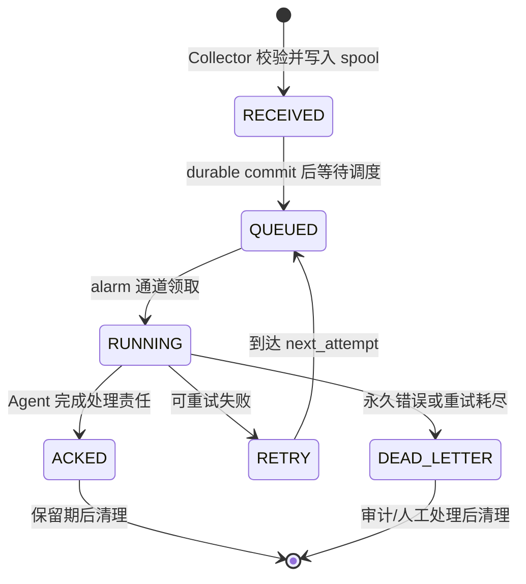
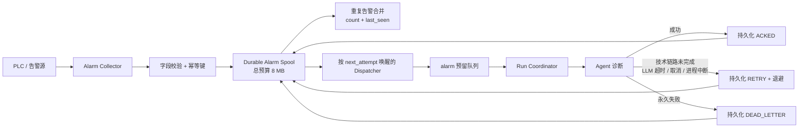
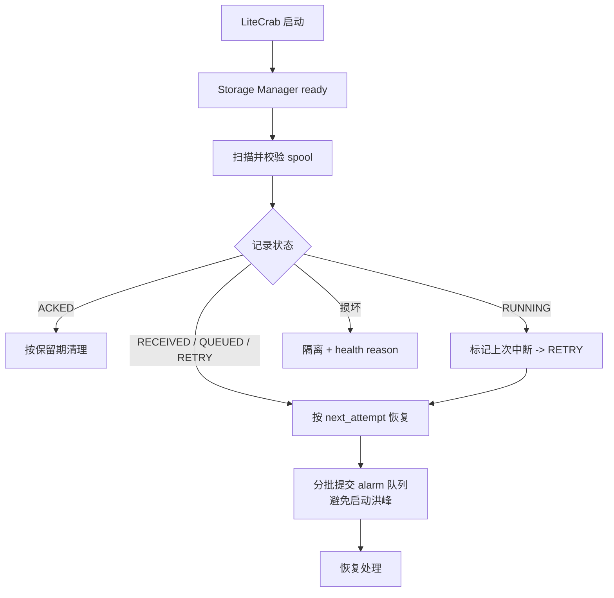
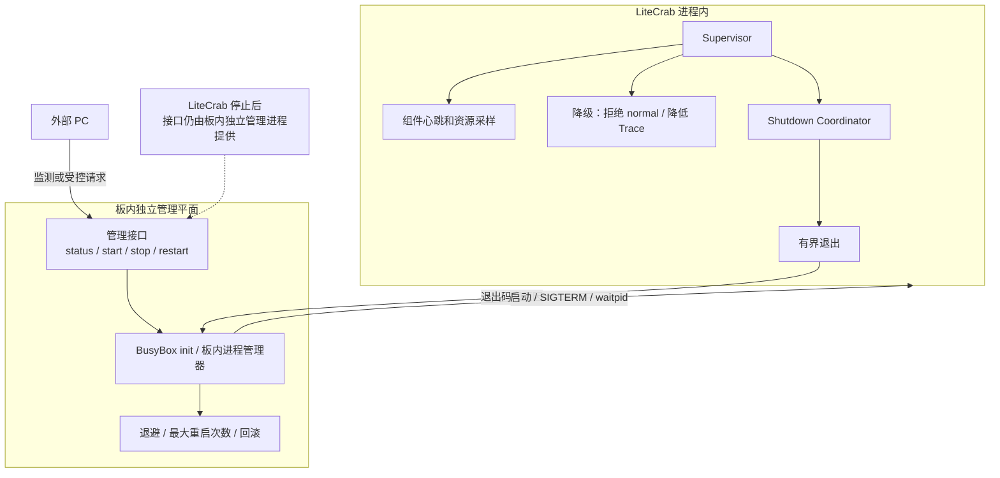
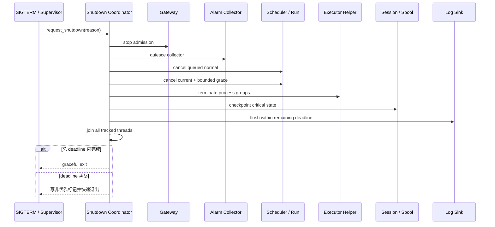

# 阶段 4：告警可靠性与无人值守运行

## 1. 文件介绍

本阶段在阶段 1 的预留 Scheduler 通道和阶段 3 的 Storage Manager 上实现 Durable Alarm Spool、组件监督和有截止时间的退出。进程拉起、关闭、自动恢复和升级回滚由板端既有独立进程负责，不属于 LiteCrab 二进制或本仓库正式交付物。

最终目标是：Agent 忙、进程重启、LLM 离线或告警风暴发生时，关键告警仍可恢复、可审计，同时 normal 流量、重试和日志不会拖垮 SD5091。

## 2. 功能与模块职责

### 2.1 Durable Alarm Spool

状态机：

```text
RECEIVED -> QUEUED -> RUNNING -> ACKED
                         |
                         +-> RETRY -> QUEUED
                         +-> DEAD_LETTER
```

- 幂等键使用 `equipid + almid + seqno + localtime` 的规范化 hash。
- 告警 Collector 收到并校验告警后，必须先把 `RECEIVED/QUEUED` 持久化，再提交 Scheduler。
- `IngressSubmit` 成功只表示进入调度，不表示 ACK；只有 Agent 处理完成，或明确接受异步处理并写下可恢复责任转移记录后，才转为 ACKED。
- 进程重启时恢复所有非 ACK 记录，根据 `next_attempt` 重新排队。
- spool 总预算 8 MB；超额时合并同设备同类活动告警，优先保留关键和最新状态，并生成不可静默丢失的 overflow 事件。
- 达到最大尝试次数进入 dead-letter，仍受配额和审计策略约束。

### 2.2 告警合并和调度预留

- alarm 使用阶段 1 的独立队列，不能落入 normal FIFO。
- 同一幂等键重复出现只更新 last_seen/count，不重复启动完整 Run。
- 同设备同类告警风暴可聚合为一个摘要 Run；新信息到达时更新 spool，而不是无限排队。
- Scheduler 可使用 `control > alarm/normal weighted`；建议每处理 1 个 alarm 后最多连续处理 2 个 normal，实际比例通过真机测试校准。
- Collector/dispatcher 通过 condition variable 等待最近 due time，不固定 25 ms 唤醒。

### 2.3 Supervisor

进程内 Supervisor 维护：

- Reactor、Scheduler、Run Coordinator、Alarm Collector/Dispatcher、Log Sink、Storage Manager、Executor Helper 的心跳。
- RSS、线程、FD、队列、Registry、Session、磁盘、spool 数量与最老未 ACK 年龄。
- 最近成功 LLM、告警查询、checkpoint 时间与连续失败数。
- `ready/degraded/overloaded/stopping` 状态和原因集合。

Supervisor 的动作有明确边界：

- 可拒绝 normal admission、降低 Trace、暂停非关键维护、重启 Helper。
- 不在主进程内自我 exec 或无限重启整个服务；进程级恢复交给 BusyBox init 或独立的板内进程管理器。
- RSS 达 128 MB、关键线程无心跳或内部不变量破坏时，记录原因并发起有界 shutdown，让板内进程 Owner 重启。

### 2.4 Shutdown Coordinator

统一总 deadline，按以下顺序推进：

1. Gateway 停止 admission，health 进入 `stopping`。
2. Alarm Collector 停止接收新事件。
3. 取消排队的 normal 请求。
4. 当前 Run 获得有限 grace period。
5. 终止 Executor 子进程组。
6. checkpoint 关键 Session 和 alarm spool。
7. flush Log Sink。
8. join 所有被跟踪线程。
9. 总 deadline 到期后写最小非优雅标记并快速退出。

### 2.5 与板端既有进程 Owner 的接口边界

- LiteCrab 的启动、停止和重启只在板内执行。板内进程管理器是实际 Owner，负责 `fork/exec/signal/waitpid` 或调用 BusyBox init 脚本。
- 预留受控管理接口 `status/start/stop/restart`。PC 可作为请求来源，但接口服务端必须运行在板内独立管理进程中；否则 LiteCrab 停止后将没有主体处理 `start`。
- LiteCrab 自身只提供运行期状态、readiness 和有界优雅退出入口，不负责停止后的自启动。
- 板端既有 Owner 采用何种 init/watchdog 实现不属于本仓库；LiteCrab 只约定启动参数、SIGTERM 退出和未来状态接口。
- 异常退出退避、单位时间最大重启次数以及版本回滚由板端 Owner 实现并在真机联调验证。
- 回滚必须考虑存储格式兼容；新版本写入不可逆格式前需要双读/版本迁移策略。

## 3. 执行流

### 3.1 告警可靠投递

```text
Collector 获取活动告警快照/事件
  -> 校验字段并计算 idempotency key
  -> spool.upsert(RECEIVED, payload, severity, timestamps)
  -> durable commit 成功
  -> spool.transition(QUEUED)
  -> alarm Scheduler lane enqueue(spoolId)
  -> Run Coordinator 领取，spool.transition(RUNNING)
  -> Agent 诊断
     -> 成功：spool.transition(ACKED)，按保留策略清理
     -> 可重试失败：计算受限 backoff，transition(RETRY)
     -> 永久错误/重试耗尽：transition(DEAD_LETTER)
```

### 3.2 重启恢复

```text
Storage Manager ready
  -> Alarm Spool 扫描并校验记录
  -> ACKED：按保留期清理
  -> RUNNING：视为上次非优雅中断，转 RETRY
  -> RECEIVED/QUEUED/RETRY：按 next_attempt 恢复
  -> 超配额/损坏：隔离记录并产生 overflow/corruption health reason
  -> Scheduler ready 后分批提交，避免启动瞬间洪峰
```

### 3.3 监督与降级

```text
Supervisor 周期采样 + 组件心跳事件
  -> 单次短暂失败：记录
  -> 连续 LLM 失败：degraded，抑制高频重试，alarm 留在 spool
  -> normal 队列/磁盘/RSS 软阈值：overloaded，拒绝 normal
  -> Helper 失败：有界重建；期间 exec Tool 返回 unavailable
  -> 关键线程卡死/RSS 硬阈值：request_shutdown(reason)
  -> 板内 init/进程管理器观察退出并按退避重启
```

### 3.4 有界退出

```text
SIGTERM handler: 只设置原子标志并唤醒 coordinator
Coordinator:
  deadline = monotonic_now + shutdown_timeout
  gateway.stop_admission()
  alarm.collector.quiesce(remaining)
  scheduler.cancel_queued_normal()
  run.cancel_then_wait(grace <= remaining)
  executor.kill_all(remaining)
  storage.checkpoint_critical(remaining)
  log.flush(remaining)
  join_tracked_threads(remaining)
  exit(graceful ? 0 : SHUTDOWN_TIMEOUT_CODE)
```

### 3.5 告警状态机图



### 3.6 告警可靠投递组件图



### 3.7 重启恢复图



### 3.8 Supervisor 与板内进程 Owner 边界图



### 3.9 有界退出顺序图



## 4. 需要修改或新增的文件

| 文件 | 动作 | 修改内容 |
|---|---|---|
| `include/litecrab/alarm_spool.h` | 新增 | spool record/state/idempotency/retry/ACK API |
| `src/alarm/alarm_spool.c` | 新增 | 8 MB 有界持久 spool、恢复、合并、dead-letter |
| `include/litecrab/alarm.h` | 修改 | Delivery 引用 spool id，不再以固定内存数组作为可靠性边界 |
| `src/alarm/alarm_service.c` | 重构 | 先落 spool、按 due time 条件等待、完成后 ACK；删除 25 ms 固定轮询 |
| `src/alarm/alarm_notify.c`、`src/alarm/polling/polling.c` | 修改 | 规范化幂等字段和 severity/merge key |
| `src/alarm/subscription/subscription.c` | 修改 | 与 polling 使用同一 spool 接口和恢复语义 |
| `include/litecrab/scheduler.h`、`src/runtime/scheduler.c` | 修改 | alarm 预留通道、加权公平、从 spool 恢复批量入队 |
| `src/kernel/kernel.c` | 修改 | 告警 Run 终态回调 spool ACK/RETRY/DEAD_LETTER |
| `include/litecrab/supervisor.h` | 新增 | 组件注册、心跳、health reason、动作策略 |
| `src/supervisor/supervisor.c` | 新增 | 资源采样、故障阈值、降级、Helper 重建、shutdown 请求 |
| `include/litecrab/shutdown.h` | 新增 | Shutdown Coordinator 和 deadline API |
| `src/supervisor/shutdown.c` | 新增 | 分阶段 quiesce/cancel/flush/join |
| `include/litecrab/management.h` | 新增 | 状态查询和优雅退出的板内协议定义 |
| `src/management/management_client.c` | 新增（可选） | LiteCrab 向板内管理器上报状态；不得承担自启动 |
| 板内进程管理器实现 | 新增 | 独立存活并实现鉴权后的 `status/start/stop/restart` 操作 |
| `src/main.c` | 重构 | 组件依赖顺序、信号安全唤醒、Supervisor/Coordinator 生命周期 |
| `src/storage/storage_manager.c` | 修改 | spool 独立配额和紧急保留空间 |
| `src/observability/metrics.c` | 修改 | 未 ACK 年龄、重试、dead-letter、组件心跳、shutdown 指标 |
| `src/config/config.c` | 修改 | spool、重试、心跳、shutdown、重启相关安全配置 |
| `config/base_config.example.json` | 修改 | 阶段 4 默认值 |
| 板端既有进程 Owner | 外部边界 | 负责 respawn/退避/升级回滚；本仓库不新增文件，只约定信号和状态接口 |
| `CMakeLists.txt` | 修改 | 新模块与故障注入测试 |
| `tests/test_alarm_spool.c` | 新增 | 状态机、幂等、恢复、配额、合并、dead-letter |
| `tests/test_supervisor.c` | 新增 | 心跳、阈值、降级、Helper 重建和 shutdown 请求 |
| `tests/test_shutdown.c` | 新增 | 各组件卡住、总 deadline、线程 join、子进程组清理 |
| `tests/test_alarm_e2e.py` | 扩展 | Agent busy、LLM offline、restart、storm、恢复 ACK |

## 5. 关键伪代码

### 5.1 spool 接收与 ACK

```c
on_alarm(occurrence):
    key = sha256(canonical(equipid, almid, seqno, localtime))
    tx = spool.begin()
    record = tx.find(key)
    if record and !record.terminal:
        record.last_seen = wall_now()
        record.count++
        record.payload = merge_bounded(record.payload, occurrence)
    else:
        record = tx.insert(key, RECEIVED, bounded_payload(occurrence))
    tx.transition(record, QUEUED)
    if tx.commit_durable() != OK:
        health.add_reason(ALARM_SPOOL_WRITE_FAILED)
        return
    scheduler.try_enqueue_alarm(record.id)  // 满时记录仍在 spool，稍后重试

on_alarm_run_finished(record_id, result):
    if result.success:
        // 两阶段 ACK：先写“已处理、禁止重跑 Skill”的 replay barrier；
        // 再写去重历史并释放槽位。任一步失败都只重试落盘。
        spool.transition_durable(record_id, HANDLED_PENDING_FINALIZE)
        spool.finalize_ack_history_durable(record_id)
    else if result.retryable and attempts_remaining(record_id):
        spool.schedule_retry_durable(record_id, bounded_backoff())
    else:
        spool.transition_durable(record_id, DEAD_LETTER)
```

### 5.2 dispatcher 事件等待

```c
dispatcher_loop():
    lock(mu)
    while !stopping:
        record = spool.next_due()
        if !record:
            cond_wait(mu)  // 新告警、停止或状态变化时唤醒
            continue
        now = monotonic_now()
        if record.next_attempt > now:
            cond_timedwait_monotonic(mu, record.next_attempt)
            continue
        unlock(mu)
        scheduler.try_enqueue_alarm(record.id)
        lock(mu)
```

### 5.3 Supervisor 判定

```c
supervise(snapshot):
    reasons = evaluate_with_hysteresis(snapshot)
    if reasons.has(RSS_SOFT | DISK_SOFT | NORMAL_QUEUE_STUCK):
        scheduler.set_normal_admission(false)
        trace.set_degraded_mode(true)
    if reasons.has(LLM_OFFLINE):
        retry_policy.suppress_fast_retries()
        // alarm 继续留在 spool，不丢失、不反复启动 Run
    if reasons.has(HELPER_DEAD):
        executor.restart_once_with_backoff()
    if reasons.has(RSS_HARD | CRITICAL_HEARTBEAT_STALE | INVARIANT_BROKEN):
        shutdown.request(reasons)
```

## 6. 功能描述与故障语义

- `ACKED` 表示 LiteCrab 已完成规定的处理责任；“已入内存队列”绝不是 ACK。
- `HANDLED_PENDING_FINALIZE` 是 ACK 的持久化中间态。重启恢复到该状态时只能补写 ACK 历史，禁止再次调用 Skill，避免设备已经被修改后因第二次落盘失败而重复修改。
- `ACKED` 也不等价于“现场告警已消失”。Skill 完成原因验证、修改后复核并输出“告警仍存在/修改无效”的受控结果后，Step 4 只确认这次处理责任已经完成；是否回滚、换原因继续诊断由 Skill 状态机决定，投递层不能依据告警仍存在擅自改设备。
- `RETRY` 只用于处理责任尚未完成的技术故障，例如 LLM/网络超时、请求取消、Agent 进程中断或 Scheduler 未接收。结构化 `completionStatus` 必须从 Agent 传回 dispatcher，不能仅凭“收到一个字符串响应”ACK。
- `RETRY` 必须持久化 next-attempt 和 attempt count，重启不能重置重试风暴。
- `DEAD_LETTER` 是可审计的终态，需要 health/metrics 可见；不能静默删除。
- LLM 离线时告警留在 spool 并做有界退避，不重复产生完整 Trace。
- spool 满时允许有策略地合并/淘汰，但必须优先保留关键告警并产生 overflow 审计事件。
- shutdown 超时退出码应与普通崩溃区分，方便板内 watchdog/进程管理器记录，并由 PC 侧读取或接收告警。

## 7. 验证与完成标准

- 告警在 `RECEIVED/QUEUED/RUNNING/ACK` 每个持久化点 kill -9，重启后未 ACK 项都能恢复且不重复确认。
- normal Run 占用执行器、LLM 离线 24 小时、alarm 队列满时，告警记录仍受 8 MB 配额约束并可审计。
- 同一告警重复 10,000 次不会产生 10,000 个 Run；合并计数和 last_seen 正确。
- 告警风暴下 control/health 始终可用，normal 不会占用 alarm 预留槽。
- dispatcher 空闲 CPU 接近 0，不再每 25 ms 唤醒。
- 各组件分别模拟卡死，进程均在总 shutdown deadline 内退出；无 detached 线程和遗留子进程组。
- BusyBox/板内进程管理器下验证 crash respawn、退避、最大重启次数、新版本失败回滚和 previous 可启动。
- LiteCrab 完全停止后，通过预留接口发起 `start`，确认请求由板内独立管理进程处理；PC 不直接操作目标进程。
- 完成主文档规定的 72 小时真机 soak，上线指标全部达标。

## 8. 一致性与合理性检查

- 状态机、幂等键、8 MB spool、预留通道、合并、dead-letter、Supervisor 和 shutdown 顺序均与主文档第 11、12、14 章一致。
- 实施前的 `alarm_service.c` 在 `IngressSubmit` 成功后调用 `remember` 并释放 Delivery；当前实现已把 ACK 延后到 Run 完成，并增加两阶段 replay barrier，修复主文档指出的丢告警和 ACK 落盘中断后重跑 Skill 的窗口。
- Scheduler 满时 spool 记录仍然存在，避免“入队失败即丢失”；这依赖阶段 3 的持久化配额，因此阶段顺序合理。
- 严格告警优先级可能让 normal 永久饥饿，采用加权策略与原文“严格优先级加防饥饿”一致。
- Supervisor 负责进程内判断，BusyBox/init 或板内进程管理器负责进程外恢复，避免主进程同时成为自己的最终监督者。
- 管理接口必须由独立板内进程承载，因为 LiteCrab 停止后自身接口不可用；这与“只能在板内由其他进程拉起和关闭”的部署约束一致。
- 自动回滚必须与存储格式兼容策略一起测试，否则旧版本可能无法读取新数据；这是对原文“升级回滚流程”的必要工程约束，不改变架构方向。
