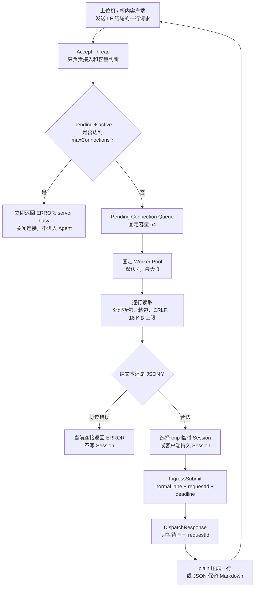
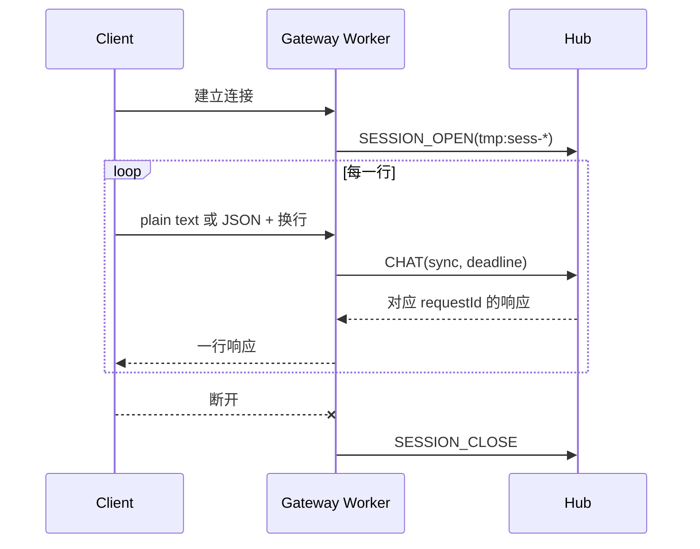
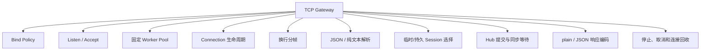
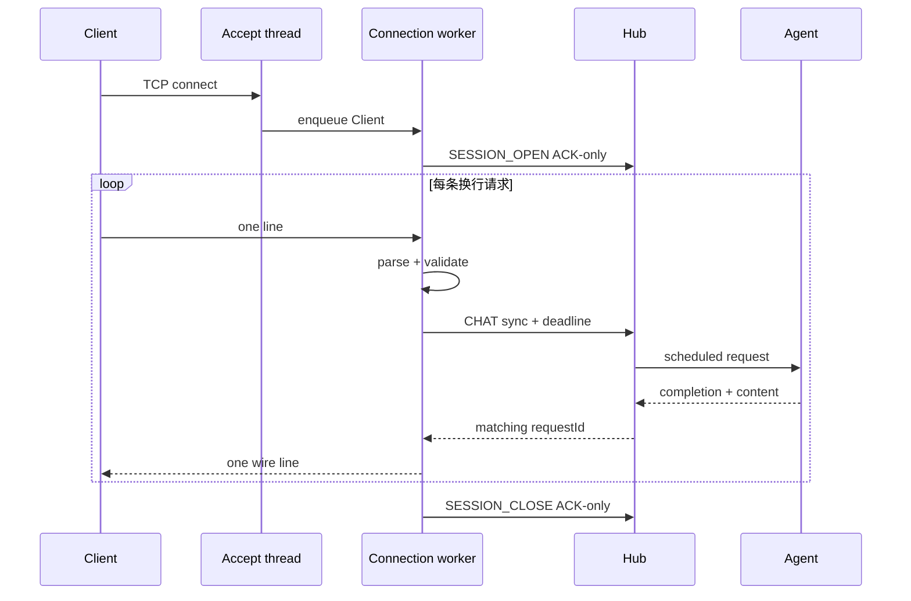
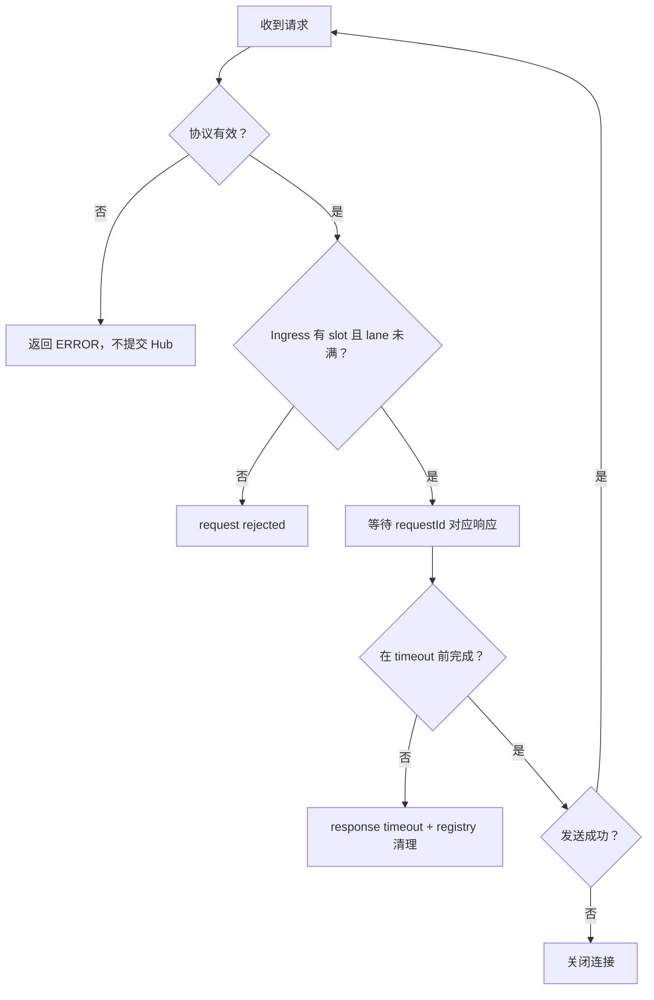
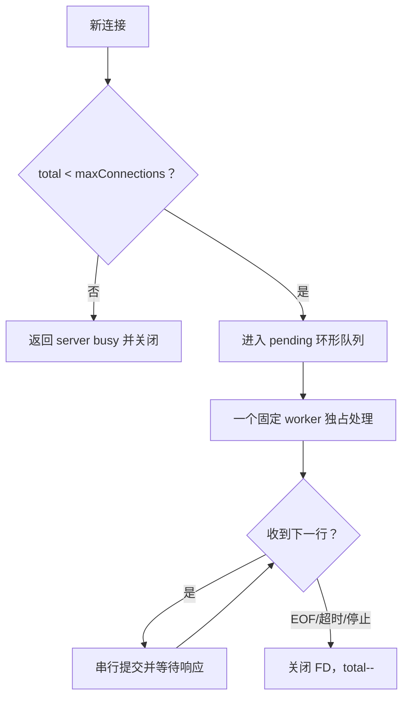

# Gateway 模块架构设计

## 1. 职责

Gateway 是调用方进入 Agent 的 TCP 适配层，负责连接容量、行协议、临时 Session、请求转换和响应写回，不负责 Agent 业务判断。



## 2. 子功能和实现

| 子功能 | 实现方式 |
|---|---|
| 固定连接池 | 默认 4、最大 8 个可 join worker；不再每连接创建 detached 线程 |
| 总连接上限 | 默认 16、最大 64；统计 pending 和 active 连接 |
| 满载拒绝 | accept 后发现容量满，立即写 `ERROR: server busy` 并关闭 |
| 行协议 | `recv_line` 读取到 `\n`；一个连接可处理多行请求 |
| 输入格式 | 支持纯文本或 JSON；JSON 必须有字符串字段 `content` |
| 响应格式 | 默认压成一行；`responseFormat=json` 时返回 JSON 并保留 Markdown 换行 |
| 临时 Session | 每个连接生成 `tmp:sess-*`，连接打开/关闭事件送入 Hub；不落盘 |
| 持久 Session | 客户端可提供合法 `sessionId`；禁止使用保留的 `tmp:` 前缀 |
| 安全绑定 | 非 loopback 地址必须显式 `allow_unauthenticated_remote=true` |
| 有界停机 | 关闭 listener、取消请求、shutdown 活动 FD、清空 pending、join worker |

## 3. 请求格式

```json
{"userId":"operator-1","sessionId":"station-1","content":"检查当前告警"}
```

线上的实际数据必须以换行结束。板内终端测试：

```sh
printf '%s\n' '{"userId":"operator-1","sessionId":"station-1","content":"检查当前告警"}' \
  | busybox nc 127.0.0.1 10003
```

这里的 BusyBox 只提供 `nc` 客户端；请求由执行命令的终端进程发送，不是 LiteCrab 内部自动执行。

## 4. Session 流



## 5. 当前限制

- 没有认证和加密；`userId` 是不可信输入。
- 固定池是过渡实现，不是最终 epoll Reactor。
- 活动连接会占用 worker；空闲慢连接靠 30 秒接收超时回收。
- Gateway 并发不代表 Agent 并发，核心 Agent 仍为单线程。
- 没有正式的 Unix Domain Socket 或上位机 SDK。

## 6. 关键文件

- `include/litecrab/gateway.h`
- `src/gateway/tcp_line.c`

## 7. 完整子功能结构



| 子功能 | 关键结构/函数 | 实现方式 | 失败表现 |
|---|---|---|---|
| 监听边界校验 | `RequestServerValidateBindPolicy` | 解析 IPv4；127/8 可默认使用，其他地址需要显式风险开关 | 启动前拒绝配置 |
| 监听 socket | `StartRequestServer` | `SO_REUSEADDR`、bind、listen；accept 外层使用 100 ms poll | 返回非零，主进程进入停机 |
| 有界连接接纳 | `ServerState.total` | 总连接数包含排队和正在处理的连接 | 超限立即发送 `ERROR: server busy` 后关闭 |
| 固定线程池 | `workers[8]` | 启动配置数量的常驻 worker；条件变量领取 pending client | worker 创建不完整则回收已启动线程并启动失败 |
| pending 队列 | `pending[64]` | mutex 保护环形数组 | 队列/连接总数满时不阻塞 accept |
| 连接初始化 | `client_main` | 设置收发 timeout、`TCP_NODELAY`，生成 `tmp:sess-*` | 内存或 socket 错误关闭本连接，不结束服务 |
| 行协议读取 | `recv_line` | 单字节读取直到 LF，兼容 CRLF | EOF/timeout 关闭连接；超长返回 -2 并关闭 |
| 请求解析 | `LiteCrabHandleNetworkRequest` | 首个非空字符为 `{` 时解析 JSON，否则裁剪纯文本 | 缺 `content`、空文本、超长文本返回 `ERROR:` |
| Session 选择 | `ConnectionContext` | 默认使用连接级临时 Session；合法 JSON `sessionId` 可切换持久 Session | 禁止客户端显式提交 `tmp:`，非法字符被拒绝 |
| Hub 请求 | `IngressSubmit` + `DispatchResponse` | normal priority、sync reply、deadline=连接请求超时 | 入队失败返回 request rejected；等待超时返回 response timeout |
| 响应编码 | `responseFormat` | plain 模式压平换行；JSON 模式保留 Markdown 并 JSON escape | 分配或发送失败关闭连接 |
| Session 生命周期事件 | `emit_session` | 建连/断连发送 ACK-only OPEN/CLOSE 控制消息 | 控制消息满载时当前实现不向客户端报告 |
| 服务停止 | `RequestServerRequestStop` | signal handler 只置位；server 线程取消所有同步 waiter、shutdown 活跃 FD、清空 pending、join workers | 避免 signal handler 中加锁和 join |

## 8. 内部结构

```text
ServerState
├── mutex + available condition
├── pending[64] 环形队列
├── head / tail / count
├── total：pending + active
├── activeFd[8]
├── workers[8] + WorkerArg[8]
└── stopping

ConnectionContext
├── connFd
├── requestTimeoutMs
├── sessionId：默认 tmp:sess-...
├── userId：默认 anonymous
└── user：传递给 handler 的上下文
```

`Client` 由 accept 线程分配，所有权交给 pending 队列，再由一个 worker 独占处理直到连接断开。一个连接可以串行处理多条消息，但同一连接不会并发执行多条请求。

## 9. 协议子结构

JSON 请求当前可携带：

| 字段 | 用途 | 缺省 |
|---|---|---|
| `content` | 必填用户输入 | 无 |
| `userId` | Session owner 声明；目前不可信 | `anonymous` |
| `sessionId` | 跨连接、跨重启恢复的 Session ID | 连接级临时 ID |
| `replyToRunId` | 精确恢复 Skill Run | 空 |
| `replyToInterruptId` | 精确恢复中断 | 空 |
| `correlationToken` | 精确关联挂起流程 | 空 |
| `responseFormat` | 值为 `json` 时返回单行 JSON | plain |



## 10. 容量与所有权

- 默认 4 worker、16 connection；硬上限 8/64。
- pending 数组容量 64，但真正接纳阈值使用配置的 `maxConnections`。
- 请求缓冲为 `maxReqBytes + 1`；普通响应缓冲为请求上限的 4 倍加 2。
- JSON 响应还会按最坏 6 倍 escape 空间临时分配。
- request content 在 Ingress 成功后归 Hub/Agent；Gateway 只保留 requestId 等待结果。
- 客户端 `userId` 当前没有认证支撑，只能用于逻辑隔离，不能视为可信身份。

## 11. 关键失败流



## 12. 能力设计与示例

### 12.1 GW-01：把 TCP 字节流转换成有边界的 Agent 请求

**场景。** 上位机或板内程序建立 TCP 连接，用一行表达一次请求。Gateway 必须处理 TCP 拆包/粘包，而不能假设一次 `recv` 就是一条消息。

**输入。** 每条消息以 LF 结束，可使用 CRLF；长度不得超过 `maxReqBytes`。首个非空字符是 `{` 时按 JSON 请求解析，否则整行作为 `content`。JSON 模式下 `content` 必须是字符串。

**输出。** 成功时生成包含 source、session、user、reply mode 和 deadline 的 Hub 请求；协议错误直接在当前连接返回 `ERROR:`，不会进入 Agent，也不会污染 Session。

示例：客户端分三次发送 `读取`、`当前状态`、`\n`，`recv_line` 会等待换行后才提交完整的“读取当前状态”。若在换行前超过 16 KiB，则关闭连接，不把截断内容当成请求执行。

### 12.2 GW-02：控制连接资源而不为每个连接无限创建线程

Accept 线程只负责接纳和容量判断；固定 Worker 从 pending 环形队列领取连接。`total` 同时计算排队和活动连接，确保攻击者不能通过大量慢连接越过上限。



这一设计保证线程数有上界，但也意味着一个空闲连接会占住一个 Worker。30 秒接收超时是当前回收机制，最终 Reactor 设计尚未实现。

### 12.3 GW-03：区分临时会话和持久会话

没有 `sessionId` 时，Gateway 为连接创建 `tmp:sess-*`。它适合一次终端调试：同一连接内多轮连续，断开后不写磁盘。客户端明确提供普通 `sessionId` 时，Session Manager 才能跨连接恢复历史。

```json
{"userId":"operator-1","sessionId":"station-1","content":"继续检查上一轮告警","responseFormat":"json"}
```

客户端不能提交 `tmp:` 前缀，因为该命名空间归 Gateway。`userId` 当前来自客户端且没有认证，只能作为逻辑 owner 匹配字段，不能作为安全身份。

### 12.4 GW-04：按 requestId 等待正确响应

每条同步请求先由 Hub 注册 response slot。Gateway 只等待本次 `requestId`，因此多个连接即使交错提交，也不会从公共队列误取其他请求的响应。连接超时后 slot 被取消；Agent 随后产生的迟到结果由 Hub 释放，不会发送给下一条请求。

失败示例：客户端等待 30 秒后断开，但模型在第 31 秒返回。Gateway 已关闭连接，Hub 发现 registry 中不存在 requestId 并释放结果；该结果绝不能复用到其他客户端。

### 12.5 GW-05：可收敛停机

停机首先阻止新 accept，再取消同步 waiter、shutdown 活跃 FD、释放 pending client，最后 join 所有 Worker。信号处理器只设置停止标志，不执行加锁、内存释放或 join，避免异步信号死锁。

## 13. 能力状态

| 能力 | 状态 | 当前边界 |
|---|---|---|
| TCP 换行协议和 JSON 请求 | 已实现 | 无版本化帧头 |
| 固定 Worker 和连接总上限 | 已实现 | 慢连接仍占 Worker |
| 临时/持久 Session 选择 | 已实现 | userId 未认证 |
| requestId 定向响应 | 已实现 | 单请求仍受 Agent 队头阻塞影响 |
| Unix Domain Socket、TLS、正式 SDK | 未实现 | 当前不能作为已交付能力 |

## 14. 测试对应关系

- `tests/test_main.c`：行读取、JSON/纯文本请求、Session ID、响应格式、worker pool、busy 和停机。
- `tests/test_tcp_e2e.py`：真实 socket 到 Agent 的端到端链路。
- `tests/test_security.c` / `tests/test_security_e2e.py`：bind policy、远程暴露开关、未认证身份边界。
- `tests/test_long_running_stress.py`：连接、超时和资源压力行为。

- `tests/test_tcp_e2e.py`
- `tests/test_long_running_stress.py`
