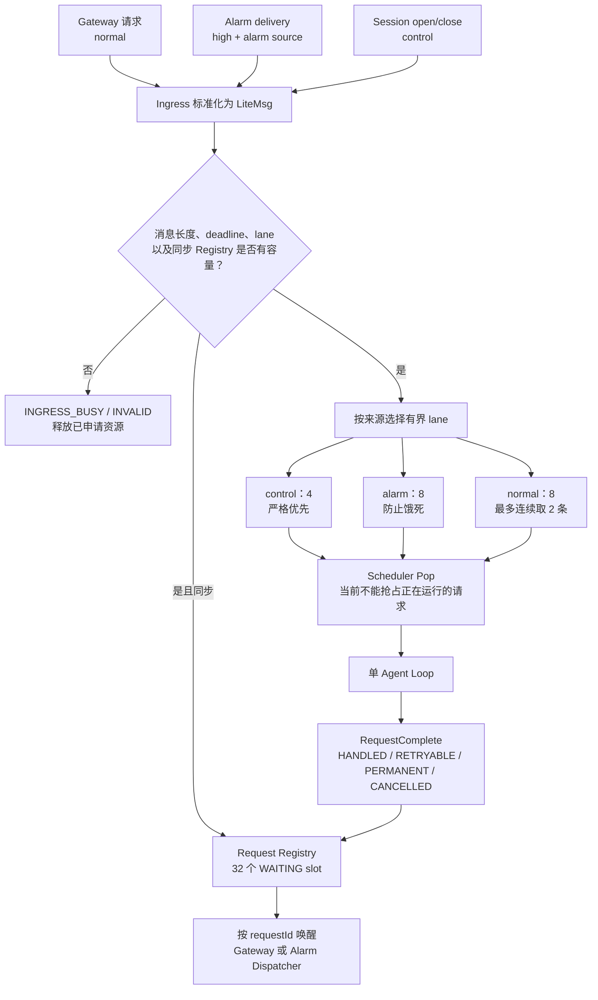
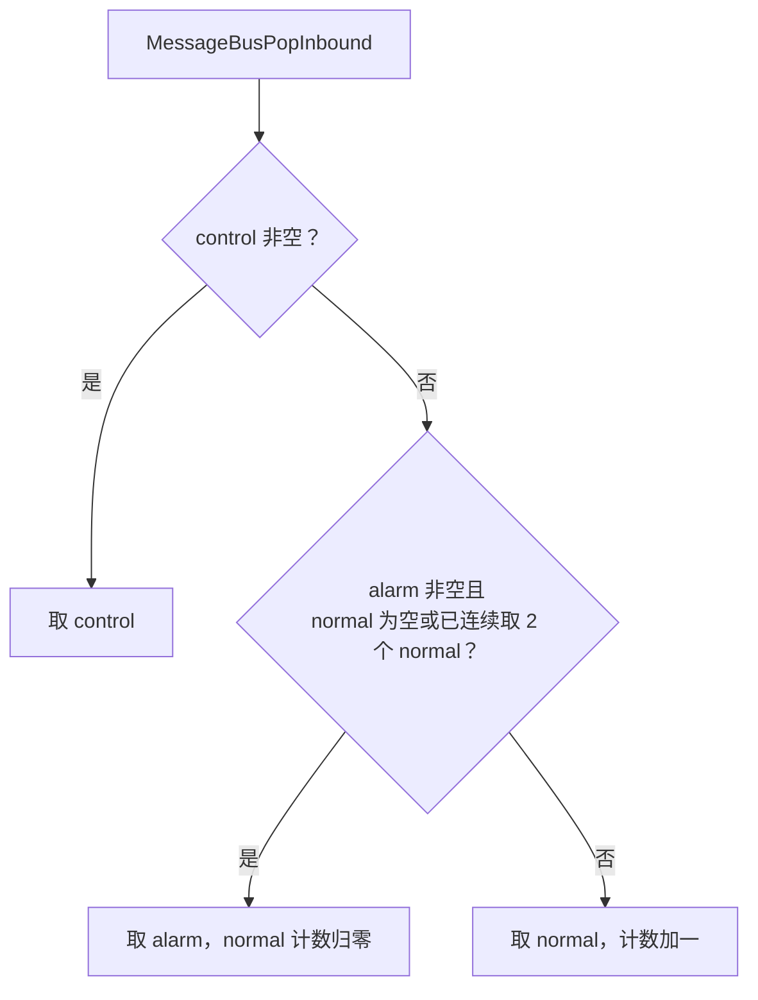
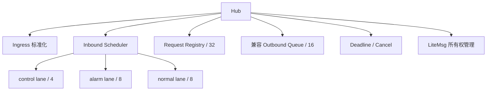
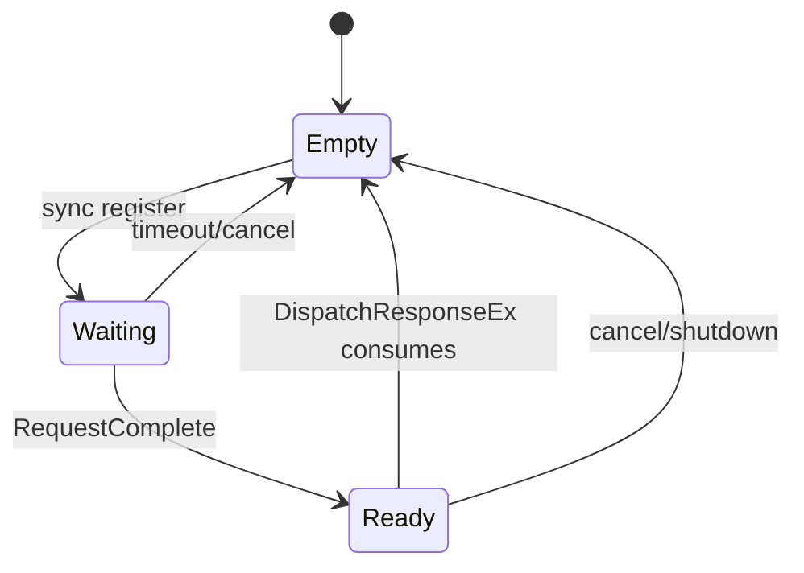
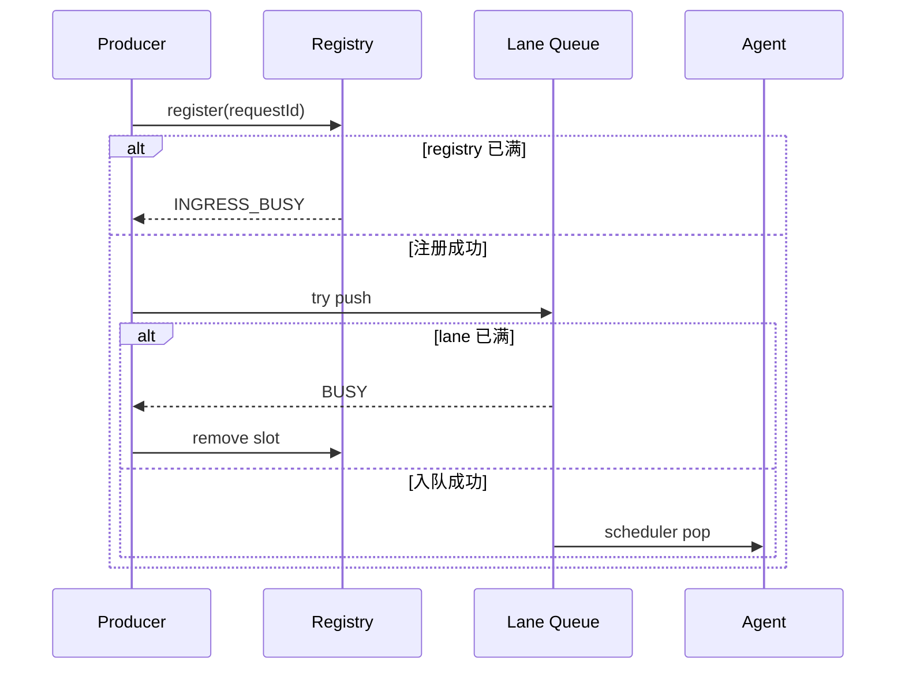

# Hub、Ingress 与 Request Registry 模块架构设计

## 1. 职责

Hub 把 Gateway、Alarm 和控制事件统一转换成 `LiteMsg`，执行容量判断和优先级调度，并把 Agent 响应准确交回原请求等待者。



## 2. `LiteMsg` 关键字段

| 字段 | 作用 |
|---|---|
| `source/channel` | 标识 `network:tcp`、`alarm:asp` 等来源，并决定 lane |
| `type` | chat、session open/close、status/action 等消息类型 |
| `priority` | low、normal、high、critical |
| `replyMode` | 同步响应或仅 ACK |
| `requestId` | Registry 定向响应键 |
| `sessionId/userId` | 会话和调用者归属 |
| `deadlineMs` | 基于单调时钟的绝对截止时间 |
| `completionStatus` | handled、retryable、permanent、cancelled |

## 3. 调度规则



control 是严格优先；当前 normal 与 alarm 同时积压时，规则实际为最多两个 normal 后取一个 alarm。它防止告警无限饿死，但不是告警抢占式执行；已经运行的请求也不能被新告警抢占。

## 4. 同步响应实现

1. `IngressSubmit` 验证输入不超过 16 KB并生成 `requestId`。
2. 同步请求先在 32 槽 Registry 注册 `WAITING`。
3. 请求使用非阻塞入队；Registry 或对应 lane 满时返回 `INGRESS_BUSY`。
4. Agent 调用 `RequestComplete` 将同一槽位置为 `READY`。
5. `DispatchResponseEx` 只等待对应 `requestId`。
6. 超时、客户端取消或全局停机清空槽位；之后到达的响应被释放。

## 5. Deadline 与取消

- 默认普通请求 120 秒、高优先级请求 180 秒；Gateway 会显式使用连接请求超时，当前为 30 秒。
- `RequestShouldStop` 同时检查 deadline 和 Registry 是否仍存在。
- `RequestCancelAll` 用于 Gateway 停机，防止 worker 永久等待。

## 6. 当前限制

- Agent 消费端只有一个线程，Scheduler 不能并行或抢占 Run。
- lane 权重和容量是编译期常量，尚无运行时配置或 metrics。
- control/status 对外协议尚未实现。
- 旧 outbound queue API 仅为兼容保留，生产同步响应已改用 Registry。

## 7. 关键文件

- `include/litecrab/hub.h`
- `src/hub/hub.c`
- `src/kernel/kernel.c`

## 8. 完整子功能结构



| 子功能 | 实现 | 关键结果 |
|---|---|---|
| 消息标准化 | `IngressSubmit` 根据 options 填写 source/channel/user/session/reply 引用/deadline | 所有入口统一成 `LiteMsg` |
| requestId 生成 | mutex 保护全局递增序列 | `req-<n>`；只保证当前进程唯一 |
| content 复制 | 按输入长度 heap copy | 入队成功后消息拥有 content |
| lane 选择 | 非 CHAT→control；high 且 `source` 以 `alarm:` 开头→alarm；其他→normal | 普通 high 请求不会自动进入 alarm lane |
| 非阻塞接入 | `MessageBusTryPushInbound` | lane 满时返回 BUSY，不拖死生产者 |
| 阻塞内部入队 | `MessageBusPushInbound` | 主要用于内部控制/唤醒消息 |
| 公平调度 | control 永远优先；normal 连续最多 2 条后优先 alarm | 避免告警饥饿，也不给告警无限抢占 |
| 同步响应注册 | 入队前占用 `ResponseSlot` | 防止消息已执行但调用方无处等待 |
| 完成发布 | `RequestComplete` 将 response 所有权转入 slot | waiter 按 requestId 唤醒 |
| 超时等待 | monotonic 条件变量 | timeout 后删除 slot，迟到 response 被拒绝 |
| 主动取消 | `RequestCancel` / `RequestCancelAll` | 清空 slot 并唤醒 waiters |
| 执行侧停止判断 | `RequestShouldStop` | 同时检查 deadline 和 sync registry 是否还存在 |
| ACK-only | 不注册同步 slot | `DispatchResponseEx` 直接返回 HANDLED；不代表业务处理完成 |

## 9. 消息和状态结构

```text
LiteMsg
├── type: CHAT / EXCEPTION / STATUS / ACTION / SESSION_OPEN / SESSION_CLOSE
├── priority: LOW / NORMAL / HIGH / CRITICAL
├── replyMode: SYNC / ACK_ONLY
├── source / channel / chatId / userId / sessionId / requestId
├── replyToRunId / replyToInterruptId / correlationToken
├── deadlineMs：CLOCK_MONOTONIC
├── completionStatus
└── content：动态内存

ResponseSlot
├── EMPTY / WAITING / READY
├── requestId
└── response LiteMsg
```

完成状态语义：

| 状态 | 调用方动作 |
|---|---|
| `HANDLED` | 请求已经得到可交付结论；Alarm 可以提交 ACK |
| `RETRYABLE` | 临时失败、超时、取消或资源问题；Alarm 可按预算重试 |
| `PERMANENT` | 确定性业务/协议错误；Alarm 转 dead-letter |
| `CANCELLED` | 类型已定义，当前主要取消路径通常表现为 retryable 文本 |

## 10. 调度状态机



Scheduler 每次 pop 的选择规则等价于：

```text
if control 非空: control
else if alarm 非空 且 (normal 为空 或 已连续执行 2 个 normal): alarm，并清零计数
else: normal，并增加 normal 计数
```

因此文档不能写成简单的“high 永远优先 normal”。当前只有 control 严格优先；alarm 与 normal 是带配额的公平调度。

## 11. 并发、容量和内存所有权

- 三条 inbound lane 共享一个 mutex/condition，但容量分别是 4、8、8。
- 单 Agent consumer 使业务执行串行；并发入口只在队列和 waiter 层发生。
- Request Registry 有 32 个 slot，是同步在途请求上限之一。
- 兼容 outbound queue 容量 16；当前主同步路径使用 Registry。
- `IngressSubmit` 失败时自行释放 content；成功后 consumer 最终调用 `LiteMsgClear`。
- `RequestComplete` 通过把 `response.content` 置空完成所有权转移，避免双重释放。

## 12. 关键竞态和失败边界

- waiter 超时后 slot 被清空；Agent 的迟到 `RequestComplete` 返回失败并由 Kernel 释放响应。
- Gateway 停机先 `RequestCancelAll`，使阻塞 worker 退出，再 join worker。
- Alarm quiesce 会取消 `activeRequestId`；Agent 通过 `RequestShouldStop` 在 LLM/tool 迭代边界观察取消。
- requestId 只在进程内递增，不能作为跨重启幂等键。
- ACK-only 不追踪最终结果，适用于 Session OPEN/CLOSE 控制消息，不适用于可靠告警业务。

## 13. 能力设计与示例

### 13.1 HUB-01：统一不同入口的消息模型

Gateway、Alarm 和内部控制事件具有不同来源，但进入 Agent 前都转换成 `LiteMsg`。标准化过程确定 source/channel、消息类型、优先级、reply mode、Session、用户、恢复引用和绝对 deadline，使 Kernel 不需要理解 TCP 或 ASP 协议。

设计理由是把“协议接入”和“执行调度”分离：新增入口只能构造消息，不能直接调用 Agent 绕过容量、deadline 和响应注册。

### 13.2 HUB-02：有界接入和三通道调度

每个 lane 都有独立容量。同步请求必须先成功占用 Registry，再尝试入队；任一步失败都会撤销已经获得的资源。正常消息与告警同时积压时，最多连续选择两个 normal，随后选择一个 alarm；control 始终优先。



这解决的是“有界等待”和“告警不饿死”，不提供运行中抢占。若一个普通请求已经进入 LLM 调用，新告警必须等该次 Agent Run 结束。

### 13.3 HUB-03：同步响应的定向交付

`ResponseSlot` 是请求完成状态的唯一 Owner。生产者等待 `WAITING → READY`；Agent 只能通过 `RequestComplete` 提交结果。超时或取消把槽恢复为 `EMPTY`，并唤醒等待线程。

示例：请求 A 和 B 顺序相反地完成。A 的线程查询 `req-10`，B 的线程查询 `req-11`，两个线程只会被各自槽位唤醒，不依赖完成顺序。

### 13.4 HUB-04：把 deadline 和调用方存活状态传给执行侧

deadline 使用单调时钟，避免系统时间校准导致等待时长跳变。Kernel 和长耗时工具可调用 `RequestShouldStop`：超过 deadline、Registry 已取消或全局停机均应停止继续消耗资源。

当前限制是所有 Tool 并非都能立即取消；Hub 提供停止事实，但具体网络库或子进程必须在自己的执行循环中检查并响应。

### 13.5 HUB-05：完成状态驱动上游策略

`HANDLED/RETRYABLE/PERMANENT/CANCELLED` 不是展示文本，而是上游恢复策略的输入。尤其 Alarm 只对 `HANDLED` 执行完成 ACK；`RETRYABLE` 保留 delivery 并受预算重试；`PERMANENT` 转 dead-letter。

错误分类目前仍部分来自 Kernel 对文本前缀的映射，因此是“结构已实现、分类来源部分实现”。后续应由 Kernel/Tool 直接返回类型化错误码。

## 14. 能力状态

| 能力 | 状态 | 当前边界 |
|---|---|---|
| 统一消息和有界 lane | 已实现 | 容量为编译期常量 |
| control/alarm/normal 公平调度 | 已实现 | 不支持抢占和并行 Run |
| requestId Registry 定向响应 | 已实现 | 仅进程内状态 |
| deadline、取消和迟到结果释放 | 已实现 | 部分 Tool 取消粒度有限 |
| 结构化完成分类 | 部分实现 | 仍依赖部分文本启发式 |

## 15. 测试对应关系

- `tests/test_main.c`：lane 容量、调度顺序、公平性、Registry、超时、取消和完成状态。
- `tests/test_alarm.c`：Alarm sync delivery 对 HANDLED/RETRYABLE/PERMANENT 的处理。
- `tests/test_long_running_stress.py`：高压入队、deadline 和停机。

- `tests/test_main.c`
