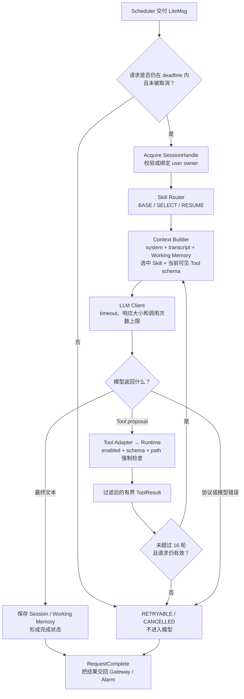
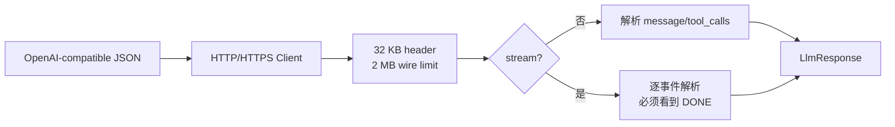
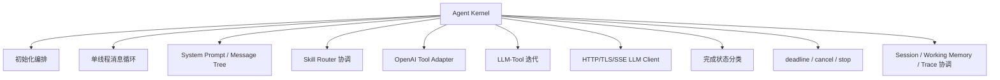
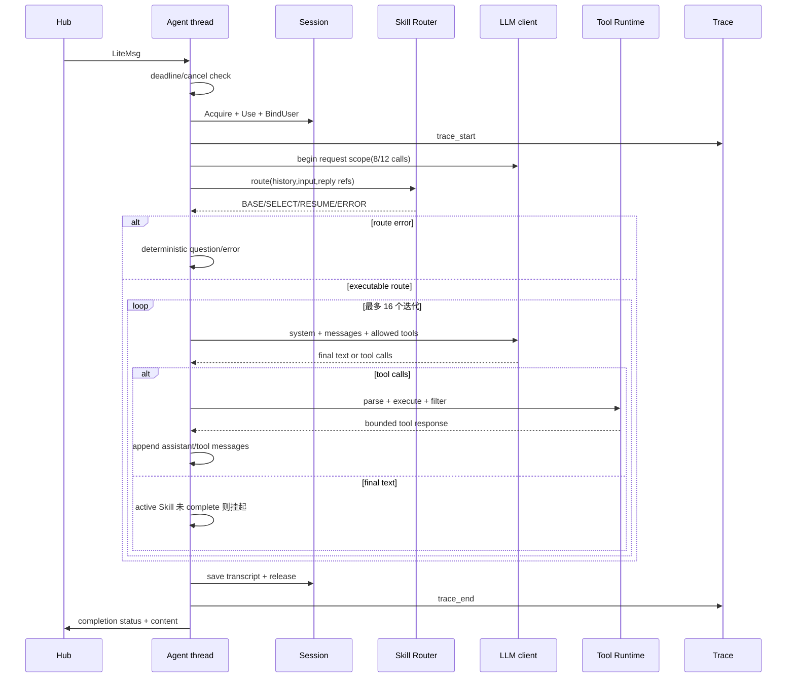
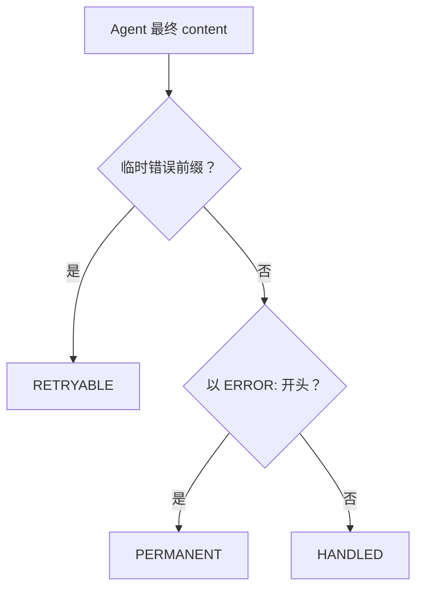
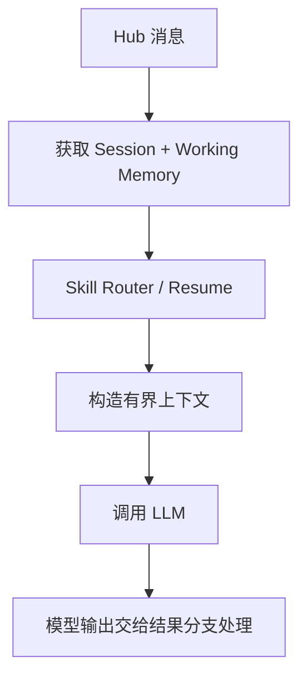
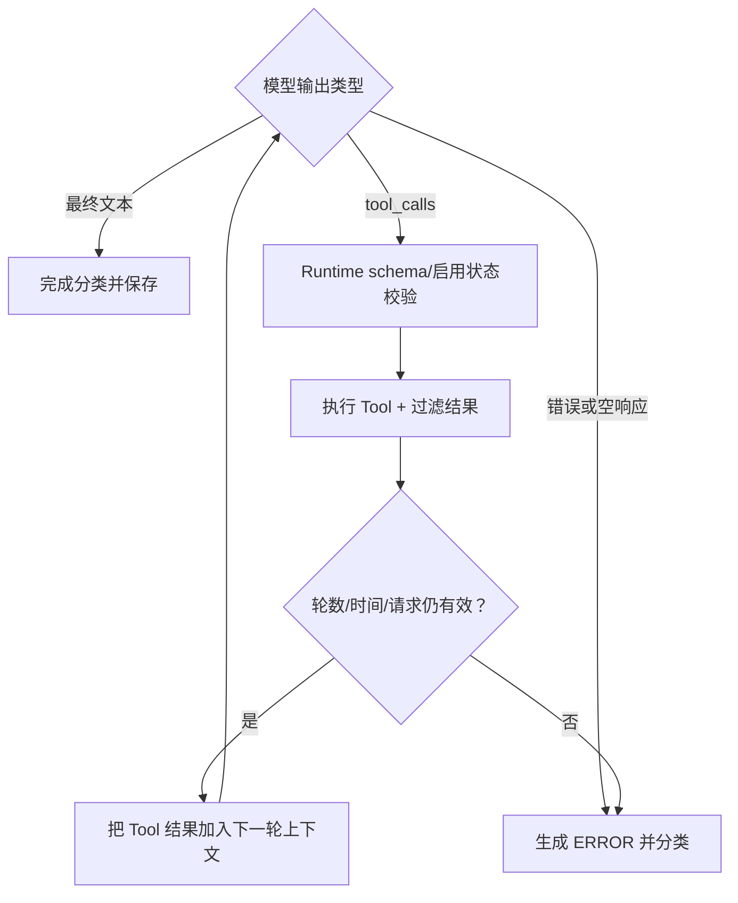

# Kernel 与 Agent Loop 模块架构设计

## 1. 职责

Kernel 是 Agent 的串行执行核心，负责初始化 Runtime/Session/Skill/LLM，消费 Hub 消息，构建上下文，执行 Skill Router、LLM 和 Tool 循环，保存状态并生成完成结果。



## 2. 初始化子功能

| 子功能 | 实现方式 |
|---|---|
| Session | 根据 workspace 配置 `.crab/sessions` 并初始化 cache |
| Skill | 从 `<workspace>/skills` 扫描 `SKILL.md` 元数据 |
| Runtime | 注册内置 Tools 并生成完整 Tool catalog |
| Tool 可见面 | 生成完整 `toolsJson` 和排除 Skill Tools 的 `baseToolsJson` |
| Router | 用同一 catalog 初始化 Skill Router |
| LLM | 解析 Provider URL并保存模型配置 |

## 3. Agent 执行循环

1. 单 Agent 线程从 Scheduler 取消息。
2. Session open 只记录连接事件，不立即建立持久 Session；首次 chat 才创建。
3. 获取 `SessionHandle`、选择当前 Session并绑定 `userId`。
4. 启动 Trace和 LLM request scope。
5. Router 决定 BASE、SELECT、RESUME 或 ERROR。
6. BASE 只向模型暴露普通 Tools；SELECT/RESUME 才暴露 `skill_read`、`skill_complete`。
7. 每轮模型返回最终文本或最多 8 个 Tool calls。
8. Tool 结果写 Trace、Working Memory和对话上下文，然后进入下一轮。
9. 最多 16 轮；普通请求最多 16 次 Tool 调用、高优先级最多 24 次。
10. 保存 Session、结束 Trace并按文本分类完成状态。

## 4. LLM 子模块



- request scope 使用绝对 deadline和取消 epoch。
- 普通请求最多 8 次 LLM 调用，高优先级最多 12 次。
- HTTP 可重试错误最多尝试 4 次，约 2/4/8 秒指数退避加抖动。
- 退避或 I/O 不能越过请求 deadline。
- 最终文本最大 64 KB；Tool 参数总 wire 受 2 MB 上限保护。

## 5. Working Memory

Working Memory 保存在当前 Session 中，记录 task、goal、Workflow 状态、当前 step、选项、最近 8 条 Tool 记录和最多 4 个已读取 Skill。每次构建 Prompt 时把有界摘要追加给模型。

## 6. 完成分类

Kernel 当前根据最终字符串判断 `LiteCompletionStatus`：LLM/超时/Session 容量等错误为 `RETRYABLE`，其他 `ERROR:` 为 `PERMANENT`，普通文本为 `HANDLED`。该机制简单但脆弱，未来应由 Skill/Run 返回结构化状态。

## 7. 当前限制

- 单 Agent 线程导致慢任务队头阻塞。
- 全局 current Session/Skill 兼容 facade 仍存在，不适合直接扩展多 Run 并发。
- LLM body 在 2 MB 内仍整块缓存，不是完全增量 HTTP/SSE。
- Agent 轮数和调用预算只限制次数，没有统一 token/cost budget。
- 取消依赖各子模块主动检查，不能保证瞬时中断所有阻塞系统调用。

## 8. 关键文件

- `include/litecrab/kernel.h`
- `src/kernel/kernel.c`
- `src/kernel/llm.c`
- `src/kernel/working_memory.c`

## 9. 完整子功能结构



| 子功能 | 入口 | 实现方式 | 输出 |
|---|---|---|---|
| Kernel 初始化 | `AgentLoopInit` | 初始化 Hub、Session、Working Memory、Skill Registry、Runtime、Tool JSON、Router 和 LLM | 全局运行上下文 |
| Agent 线程 | `AgentLoopStart` | 创建唯一 `agent_main` pthread | 单消费者执行模型 |
| 控制消息 | `agent_main` | OPEN 延迟建 Session；CLOSE 释放 Session；stop 使用 EXCEPTION 唤醒 | 生命周期动作 |
| Session 获取 | `AgentSessionStateAcquire/Use` | 每条 CHAT 获取显式 handle 并绑定 user | 独立 history/working memory |
| Trace scope | `AgentTraceStart/Finish` | 每个 CHAT 建 root trace，累计 token/tool 计数 | JSONL 审计 |
| Skill 路由 | `SkillRouterRun` | 在主 LLM round 前解析恢复引用或选择 Skill | BASE/SELECT/RESUME/ERROR |
| Route grant | `AgentSessionStateSetSkillRoute` | 把本轮允许的 Skill 写入 Session | Runtime 强校验依据 |
| Context 构建 | `ContextBuildSystemPromptEx` | 基础工具说明、Skill metadata、运行规则和 Working Memory | system prompt |
| Tool schema | Tool Adapter | 由 Runtime spec 生成 OpenAI tools JSON；BASE 隐藏两个 Skill tool | 模型可见工具面 |
| Tool call 解析 | `LlmToolAdapterParseCall` | 严格 JSON object、已知参数、类型和数组限制 | `CrabToolCall` |
| Agent round | `run_round` | LLM→0～8 tool calls→Runtime→append tool exchange→下一轮 | 最终文本或错误 |
| Skill Handler | `SkillHandler*` | 在 tool 前后更新 Run、step、挂起和完成 | Skill 生命周期 |
| Completion 分类 | `finish_request` | 特定临时错误→RETRYABLE；其他 `ERROR:`→PERMANENT；普通文本→HANDLED | Hub response |
| 停机 | `AgentLoopStop` | 增加 LLM cancel epoch、停止标志、入队唤醒、join、停止 Runtime | 有界结束 |

## 10. Agent 请求内部结构

```text
输入 LiteMsg
├── SessionHandle：本轮显式引用
├── AgentTraceScope：trace/root span/计数
├── SkillRouterResult：本轮执行路由
├── messages：Session history + 当前 user + tool exchange
├── system：基础规则 + Skill metadata + route directive + Working Memory
├── toolsJson/baseToolsJson：本轮工具 schema
└── LlmResponse
    ├── text[64 KiB]
    ├── calls[8]
    └── token counters
```

## 11. 完整执行状态流



## 12. LLM Client 子模块

| 子功能 | 当前实现 |
|---|---|
| URL 解析 | HTTP/HTTPS、主机、可选端口、path；`/` 和 `/v1` 归一到 chat completions |
| DNS/连接 | `getaddrinfo`；逐地址尝试；每次 connect 最长 2 秒且受请求剩余时间约束 |
| TLS | 系统信任根、peer verify、SNI、hostname verify；没有 LLM insecure 开关 |
| HTTP | 手工构造 POST，Bearer key，Connection: close |
| 响应边界 | wire body 最大 2 MiB，header 最大 32 KiB，final text 最大 64 KiB |
| Transfer Encoding | 支持 Content-Length 和 chunked decode |
| SSE | 聚合 `data:` 事件；必须至少一个事件并看到 `[DONE]` |
| Tool call | streaming arguments 分片追加；单次最多 8 个 call |
| Usage | prompt/completion/total/reasoning 计数进入 Trace |
| Retry | 429/503 和 500/502/504 最多 4 次；2/4/8 秒基数加 0～25% jitter |
| 不重试 | 响应过大、其他 4xx、协议解析错误 |
| 请求级取消 | thread-local deadline/call budget + 全局 cancel epoch |

内部错误码的关键分类：`-205` deadline/cancel、`-206` 响应过大、`-207` 非重试 HTTP、`-208/-209` 可重试 HTTP、`-210` 请求级 LLM 调用预算耗尽。

## 13. 预算与边界

| 预算 | normal | high/alarm |
|---|---:|---:|
| Agent tool iteration | 16 | 16 |
| 每轮模型 tool calls | 8 | 8 |
| 请求累计 Tool calls | 16 | 24 |
| 请求累计 LLM calls（含 Router resolver） | 8 | 12 |
| Tool 结果进入模型 | 16 KiB/次 | 16 KiB/次 |
| Session transcript | 24 KiB、32 messages | 相同 |

这些限制是 ceiling，不是执行目标。达到限制时停止继续调用；若仍有 Active Skill，则挂起而不是伪造完成。

## 14. 完成与失败语义



临时错误目前通过字符串前缀识别，包括 LLM 请求失败、deadline/cancel、Session 不可用/容量耗尽和内存分配失败。这个实现可运行但不理想：业务层自然语言仍承担类型协议，后续应改成显式结构化 error/result。

## 15. 能力设计与示例

### 15.1 KRN-01：把一条 Hub 消息执行成一个有界 Agent Run

Kernel 是执行面的协调者。它从 Hub 取得 `LiteMsg`，解析 Session 和恢复引用，建立本轮上下文，再进入最多 16 轮的 LLM/Tool 循环。每轮只允许三种结果：模型给出最终文本、模型提出 Tool calls、模型或协议失败。



上图只描述主干，合法分支见下图；模型输出不能被视为可直接执行的命令。



第一张图里不应存在可执行的模型旁路；真正执行必须进入第二张图中的 Runtime 校验节点。

### 15.2 KRN-02：构造有界而且与当前阶段一致的上下文

上下文由系统规则、Session transcript、Working Memory、路由结果、激活 Skill 正文和当前可见 Tool schema 组成。基础请求不注入 Skill Tool；路由阶段只暴露候选元数据；选中后才允许 `skill_read` 加载正文。

示例：用户输入“1+1 等于多少”时，Router 返回 base 路径，模型看不到 PLC Skill 正文和执行脚本。输入包含明确 PLC 告警信息时，才选择 `PLC_Diagnosis`，随后加载其说明并执行受限工具。

### 15.3 KRN-03：验证模型 Tool call，而不是信任模型输出

LLM 返回的工具名、call id 和 arguments 都是不可信输入。Kernel 只负责解析和关联，Runtime 再检查工具是否注册、是否启用、参数是否符合 schema。Tool 结果经过大小和字段过滤后才回填模型上下文。

失败示例：模型伪造一个已禁用的 `shell` 调用。即使它出现在模型响应中，Runtime 仍返回 disabled 错误，Kernel 不得直接调用函数指针或把它记为成功步骤。

### 15.4 KRN-04：形成可供 Gateway 和 Alarm 使用的完成结论

Kernel 将最终结果写入 Session/Working Memory，并调用 Hub 的 `RequestComplete`。普通调用方读取文本；Alarm 根据 completion status 决定 ACK、重试或 dead-letter。这里的 `HANDLED` 表示 Agent 已输出处理结论，不表示设备物理告警已清除。

### 15.5 KRN-05：在预算耗尽或请求取消后停止推进

当前主要预算是最大模型轮数、LLM timeout、请求 deadline 和有界输出。每次继续下一轮前必须检查请求是否仍有效。达到上限后返回明确错误并保留已有 Session 证据，不能无限调用模型或工具。

## 16. 能力状态

| 能力 | 状态 | 当前边界 |
|---|---|---|
| 单 Agent LLM/Tool 主循环 | 已实现 | 同时只执行一个主要 Run |
| Skill 分阶段上下文 | 已实现 | 仍集中在较大的 `kernel.c/skill.c` |
| Tool schema 与启用强制 | 已实现 | `shell` 隔离仍不足 |
| 请求 deadline/取消检查 | 部分实现 | 依赖下游操作配合取消 |
| 完全结构化错误与 Run checkpoint | 未实现 | 当前存在文本启发式 |

## 17. 测试对应关系

- `tests/test_main.c`：Tool Adapter、message tree、Agent Loop、完成分类、取消和预算。
- `tests/test_agent_matrix.py`：多类请求和 Tool/Skill 行为矩阵。
- `tests/test_resolver_modes.py`：Router 与 provider streaming/non-streaming 兼容。
- `tests/test_tcp_e2e.py`、`tests/test_alarm_e2e.py`：两种入口到 Kernel 的完整执行。
- `tests/test_long_running_stress.py`：超时、资源上限、重试和长期运行。
