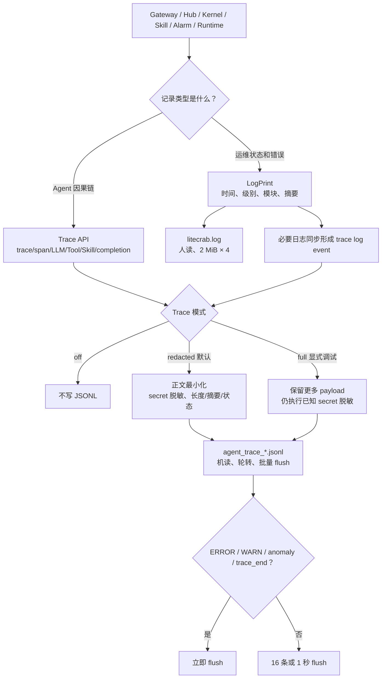
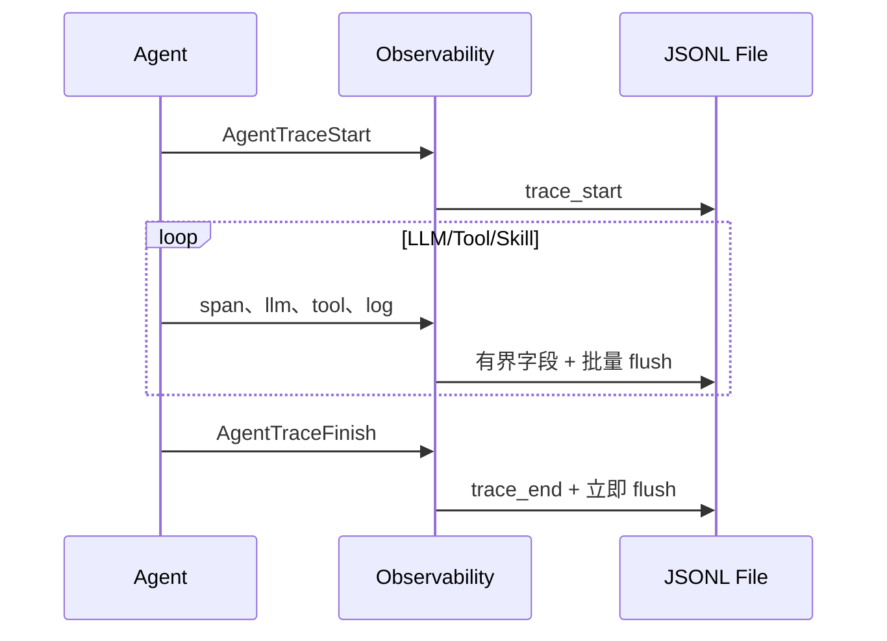
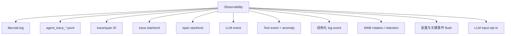
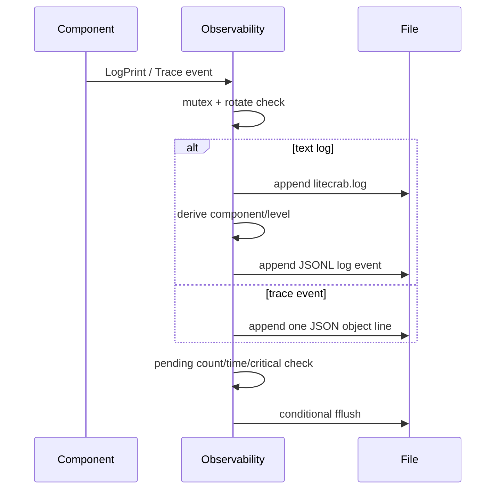
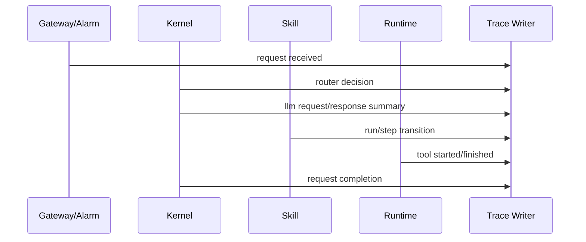

# Observability 模块架构设计

## 1. 职责

Observability 同时提供人读文本日志和机读 JSONL Agent Trace，记录启动、Gateway、Alarm、Router、LLM、Tool、Skill 和异常事件。



## 2. 子功能

| 子功能 | 实现方式 |
|---|---|
| 文本日志 | `LogPrint` 写 `litecrab.log`，并把同一事件转为 Trace log |
| Trace scope | 每个 Agent 请求产生 `trace_start` 和 `trace_end`，记录时长和 token/call 计数 |
| Span | Router、Skill、Tool 等可创建父子 span |
| LLM 事件 | 记录模型、迭代、状态、Tool 名称、token 和错误码 |
| Tool 事件 | 记录 Tool 输入、过滤后输出、exit code 和状态 |
| 异常 | anomaly 事件立即 flush |
| 轮转 | 单文件达到 2 MB 后保留有限代文件 |
| 批量刷盘 | 普通记录 16 条或 1 秒 flush；ERROR/WARN、anomaly、trace_end 立即 flush |
| 隐私开关 | 默认不记录发给 LLM 的完整 messages；环境变量显式开启 |

## 3. Trace 执行流



## 4. 使用

日志目录来自 base config 的 `log.dir` 或 `LITECRAB_LOG_DIR`。仅在受控诊断中开启完整 LLM 输入：

```sh
export LITECRAB_TRACE_LOG_LLM_INPUT=1
```

默认应保持关闭，因为 messages 可能包含用户输入、设备数据和 Skill 上下文。

## 5. 当前限制

- 日志在业务线程同步写入，慢盘可能阻塞 Agent。
- `log.level` 尚未实现过滤。
- 轮转和清理没有统一总磁盘预算，也没有磁盘满 health 指标。
- Trace 有最小化开关，但不是完整的字段级 secret redaction/加密/签名方案。
- 写入失败多数只表现为记录缺失，缺少独立告警通道。

## 6. 关键文件

- `include/litecrab/observability.h`
- `src/observability/observability.c`
- `src/kernel/kernel.c`
- `src/kernel/skill.c`

## 7. 完整子功能结构



## 8. 文本日志子模块

| 子功能 | 实现 |
|---|---|
| 初始化 | 创建 log dir，打开 `<dir>/litecrab.log` append |
| 输出 | `LogPrint` 先去掉尾部 CR/LF，再单行写入 |
| component 推断 | 文本以 `[name]` 开头时提取 name，否则 `general` |
| level 推断 | 包含 ERROR/failed→error；WARN/WARNING→warn；否则 info |
| 双写 | 同一文本同时进入 litecrab.log 和 JSONL `type=log` |
| 轮转 | 当前文件达到 2 MiB 后生成 `.1`～`.3`，总共当前文件+3 代 |
| flush | 16 条、距上次 1 s、错误/失败/警告时立即 flush |

## 9. Trace 数据模型

```text
AgentTraceScope
├── traceId / rootSpanId / skillSpanId
├── startTimeMs / systemPromptHash / lastMessageCount
└── prompt/completion/llm/tool counters

AgentTraceSpan
├── spanId / traceId / parentSpanId
├── type / name
└── startTimeMs
```

| event type | 主要字段 | 产生位置 |
|---|---|---|
| `trace_start` | trace/root/user/session/input | Kernel 每条 CHAT |
| `trace_end` | status/finalOutput/duration/token/call counts | Kernel 完成 |
| `span_start/end` | parent/type/name/input/metadata/output | 可嵌套操作 |
| `llm` | model/iteration/status/toolUse/tool names/calls/output/usage/error | Router 与主 Agent |
| `tool` | name/input/output/exitCode/status | 每次 Tool |
| `anomaly` | parent/category/level/detail | Tool 非零等异常 |
| `log` | level/component/message | `LogPrint` 镜像和显式事件 |

## 10. 写入与轮转流程



Trace 文件名使用本地时间秒级时间戳，冲突时追加三位序号。初始化时最多收集 64 个 trace 文件，按 mtime 保留最新 3 个旧文件，再创建本次新文件；超过数组容量的额外文件直接删除。

## 11. 截断和隐私边界

- `trace_start.input` 当前始终记录用户输入，未提供关闭开关。
- Tool input 记录模型参数，Tool output 截到 16 KiB。
- LLM output 截到 4 KiB。
- 完整 LLM input 默认不记录；只有 `LITECRAB_TRACE_LOG_LLM_INPUT=1/true/yes/on` 或 API 显式开启时记录 system+messages。
- LLM input 开启后单条临时 JSON buffer 约 96 KiB，用于容纳 system、history 和工具结果。
- Viewer 侧遮罩不能替代源 JSONL 脱敏；原始 trace 可能包含用户数据、Tool 参数或设备信息。
- 文件权限依赖进程 umask 和创建环境，模块没有对所有日志显式 chmod 0600。

## 12. 并发和可靠性

- 一个全局 mutex 同时保护文本日志、Trace 写入、轮转和 ID 序列。
- `make_id` 使用 realtime ms + 进程内递增序列，适合进程内关联，不是全局 UUID。
- Trace 是 append-only 观测数据，不参与 Session、Skill 或 Alarm 恢复。
- 批量 flush 减少 SD 卡写放大，但崩溃时可能丢最近不足 16 条且不到 1 秒的普通事件。
- anomaly 和 trace_end 立即 flush，优先保留失败和结束边界。

## 13. 使用与排障入口

| 目标 | 建议观察 |
|---|---|
| 服务是否启动 | `[startup]` revision/build/workspace/limits |
| Gateway 暴露 | `[security]` 与 `[gateway]` |
| 告警接入 | `[alarm] active query/reconnect/queued/handled/dead-letter` |
| Skill 选择 | JSONL `skill.candidates.resolved` |
| Skill 卡住 | `skill.run.state_changed`、tool/llm 次数、最后 exit code |
| 请求超时 | trace_end status、LLM errorCode、Hub response timeout |

## 14. 能力设计与示例

### 14.1 OBS-01：提供面向运维的有界文本日志

文本日志记录启动版本、模块状态、网络和告警摘要，供 `tail -F` 快速排障。日志文件使用私有权限创建，并按 `2 MiB × 4` 的边界轮转，防止长期运行耗尽磁盘。

一次日志事件应回答“何时、哪个模块、发生什么、结果如何”，但不应默认写入 API key、密码、完整 prompt 或整段 ASP 响应。无法打开日志文件时必须向启动方暴露失败或使用明确的降级策略，不能假装已记录。

### 14.2 OBS-02：用 JSONL Trace 保存一次 Agent Run 的因果链

Trace 面向研发和审计，按事件记录 router、LLM、Tool、Skill、完成状态和耗时。共同关联字段使同一 Session 中的多个请求仍可按 trace/request/run/tool call 还原。



示例：分析“是否修改两次”时，应按 tool call id 找到两次 `set_freq_band` 调用，而不能因为总结文本出现“未二次递增”就推断历史只修改一次。

### 14.3 OBS-03：按模式控制敏感内容

默认 redacted 模式保留事件类型、标识、长度、摘要和结果，隐藏输入正文与 secret；full 模式用于受控调试，仍必须执行已知 secret 脱敏。关闭 Trace 不应关闭必要的错误日志。

配置示例：生产板使用 redacted；短时实验可以显式使用 full，并在结束后限制文件访问和清理。无论哪种模式，都不能记录 `LITECRAB_API_KEY` 或 Alarm 密码原文。

### 14.4 OBS-04：截断、轮转和并发串行化

所有写入在 Observability 内部加锁并生成一条完整 JSONL，避免多个线程交叉拼接。字段超过上限时保存 truncated 标志、原始长度和摘要。轮转发生在写入边界，不拆分单条事件。

### 14.5 OBS-05：明确可观测性不等于可靠状态

日志和 Trace 是证据，不是 Session、Skill Run 或 Alarm delivery 的权威存储。删除 Trace 不得改变业务状态；恢复告警只能读取 spool，恢复 Session 只能读取 Session Store。这个边界避免研发工具误充当生产 checkpoint。

## 15. 能力状态

| 能力 | 状态 | 当前边界 |
|---|---|---|
| 文本日志、权限和轮转 | 已实现 | 无集中式采集 |
| Agent JSONL Trace | 已实现 | 事件 schema 尚未版本化完整治理 |
| redacted/full/off 模式 | 已实现 | full 仍需严格运维控制 |
| 字段截断和 secret 脱敏 | 已实现 | 不能识别所有未知业务敏感值 |
| metrics、health、远程审计导出 | 未实现 | 不能作为当前监控能力承诺 |

## 16. 测试对应关系

- `tests/test_main.c`：事件字段、trace/span、Tool/LLM 日志、开关、轮转和 flush。
- `tests/test_long_running_stress.py`：日志尺寸、文件代数和长期写入。
- `tests/test_security.c`：LLM input 默认关闭、敏感内容边界和文件策略。
- `tests/test_agent_matrix.py`：Router/Run/Tool Trace 的实际关联。
