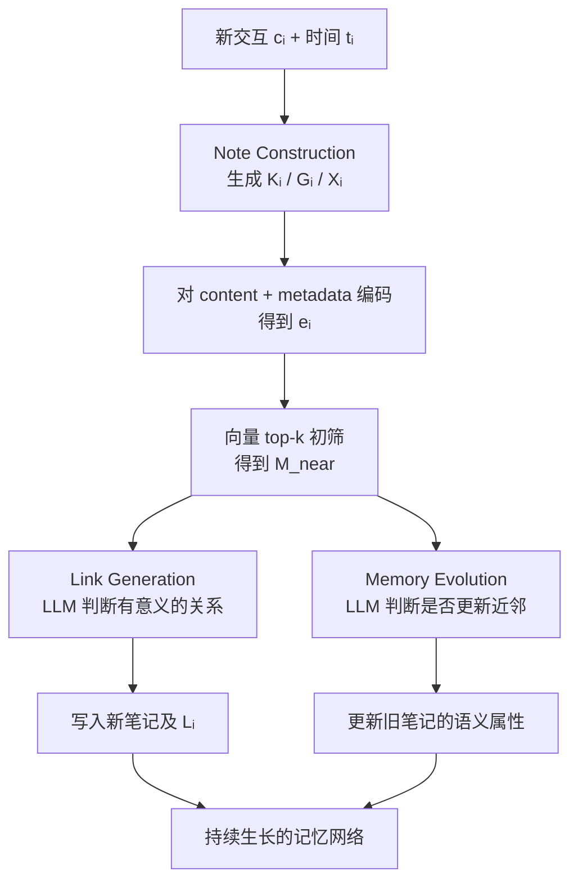
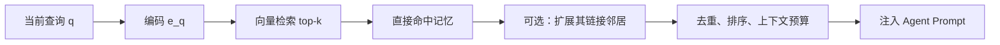

# A-MEM：Agentic Memory 原理、设计与创新点

> 论文：**A-MEM: Agentic Memory for LLM Agents**，NeurIPS 2025，arXiv:2502.12110（本文按 v11 分析）  
> 代码：[`WujiangXu/A-mem`](https://github.com/WujiangXu/A-mem)（论文复现实验）与 [`WujiangXu/A-mem-sys`](https://github.com/WujiangXu/A-mem-sys)（面向 Agent 集成的实现）  
> 本文目的：解释 A-MEM 的问题定义、数据模型、运行流程、创新点、实验结论和工程边界。LiteCrab 的具体移植设计见 [`A-MEM适配LiteCrab分析.md`](A-MEM适配LiteCrab分析.md)。

## 1. A-MEM 解决什么问题

LLM Agent 的短期上下文会被窗口长度、Session 生命周期和成本限制。传统长期记忆一般采用“保存原文或摘要 → 向量检索 → 拼入 Prompt”的固定流水线，主要有三类不足：

1. **记忆表示贫乏**：只保存原文，难以显式表达主题、上下文和概念。
2. **记忆彼此孤立**：相似记忆能被分别召回，但系统没有持续维护它们之间的关系。
3. **旧记忆不会重新解释**：新事实出现后，历史记忆的语义表示通常保持不变。

A-MEM 的核心主张是：长期记忆不应只是静态数据库，而应在新记忆到来时自动完成“理解、关联、重组”。它借鉴 Zettelkasten（卡片盒笔记法）的两个原则：

- **原子性**：一条笔记表达一个自包含的知识单元；
- **灵活链接**：知识组织由内容之间的关系自然形成，而不是完全依赖预定义目录或固定 schema。

这里的 “agentic” 主要指 **LLM 参与记忆的构建、链接和演化决策**，并不表示每条记忆本身是一个独立 Agent。

## 2. 记忆的数据模型

论文将第 $i$ 条记忆表示为：

$$
m_i = \{c_i,t_i,K_i,G_i,X_i,e_i,L_i\}
$$

| 字段 | 含义 | 产生方式 | 主要用途 |
|---|---|---|---|
| $c_i$ | 原始交互内容 | 输入 | 保留事实和原始语境 |
| $t_i$ | 时间戳 | 输入/系统 | 时间推理与排序 |
| $K_i$ | 关键词 | LLM 生成 | 捕获具体概念和实体 |
| $G_i$ | 标签 | LLM 生成 | 粗粒度分类 |
| $X_i$ | 上下文描述 | LLM 生成 | 补充原文未显式写出的语义背景 |
| $e_i$ | 稠密向量 | 文本编码器 | 相似检索和候选召回 |
| $L_i$ | 关联记忆集合 | LLM 判断 | 构成可跨笔记访问的知识网络 |

嵌入并非只编码原文，而是编码内容与生成元数据的拼接：

$$
e_i=f_{enc}[\operatorname{concat}(c_i,K_i,G_i,X_i)]
$$

这是一项关键设计：LLM 先把隐式语义显式化，编码器再把扩充后的表示映射到向量空间。因此，检索质量同时依赖 LLM 提取质量和嵌入模型质量。

## 3. 写入路径：构建、链接、演化



### 3.1 Note Construction：把交互变成语义笔记

系统用模板 $P_{s1}$ 让 LLM 从原始内容和时间中生成关键词、标签和上下文：

$$
K_i,G_i,X_i \leftarrow \operatorname{LLM}(c_i \| t_i \| P_{s1})
$$

它不是普通摘要：关键词用于细粒度匹配，标签用于分类，上下文描述用于表达主题和隐含关系。三者从不同视角扩充同一条原子记忆。

### 3.2 Link Generation：两阶段关系发现

新笔记 $m_n$ 加入时，系统先计算它与历史记忆的余弦相似度：

$$
s_{n,j}=\frac{e_n\cdot e_j}{\|e_n\|\|e_j\|}
$$

再取 top-$k$ 候选集合 $\mathcal{M}_{near}^{n}$，交给 LLM 判断哪些候选存在有意义的共同属性或概念关系。

这形成一个典型的两阶段管线：

| 阶段 | 负责什么 | 为什么需要 |
|---|---|---|
| 向量召回 | 从大量历史中快速缩小候选集 | 控制计算量和 Prompt 长度 |
| LLM 判别 | 识别相似度之外的概念、上下文或潜在因果关系 | 避免只按表面词义连边 |

论文用 “box” 描述互相关联的记忆簇；一条笔记可以同时处于多个 box。这里的 box 是概念模型，不是预先创建的物理目录。

### 3.3 Memory Evolution：用新经验重新解释旧经验

建立新链接后，系统逐个考察候选近邻 $m_j$，综合新记忆、其他近邻和旧记忆本身，判断是否更新旧记忆的上下文、关键词和标签：

$$
m_j^* \leftarrow \operatorname{LLM}(m_n \| \mathcal{M}_{near}^{n}\setminus m_j \| m_j \| P_{s3})
$$

论文描述中，$m_j^*$ 会替换 $m_j$。其意图是让记忆网络随经验积累形成更高阶的属性和组织，而不是永远停留在首次写入时的解释。

需要注意：**演化的是语义表示，不应被理解为可以无证据改写历史事实**。原论文主要面向对话记忆；在工业诊断、安全或审计场景中，原始证据应保持不可变，演化结果应作为带版本和来源的派生层保存。

## 4. 读取路径：相关记忆检索

查询 $q$ 使用同一个编码器得到 $e_q$，然后按余弦相似度取 top-$k$：

$$
e_q=f_{enc}(q),\qquad
\mathcal{M}_{retrieved}=\{m_i\mid \operatorname{rank}(s_{q,i})\le k\}
$$



论文正文公式明确的是 top-$k$ 直接检索；架构说明和 `A-mem-sys` 的 `search_agentic` / `find_related_memories_raw` 还体现了对链接邻居的扩展访问。工程实现时应把“是否扩展、扩展几跳、最多多少条”设为显式策略，否则图扩展容易造成上下文膨胀。

## 5. 三个层次的创新

### 5.1 表示层：LLM 生成的多视角语义笔记

相较只嵌入原文，A-MEM 把关键词、标签和上下文共同纳入表示，使短句、隐含指代和跨会话主题更容易被召回。

### 5.2 组织层：稠密召回与 LLM 连边结合

纯向量检索只回答“像不像”；A-MEM 进一步让 LLM 判断“是否存在值得保留的关系”。记忆由扁平集合变成动态关系网络，同时保持候选生成的可扩展性。

### 5.3 学习层：新记忆反向更新历史语义

大多数外部记忆系统只新增或删除记录。A-MEM 允许新经验改变旧记忆的语义元数据，把长期记忆从 append-only 日志提升为可演化的知识组织。

综合来看，A-MEM 的创新不是单个向量库或单个 Prompt，而是把以下闭环组合起来：

```text
新经验 → 结构化理解 → 候选召回 → 关系判断 → 旧知识重解释 → 更好的后续召回
```

## 6. 论文、复现仓库和系统仓库的关系

| 资料 | 主要定位 | 应如何使用 |
|---|---|---|
| 论文 | 算法思想、公式和对照实验 | 作为机制与效果主张的依据 |
| `A-mem` | 复现实验结果 | 理解 LoCoMo/DialSim 评测、检索器和超参 |
| `A-mem-sys` | 便于 Agent 集成的 Python 实现 | 参考 API、ChromaDB、元数据和多 LLM backend 接法 |

系统仓库的主要对象是 `MemoryNote` 和 `AgenticMemorySystem`，提供 `add_note`、`read`、`update`、`delete`、`search`、`search_agentic` 等 API。代码还增加了 `retrieval_count`、`last_accessed`、`category`、`evolution_history` 等工程字段，并在 `add_note` 时自动补齐缺失元数据。

不能把系统仓库视为论文伪代码的一比一实现：例如生产仓库将关联判断和近邻更新合并在一次 evolution 决策中，并使用 ChromaDB 管理嵌入与元数据；部分辅助检索函数和持久化行为也带有明显的示例实现性质。移植时应复用思想和契约，而不是逐行翻译 Python。

## 7. 实验结论应该怎样解读

### 7.1 消融实验

以 GPT-4o-mini 为基础模型时，论文报告：

| 方法 | Multi-Hop F1 | Temporal F1 | Single-Hop F1 |
|---|---:|---:|---:|
| 去掉 LG 和 ME | 9.65 | 24.55 | 13.28 |
| 保留 LG、去掉 ME | 21.35 | 31.24 | 39.17 |
| 完整 A-MEM | 27.02 | 45.85 | 44.65 |

这支持两个判断：链接生成是组织记忆的基础，记忆演化带来进一步增益；但这些数字来自长对话 QA 数据集，不能直接等价为工业告警诊断的准确率提升。

### 7.2 检索数量 $k$

论文测试了 $k\in\{10,20,30,40,50\}$。更大的 $k$ 通常带来更多上下文，但收益会饱和甚至下降。附录中 GPT-4o-mini 在不同任务类别使用 40 或 50，而小模型不少类别维持 10。因此“论文默认 $k=10$”只是实现起点，不是统一最优值。

### 7.3 成本与规模

论文表 1 的 token 长度依基础模型而异：例如 GPT-4o-mini + A-MEM 为 2,520，GPT-4o + A-MEM 为 1,216；不能概括成固定“每次操作 1,200 tokens”。表 4 报告 100 万记忆时 A-MEM 占用约 1464.84 MB、检索时间约 $3.70\pm0.74\,\mu s$，这是论文特定实验环境和检索实现的测量结果，不是任意数据库、ARM 板卡或线性扫描实现的性能承诺。

## 8. 局限与工程风险

| 风险 | 原因 | 工程含义 |
|---|---|---|
| LLM 依赖 | 元数据和关系质量受基础模型影响 | 需要 schema 校验、降级和人工抽查 |
| 错误演化 | 新信息可能不完整或与旧信息冲突 | 原始事实不可覆盖；派生层需版本化 |
| 写入放大 | 每条新记忆可能触发构建、关联和近邻更新 | 应批处理、限流、异步化 |
| 图扩展噪声 | 链接邻居会增加召回量 | 必须设置 hop、条数和 token 上限 |
| 时间语义不足 | 相似度不等于时序有效性 | 增加有效期、发生时间和状态字段 |
| 访问隔离 | 全局记忆可能跨用户、设备泄露 | 检索前必须先做 scope/ACL 过滤 |
| 评测外推 | 论文主要是长对话 QA | 目标系统必须建立领域数据集重新评测 |
| 文本限定 | 论文明确以文本交互为主 | 图像、波形和原始遥测应存引用与摘要，而非直接照搬 |

## 9. 对 Agent 设计最值得移植的思想

优先移植的不是 ChromaDB 或某个嵌入模型，而是四个架构原则：

1. **原始证据与派生理解分层**：事实稳定，解释可演化。
2. **先召回再推理**：便宜的索引缩小范围，昂贵的 LLM 只处理候选。
3. **写入和读取都是有预算的策略**：不是所有对话都值得记忆，也不是命中越多越好。
4. **记忆形成反馈闭环**：新的成功、失败和用户纠正，应能提升未来检索和决策。

这四点可以在没有本地大模型、没有 ChromaDB 的嵌入式 Agent 中实现；向量检索只是候选召回的一种实现方式。

## 10. 资料来源

- [A-MEM 论文 HTML（v11）](https://arxiv.org/html/2502.12110v11)
- [A-MEM 论文 PDF](https://arxiv.org/pdf/2502.12110)
- [论文复现仓库 `WujiangXu/A-mem`](https://github.com/WujiangXu/A-mem)
- [Agent 集成仓库 `WujiangXu/A-mem-sys`](https://github.com/WujiangXu/A-mem-sys)

