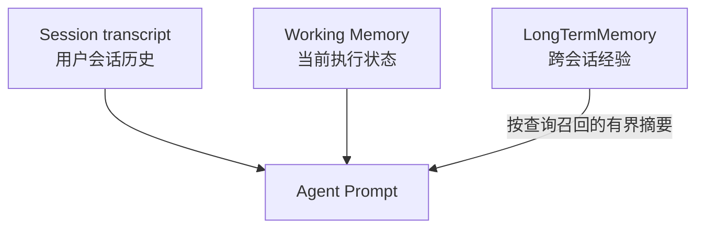
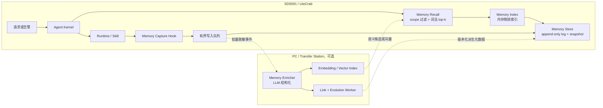
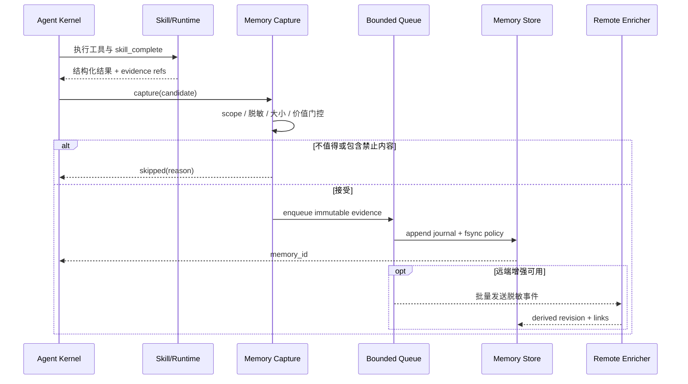
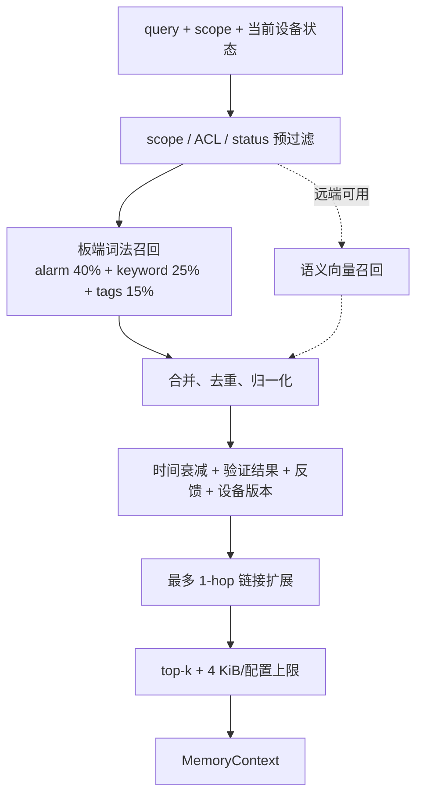
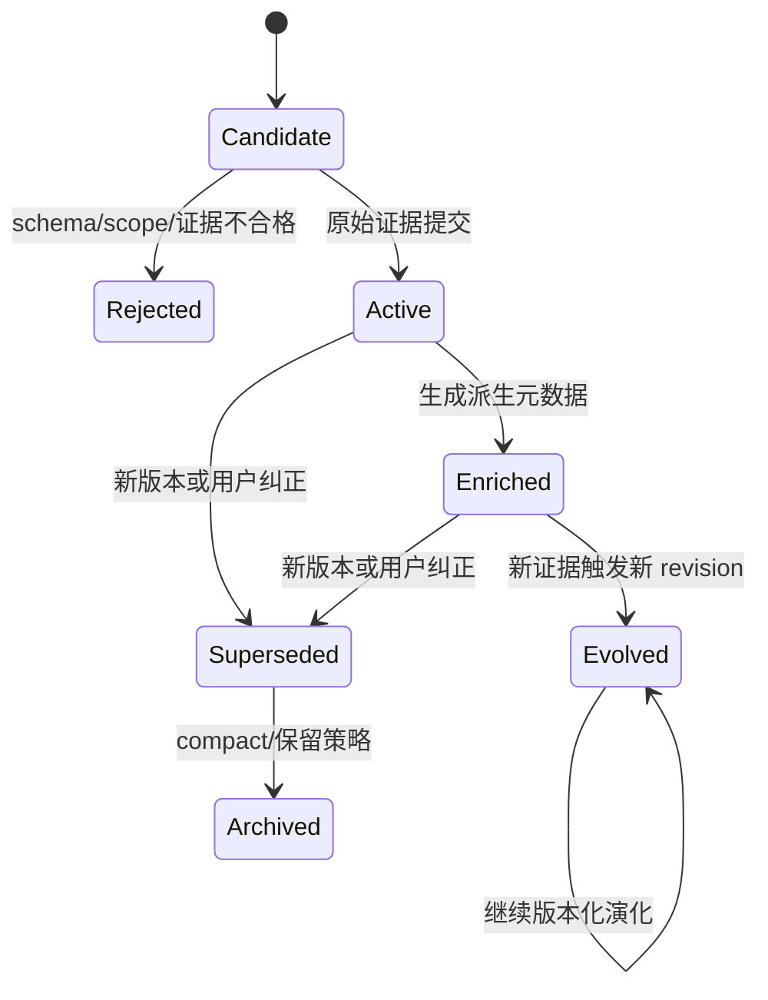

# A-MEM 思想移植 LiteCrab：架构与实施方案

> 上游原理：[`A-MEM论文记忆能力分析.md`](A-MEM论文记忆能力分析.md)  
> 目标代码：LiteCrab C11 Agent，面向 ARM 32-bit SD5091；本文是设计方案，文中新增能力均标记为“待实现”。  
> 设计结论：**保留 A-MEM 的原子笔记、候选召回、语义链接和演化闭环；不直接移植 Python/ChromaDB。板端负责可靠存储、隔离和有界词法检索，PC/服务端可选负责嵌入与 LLM 演化。**

## 1. 当前能力与目标差距

LiteCrab 当前已有三种“记忆相关状态”，但都不是通用长期记忆：

| 当前机制 | 当前作用 | 边界 |
|---|---|---|
| Session transcript | 保存单个 Session 的短对话 | 最多 32 条/24 KiB；Session 隔离；7 天 TTL |
| Working Memory | 当前请求/Skill 的 task、goal、step、工具历史 | 只服务当前执行恢复和 Prompt 构造 |
| Skill 状态 | 路由、执行、挂起与完成 | 是工作流控制状态，不是经验知识库 |

目标是新增第四层 `LongTermMemory`，满足：

- 跨 Session 保存经过筛选的诊断经验；
- 在 Agent 推理前自动召回相关历史；
- 支持设备、用户和领域隔离；
- 新经验可建立链接并更新旧经验的“解释层”；
- 原始告警、工具结果和处置证据不可被 LLM 覆盖；
- 在板端资源、Flash 寿命、LLM 配额或网络异常时可降级运行。

## 2. 设计原则

### 2.1 不把 Session、Working Memory 和长期记忆混在一起



长期记忆只向 Prompt 注入本轮命中的摘要，不把整个记忆库复制进 Session，也不把命中结果写回 Working Memory 的权威状态。

### 2.2 原始事实不可变，派生理解可演化

A-MEM 论文允许演化后的笔记替换旧笔记。LiteCrab 面向设备操作和审计，应改为双层模型：

```text
Evidence（不可变）
  告警标识、发生时间、工具输入/输出摘要、实际动作、验证结果、来源引用

Derived Note（可版本化）
  keywords、tags、context、links、置信度、适用条件、失效条件
```

LLM 只能新建 `Derived Note` 版本；不能覆盖 Evidence。用户纠正或新证据通过 `supersedes` / `contradicts` / `supports` 关系表达。

### 2.3 记忆只辅助决策，不自动授权副作用

命中的历史处置只能作为参考。所有写设备、改配置和执行程序仍必须经过现有 Skill、Runtime schema、权限和验证流程。系统 Prompt 应明确：历史记忆可能过期或错误，执行前必须读取当前设备状态。

## 3. 推荐总体架构

采用“板端核心 + 可选远端增强器”的混合架构。



选择该架构的原因：

- 当前 LiteCrab 的 LLM client 和 Agent loop 是全局、单 Agent 线程设计，不宜直接增加一个共享同一 LLM 状态的后台演化线程；
- MiniLM、Python 和 ChromaDB 不适合直接并入现有 C11 静态板端产物；
- 板端本地索引可保证断网仍能读写和检索；
- 远端增强不可用时，记忆系统退化为确定性的结构化日志 + 词法检索，不影响主业务完成。

若部署环境没有常驻 PC，阶段 1 和阶段 2A 仍可完全在板端运行；只关闭 embedding 和 LLM evolution。

## 4. 记忆模型

### 4.1 建议记录结构

```json
{
  "schema_version": 1,
  "id": "mem_...",
  "revision": 3,
  "status": "active",
  "scope": {
    "tenant_id": "default",
    "user_id": "operator-a",
    "site_id": "site-01",
    "device_id": "plc-001"
  },
  "event": {
    "occurred_at_ms": 1789171200000,
    "ingested_at_ms": 1789171210000,
    "source": "skill:PLC_Diagnosis",
    "session_id_hash": "sha256:..."
  },
  "evidence": {
    "alarm_signature": {"equipid": "...", "almid": "...", "reason": "..."},
    "symptom": "...",
    "action_taken": "...",
    "action_result": "success",
    "verification": "alarm cleared after readback",
    "raw_refs": ["trace:..."]
  },
  "derived": {
    "summary": "...",
    "keywords": ["..."],
    "tags": ["..."],
    "context": "...",
    "applicability": ["..."],
    "invalidators": ["firmware changed"],
    "confidence": 0.82,
    "links": [
      {"target": "mem_...", "type": "supports", "confidence": 0.76}
    ]
  },
  "provenance": {
    "generator": "deterministic|llm:model-name",
    "prompt_version": "memory-note-v1",
    "parent_revision": 2
  }
}
```

### 4.2 必须保留的字段语义

| 字段 | 规则 |
|---|---|
| `scope` | 在相似度计算前过滤，禁止先全局召回再过滤 |
| `evidence` | append-only；删除只写 tombstone，compact 时再物理清理 |
| `derived` | 可新增版本；每次演化保留 generator 和父版本 |
| `confidence` | 表示派生解释置信度，不代表设备动作安全等级 |
| `links.type` | 至少支持 `related`、`supports`、`contradicts`、`supersedes`、`same_case` |
| `raw_refs` | 指向受控 Trace；Prompt 中默认不展开原始敏感内容 |

## 5. 功能点设计

| 功能 | 粗略说明 | 首发优先级 |
|---|---|---:|
| 记忆捕获 | 从成功/失败的 Skill 闭环和显式用户纠正中构造候选事件 | P0 |
| 写入门控 | 过滤闲聊、重复项、无结果过程和敏感字段 | P0 |
| 本地持久化 | append-only journal、CRC、原子 snapshot、启动恢复 | P0 |
| scope 隔离 | 按 tenant/user/site/device 过滤 | P0 |
| 词法检索 | 字段加权倒排索引，支持 top-k 和时间/状态加权 | P0 |
| 自动召回 | 首次 LLM 调用前注入有界历史摘要 | P0 |
| `memory_search` | 模型需要更多历史时进行二次检索 | P1 |
| 反馈与纠正 | 标记 useful、incorrect、superseded，影响后续排序 | P1 |
| 链接生成 | 对候选近邻生成带类型、置信度的链接 | P1 |
| 记忆演化 | 只更新派生层，保留历史版本 | P1 |
| 语义检索 | PC 侧 embedding + vector top-k，与词法结果融合 | P2 |
| 运维治理 | 配额、TTL、compact、导出、删除、指标和审计 | P1 |

## 6. 写入流程

### 6.1 触发条件

首版只在高价值边界触发，不对每一轮对话调用 LLM：

- `skill_complete` 成功或失败，且存在工具证据；
- 告警处置完成并完成 readback/告警消除验证；
- 用户明确纠正历史结论；
- 用户显式要求“记住”；
- 重要配置/设备版本变化，用于使旧经验失效。

普通闲聊、未完成中间步骤、纯检索命中、密钥和完整原始响应默认不写入。

### 6.2 写入时序



关键行为：

- 捕获失败不得把已完成的用户请求改成失败；记录指标并 fail-open；
- 队列满时丢弃低优先级候选并计数，不能阻塞 Agent 主循环；
- 同一 `alarm_signature + action + verification` 在时间窗内去重，但增加 `occurrence_count`；
- 未验证成功的处置必须标为 `unknown` 或 `failed`，不能写成最佳实践。

## 7. 检索与 Prompt 注入流程

### 7.1 两级检索



建议起始评分（需用领域数据校准）：

$$
score = 0.55\,lexical + 0.25\,semantic + 0.10\,recency + 0.10\,feedback
$$

若无语义服务，将 semantic 权重按比例分配给 lexical；scope 不参与加权，而是硬过滤条件。成功案例不是天然高分：设备版本不匹配、存在 `contradicts` / `supersedes` 链接或缺少验证时应降权。

### 7.2 自动召回与显式工具并存

- **自动召回**：Kernel 在本轮第一次 LLM 调用前，用用户请求、告警签名和当前 Skill 构造查询，注入 3～5 条有界摘要。这样模型不需要先“想起要搜索”。
- **显式 `memory_search` Tool**：当首批记忆不足或需要指定设备/时间范围时，由模型进行第二次查询。

Prompt 注入建议格式：

```text
Historical memory (untrusted advisory context; verify current device state):
- [mem_x, confidence=0.82, verified=success, occurred_at=...]
  Applicable when: ...
  Summary: ...
  Evidence ref: trace:...
```

不得把记忆内容混入 system policy；它应作为独立、明确标记为不可信的上下文块，防止历史文本中的提示注入覆盖系统规则。

## 8. Link Generation 与 Memory Evolution 的 LiteCrab 版本

### 8.1 Link Generation

1. 新记忆先按 scope、告警签名和词法/向量相似度取候选，默认不超过 10 条；
2. 规则可直接确认 `same_case`、版本更新等确定关系；
3. LLM 只对剩余候选输出严格 JSON：目标 ID、关系类型、理由摘要和置信度；
4. 校验目标存在、同 scope、无自环、条数有界后写入；
5. 默认存双向 `related/same_case`，`supports/contradicts/supersedes` 保持有向。

### 8.2 Memory Evolution



演化规则：

- 只改 `derived`，禁止重写 `evidence`、发生时间和来源；
- 旧版本可回溯；新版本失败时继续使用上一个已提交版本；
- LLM 输出必须通过 schema、长度、ID、scope 和关系类型白名单校验；
- 矛盾信息优先建立 `contradicts`，不让模型擅自选一个“真相”；
- 高风险结论必须等待新工具证据或人工确认，不能仅凭 LLM 置信度晋升。

## 9. 板端存储设计

建议目录：

```text
<workspace>/.crab/memory/
├── journal.lcm       # append-only Evidence/Derived/Tombstone 记录
├── snapshot.lcm      # compact 后的原子快照
├── lexical.idx       # 可重建的倒排索引，不作为唯一事实源
└── quarantine/       # 损坏或 schema 不兼容记录
```

不要以“直接不断改写 JSONL 某一行”实现演化。建议沿用 Session 模块已有的边界校验和临时文件替换思想：journal 带 magic、schema version、length、CRC；snapshot 写临时文件、`fsync`、rename，再切换 journal。索引始终可由 journal/snapshot 重建。

初始容量建议作为配置而非硬编码：

| 限制 | 建议初值 |
|---|---:|
| 单条 Evidence | 8 KiB |
| 单条派生摘要 | 2 KiB |
| 内存索引记录数 | 5,000 |
| 自动召回数 | 3～5 |
| Link 候选数 | 10 |
| Prompt 注入总量 | 4 KiB |
| 捕获队列 | 32 条 |

达到配额后优先 compact、淘汰已 supersede 且超过保留期的派生版本；审计要求保留的 Evidence 不得静默删除。

## 10. 配置契约

在 `base_config.example.json` 增加：

```json
{
  "memory": {
    "enabled": false,
    "store_dir": ".crab/memory",
    "max_records": 5000,
    "max_note_bytes": 8192,
    "capture_queue_size": 32,
    "auto_recall_k": 4,
    "candidate_k": 10,
    "max_prompt_bytes": 4096,
    "graph_hops": 1,
    "fail_open": true,
    "remote_enricher_url": "",
    "remote_timeout_ms": 3000,
    "evolution_enabled": false
  }
}
```

默认关闭是为了保持当前部署兼容；启用时必须校验 `store_dir` 位于 workspace 内，限制数值范围，并禁止把 API key 写入记忆记录。

## 11. 需要修改的代码位置

以下行号只用于定位当前版本，长期维护应以符号名为准。

| 文件 | 动作 | 功能 |
|---|---|---|
| `include/litecrab/memory.h` | 新增 | `MemoryConfig`、`MemoryRecord`、`MemoryContext` 和生命周期 API |
| `src/memory/memory.c` | 新增 | 门控、scope、捕获、查询、排序与统一 facade |
| `src/memory/memory_store.c` | 新增 | journal/snapshot、CRC、恢复、tombstone、compact |
| `src/memory/memory_index.c` | 新增 | 字段加权倒排索引、top-k、可重建索引 |
| `src/memory/memory_worker.c` | 新增 | 有界队列、批处理、远端增强与退避；不复用 Agent LLM request scope |
| `include/litecrab/config.h` | 修改 | 在 `LiteCrabAppConfig` 增加 `MemoryConfig memory` |
| `src/config/config.c` | 修改 | 默认值、JSON 解析、路径与上限校验 |
| `config/base_config.example.json` | 修改 | 增加 `memory` 示例配置 |
| `CMakeLists.txt` | 修改 | 编译 memory 源文件并注册测试 |
| `src/main.c` | 修改 | 按顺序 init/start/stop/destroy Memory，启动失败按配置降级或终止 |
| `src/kernel/kernel.c` | 修改 | `AgentLoopInit` 接收 Memory；首轮 LLM 前自动召回；Tool 结果后捕获；Prompt 预算 |
| `src/kernel/skill.c` | 小改 | 暴露结构化完成事件或 completion snapshot；不要在此直接做 I/O/LLM |
| `src/runtime/builtin_tools.c` | 修改 | 注册 `memory_search`、后续可加 `memory_feedback`；复用 Runtime schema 和限长 |
| `src/observability/observability.c` | 修改 | `memory.capture/search/evolve/compact` 指标与 trace event，内容默认脱敏 |
| `others/transfer_station/service.py` | 可选修改 | 增加 `/v1/memory/enrich`、`/search`、`/feedback`，与 LLM proxy 分开限流 |
| `docs/memory/memory_module_architecture.md` | 新增 | 实现时按项目文档规范记录最终契约与状态 |

### 11.1 Kernel 接入点

当前 `ContextBuildSystemPromptEx()` 最终调用 `WorkingMemoryAppendPrompt()`。建议不要让 Memory 模块依赖 Working Memory，而是在 Kernel 构建完基础 system prompt 后，再调用：

```c
MemoryRecall(..., &memoryContext);
MemoryContextAppendPrompt(&memoryContext, system, sizeof system);
```

捕获点位于 Kernel 收到已校验的 Tool result、`SkillHandlerOnToolResult()` 更新完成状态之后。这样可以同时读取 tool evidence 和 Skill completion snapshot，但只入队，不在 Agent 线程做演化网络请求。

### 11.2 Runtime Tool 契约

`memory_search` 建议参数：

| 参数 | 类型 | 说明 |
|---|---|---|
| `query` | string，必填 | 自然语言或告警特征 |
| `deviceId` | string，可选 | 只能缩小当前授权 scope |
| `fromTimeMs` / `toTimeMs` | int，可选 | 时间范围 |
| `resultStatus` | enum，可选 | success/fail/unknown |
| `limit` | int，可选 | 1～10 |

输出只包含有界摘要、适用条件、验证状态、发生时间和 evidence ref。工具参数不能扩大调用者的 ACL。

## 12. 分阶段实施

### 阶段 0：契约和数据集

- 定义 Evidence schema、scope、敏感字段和写入门控；
- 从现有 Trace 构造一批脱敏的“查询—相关历史—期望动作”样本；
- 建立无记忆基线：成功率、误召回率、平均 token、P95 延迟。

退出条件：schema 可版本化；至少覆盖成功、失败、矛盾、版本变化和跨设备隔离用例。

### 阶段 1：板端可靠 MVP

- append-only store + 恢复 + compact；
- Skill 完成事件捕获；
- scope 硬过滤、字段加权词法 top-k；
- 自动 Prompt 注入和 `memory_search`；
- 全部功能可配置关闭，远端不可用不影响 Agent。

退出条件：重启恢复、断电模拟、损坏文件、配额、跨 scope 和 Prompt 注入测试通过。

### 阶段 2A：反馈、链接和版本化演化

- `memory_feedback`、tombstone、supersedes/contradicts；
- 规则链接优先，LLM 链接可选；
- 派生层 revision、回滚和隔离校验；
- 批处理与调用预算。

退出条件：LLM 输出畸形、超时或错误连边时不破坏 Evidence 和可用索引。

### 阶段 2B：PC 侧语义增强（可选）

- Transfer Station 或独立 sidecar 部署 embedding/vector index；
- 词法与语义结果融合；
- 双方 schema version、幂等 key、超时和重试契约；
- 板端保留最近/高价值记忆的本地可用副本。

退出条件：断开 PC 后功能可降级；恢复连接后无重复写入和跨 scope 泄露。

### 阶段 3：领域评测后再默认启用

- A/B 比较自动召回开关；
- 调整 top-k、时间衰减、图扩展和写入门控；
- 只有在诊断收益显著且误导率达标后，才将 `memory.enabled` 设为部署默认值。

## 13. 测试与验收

| 测试文件 | 覆盖内容 |
|---|---|
| `tests/test_memory.c` | schema、门控、排序、去重、scope、版本、CRC、compact |
| `tests/test_memory_restart.py` | 重启恢复、截断 journal、损坏 snapshot、幂等重放 |
| `tests/test_memory_security.py` | 跨用户/设备访问、提示注入、敏感字段、路径逃逸 |
| `tests/test_memory_e2e.py` | Skill 完成 → 捕获 → 新 Session 召回 → Prompt 使用 |
| `tests/test_long_running_stress.py` | 队列满、磁盘满、compact、长期写入和线程退出 |
| `tests/test_transfer_station.py` | enrich/search 超时、错误 JSON、版本不兼容和降级 |

建议验收指标：

- scope 泄露为 0；
- Evidence 被演化覆盖为 0；
- 记忆服务异常不阻断主请求；
- 自动注入严格不超过配置字节数；
- 命中结果每条都可追溯到 evidence ref；
- 相比无记忆基线，领域任务成功率提升且“错误历史导致错误动作”的比例低于预设阈值；
- 记录板端内存、Flash 写放大、P50/P95 延迟与 LLM token 增量。

## 14. 主要风险与缓解

| 风险 | 缓解措施 |
|---|---|
| 错误记忆诱导设备操作 | advisory 标记、当前状态复核、Skill/Runtime 权限不绕过 |
| LLM 幻觉污染 | immutable Evidence、版本化 Derived、schema 和置信度校验 |
| 跨设备/用户泄露 | 查询前 scope 硬过滤；测试 ACL 负例 |
| Prompt 注入持久化 | 写入脱敏和指令剥离；记忆块不作为 system policy |
| Flash 写放大 | 批量 journal、按策略 fsync、低频 compact、可配置保留 |
| 队头阻塞 | 捕获入有界队列；远端操作独立 worker/sidecar |
| 远端不可用 | fail-open；板端词法索引作为最低能力 |
| 过多无效记忆 | 高价值触发、去重、反馈降权、TTL 和 supersede |
| 图关系爆炸 | 候选、边数、hop、Prompt 字节数四重上限 |

## 15. 最小可行版本的最终边界

MVP 应包含：可靠 Evidence 存储、scope 隔离、词法检索、自动召回、`memory_search` 和可观测性。MVP **不要求**本地 MiniLM、ChromaDB、LLM 自动演化或多跳图检索。

这样的切分已经移植了 A-MEM 最有价值的闭环骨架，同时符合 LiteCrab 当前 C11、ARM、单 Agent 线程和长时间运行的约束；待领域评测证明收益后，再逐步加入远端 embedding、Link Generation 和版本化 Memory Evolution。

