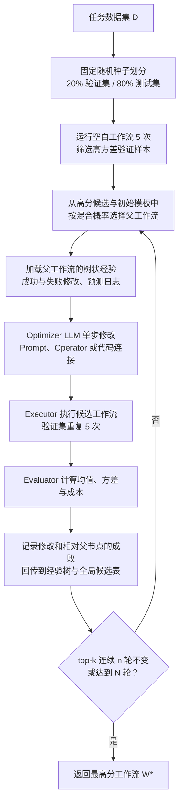
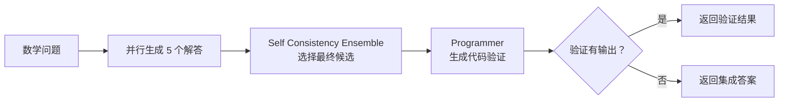

# AFlow：智能体工作流自动生成原理、搜索机制与工程启示

> 论文：**AFlow: Automating Agentic Workflow Generation**，ICLR 2025，arXiv:2410.10762（本文按 v4 分析）  
> 代码：[`FoundationAgents/AFlow`](https://github.com/FoundationAgents/AFlow)（MIT License）  
> 本文目的：解释 AFlow 的问题定义、工作流表示、MCTS 搜索过程、实验结论和工程边界，并提炼对 LiteCrab 一类工具型 Agent 的可移植思想。

## 1. AFlow 解决什么问题

许多 LLM 应用并不是只调用一次模型，而是按预先设计的流程多次调用，例如“生成多个候选 → 投票 → 检查 → 修正 → 格式化”。这类 **agentic workflow** 能提升推理、问答和代码生成效果，但通常依赖人工选择节点、Prompt、分支和循环。

已有自动优化方法分别优化 Prompt、超参数或工作流结构，但仍有两类不足：

1. **搜索空间受限**：固定 DAG 或固定模板难以表达条件分支、循环、并行和复杂数据流。
2. **搜索效率不足**：即使把工作流写成代码，线性积累历史方案也难以在有限迭代中复用成功经验、避开失败路径。

AFlow 的核心主张是：把完整工作流表示为代码，把工作流生成视为黑盒搜索问题，再用 LLM 负责提出修改、用实际执行得分提供反馈、用树结构保存修改经验，并以一种 MCTS 变体平衡探索与利用。

这里的自动化是 **离线搜索出一个面向某类任务的静态工作流**。论文中的工作流在处理单个样本时通常按照已生成代码执行；它不是运行时随环境自由规划的自主 Agent。

## 2. 工作流优化如何被形式化

### 2.1 Node：一次可配置的 LLM 调用

第 $i$ 个节点可表示为：

$$
N_i=N(M,\tau,P,F)
$$

| 参数 | 含义 | 论文搜索中的处理 |
|---|---|---|
| $M$ | 调用的模型 | 实验中固定 |
| $\tau$ | 温度 | 实验中固定 |
| $P$ | Prompt | 主要优化对象之一 |
| $F$ | 输出格式，如 XML、JSON、Markdown 或原始文本 | 实验中固定 |

论文先给出了包含模型、温度、Prompt 和输出格式的完整节点空间，但实际搜索时固定 $M$、$\tau$ 和 $F$，重点修改 Prompt 与节点之间的代码连接。这种收缩降低了搜索难度，也意味着论文并未同时完成模型选择、采样参数调优和结构搜索。

### 2.2 Edge：用代码表达控制流和数据流

边 $E$ 决定节点的执行顺序、依赖和输入输出传递。AFlow 选择代码作为主要表示，因为普通程序结构可以自然表达：

- 顺序执行；
- 条件分支；
- 循环与重试；
- 并发候选生成；
- 中间结果聚合；
- 工具执行与异常处理。

因此，AFlow 搜索的不是一张只有节点和连线的简单图，而是一个能够调用节点和算子的可执行程序。代码既承载控制流，也承载中间变量的数据流。

### 2.3 Operator：带有人类先验的复用构件

论文把常见的 Agent 模式封装成 Operator，供优化器直接组合：

| Operator | 典型作用 |
|---|---|
| Generate | 根据任务或上下文生成答案 |
| Format | 把答案转换为评分器或下游需要的格式 |
| Review and Revise | 审查已有答案并修订 |
| Ensemble | 对多个候选进行投票或选择 |
| Test | 执行测试，根据失败样例迭代修复 |
| Programmer | 生成并执行验证代码 |
| Custom | 构造不受预定义模式限制的普通节点 |

Operator 不是最终工作流模板，而是搜索空间中的“积木”。它提高发现有效结构的概率，但也注入了明显的人类先验。论文消融表明，即使只保留 Custom，AFlow 仍能自动发现类似 ensemble 的结构，但搜索效率和最终效果通常不如提供算子时稳定。

### 2.4 搜索目标

给定任务 $T$、评价函数 $G$ 和搜索算法 $A$，一般工作流优化写作：

$$
W=A(S,G,T),\qquad W^*=\arg\max_{W\in S}G(W,T)
$$

AFlow 的实际搜索空间为：

$$
S_{\text{AFlow}}=\{(P_1,\ldots,P_n,E,O_1,\ldots,O_n)\mid P_i\in\mathcal{P},E\in\mathcal{E},O_i\in\mathcal{O}\}
$$

它同时覆盖 Prompt、Operator 组合和代码控制流，评价函数则把一个完整工作流映射为可比较的数值分数。

## 3. AFlow 的整体搜索闭环

论文实验默认最多搜索 $N=20$ 轮，保留 top-$k$ 候选时 $k=3$，若 top-$k$ 连续 $n=5$ 轮不再变化则提前停止。每个新工作流在验证集上重复执行 5 次，以均值缓解 LLM 随机性带来的评价噪声。

## 4. MCTS 变体的四个关键步骤

### 4.1 选择：Soft Mixed Probability

AFlow 不总是选择当前最高分工作流，也不使用标准 UCT 公式，而是对 top-$k$ 候选采用均匀分布与基于得分的 softmax 分布的混合：

$$
P_{\text{mixed}}(i)=\lambda\frac{1}{n}+(1-\lambda)
\frac{\exp(\alpha(s_i-s_{\max}))}
{\sum_{j=1}^{n}\exp(\alpha(s_j-s_{\max}))}
$$

其中 $s_i$ 是候选工作流的分数，$s_{\max}$ 用于数值稳定，$\lambda$ 控制均匀探索比例，$\alpha$ 控制分数差异对选择概率的影响。

这一设计的作用是：

- 高分工作流获得更大概率，继续利用有效结构；
- 其他 top-$k$ 工作流仍可能被选中，保留多条改进路线；
- 初始空白模板也被纳入选择，使后期仍能从简单结构重新探索，降低局部最优风险。

论文正文与附录伪代码对 $\lambda$、$\alpha$ 的默认值存在对调：正文写 $\alpha=0.4,\lambda=0.2$，附录算法写 $\lambda=0.4,\alpha=0.2$。复现时应以实际代码配置为准，而不能只照抄公式旁的文字。

### 4.2 扩展：LLM 修改一个完整工作流

被选中的父工作流连同其历史经验一起送给 Optimizer LLM。经验包括：

- 父工作流的代码和 Prompt；
- 历次修改的自然语言说明；
- 修改相对父节点是成功还是失败；
- 预测结果与期望输出的详细日志；
- 可用 Operator 的接口说明。

Optimizer 每轮进行一次针对性修改，例如增加一个投票算子、加入验证步骤、改变候选数量、调整 Prompt 的推理要求或收紧最终答案格式。这里的“树搜索节点”代表一个 **完整工作流版本**，不要与工作流内部的一次 LLM 调用节点混淆。

### 4.3 执行与评价：以任务反馈替代主观猜测

候选工作流被真实执行，评价器根据任务计算分数：数学题使用 solve rate，代码题使用 pass@1，问答题使用 F1。AFlow 还跟踪 token 成本，用于比较性能与开销的 Pareto 前沿。

论文强调重复评价的意义：单次 LLM 输出噪声可能让一个较差修改偶然得高分，5 次重复能产生更可靠的均值和标准差。但它同时把搜索成本近似放大为“迭代轮数 × 验证样本数 × 重复次数 × 工作流内调用次数”。

### 4.4 经验回传：保存修改因果而不只保存分数

每轮会记录三类信息：候选工作流的性能、相对父工作流做了什么修改、该修改相对父节点是否成功。经验回传给父节点，并把分数加入全局候选记录，供后续选择使用。

与线性历史相比，树状经验保留了“从哪个版本做了什么修改后变好或变差”的局部上下文。Optimizer 因而可以沿成功路径继续细化，也能避免在同一父版本上重复已知失败的修改。

严格说，AFlow 借用了 MCTS 的选择、扩展、评价和回传框架，但每个搜索节点是完整程序，扩展动作由 LLM 提议，选择策略也不是标准 UCT。因此把它理解为 **面向代码工作流的 MCTS 风格黑盒优化器** 比“标准 MCTS 的直接实现”更准确。

## 5. 一个具体案例：GSM8K 工作流如何长出来

论文展示的最优 GSM8K 工作流大致形成了以下结构：

沿最优路径，AFlow 先加入 self-consistency ensemble，再加入 Programmer 验证，并继续优化最终格式和逐步核验 Prompt。论文也保留失败分支：例如某轮加入的 review 节点在缺少额外推理的情况下直接改写复杂答案，反而降低准确率。

这个案例揭示了 AFlow 真正搜索的三个层次：

1. **结构**：调用几次、先后顺序、是否投票、是否验证；
2. **参数化行为**：每个节点的 Prompt 和候选数量；
3. **接口契约**：最终答案格式能否被评价器稳定解析。

第三点很容易被低估。论文的优化轨迹中，仅收紧 `boxed` 数学答案或单一数值输出格式就能改变得分，说明评测提升可能同时来自推理质量和答案可解析性的改善。

## 6. AFlow 的主要创新

### 6.1 表示层：把工作流变成可执行代码

代码表示统一承载节点连接、变量传递、循环、分支和工具调用，搜索空间比固定 Prompt 或简单 DAG 更有表达力。代价是搜索对象不再是天然安全、天然有效的结构，必须增加语法、运行时和权限约束。

### 6.2 搜索层：用树状经验组织工作流演化

AFlow 不把所有过去方案平铺进一个越来越长的 Prompt，而是围绕父子版本保留局部修改历史。树结构让 LLM 更容易判断某项修改在特定工作流上下文中为何成功或失败。

### 6.3 反馈层：让真实执行结果驱动下一轮生成

Optimizer 不只阅读工作流文本，还读取评价分数、预测与标准答案差异。这把“设计 Agent 工作流”从一次性代码生成转为 generate-execute-measure-improve 的闭环。

### 6.4 先验层：Operator 缩小有效结构的发现距离

预定义 Operator 把 ensemble、review、test 等成熟模式作为可复用动作，使有限轮次内更容易出现有竞争力的候选。它没有消除人工经验，而是把人工经验从“手写完整工作流”降低为“设计受控构件和接口”。

## 7. 实验结果应该怎样解读

### 7.1 实验设置

论文使用六个推理基准：HotpotQA、DROP、HumanEval、MBPP、GSM8K 和 MATH level 5 子集，覆盖问答、代码和数学。数据按 1:4 划分验证集和测试集；HotpotQA、DROP 各抽取 1,000 个样本，MATH 选取四类 level 5 问题共 617 个。优化器使用 Claude 3.5 Sonnet，执行模型主要包括 GPT-4o-mini、DeepSeek-V2.5、GPT-4o 和 Claude 3.5 Sonnet。

### 7.2 主结果

在统一使用 GPT-4o-mini 执行、各方法测试 3 次取均值的比较中：

| 方法 | HotpotQA F1 | DROP F1 | HumanEval pass@1 | MBPP pass@1 | GSM8K Solve Rate | MATH Solve Rate | 平均 |
|---|---:|---:|---:|---:|---:|---:|---:|
| IO | 68.1 | 68.3 | 87.0 | 71.8 | 92.7 | 48.6 | 72.8 |
| CoT | 67.9 | 78.5 | 88.6 | 71.8 | 92.4 | 48.8 | 74.7 |
| CoT Self Consistency | 68.9 | 78.8 | 91.6 | 73.6 | 92.7 | 50.4 | 76.0 |
| MedPrompt | 68.3 | 78.0 | 91.6 | 73.6 | 90.0 | 50.0 | 75.3 |
| MultiPersona | 69.2 | 74.4 | 89.3 | 73.6 | 92.8 | 50.8 | 75.1 |
| Self Refine | 60.8 | 70.2 | 87.8 | 69.8 | 89.6 | 46.1 | 70.7 |
| ADAS | 64.5 | 76.6 | 82.4 | 53.4 | 90.8 | 35.4 | 67.2 |
| **AFlow** | **73.5** | **80.6** | **94.7** | **83.4** | **93.5** | **56.2** | **80.3** |

论文据此报告：AFlow 相比最佳人工设计基线平均提升 5.7%，相比自动工作流优化方法 ADAS 提升 19.5%。这里的“平均”混合了 F1、pass@1 和 solve rate 三种不同指标，适合做论文内的总体比较，不应被解释为单一业务指标上的稳定提升。

### 7.3 跨模型迁移并非完全模型无关

HumanEval 上，由 GPT-4o-mini 搜得的工作流在 GPT-4o-mini、GPT-4o 和 Claude 3.5 Sonnet 上分别达到 94.7、96.2 和 95.4；大多优于相同模型的简单基线。这说明工作流结构具有一定迁移性。

但由 DeepSeek-V2.5 搜得的工作流放到 GPT-4o-mini 上只有 90.8，低于 GPT-4o-mini 为自身搜索出的 94.7。论文因此明确指出：不同执行模型可能需要不同的最优工作流。工程上应把“工作流版本”和“目标模型版本”绑定评测，不能假设替换模型后性能不变。

### 7.4 成本结论只统计部署期推理成本

HumanEval 的明细中，DeepSeek-V2.5 执行由 GPT-4o-mini 搜出的 AFlow 工作流，得分 93.9%，成本 0.0291 美元；GPT-4o 直接调用得分 93.89%，成本 0.6371 美元，因此前者约为后者成本的 4.55%。另一些组合在 5.92% 或 8.05% 的成本下超过 GPT-4o IO。

这个结论证明了“较弱模型 + 更好工作流”可能位于更优的执行成本 Pareto 前沿，但表中成本是执行已选工作流通过划分后 HumanEval 测试集的费用。搜索阶段需要多轮、多次运行验证集，还要调用优化器模型，其一次性生成成本不能与部署期执行成本混为一谈。

### 7.5 消融和开放任务

GSM8K 消融中，不提供预定义 Operator 的 AFlow 仍达到 93.1%，并能自行形成类似 ensemble 的结构，说明代码表示和反馈搜索本身有效；提供 Operator 后，搜索曲线更快找到更高分工作流。

论文主体依赖可计算的数值评价。附录进一步用 GPT-4o 评分长篇小说生成和学术创意生成，并安排 3 名人工评价者复核，展示方法可以扩展到开放任务。不过此时评价器本身会引入模型偏好、标尺漂移和“迎合评审模型”的风险，证据强度也弱于六个客观基准的主实验。

## 8. 与其他自动优化方法的区别

| 方法类别 | 主要优化对象 | 表达能力 | 典型边界 |
|---|---|---|---|
| Prompt 优化 | 固定流程中的指令文本 | 低到中 | 不能改变调用拓扑 |
| 超参数优化 | 温度、模型、采样数等 | 低 | 依赖预定义工作流 |
| 图结构优化 | 节点和图连接 | 中到高 | 复杂循环、状态和条件需要额外语义 |
| ADAS 式代码搜索 | 完整代码工作流 | 高 | 线性历史和启发式搜索效率有限 |
| AFlow | Prompt、Operator 与代码控制流 | 高 | 依赖评价器、执行预算和安全沙箱 |

AFlow 的贡献不是第一次用代码表示 Agent，也不是第一次用 LLM 改写 Prompt，而是把 **代码工作流表示、Operator 先验、树状经验、真实执行反馈和混合概率选择** 组合成一套可重复迭代的搜索流程。

## 9. 局限与工程风险

| 风险 | 原因 | 工程含义 |
|---|---|---|
| 评价器依赖 | 搜索目标由 $G$ 决定 | 指标不完整时会优化代理目标，而非真实业务价值 |
| 验证集过拟合 | 20 轮反复查看同一批验证反馈 | 必须保留隔离测试集，并做跨时间、跨设备和异常场景评测 |
| 搜索成本高 | 每轮多次执行整个工作流 | 应设置预算、缓存、并行度、早停和成本约束 |
| 生成代码风险 | LLM 可修改控制流并触发执行 | 必须使用 AST/白名单校验、资源限额、进程隔离和最小权限 |
| 工作流膨胀 | 更多候选、验证和修订常能换取分数 | 目标函数应同时惩罚延迟、token、工具次数和失败率 |
| 模型耦合 | 为一个执行模型搜出的结构未必最适合另一个模型 | 升级模型后要重新回归，必要时重新搜索 |
| Operator 偏置 | 预定义构件限制优化器更容易探索到的区域 | Operator 应版本化，并保留 Custom 或从空白模板探索的通道 |
| 反馈噪声 | LLM 输出和 LLM Judge 都可能不稳定 | 使用重复评价、置信区间、硬规则与人工抽检 |
| 基准外推 | 主实验集中于可自动评分的推理任务 | 不能直接推出对长期运行、工具可靠性或工业控制的提升 |
| 复现细节不一致 | 正文与附录的 $\lambda/\alpha$ 值互换 | 配置、论文公式和代码必须交叉核对并固化到实验记录 |

官方仓库 README 还提示，部分 Operator 从 MetaGPT 迁移时可能存在缺陷。论文结果、开源实现和工程产品应被视为三个不同层次：前者证明方法潜力，仓库支持复现，生产系统仍需补齐安全、稳定性、审计和版本治理。

## 10. 对 LiteCrab 一类工具型 Agent 最值得移植的思想

最值得移植的不是完整 Python 框架，而是五个方法论：

1. **工作流即版本化程序**：把 Prompt、调用顺序、分支、重试和输出契约放进同一可追踪版本，而不是分散在多个隐式配置中。
2. **优化器与执行器分离**：高能力模型可以离线设计流程，板端或低成本模型只执行经过验证的固定版本。
3. **每次修改保持小步可归因**：一轮只改变一个结构或 Prompt 重点，才能判断分数变化来自哪里，并支持回滚。
4. **保留成功和失败经验**：不仅记录最佳版本，也记录父子关系、修改说明、失败样例和成本，避免重复踩坑。
5. **多目标评价替代单一准确率**：工业 Agent 至少同时考虑任务成功率、误操作率、延迟、token、工具调用次数、可恢复性和人工接管率。

适合 LiteCrab 的职责边界可以是：

板端不应直接运行任意 LLM 生成的代码，也不应在线自动发布新工作流。更稳妥的方式是：PC/CI 侧离线搜索，将结果编译或转换成 LiteCrab 可验证的状态机/DSL，经过权限审查、回归测试和签名后再部署。运行日志回流到下一轮离线优化，形成受控闭环。

## 11. 阅读论文时需要特别区分的概念

- **工作流内部节点**：一次 LLM 调用或一个 Operator；
- **搜索树节点**：一个完整的候选工作流版本；
- **执行反馈**：候选工作流在验证数据上的客观或模型评分；
- **经验回传**：把修改、得分和成败写回版本树，不是训练 LLM 参数；
- **自动生成**：从空白模板开始搜索，不等于零人工先验，Operator、评价器、数据集和安全边界仍由人设计；
- **成本优势**：主要指最终工作流的推理成本，不代表把离线搜索成本一并摊销后仍始终更便宜。

## 12. 资料来源

- [AFlow 论文 PDF v4](https://arxiv.org/pdf/2410.10762v4)
- [AFlow arXiv 页面](https://arxiv.org/abs/2410.10762)
- [AFlow ICLR 2025 OpenReview 页面](https://openreview.net/forum?id=z5uVAKwmjf)
- [AFlow 官方代码仓库](https://github.com/FoundationAgents/AFlow)

