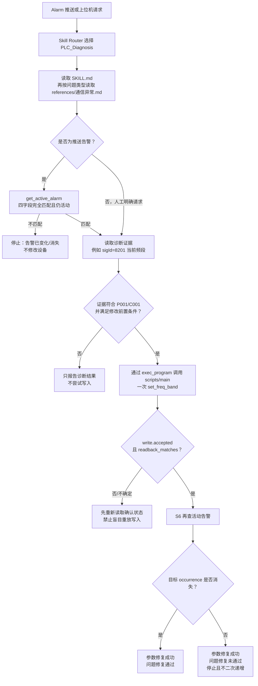
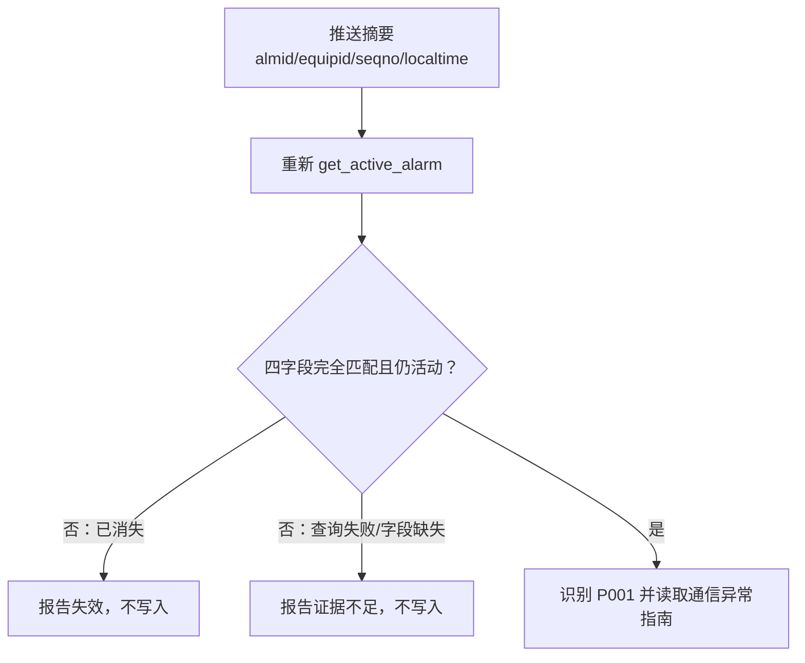
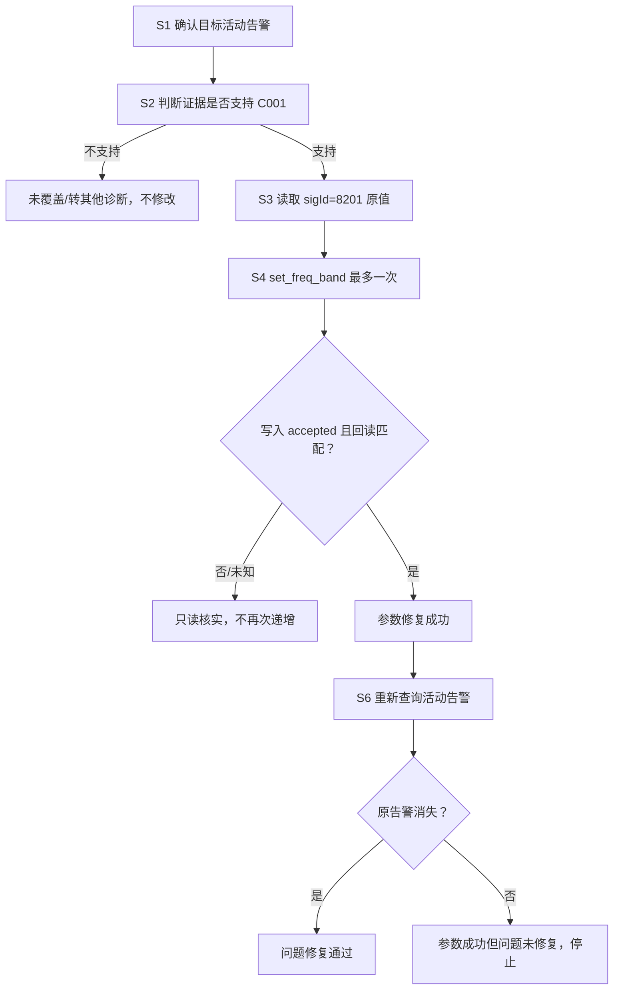
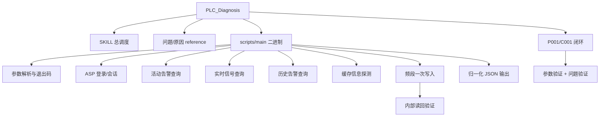
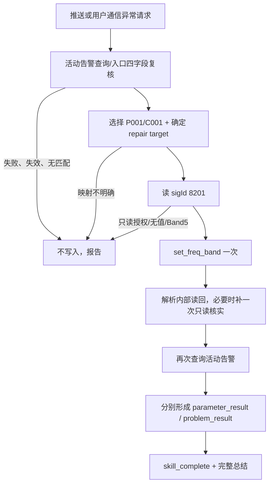
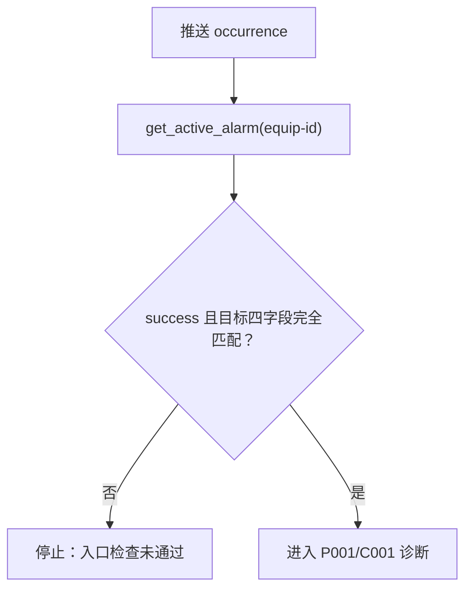
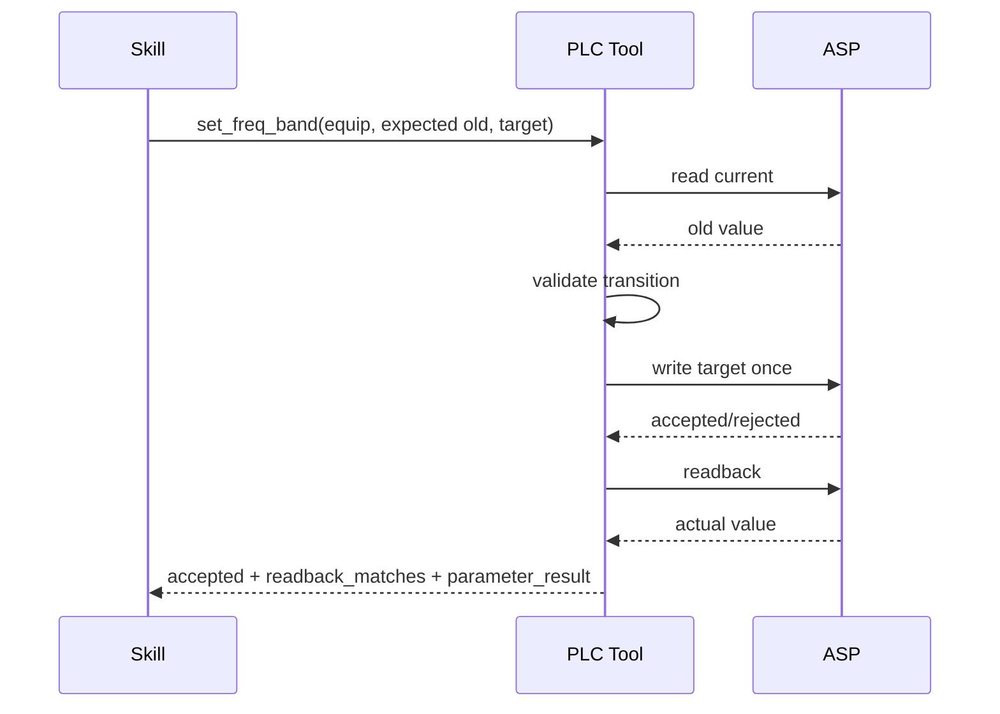

# PLC_Diagnosis 模块架构设计

## 1. 职责

PLC_Diagnosis 是板端 Skill 包，不是 Agent 内部 C Tool。Skill 负责问题分类和闭环规则；`scripts/main` 是唯一领域程序入口；`scripts/asp/*` 封装具体 ASP 请求。



## 2. 组件

| 组件 | 职责 |
|---|---|
| `SKILL.md` | 功能清单、问题路由、推送告警入口检查、统一总结 |
| `references/通信异常.md` | P001/C001 的证据、步骤、停止条件和双层验证 |
| `scripts/main` | 解析 `-o <operation>` 和参数，自动登录并调用 ASP 函数 |
| `scripts/main.c` | 领域程序源码 |
| `scripts/asp/*` | login、活动告警、监控信号、历史告警、频段设置等接口 |
| `scripts/tests/*` | 归一化、命令和设备接口测试 |

## 3. 当前操作

| operation | 作用 | 写操作 |
|---|---|---|
| `login` | 单独验证认证 | 否 |
| `get_cache_info` | 查询缓存/连通辅助信息 | 否 |
| `get_active_alarm` | 查询并归一化活动告警 | 否 |
| `get_monitor_info` | 查询设备信号，C001 使用 sigId=8201 | 否 |
| `get_history_alarm` | 查询历史告警辅助证据 | 否 |
| `set_freq_band` | 读当前 Band、计算或指定目标、写入并读回 | 是 |

统一调用方式：

```json
{"command":"main","path":"skills/PLC_Diagnosis/scripts","args":["-o","get_active_alarm","--equip-id","1"]}
```

必须使用 `exec_program`，参数逐项放入 `args`，不得让 LLM 拼接 shell 命令。认证通过最小子进程环境传入，不放在 Tool 参数和报告中。

## 4. 推送告警入口检查



推送摘要只是待核验证据，不能直接触发写操作，也不能用列表中的另一条告警替代目标告警。

## 5. P001/C001 闭环



参数修复和问题修复是两层独立结果。`write.accepted=true` 和 readback 成功不能代替活动告警复查。

## 6. 归一化结果

领域程序只输出一个 JSON 对象，公共字段为 `schema_version`、`operation`、`success`、`exit_code`、`transport`、`business`、`query`、`data`、`warnings`、`error`。完整字段契约保留在 [`plc_llm_tool_output_filtering.md`](plc_llm_tool_output_filtering.md)。

退出码：0 成功；1 参数错误；2 本地错误；3 网络错误；4 HTTP/业务响应错误；5 登录失败；6 频段或读回验证失败。

## 7. 当前限制

- 当前只实现 P001 通信异常下的 C001 网络频段不匹配分支。
- 命中通信异常不等于证据已确认 C001，不能因为只有一个分支就自动修改。
- “每次 Run 最多修改一次”不是全局幂等；不同告警仍可能依次修改同一 sigId。
- 没有持久 remediation key、跨重试 mutation ledger和自动回滚。
- `get_cache_info` schema 尚未冻结，只能作为辅助信息。
- 必须在 SD5091 上验证静态领域二进制在 64 MB/15 秒/256 KB限制内正常运行。

## 8. 关键文件

- `skills/PLC_Diagnosis/SKILL.md`
- `skills/PLC_Diagnosis/references/通信异常.md`
- `skills/PLC_Diagnosis/scripts/main.c`
- `skills/PLC_Diagnosis/scripts/asp/*`
- `src/runtime/builtin_tools.c`

## 9. 完整子功能结构



## 10. Skill Definition 子功能

`SKILL.md` 负责功能清单、问题路由、推送入口校验、统一输出和扩展约定；`references/通信异常.md` 只负责 P001/C001 的证据、设备映射、精确步骤、Band 映射、停止条件和结果矩阵。

| 子功能 | 责任 |
|---|---|
| 请求分类 | 判断只读查询、用户授权修复或推送告警 |
| 告警入口复核 | 使用四字段完全匹配推送 occurrence，失效/缺字段时不写 |
| 问题路由 | 当前只有 P001 通信异常 |
| 原因选择 | 当前只有 C001 频段不匹配，始终标记为待验证原因 |
| 修复授权 | 用户明确要求自动修复时最多写一次；只查询时不写 |
| 双层验证 | 参数读回与活动告警复查分别给出结果 |
| 完成 | 所有分支输出完整总结并调用 `skill_complete` |

## 11. PLC 二进制分层

```text
scripts/main.c
├── Options 解析与严格参数校验
├── login + 单进程 curl session
├── operation dispatch
├── set_freq_band 组合事务
└── 选择 normalized printer

scripts/asp/
├── http.c：GET/POST、Buffer、响应上限、可选原始保存
├── login.c：cookie + token
├── get_active_alarm.c
├── get_monitor_info.c
├── get_history_alarm.c
├── get_cache_info.c
├── set_freq_band.c
└── normalize.c：领域白名单和统一 JSON
```

Agent 只能通过 Runtime `exec_program` 启动 `scripts/main`。没有 `diagnose_communication` 这种聚合命令；问题识别由 LLM/Skill 完成，二进制只实现确定的 ASP operation 和频段写入组合。

## 12. 命令子功能和数据契约

| operation | 子功能 | 关键输入 | 关键输出 |
|---|---|---|---|
| `login` | 单独认证探测 | base URL + 环境凭据 | `data.authenticated` |
| `get_active_alarm` | 当前活动告警 | 可选 equip ID | `data.alarms[]`、returned count；白名单原因信息 |
| `get_monitor_info` | 设备信号组读取 | equip/equip type/para3/para4 | `devices[].signals[]`、missing/truncated、可选 displayValue |
| `get_history_alarm` | 分页历史查询 | device、时间、页、level、sort | 当前页 alarms、total/returned/truncated |
| `get_cache_info` | 未冻结 schema 的连通探测 | 通用参数 | 仅响应类型/字节数/`schema_known=false`，不泄露 raw cache |
| `set_freq_band` | 读→计划→写→读回组合 | equip/equip type、可选 value | `before/planned/write/after/verification` |

所有 operation 只向 stdout 输出一行 JSON。统一顶层字段为 `schema_version`、`operation`、`success`、`exit_code`、`transport`、`business`、`query`、`data`、`warnings`、`error`；写频段使用专门的 before/planned/write/after/verification 结构。HTTP 2xx 不等价于业务成功。

字段级白名单、截断和示例见 [`plc_llm_tool_output_filtering.md`](plc_llm_tool_output_filtering.md)。

## 13. 认证和网络子模块

- 默认 ASP 地址存在于二进制常量，但可用 `--base-url` 覆盖。
- 用户名和密码优先从 `LITECRAB_ALARM_USER/PASSWORD` 进入受限子进程环境，不应放进 Tool args 或最终报告。
- 每条 operation 在自己的短生命周期进程内自动登录并复用同一 curl handle/cookie/token。
- response Buffer 从 4096 B 增长，最大 1 MiB。
- 测试环境可以显式启用测试 TLS 行为；正式行为不应无条件关闭验证。
- `--output` 只保存最后一次 ASP 原始响应，不保存组合流程全部中间响应。

## 14. `set_freq_band` 内部事务

```mermaid
sequenceDiagram
    participant M as main
    participant G as get_monitor_info
    participant S as set_signal_info
    participant N as normalized output
    M->>G: read current sigId 8201
    G-->>M: before enum value
    M->>M: map value→Band; compute next Band
    alt invalid/missing/Band5
        M->>N: failed_stage=plan, no write
    else writable plan
        M->>S: exactly one write
        S-->>M: HTTP + business/device/signal result
        M->>G: exactly one readback even if write response unclear
        G-->>M: after value
        M->>M: compare after with planned
        M->>N: before/planned/write/after/verification
    end
```

Band 编号与接口值映射：1→1、2→3、3→23、4→7、5→13。默认策略按 Band 编号前进一步；Band5 不循环。写响应失败或不明确时只做读回，不再次写入。

## 15. P001/C001 端到端状态流



S4 已尝试写入后，无论参数成功、失败或未知都进入 S6 问题复查。S6 告警仍存在时不二次递增、不自动回滚：说明 C001 未解决本次问题，停止并报告，等待新原因分支或人工判断。

## 16. 设备映射和身份边界

- 推送 occurrence 使用 `almid + equipid + seqno + localtime` 完全匹配，不能用列表中其他同类告警替代。
- 测试环境告警上报设备和频段配置设备不是同一个 ID；当前示例 repair target 为 4099/33036。
- 用户指定其他站点时必须先获得映射，不能把 alarm equipid 直接拿去写频段。
- S6 判断同一问题范围是否仍存在，会结合 equipid/almid/reason/position/faultDesc；同类故障换 seqno 仍不能判定恢复。

## 17. 退出码和调用方动作

| exit code | 含义 | Skill 动作 |
|---:|---|---|
| 0 | 成功 | 继续按本步骤业务字段判断 |
| 1 | 参数错误 | 停止；修正调用而非盲重试 |
| 2 | 本地错误 | 报告环境/存储/内存问题 |
| 3 | 网络错误 | 只读操作允许重试一次；写操作不重发 |
| 4 | HTTP/业务响应错误 | 检查归一化 error；写后执行只读核实 |
| 5 | 登录失败 | 停止并报告认证问题 |
| 6 | 频段无效、无下一 Band 或读回不匹配 | 停止自动修改，报告参数验证失败 |

## 18. 尚缺子功能

- P001 除 C001 外的通信原因尚未实现。
- 没有按站点配置的告警设备→修复设备映射表。
- 没有 mutation ID、跨告警幂等 ledger 和自动补偿。
- 没有经真机验证的告警清除等待窗口；当前只即时复查一次。
- `get_cache_info` schema 未冻结，不能作修复成功证据。
- Skill completion summary 还没有由 Runtime 结构化校验。

## 19. 能力设计与示例

### 19.1 PLC-01：把自然语言告警映射成受控诊断流程

`PLC_Diagnosis` 的 Definition 描述适用告警、可用工具和完成规则。Router 选中后，Skill 正文指导 Agent 按 P001/C001 等既定流程执行，不允许模型自由拼接 ASP URL 或 shell 命令。

输入既可以是上位机文字，也可以是 Alarm Service 的结构化摘要。推送告警必须先通过身份复核；普通人工查询可以根据明确设备 ID 开始，但仍受工具参数契约约束。

### 19.2 PLC-02：告警入口身份复核

Skill 调用 `get_active_alarm --equip-id`，并用 `seqno + almid + equipid + localtime` 与推送消息完全匹配。匹配失败表示告警已经变化、消失或输入错误，此时停止修复，不允许因为 almid 相似继续写参数。



### 19.3 PLC-03：通过固定命令接口读取诊断证据

PLC 二进制提供命令级 API，例如活动告警查询、监控信号读取和当前频段读取。每个命令输出统一 JSON envelope，至少包含 success、exit_code、data/error 和必要 verification。脚本层只保留模型需要的字段，避免大段 ASP 数据直接进入上下文。

示例：读取 `sigId=8201` 得到原值 `3/Band2`。该值既是诊断证据，也是后续受控写入的前置条件。

### 19.4 PLC-04：把一次参数修改实现成可验证事务

`set_freq_band` 不是“发送请求就成功”。它执行：读取旧值 → 校验合法迁移 → 发送一次写请求 → 检查 accepted → 重新读取 → 比较预期值 → 形成 parameter_result。



只有 accepted 且 readback_matches 才是“参数修复成功”。网络中断发生在写请求之后时，结果可能不确定；调用方必须 readback，不能直接重发写请求。

### 19.5 PLC-05：区分参数验证和问题验证

参数验证回答“目标参数是否已经写成预期值”；问题验证回答“原告警是否消失”。两者是独立结果：参数可以成功但告警仍存在，这通常说明初始原因假设不充分，而不是自动授权继续递增。

以当前轨迹为例：Band2 → Band3 写入和回读成功，但 `seqno=4/almid=1154/reason=964` 仍活动。正确结论是“参数修复成功、问题修复未通过，停止且不二次递增”。

### 19.6 PLC-06：限制重复副作用

同一诊断 Run 内只允许一次频段推进。告警仍存在、修复原因不匹配或结果不确定时，Skill 输出证据和停止原因。已成功修改的参数当前不会由 Step 4 自动回滚，因为旧值是否安全、是否影响其他业务需要领域策略；回滚只能由明确补偿流程执行。

跨进程重启和重复告警的持久幂等 ledger 尚未完成，所以当前部署仍需要把这一点列为风险，而不能仅依赖提示词保证永不重复修改。

### 19.7 PLC-07：统一退出码和调用方动作

| 结果类别 | 例子 | Skill 动作 |
|---|---|---|
| 成功 | 查询成功；写入且回读匹配 | 保存证据，进入下一验证步骤 |
| 参数/协议错误 | equip id 非法、响应缺字段 | 停止并报告，不重试写入 |
| 暂态网络错误 | 连接超时、认证临时失效 | 只对安全的读取重试；写入不确定先 readback |
| 写入被拒绝 | accepted=false | 停止，保留原参数 |
| 参数成功但告警仍在 | root cause 未解决 | 停止二次修改，输出双层结论 |

## 20. 能力状态

| 能力 | 状态 | 当前边界 |
|---|---|---|
| 告警身份复核和只读诊断 | 已实现 | 依赖 ASP 字段稳定性 |
| 受限 PLC 二进制和统一 JSON 输出 | 已实现 | 仍需 5091 真实环境验证 |
| 一次写入、accepted、readback 双检 | 已实现 | 非分布式事务 |
| 参数结果与问题结果分离 | 已实现 | 根因知识仍由 Skill 规则表达 |
| 跨告警幂等 ledger 和自动补偿 | 未实现 | 当前关键生产风险 |

## 21. 测试对应关系

- `skills/PLC_Diagnosis/scripts/tests/test_normalized_output.py`：每个 operation、白名单、截断、枚举、频段写入与读回。
- `tests/test_alarm_e2e.py`：告警推送入口、Skill 路由和闭环。
- `tests/test_agent_matrix.py`：只读/修复/失败分支和总结。
- 真机仍需验证登录字段、ASP schema、设备映射、写入业务码和告警状态更新时间。
