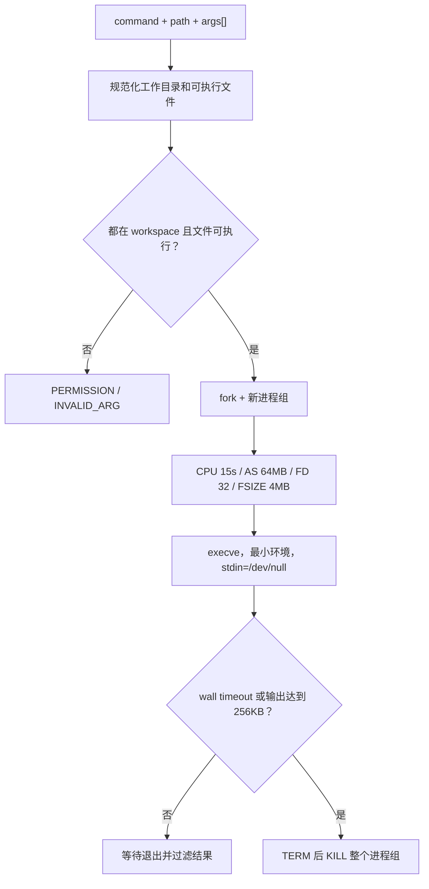
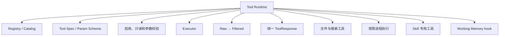
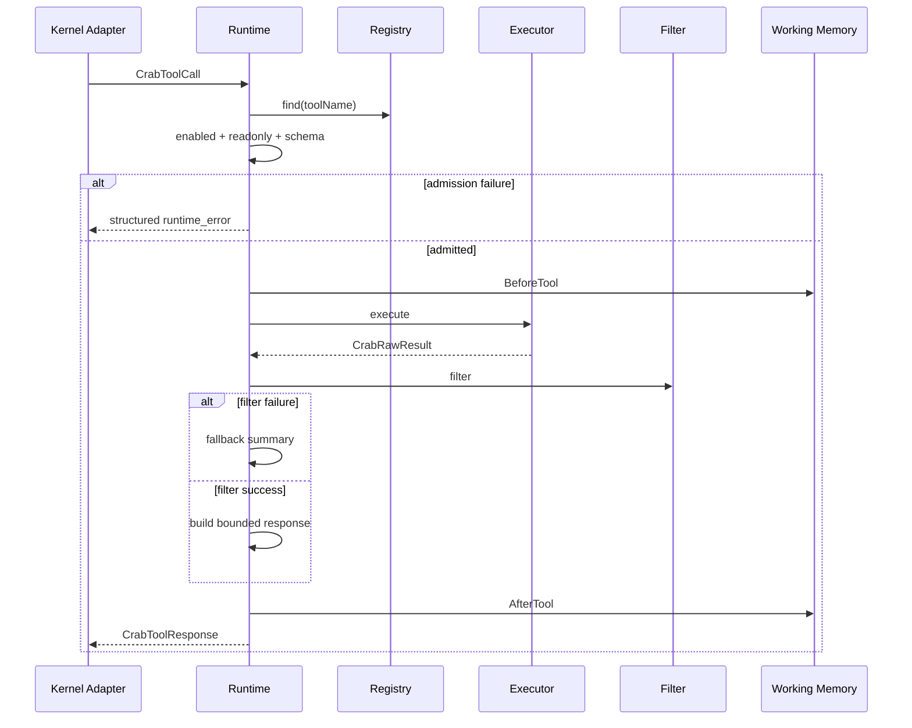
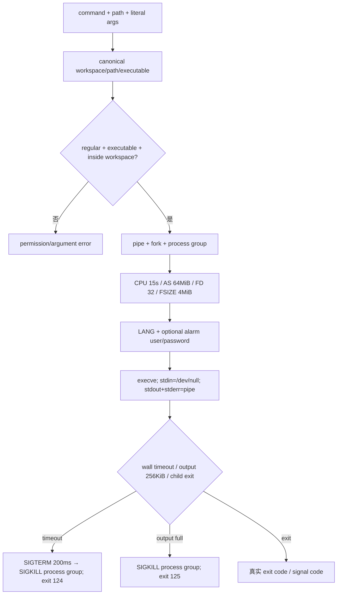
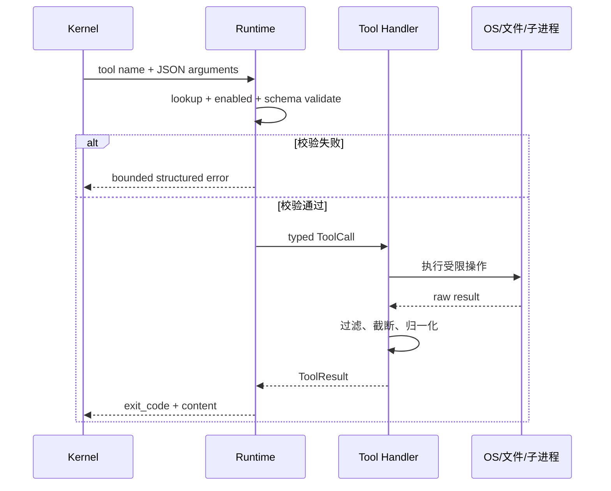
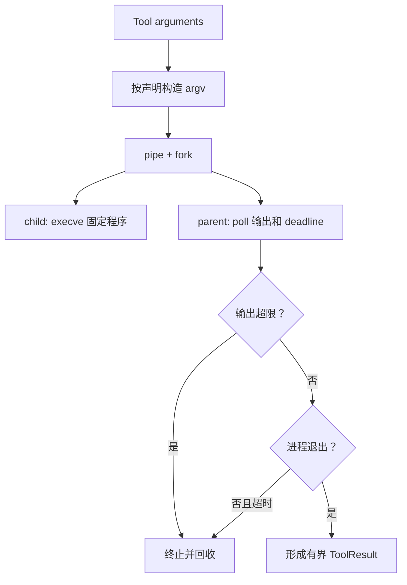

# Tool Runtime 模块架构设计

## 1. 职责

Runtime 是 Tool 的唯一执行入口，管理 Tool 注册表、schema、参数类型、启用状态、执行函数、结果过滤和统一错误响应。

```mermaid
flowchart TD
    MODEL["LLM 返回 Tool proposal<br/>名称和参数都不可信"] --> ADAPTER["Tool Adapter<br/>JSON → CrabToolCall"]
    ADAPTER --> FIND{"Registry 中存在？"}
    FIND -->|否| E1["TOOL_NOT_FOUND<br/>绝不执行"]
    FIND -->|是| ENABLE{"当前 enabled？"}
    ENABLE -->|否| E2["TOOL_DISABLED<br/>即使模型伪造也拒绝"]
    ENABLE -->|是| VALID{"参数满足 schema？<br/>必填、类型、范围、enum、未知字段"]
    VALID -->|否| E3["VALIDATION_ERROR<br/>没有外部副作用"]
    VALID -->|是| EXEC["唯一 Handler<br/>文件工具或受限 exec_program"]
    EXEC --> RAW["RawResult<br/>stdout / stderr / exit code"]
    RAW --> FILTER["领域过滤 + 长度限制<br/>只保留 LLM 决策需要的信息"]
    FILTER --> RESP["CrabToolResponse<br/>结构化成功或失败"]
    E1 --> RESP
    E2 --> RESP
    E3 --> RESP
```

## 2. 子功能和实现

| 子功能 | 实现方式 |
|---|---|
| Registry | 最多注册 32 个 `CrabToolSpec`，拒绝重名和无效 spec |
| Schema | 支持 string、int、bool、string array；参数最多 16 个 |
| 数组边界 | 最多 32 项、每项 1024 bytes、总计 8192 bytes |
| 启用检查 | 禁用 Tool 在参数校验和执行前返回 `CRAB_ERROR_TOOL_DISABLED` |
| 参数校验 | 必填、默认值、整数范围、enum、未知参数统一校验 |
| Raw/Filtered 分层 | 执行器产生 stdout/stderr；filter 形成给 LLM 的 summary/content/warnings |
| 统一错误 | Runtime、Tool exit、filter failure 分开记录，不把失败伪装成成功 |
| workspace 边界 | 文件和程序路径经规范化后必须位于 workspace 内 |

## 3. 当前内置 Tools

| 类别 | Tool | 实现 |
|---|---|---|
| 文件 | `read`、`write`、`edit`、`ls`、`pwd` | workspace 内受控读写和列表 |
| 搜索 | `grep`、`glob` | 10,000 项、30 秒、深度 128；grep 扫描最多 8 MB |
| 执行 | `exec_program` | 不经 shell，执行 workspace 内真实二进制并施加资源限制 |
| 兼容执行 | `shell` | 通过 `sh -c`，当前仍是待整改高风险路径 |
| 数据 | `csv_cell` | 有界读取 CSV 单元格 |
| Skill | `skill_read`、`skill_complete` | 受 Router/Session 边界控制的 Skill 生命周期 Tool |

## 4. `exec_program` 执行流



Tool 输出在执行器中最多 256 KB，但 Runtime 响应 content 最大 64 KB，Kernel 实际回送给下一轮 LLM 的单 Tool 输出再限制为 16 KB。

## 5. 安全边界

- `exec_program` 不搜索系统 PATH，不接受绝对命令路径，不执行 shell 语法。
- 子进程只继承 `LANG` 和必要的告警用户名/密码环境变量。
- 文件 Tool 不能逃出 workspace；Skill 指令路径不能被普通 read/grep 旁路读取。
- `readonlyMode`、permission、risk 和 concurrency 已有数据结构，但完整 Policy/审批引擎尚未落地。

## 6. 当前限制

- `shell` 仍可执行任意 shell 语法，没有 `exec_program` 的 rlimit、wall timeout 和进程组清理；正式版应禁用或统一执行器。
- `exec_program` 仍在多线程主进程中直接 fork，不是独立 Helper。
- 没有可靠的子进程数量限制；错误使用共享 UID 的小 `RLIMIT_NPROC` 会影响板上其他服务。
- Tool 的风险等级和权限目前主要是元数据，尚无 Principal/Policy 强制决策。

## 7. 关键文件

- `include/litecrab/runtime.h`
- `src/runtime/runtime.c`
- `src/runtime/builtin_tools.c`
- `src/kernel/kernel.c`

## 8. 完整子功能结构



| 子模块 | 结构/入口 | 功能 |
|---|---|---|
| Runtime 生命周期 | `CrabRuntimeInit/Start/Stop/Destroy` | 固化 workspace、raw 路径和输出上限；维护 started 状态 |
| Registry | `CrabToolRegistry` | 最多 32 个 spec；拒绝缺 name/description/execute/filter、重复名称和非法 enabled 值 |
| Catalog | `CrabToolCatalogView` | 向 Kernel/LLM Adapter 暴露稳定只读视图 |
| Schema | `CrabToolSpec`、`CrabToolParamSpec` | 描述类型、required/default、整数范围、enum、权限、并发和风险元数据 |
| Call 模型 | `CrabToolCall` | callId、toolName、最多 16 个 typed args |
| Admission | `CrabRuntimeCallTool` | 存在性→enabled→readonly→参数校验 |
| Executor | `CrabToolExecuteFn` | 产生 exit code、stdout/stderr、duration/truncated/rawRef |
| Filter | `CrabToolFilterFn` | 把 RawResult 转为有界摘要和正文；失败时降级 fallback |
| Response | `CrabBuildToolResponse` | 统一输出 tool/success/exit_code/summary/content/warnings/truncated/raw_ref |
| Memory hooks | `WorkingMemoryBeforeTool/AfterTool` | 记录当前命令和最近工具历史；`skill_read` 成功后缓存正文 |

## 9. 类型和容量模型

```text
CrabToolSpec
├── identity: name + description
├── enablement: enabledByDefault + readonly
├── policy metadata: permissions + concurrency + riskLevel
├── params[...]
├── execute()
└── filter()

CrabToolCall
├── callId[64]
├── toolName[64]
└── args[16]
    ├── string / int / bool / string[]
    └── string[] ≤32 项、单项 ≤1024 B、合计 ≤8192 B

CrabToolResponse
├── runtimeError / toolExitCode / filterError
├── summary ≤4096 B
├── content ≤65536 B
├── warnings ≤8 条
├── truncated
└── rawRef
```

`permissions`、`concurrency` 和 `riskLevel` 当前主要是声明性 metadata。Runtime 已真正执行 enabled、readonly、schema 和部分 workspace 边界，但尚无通用 Policy Engine、并发锁管理器或用户审批器。

## 10. Tool 调用管线



错误分三层，文档和调用方不能混为一个字段：

| 层 | 字段 | 示例 |
|---|---|---|
| Runtime admission | `runtimeError` | tool 不存在、disabled、参数错、只读模式拒绝 |
| Tool process/business | `toolExitCode` | 文件系统 errno、子进程退出码、PLC 退出码 |
| Filter | `filterError` | 过滤器失败，返回 fallback 且标记 truncated |

## 11. 内置工具完整清单

| Tool | 子功能 | 默认启用 | 主要边界 |
|---|---|---:|---|
| `read` | 带行号读取文本片段 | 是 | workspace 内；最多 1 MiB；Skill 指令路径禁止旁路 |
| `csv_read` | 按行和列号/表头读取单元格 | 是 | 文件最大 1 MiB；处理引号与转义 |
| `write` | create/overwrite/append | 是 | workspace 路径；可选创建父目录；readonly mode 禁止 |
| `edit` | 精确字符串替换 | 是 | 文件 ≤1 MiB；实际 occurrence 数必须等于期望值 |
| `grep` | 递归子串检索 | 是 | 最大 10000 entry、30 秒、扫描 8 MiB；跳过构建目录和 Skill 指令 |
| `glob` | 递归文件名匹配 | 是 | 共用遍历预算；可包含目录 |
| `ls` | 单目录排序列举 | 是 | workspace 内；hidden 和条数显式控制 |
| `pwd` | 返回 canonical workspace | 是 | 只读 |
| `exec_program` | 不经 shell 执行 workspace 二进制 | 是 | 进程组、rlimit、wall timeout、输出上限、最小环境 |
| `shell` | `sh -c` 任意命令 | 否 | 当前不具备同等级边界，属于 P0 禁用项 |
| `skill_read` | 读取被 Router 授权的 SKILL/reference | 是但仅 Skill route 暴露 | route grant、openat/no-follow、hash |
| `skill_complete` | 请求完成 Active Skill | 是但仅 Skill route 暴露 | 只检查 active；业务证据未结构化验证 |

## 12. Workspace 路径子模块

`normalize_path` 以 canonical workspace 为根，解析已有父目录并检查前缀边界；新建嵌套路径在父目录尚不存在时执行词法 `..` 拒绝，再拼接 trusted base。读、写、编辑、搜索、列目录和进程执行都通过该入口。

当前边界：

- 已有父目录的 symlink escape 会被 `realpath` 前缀检查拦截。
- Skill 的 `SKILL.md` 和 `references/` 被普通 read/grep 屏蔽，必须走 `skill_read`。
- 路径检查不是 openat-based 通用文件 capability；检查后到打开间仍存在 TOCTOU 风险。
- 写入和编辑没有原子临时文件替换；进程异常时可能留下部分文件。

## 13. `exec_program` 子模块



安全特点是参数逐项传入 `argv`，不会发生 shell 元字符解释；子进程关闭除标准流外的继承 FD，只获得 `LANG` 及可选的两个告警凭据环境变量。尚未实现 seccomp、namespace、chroot、网络 egress 或 executable allowlist。

## 14. 文件和搜索算法细节

- `edit` 先完整读取、计算 occurrence，再一次性生成替换结果；数量不匹配时不写入。
- `grep` 只处理无 NUL 的 UTF-8 文本行；单行缓冲 4096 B，非法 UTF-8 行不匹配。
- `walk` 先 visit 当前层，再递归目录，最大深度 128；跳过 `.git`、`build*`、`dist`、`node_modules`。
- `glob` 同时对相对路径和 basename 使用 `fnmatch`。
- `ls` 仅一层并按字节序排序，输出 `dir/file/other`。
- `csv_read` 是轻量解析器，不是完整 RFC CSV 数据库；面向单元格读取。

## 15. 能力设计与示例

### 15.1 RT-01：注册强类型 Tool，并生成模型可见 schema

Tool 注册项同时包含名称、说明、参数定义、启用状态和处理函数。Kernel 渲染给模型的 schema 只能来自注册表，避免提示词声明与真正执行器不一致。禁用 Tool 不应出现在模型可见列表中；即使模型伪造名称，执行入口仍会再次拒绝。

示例：`read` 声明必填字符串 `path`。模型传入 `{"path":123}` 时，Runtime 在文件访问前返回参数类型错误；不会把数字格式化为路径继续执行。

### 15.2 RT-02：统一执行管线和结果契约



`ToolResult` 的内容必须是有界、可释放、适合再次放入 LLM 上下文的结果。原始网页、文件或进程输出不能无上限回填。

### 15.3 RT-03：把 Workspace 文件访问限制在规范化根目录内

文件工具先把相对路径解析到 Runtime 的 canonical workspace root，再检查路径是否逃逸。`..`、绝对路径、符号链接绕过和超长路径都必须在打开目标前被拒绝。

正常示例：workspace 为 `/opt/litecrab`，`read` 输入 `config/base_config.example.json`，解析结果仍位于根内。失败示例：输入 `../../etc/shadow`，规范化后越界，Runtime 返回拒绝而不访问文件。

### 15.4 RT-04：受限执行已登记的外部程序

`exec_program` 不接收 shell 命令字符串，而是使用注册时固定的程序路径和参数规则构造 `argv`，通过 fork/exec 执行。父进程负责 stdout/stderr 捕获、输出上限、timeout、TERM/KILL 和 waitpid 回收。



该能力适合 PLC 二进制；它不等同于当前通用 `shell`。`shell` 仍可解释任意命令字符串，是正式部署前需要关闭或整改的旁路。

### 15.5 RT-05：对不同工具实施领域输出过滤

通用工具执行字节截断；PLC 工具在脚本/二进制层还会只保留 LLM 决策需要的字段。例如设置频段只向模型提供 accepted、readback 和 verification，而不是整段 ASP 原始响应。这降低 token 和敏感数据暴露，但原始证据仍应通过受控 Trace/日志保留。

## 16. 能力状态

| 能力 | 状态 | 当前边界 |
|---|---|---|
| 注册表、schema、启用状态双层检查 | 已实现 | schema 类型集合较轻量 |
| Workspace 文件限制 | 已实现 | 仍需持续做符号链接攻击测试 |
| `exec_program` timeout/输出/回收 | 已实现 | 非完整 OS sandbox |
| PLC 领域结果过滤 | 已实现 | 字段契约需随脚本版本维护 |
| 任意 `shell` 安全隔离 | 未实现 | 正式部署前的 P0 风险 |

## 17. 测试对应关系

- `tests/test_main.c`：Registry、schema、所有 builtin、路径逃逸、Skill 旁路、output/filter 和 exec_program 资源边界。
- `tests/test_security.c`：disabled tool、readonly、workspace、symlink 和敏感路径。
- `tests/test_long_running_stress.py`：大输出、超时、进程树回收和资源压力。
- `skills/PLC_Diagnosis/scripts/tests/test_normalized_output.py`：受限程序执行后的领域 JSON 契约。
