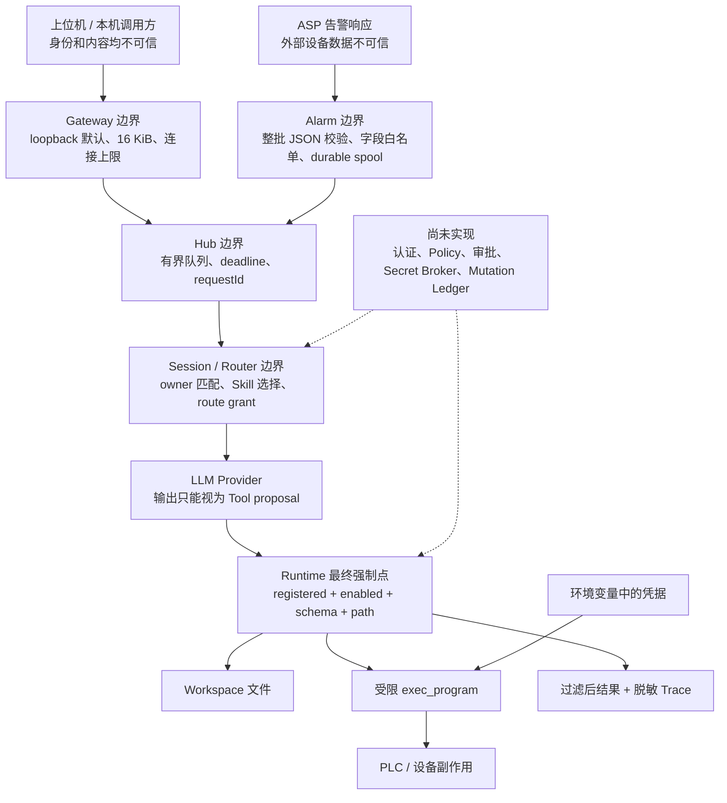
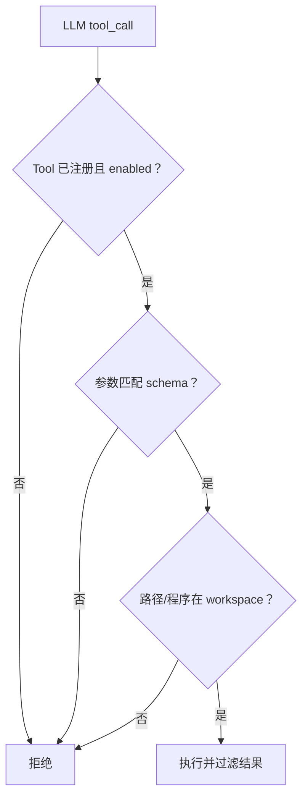
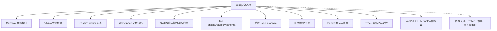
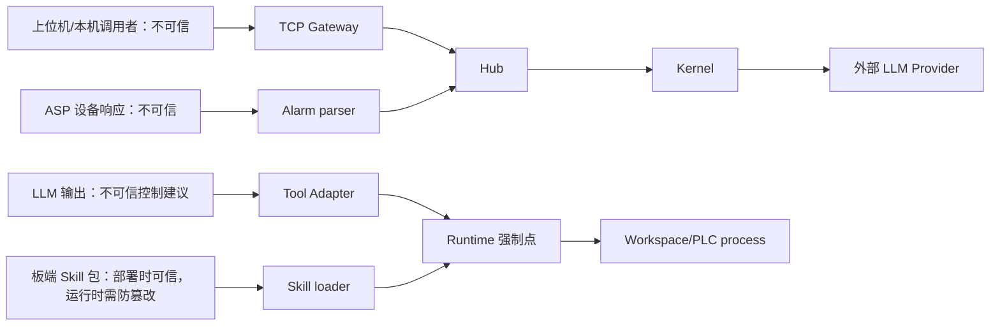
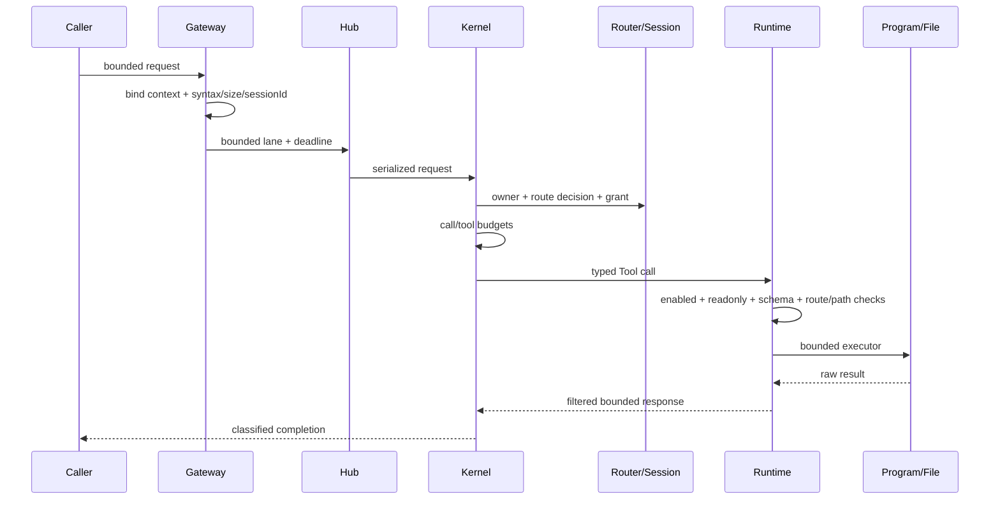
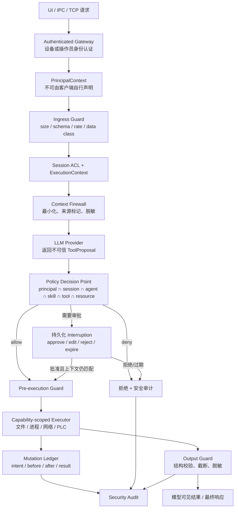
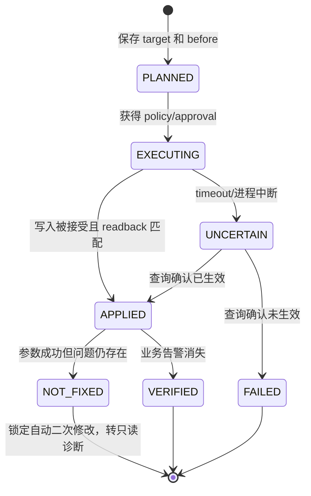
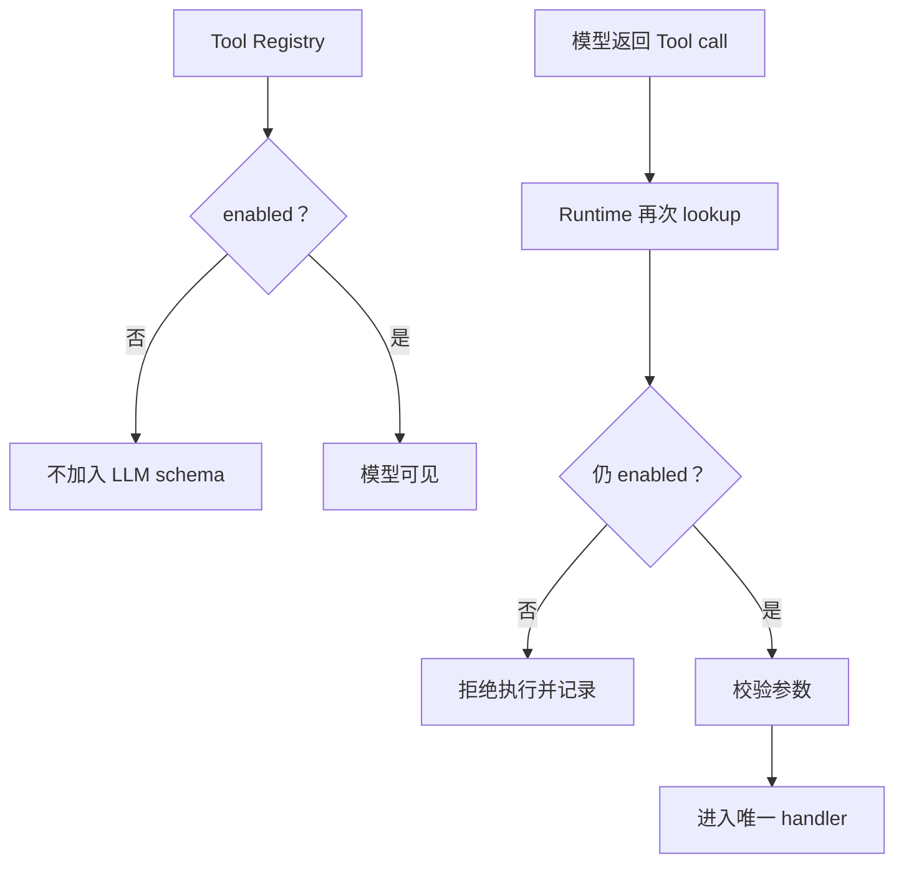

# Security 模块架构设计与风险边界

## 1. 当前信任边界

下面这张图先区分“不可信输入”“当前已落地强制点”和“真正会产生副作用的资源”。请求不能从输入或模型直接到达设备，必须穿过 C Runtime 的确定性检查。



用户输入、告警字段、LLM 输出、Skill 内容和 Tool 输出都不能天然视为可信。当前真正的强制点主要在 Gateway、Tool schema、workspace 路径和受限 `exec_program`。

## 2. 已落地控制

| 层 | 控制 |
|---|---|
| Gateway | 默认 loopback；非 loopback 需显式风险开关；16 KB输入；连接和超时上限 |
| Hub | 有界队列、Registry、deadline、取消和迟到响应释放 |
| Session | Session ID 校验、首次 user 绑定、临时会话不落盘 |
| Skill | Router 唯一选择；BASE 不暴露 Skill Tools；canonical Skill 路径 |
| Runtime | Tool enabled 检查、参数 schema、workspace 路径限制、结构化错误 |
| `exec_program` | 无 shell、真实 workspace 可执行文件、最小环境、rlimit、wall timeout、进程组回收 |
| LLM | 2 MB响应、32 KB header、调用次数、deadline、不完整 SSE 拒绝 |
| Observability | LLM messages 默认不落 Trace；文件轮转；异常优先 flush |
| Alarm | 原始 ASP body 不持久化；spool 0600；先持久化再投递 |

## 3. Tool 强制执行流



## 4. 当前 P0 风险

### 4.1 TCP 无认证

`allow_unauthenticated_remote=true` 只是允许绑定远程地址，不会验证客户端身份。`userId` 可伪造。正式部署应保持 loopback，由板内独立管理进程代理，或增加双向认证和来源控制。

### 4.2 `shell` 绕过受限执行器

`shell` 使用 `sh -c`，没有 `exec_program` 的 CPU/内存/FD/FSIZE、wall timeout和进程组回收。正式版本应禁用它，或使其完全复用受限 Helper；仅在 Prompt 中要求“不使用”不构成安全边界。

### 4.3 明文密钥

当前本地 LLM 配置存在明文凭据风险。必须轮换已暴露密钥、从仓库移除真实值、检查 Git 历史，并使用 `apiKeyEnv` 或板端 Secret Broker。

### 4.4 有副作用 Skill 不幂等

Alarm 是 at-least-once，Skill 外部写操作没有持久 mutation ledger。超时、崩溃或不同告警可能造成重复修改。必须用 `Skill + 设备 + 参数 + 动作/故障周期` 建立 remediation key，保存 intent、before、after、readback 和最终状态。

## 5. 尚未实现

- Principal/ExecutionContext 和可信身份传播。
- Policy Engine、审批、风险 Profile 和唯一副作用授权点。
- Secret Broker 和 Tool 网络出口控制。
- Skill 包签名、版本锁定和供应链校验。
- 文件/Trace 加密、完整字段脱敏和防篡改审计。
- 独立进程 Helper、cgroup/seccomp 等更强沙箱。
- health/metrics 和安全事件对外管理接口。

## 6. 上线门槛

1. 删除或安全封闭 `shell`。
2. 轮换并移除仓库明文密钥。
3. 确定上位机认证/代理方案，不能裸开未认证 TCP。
4. 为 PLC 写操作实现持久幂等和失败锁定。
5. 在 5091 验证路径穿越、超大输入、慢连接、输出洪泛、fork 子进程和断电恢复。

## 7. 关键文件

- `src/gateway/tcp_line.c`
- `src/hub/hub.c`
- `src/kernel/skill.c`
- `src/runtime/runtime.c`
- `src/runtime/builtin_tools.c`
- `src/observability/observability.c`

## 8. 安全子功能全景



## 9. 已实现控制及强制点

| 控制 | 强制代码点 | 能阻止什么 | 不能阻止什么 |
|---|---|---|---|
| loopback 默认绑定 | Config + `RequestServerValidateBindPolicy` | 配置遗漏导致直接远程暴露 | 同机恶意进程；显式开启远程后的未认证访问 |
| 远程风险开关 | `allow_unauthenticated_remote` | 非 loopback 意外启动 | 不是认证或加密 |
| 行协议/请求上限 | Gateway recv + Config validation | 无限请求体和部分连接耗尽 | 慢速请求仍占一个 worker 到 timeout |
| 固定连接/线程池 | Gateway `ServerState` | 无界线程创建 | 业务层队列满载和合法流量 DoS |
| Session owner | `AgentSessionStateBindUser` | 同一 sessionId 被不同声明 user 读取 | userId 本身没有认证，攻击者可冒用首次 owner |
| Session checksum/atomic write | Session Store | 部分写入和明显损坏被当作有效状态 | 不提供加密或真实性 MAC |
| workspace path | Runtime `normalize_path` | 常规绝对/相对逃逸和已有 symlink 父目录逃逸 | TOCTOU、同 workspace 内越权 |
| Skill 指令保护 | 普通 read/grep + `skill_read` | 绕过 Router 直接读 SKILL/reference | scripts/resources 未做完整 package capability |
| route grant | Session + Handler + Runtime | 模型加载未选 Skill | Skill 激活后的普通 Tool 权限未隔离 |
| Tool enabled | `CrabRuntimeCallTool` | 默认禁用 shell 被模型调用 | 内部代码显式改 spec 后可启用 |
| readonly mode | Runtime admission | 所有 spec 标记非 readonly 的 Tool | 元数据错误或只读 Tool 内部副作用 |
| exec_program | canonical path + execve + rlimit + process group | shell 注入、workspace 外 executable、部分资源滥用 | 子程序网络访问、系统调用、同权限文件访问 |
| LLM TLS | `llm.c` | 证书/主机不匹配的 HTTPS | HTTP 配置仍允许明文传输 |
| ASP TLS | libcurl verify | 默认验证设备 HTTPS | `--alarm-insecure-tls` 可显式关闭 |
| Trace input opt-in | Observability | 默认不落完整 system/history/tool exchanges | user input、Tool input/output 仍可能敏感 |
| 预算 | Gateway/Hub/Kernel/Runtime/Session/Alarm | 多类无界内存、调用和存储增长 | 没有按身份/租户速率限制 |

## 10. 信任边界与数据流



主要保护对象是 PLC/设备参数、板端文件、API/ASP 凭据、Session/Skill 状态、日志和服务可用性。用户文本、ASP body、LLM tool call、Tool stdout 以及未认证 TCP identity 都必须按不可信输入处理。

## 11. 子功能执行顺序



安全检查必须位于执行链的强制点，而不是只写在 Prompt。当前已把 Skill 选择、disabled shell、typed args 和 workspace executable 放到 C Runtime；设备写入授权、修复幂等和细粒度 capability 仍主要依赖 Skill 指令，尚未完成下沉。

## 12. Secret 子模块现状

- LLM key 可直接来自配置字段、固定环境变量或 provider 的 `apiKeyEnv` 间接引用。
- PLC 子进程只继承 `LANG` 和两个告警凭据变量，不继承整个父环境。
- Alarm client/service destroy 会清空复制的 password；LLM 全局 key 缓冲当前没有显式清零。
- Tool 参数和 Trace 不应出现密码，但系统没有通用 secret scanner/redactor。
- 仓库工作副本中的本地 `config/llm_config.json` 可能含明文凭据；不得提交或复制到文档、日志。
- 正式版本没有 Secret Broker、短期 token broker、硬件密钥或密文配置。

## 13. 资源防护矩阵

| 层 | 当前上限 |
|---|---|
| Gateway | 8 worker/64 connection 硬上限；默认 4/16；请求 16 KiB |
| Hub | control 4、alarm 8、normal 8；sync registry 32 |
| Kernel | 16 iteration；normal 16 tool/8 LLM；high 24 tool/12 LLM |
| LLM | header 32 KiB；wire 2 MiB；text 64 KiB；每轮 8 tool calls |
| Runtime | Registry 32；args 16；response 64 KiB；数组 32 项/8 KiB |
| exec_program | CPU 15 s、AS 64 MiB、FD 32、file 4 MiB、output 256 KiB、wall 120 s max |
| Session | cache 32、history 24 KiB/32 messages、disk 128 files/32 MiB/7 d |
| Alarm | delivery 64、seen 1024、4 attempts、180 s deadline |
| Logs | 2 MiB × 4 generations；Trace 约当前+3 old files |

## 14. P0 风险的具体触发方式

### 14.1 未认证 TCP

如果显式绑定非 loopback，任何能连到端口的人都可以声明任意 `userId/sessionId` 并请求 Tool/Skill。当前警告日志不是防护。真机在引入可信上位机认证或本地 IPC 身份前，应保持 loopback，并由受信进程代理。

### 14.2 任意 shell

`shell` 默认 disabled，但实现仍存在且没有 timeout、rlimit、最小环境或 workspace executable 约束。不得在正式配置中开启；需要外部程序时使用 `exec_program`。

### 14.3 有副作用修复不幂等

Alarm pending delivery 是 at-least-once；不同 occurrence 也可能命中相同 repair target。PLC Skill 当前只在单次 Run 内限制写一次，没有跨 Run mutation ledger。进程在“设备写成功、HANDLED barrier 前”崩溃仍可能重放写操作。

### 14.4 明文和源 Trace

API key/ASP 密码可能驻留配置或进程内存；Trace 会记录 user 和 Tool 数据。启用完整 LLM input 会显著扩大敏感面。部署时必须限制目录权限和日志读取者。

## 15. 目标安全子模块（尚未实现）

旧版安全架构设计中的方向仍然有效，但必须明确标记为目标，而不是当前能力。完整目标链如下：



目标设计中每个关键决策都有唯一 Owner：Gateway 认证 principal，ExecutionContext 传播身份，Policy Engine 决定 allow/deny/approval，Executor 强制资源边界，Mutation Ledger 负责副作用幂等，Audit 只记录证据而不充当状态库。

| 目标模块 | 需要解决的问题 |
|---|---|
| Authenticated Gateway/IPC | 把 OS/上位机可信身份映射为 principal，禁止客户端自声明身份 |
| ExecutionContext | 在 Session、Run、Tool 全链携带 principal/policy snapshot |
| Policy Engine | 按 principal、Skill、Tool、资源、风险给出 allow/deny/approval |
| Capability File API | openat 根 FD、no-follow、原子写、细粒度路径授权 |
| Approval Store | 高风险写入的持久审批、过期、消费和恢复 |
| Mutation Ledger | operation key、目标、before/planned/after、状态和幂等结果 |
| Restricted Network | Tool/子进程 egress allowlist、DNS/IP 重绑定防护 |
| Secret Broker | Tool 只获得短期引用，不把长期凭据放进 Prompt/args |
| Guardrails | input/tool output/final output 的结构化校验与脱敏 |
| Supply Chain | Skill manifest、完整 package hash、签名和版本 pinning |

### 15.1 Authenticated Gateway 与 PrincipalContext

认证层的输入是连接级证据，而不是请求正文中的 `userId`。Unix Domain Socket 可使用 peer credential；上位机通道可使用设备证书或短期 token。认证成功后生成只读 `PrincipalContext`，后续 Session 和 Tool 调用只能引用它。

```c
typedef struct {
    char principalId[64];
    char tenantId[64];
    char authMethod[24];
    unsigned int authStrength;
} CrabPrincipal;
```

失败示例：请求正文声明 `userId=admin`，但连接证书映射为 `station-reader`。系统必须以连接认证结果为准，拒绝正文提升权限，并记录 `auth.claim_mismatch`。

### 15.2 ExecutionContext 与 Session ACL

ExecutionContext 在 request、run、skill 和 tool call 之间传递同一 principal、session、run、toolCall 和 policy revision，禁止各层重新从字符串推测身份。

```c
typedef struct {
    CrabPrincipal principal;
    char sessionId[64];
    char runId[64];
    char toolCallId[64];
    char capabilitySource[96];
    unsigned long long policyRevision;
} CrabSecurityContext;
```

Session ACL 在 acquire 时检查 principal 是否拥有该 Session；Tool 执行前再次检查 context 是否仍绑定同一 Run，防止旧审批或旧 route grant 被另一个请求复用。

### 15.3 Policy Engine

Policy Engine 接收 SecurityContext、Tool spec、资源规范化标识、参数摘要、风险等级和当前安全 profile，返回 `ALLOW`、`DENY` 或 `REQUIRE_APPROVAL`。有效能力取多层交集：设备策略 ∩ principal ∩ session/run grant ∩ agent profile ∩ Skill 请求 ∩ Tool 所需能力 ∩ 环境支持。

```text
policy_decide(context, proposal):
    resource = normalize_resource(proposal)
    capabilities = intersect_all_grants(context, proposal.tool, resource)
    if required capability 不在 capabilities: DENY
    if 参数、预算、版本或环境不匹配: DENY
    if risk >= approval threshold: REQUIRE_APPROVAL
    return ALLOW
```

Policy 结果必须由 C Runtime 计算，LLM 只能提出 proposal，不能在 prompt 中自行声明“已经得到授权”。

### 15.4 Approval Store

审批记录绑定 `interruptId + sessionId + runId + toolCallId + argsHash + policyRevision + expiry`。批准、编辑、拒绝都是 append-only 决策事件；恢复时重新计算参数摘要和当前 policy，任一不匹配都不能消费旧批准。

示例：操作员批准把 Band2 调到 Band3。如果模型随后把参数改成 Band4，`argsHash` 改变，原批准失效，必须重新请求审批。

### 15.5 Capability Executor

文件能力使用预打开 workspace root FD、`openat`、`O_NOFOLLOW` 和原子替换；进程能力使用登记 program id、固定 argv 模板、最小环境、rlimit 和 deadline；网络能力使用 host/port allowlist，并在解析后检查实际 IP。Executor 不接受“任意字符串命令”作为通用能力。

### 15.6 Mutation Ledger

每个有副作用操作在执行前写 intent，在执行后写 result。键至少包含业务操作类型、设备、目标参数和原因，例如 `P001:C001:equip-1:freq-band`，而不能只使用告警 occurrence key。



该状态机直接解决“告警不同但修改目标相同”导致重复递增的问题。Alarm spool 继续负责消息可靠交付，Mutation Ledger 独立负责设备修改幂等，两者不能合并成同一个 key。

### 15.7 Secret Broker、Output Guard 与 Audit

Secret Broker 向 Tool 提供短期 handle 或按调用注入，不把真实 secret 放进 prompt、Tool arguments 和普通 Trace。Output Guard 对 Tool 输出和最终文本做 schema、大小、敏感字段和数据分类检查。Audit 只保存脱敏后的决策证据，包括谁、在什么 policy revision 下、对哪个资源、为何允许或拒绝。

### 15.8 Skill 供应链

目标 manifest 应记录 Skill 名称、版本、入口、完整包 hash、请求 capability 和最低安全级别。启动或热更新时先校验 manifest、路径和 hash，再建立不可变 Registry snapshot；运行中的 Run 固定使用原 snapshot，避免执行过程中 Definition 被替换。

## 16. 能力设计与示例

### 16.1 SEC-01：控制网络暴露范围

默认只允许 loopback 监听。配置非 loopback 地址时必须显式开启 `allow_unauthenticated_remote`，并在 Config 和 Gateway 两处校验。双重校验防止某个调用方绕过 Config 直接调用 Gateway API。

这只是风险确认，不是认证。开启该选项后，远端仍可伪造 `userId` 和 `sessionId`；生产远程访问需要外部可信通道或后续认证协议。

### 16.2 SEC-02：让 Tool 启用状态成为强制执行边界



只在提示词里隐藏 Tool 不够，因为模型或恶意 Provider 可以伪造调用。Runtime 的第二次检查是最终强制点。

### 16.3 SEC-03：限制文件、进程和输出资源

文件访问使用 canonical workspace root；受限程序执行使用固定 executable、argv、timeout、输出上限和 waitpid 回收；Gateway、Hub、Session、日志和 spool 都有容量上限。这些控制降低路径逃逸、fork 风暴和磁盘耗尽风险。

当前通用 `shell` 仍是例外：它没有完全进入受限 `exec_program` 模型。因此正式部署应禁用它，或先完成等价的命令 allowlist 与资源隔离。

### 16.4 SEC-04：最小化 Trace 和 Secret 暴露

默认 Trace 使用 redacted 模式，日志与 Trace 文件采用私有权限；LLM key 推荐通过 `apiKeyEnv` 注入。当前 Alarm 用户名和密码仍可来自 CLI/环境变量，进程参数、环境和内存仍有暴露面，Secret Broker 尚未实现。

### 16.5 SEC-05：防止 Skill 和模型绕过执行路径

Skill 正文是策略说明，不具有系统权限。模型提出的所有动作必须经过 Router/Route Grant、Runtime lookup、enabled、schema 和具体 handler。Skill 包内脚本不能因为位于 `skills/` 就自动可信；PLC 脚本只通过预定工具链调用。

### 16.6 典型威胁和当前处理

| 威胁输入 | 已有控制 | 仍存风险 |
|---|---|---|
| 远端伪造 TCP 请求 | 默认 loopback、显式远程风险开关 | 没有认证/TLS |
| Prompt injection 要求读取系统文件 | workspace 规范化、Tool schema | `shell` 可能绕过 |
| 模型伪造禁用 Tool | Runtime 二次 enabled 检查 | 缺少通用 Policy Engine |
| 超大 Tool/LLM 输出 | 大小上限与截断 | 整块响应仍有峰值内存 |
| 重复告警要求再次写参数 | Skill 一次修改规则 | 缺持久幂等 ledger |
| 配置或 Trace 泄密 | env key、redaction、私有权限 | 明文配置兼容路径仍存在 |

### 16.7 生产上线判定

“有安全控制”不等于“达到生产安全”。当前至少需要在部署配置中禁用 `shell`、保持 loopback 或提供可信代理、移除明文密钥、限制 full Trace，并完成 5091 上的权限和压力验证。认证、Policy Engine、审批、Secret Broker 和副作用 ledger 仍标记为未实现。

## 17. 能力状态

| 能力 | 状态 | 当前边界 |
|---|---|---|
| loopback 默认和双层绑定校验 | 已实现 | 不是身份认证 |
| Tool enabled/schema 强制 | 已实现 | 不是完整 capability policy |
| workspace 与受限程序执行 | 部分实现 | `shell` 仍可绕过 |
| Trace 最小化和文件权限 | 已实现 | full 模式需要运维约束 |
| 认证、审批、Policy、Secret Broker | 未实现 | 正式架构缺口 |

## 18. 上线检查和测试对应关系

- `tests/test_security.c`：Tool enablement、readonly、路径、Skill 旁路、Trace 默认值和 bind policy。
- `tests/test_security_e2e.py`：真实网络入口和配置组合。
- `tests/test_long_running_stress.py`：资源边界和 DoS 型压力。
- `tests/test_alarm.c`：可靠投递与副作用重放窗口。
- `tests/test_deployment_contract.py`：单二进制、外置配置/Skill 和安装边界。

在当前能力下，安全结论是：适合 loopback、受控板端进程和受控 Skill 的集成测试；未经认证的远程访问、默认启用 shell、包含生产密钥的配置提交、以及无人值守重复写 PLC 均不能视为生产可接受状态。

- `tests/test_security.c`
- `tests/test_security_e2e.py`
