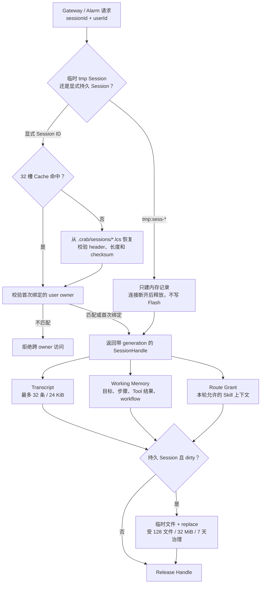
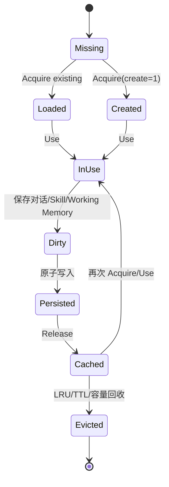
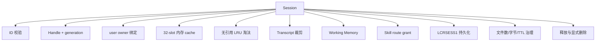
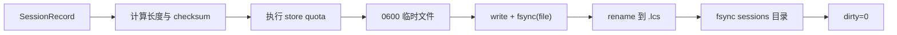
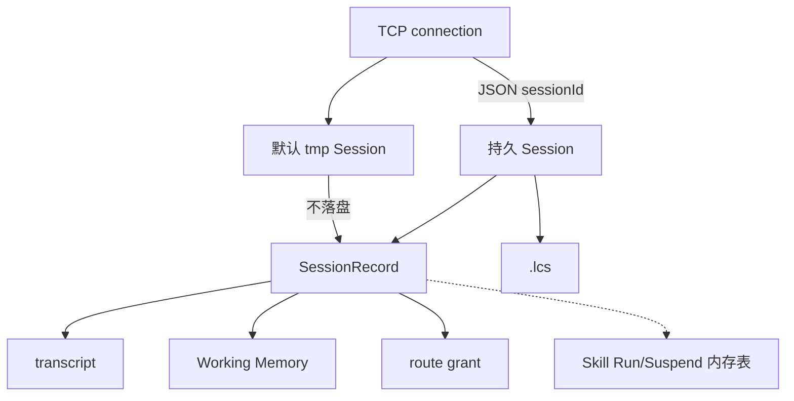
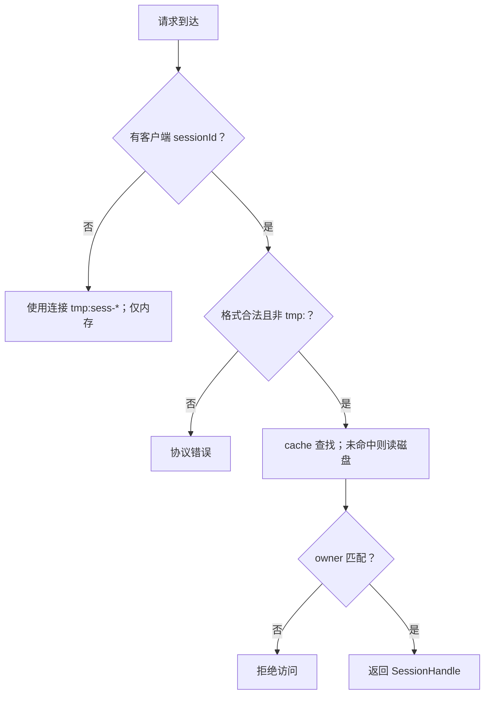

# Session 与 Working Memory 模块架构设计

## 1. 职责

Session 保存用户归属、对话历史、当前 Skill 路由和 Working Memory。它把短连接与可恢复会话分开，并通过内存 cache 和有界文件存储控制长期资源。



## 2. 标识和生命周期

| 类型 | 来源 | 是否持久化 | 用途 |
|---|---|---|---|
| `tmp:sess-*` | Gateway 为 TCP 连接生成 | 否 | 单连接临时上下文，断开后释放 |
| 显式 `sessionId` | 客户端 JSON 提供 | 是 | 跨连接恢复对话和 Skill 状态 |
| `SessionHandle` | Session Manager 返回 | 内存句柄 | slot + generation 防止淘汰后旧指针误用 |



## 3. 子功能和实现

| 子功能 | 实现方式 |
|---|---|
| ID 校验 | 限制长度和字符；客户端不能使用 `tmp:` 保留前缀 |
| 用户隔离 | 首次请求绑定 `userId`；不同用户再次使用返回错误 |
| 内存 cache | 32 个 `SessionRecord`；引用中的记录不能淘汰 |
| 对话裁剪 | 最多保留 32 条消息且总 JSON 不超过 24 KB |
| 持久格式 | `LCRSESS1` header + session/user/messages/WorkingMemory/Skill route + checksum |
| 原子提交 | 写临时文件、文件 `fsync`、`rename`、目录 `fsync` |
| 启动清理 | 删除 `.tmp.*`、过期文件和超配额旧文件 |
| 配额 | 128 文件、32 MB、7 天 TTL，按 mtime LRU 回收未引用项 |
| 临时会话保护 | `tmp:sess-*` 标记 clean，不写 Flash |

## 4. Working Memory 子功能

- 当前 task 和 goal。
- Workflow active/status、当前 step、script/steps 路径。
- 最多 16 个选项。
- 最近 8 个 Tool 输入/输出/exit code。
- 最多缓存 4 个已读取 Skill，每个正文有固定大小。
- 在下一轮 Prompt 中追加有界摘要，避免依赖完整历史推断当前状态。

## 5. 请求执行流

1. Agent 按 `sessionId` Acquire 并 Use。
2. 校验或首次绑定 `userId`。
3. 加载对话、Working Memory 和已允许 Skill。
4. Router 和 Agent Loop 执行期间更新状态。
5. 对话裁剪后保存；持久 Session 原子落盘，临时 Session跳过落盘。
6. Release 引用；连接关闭时临时 Session 可被释放。

## 6. 当前限制

- 当前单 Agent 线程仍使用全局 current Session 兼容 facade；多 Run 并发前必须改成显式传递 `SessionHandle`。
- Skill suspend queue 和所有 Run 状态没有完全统一进 Session 文件事务。
- 被引用 Session 不能淘汰，极端情况下新 Session 会返回容量不足。
- 存储没有加密、版本迁移工具、损坏隔离目录或跨进程锁。
- Session、spool、Trace 尚未共享统一总磁盘配额。

## 7. 关键文件

- `include/litecrab/session.h`
- `src/session/session.c`
- `include/litecrab/working_memory.h`
- `src/kernel/working_memory.c`

## 8. 完整子功能结构



## 9. SessionRecord 子结构

```text
SessionRecord（内存）
├── 生命周期：inUse / dirty / generation / references / accessSequence
├── 版本：revision / createdTimeMs / updatedTimeMs
├── identity：session / user
├── messages[24 KiB]
├── WorkingMemory
└── route grant
    ├── routeEnforced
    ├── routeAllowsSkill
    └── routedSkill[128]

SessionHandle（调用方持有）
├── slot
├── generation
└── sessionId
```

generation 用于防止槽位被淘汰并复用后，旧 handle 错误访问新 Session。`resolve_handle` 同时检查 slot、generation 和 sessionId。

## 10. 子功能实现矩阵

| 子功能 | 入口 | 实现方式 | 失败/边界 |
|---|---|---|---|
| ID 校验 | `AgentSessionIdValidate` | 长度 <64；只允许字母、数字、`-_.:` | Gateway 额外禁止客户端自选 `tmp:` |
| Store 初始化 | `AgentSessionStoreConfigure` | 创建 `<workspace>/.crab/sessions`，0700 | workspace 不可写则 Agent 初始化失败 |
| 获取 | `Acquire` | 命中 cache；否则选空槽/LRU 无引用槽，再从磁盘加载或创建 | 32 槽全部被引用时返回容量错误 |
| 选中 | `Use` | 将 handle 放入 thread-local `currentHandle` | 无效 generation 拒绝 |
| 引用释放 | `Release` | dirty 时先持久化，再 references--，清 thread-local | 持久化失败当前 API 不把错误返回给调用者 |
| 用户绑定 | `BindUser` | 第一次写 owner；后续必须完全一致 | 不同 user 返回 -2，不清除已有内容 |
| 消息保存 | `Save` | 校验 JSON array；保留最后 32 条并确保 <24 KiB；增加 revision | 单条/尾部仍过大时继续丢最旧消息，全部不适配则 `[]` |
| Working Memory | `AgentSessionStateWorkingMemory` | 直接返回当前 record 内嵌对象 | 由 Kernel 单线程使用，不是独立并发 store |
| route grant | `SetSkillRoute/SkillAllowed` | 每轮 Router 覆盖；持久化在 Session 文件 | 没有 enforced 状态时兼容性放行 |
| 显式关闭 | `CloseById` | 取消 Skill 状态、释放 cache、删除 `.lcs` | 这是删除 Session，不是普通 TCP 断连 |
| TCP 断连释放 | `ReleaseById` | 获取/释放引用，不删除持久文件 | 持久 Session 可在下次连接恢复 |

## 11. 持久化格式

文件路径为 `<workspace>/.crab/sessions/<sessionId>.lcs`，magic 为 `LCRSESS1`。

```text
SessionDiskHeader
├── magic/version/headerSize
├── revision/createdTimeMs/updatedTimeMs
├── sessionLen/userLen/messagesLen/memoryLen/routedSkillLen
├── routeEnforced/routeAllowsSkill
└── payloadChecksum (FNV-1a)

payload
├── session bytes
├── user bytes
├── messages JSON bytes
├── raw WorkingMemory struct
└── routedSkill bytes
```



加载时校验文件尺寸、magic、version、headerSize、每段长度、checksum、文件内 sessionId 和 messages JSON。损坏文件不会部分恢复。

## 12. Cache 与磁盘治理

| 资源 | 上限/规则 |
|---|---|
| 内存 cache | 32 个 Session |
| 可淘汰条件 | `references == 0` |
| 淘汰顺序 | `accessSequence` 最小，即 LRU |
| 磁盘文件 | 最多 128 个 |
| 磁盘总量 | 最多 32 MiB |
| TTL | 7 天未修改 |
| 临时文件 | 扫描时删除 `.tmp.` 文件 |
| 保护 | 当前被引用的 Session 不因 TTL/配额删除 |

写入前先计算替换后的 projected count/bytes，再按 mtime 从旧到新清理；仍无法满足配额时拒绝持久化。

## 13. Working Memory 子结构

```text
WorkingMemory
├── task / goal / currentCommand
├── WorkflowState
│   ├── active + status
│   ├── skillPath / scriptPath / stepsPath
│   ├── currentStepId / currentStepDescription
│   ├── options[16]
│   └── toolHistory[8]
└── cached skills[4]
    ├── path[256]
    └── content[8192]
```

每次请求 `WorkingMemoryBeginRequest` 更新 task；tool 前后更新 currentCommand 和最近记录；`skill_read` 缓存正文；`WorkingMemoryAppendPrompt` 把有界摘要附加到 system prompt。Working Memory 会随 `SessionRecord` 落盘，但它不是完整 Skill Run Store。

## 14. Session、Skill 和连接的真实关系



当前需要特别区分：

- transcript、Working Memory 和 route grant 已持久化；
- Active Skill、Run Store、Suspend Queue 没有写入 `.lcs`，进程重启后不能恢复正在执行/挂起的 Skill；
- `tmp:` Session 不落盘，连接断开后仅释放引用，后续通常不会再被定位；
- 同一个持久 Session 同时被多个连接引用在数据结构上允许，但 Agent 单线程串行处理请求。

## 15. 能力设计与示例

### 15.1 SES-01：按 Session ID 隔离对话和工作状态

Session Manager 以 `sessionId` 为主键管理 `SessionRecord`。每条记录包含 owner、transcript、Working Memory、路由授权和 revision。Kernel 必须先取得明确 SessionHandle，再读写该记录，不能依赖一个全局“当前会话”。

示例：`station-A` 正在执行 PLC Skill，`station-B` 询问普通问题。两者的 transcript、active workflow 和 route grant 必须分别保存，B 不能继承 A 的 Skill 上下文或工具权限。

### 15.2 SES-02：区分连接级临时会话和跨连接持久会话

`tmp:sess-*` 由 Gateway 创建，只在连接生命周期内使用，不写 Flash；普通 Session ID 可在连接断开后保留，并在下一次请求时从磁盘恢复。这个区别避免临时探测连接制造大量小文件。



### 15.3 SES-03：有界保存 transcript

追加消息时先检查单条长度和总容量，再维护最多允许的消息数量。持久化使用 `LCRSESS1` 格式和临时文件替换，避免把半写文件当成有效 Session。恢复时必须校验 header、长度、计数和字段边界。

当容量不足时，当前实现返回错误或按既定边界处理，不应静默覆盖影响正在执行的状态。长期方案可引入摘要和 artifact，但当前没有通用长期记忆系统。

### 15.4 SES-04：保存 Working Memory，而不把它等同于权威 Run

Working Memory 记录目标、计划、步骤、证据、工具状态、恢复引用和 workflow phase。它用于重新构造模型上下文和解释执行过程。Skill 的 Active/Run/Suspend 结构仍主要在内存，因此服务重启后不能仅凭 Working Memory 判断某个副作用是否可以安全重放。

失败示例：文件显示上次步骤为“已写入频段”，但没有持久 remediation ledger 和幂等结果。重启后不得把该文本直接当作“可以再次写入”的授权；应先重新读取设备状态并由 Skill 的安全规则决定停止或继续。

### 15.5 SES-05：有界 Cache 和安全淘汰

Cache 满时只淘汰未被引用、未处于活动执行的 LRU Session。脏的持久 Session 必须先成功 checkpoint；写入失败则不能假装已经释放责任。被 Kernel 持有的 SessionHandle 通过引用计数阻止淘汰。

### 15.6 SES-06：用 revision 和 route grant 约束更新

revision 用于表达同一 Session 的状态版本；route grant 绑定本次路由决策和可见能力。它们防止无关请求直接复用旧 Skill 上下文。当前单 Agent 降低了并发冲突，但这些字段仍是后续多 Run 和 CAS 的基础。

## 16. 能力状态

| 能力 | 状态 | 当前边界 |
|---|---|---|
| Session 隔离、owner 绑定和 Handle | 已实现 | owner 身份来源尚未认证 |
| 临时/持久 Session 区分 | 已实现 | 后端仅本地文件 |
| transcript + Working Memory 持久化 | 已实现 | 无长期检索记忆 |
| 有界 cache 和 LRU | 已实现 | 固定容量、无跨进程共享 |
| Skill Run/Suspend 崩溃恢复 | 未实现 | 不能由 Working Memory 替代 |

## 17. 测试对应关系

- `tests/test_main.c`：ID、handle generation、owner、cache、裁剪、Working Memory 和 route grant。
- `tests/test_session_restart.py`：进程重启后的 transcript/owner/Working Memory 恢复、损坏文件和配额。
- `tests/test_tcp_e2e.py`：连接级 Session 与显式持久 Session。
- `tests/test_ui_session_transport.py`：上位机/UI 如何稳定传递 sessionId，而不是把浏览器历史误当 Agent history。

- `tests/test_session_restart.py`
