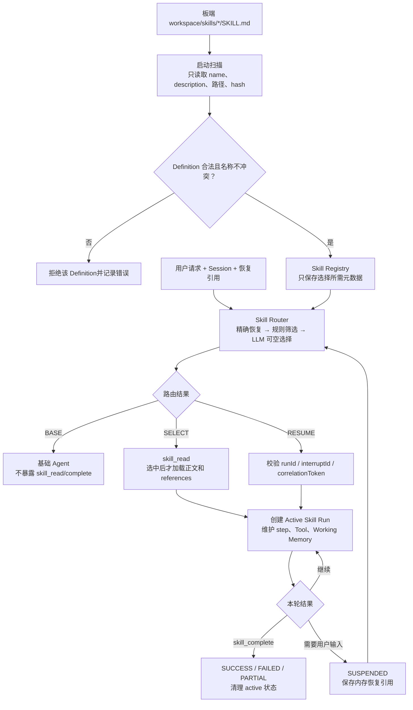
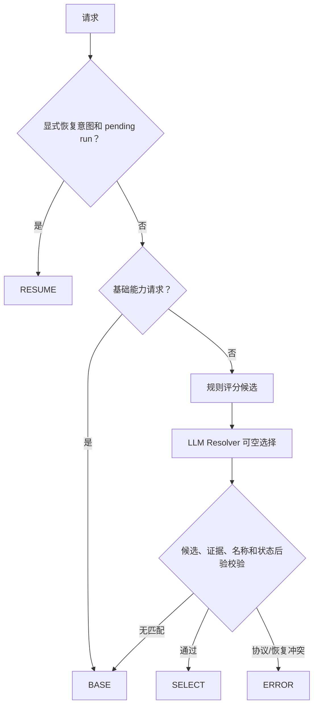
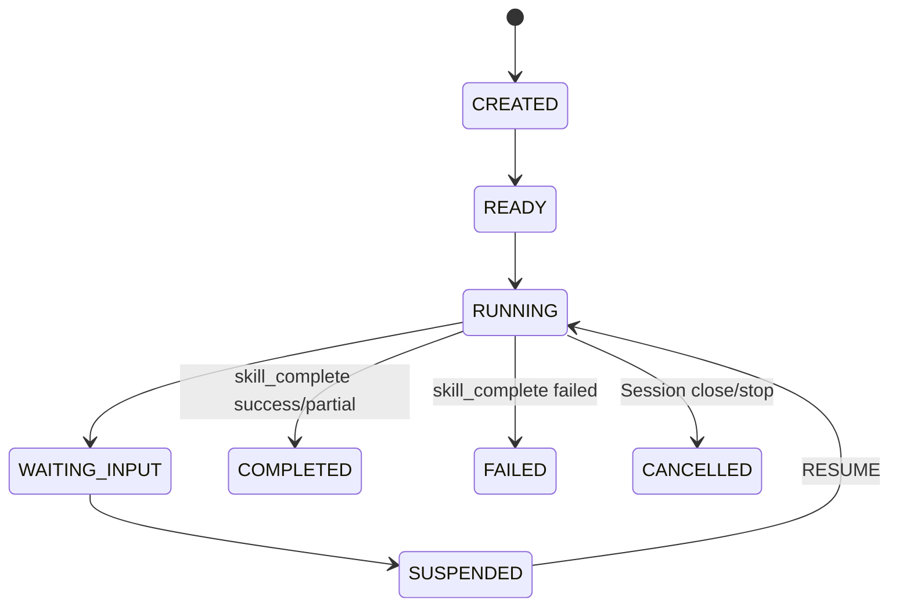
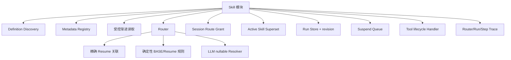
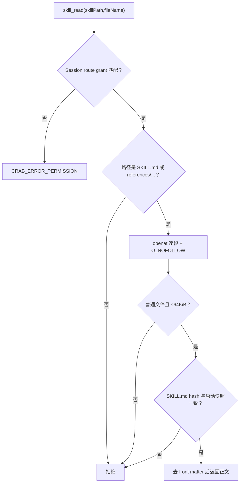
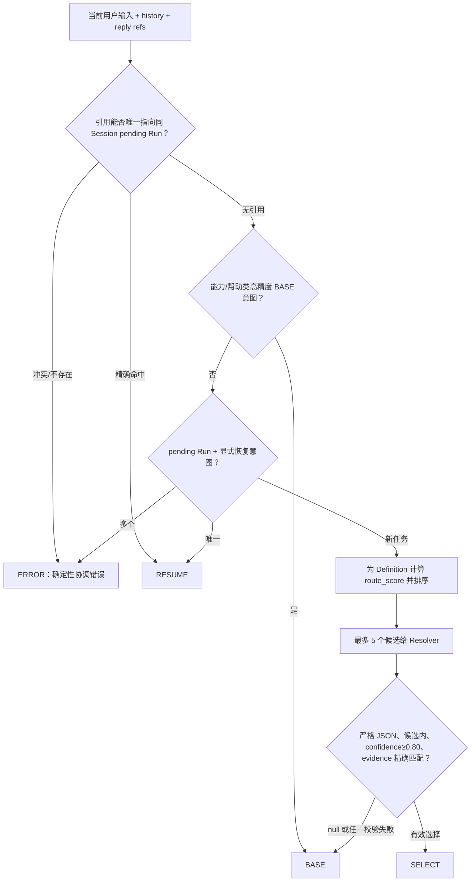
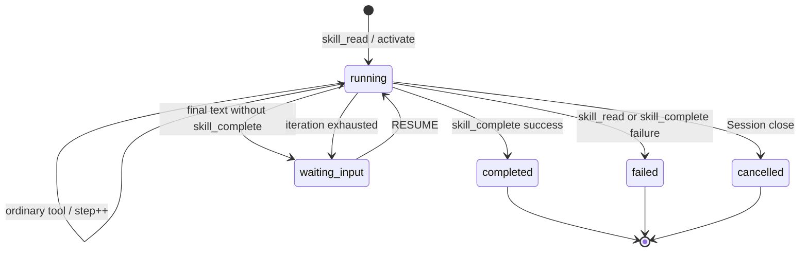
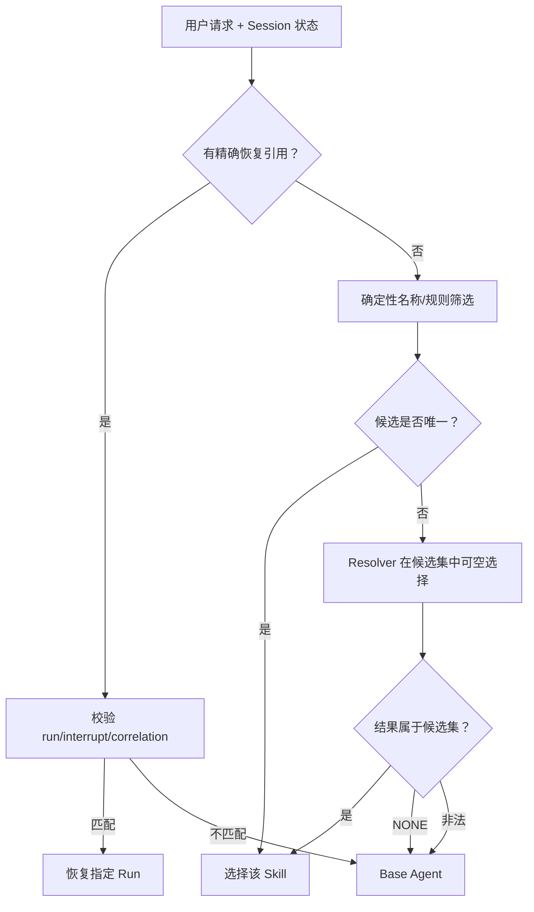
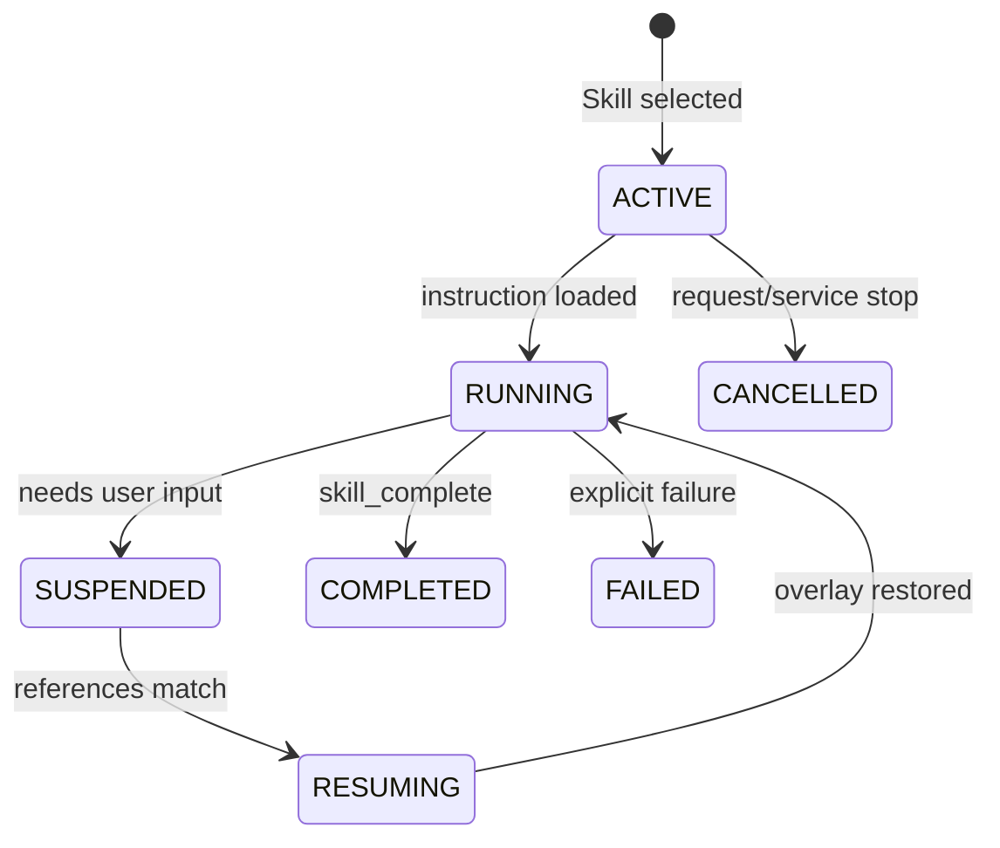

# Skill 模块架构设计

## 1. 职责

Skill 模块负责从板端 workspace 发现 Skill、只加载元数据、为请求选择零个或一个 Skill、在选中后读取正文，并维护 Skill Run 的激活、挂起、恢复和完成状态。



## 2. Definition 发现

- 默认根目录为 `<workspace>/skills`。
- 递归发现 `SKILL.md`，解析 front matter 的 `name` 和 `description`。
- 启动时保存路径、package root、scripts dir 和 SHA-256 definition hash。
- 启动上下文只暴露选择元数据，不把所有 Skill 正文塞入 Prompt。
- 正文和引用资源必须通过 `skill_read` 且路径通过 canonical root 校验。

## 3. Router



Router 是 Skill 选择的唯一入口。基础 Agent不能在后续对话中自行猜测另一个 Skill；SELECT/RESUME 后系统提示只允许读取已选中的 Skill。

## 4. Run 状态



运行时同时维护 `SkillStateSuperset`、`SkillRunSnapshot` 和 suspend queue。状态迁移写 Trace；Session 记录本次允许的 Skill，防止普通文件 Tool 绕过读取其他 Skill 指令。

## 5. Tool 交互

| Tool | 功能 |
|---|---|
| `skill_read` | 读取 Router 已选择 Skill 的正文或合法相对引用，并缓存到 Working Memory |
| `skill_complete` | 显式提交 success/failed/partial 和 summary，结束当前 Skill |
| 领域 Tool | 由 Skill 指令选择，如 PLC_Diagnosis 使用 `exec_program` 调用板端二进制 |

如果模型在 Skill 活跃时直接输出文本而未完成，当前实现会把状态放入 suspend queue，而不是隐式宣布成功。

## 6. 当前限制

- 状态主要在内存和 Session 结构中，尚无独立持久化 Run/Step/approval checkpoint。
- 只有单 Agent 线程，不能安全并发多个 Skill Run。
- 没有通用审批/Policy 引擎和补偿事务。
- 有副作用 Skill 缺少跨请求、跨告警、跨崩溃的 remediation ledger。
- `skill_complete` 表示流程完成，不自动证明外部问题已经修复；Skill 必须执行自己的问题复查。
- Resolver 仍依赖 LLM，虽有候选和证据后验校验，仍需持续做误路由评估。

## 7. 关键文件

- `include/litecrab/kernel.h`
- `src/kernel/skill.c`
- `src/kernel/kernel.c`
- `src/runtime/builtin_tools.c`
- `skills/*/SKILL.md`

## 8. 完整子功能结构



## 9. Definition 发现和验证

| 子功能 | 当前实现 |
|---|---|
| 根目录 | 只使用 `<workspace>/skills` 的 canonical path，不从任意 CWD 猜测 |
| 扫描范围 | 只扫描第一层 `<skill>/SKILL.md` |
| 数量 | Registry 最多 32 个 |
| 顺序 | 目录名按字节序排序后装载 |
| 文件约束 | Skill 根、包目录、SKILL.md 不能是符号链接；SKILL.md 必须普通文件 |
| 尺寸 | SKILL.md 1～131072 B |
| metadata | 简化 front matter，只消费 `name` 与 `description`/`prompt` |
| 定位 | 保存 path、canonical packageRoot、scriptsDir |
| 完整性 | 启动时计算 SKILL.md SHA-256 `definitionHash` |

`SkillEntry` 只保存路由和定位所需 metadata，正文不会在启动时注入每轮上下文。当前不支持 namespace、版本依赖、热更新、完整 YAML schema 或 package 全量 hash。

## 10. Skill 文件读取子模块



普通 `read`、`grep` 无权读取 Skill 指令和 references；`skill_read` 是唯一指令入口。scripts 不通过 `skill_read` 暴露，执行时由 `exec_program` 根据 Skill 指令调用。

## 11. Router 子模块

Router 返回四种最终动作：BASE、SELECT、RESUME、ERROR。内部先产生规则决策，再在必要时调用可空 LLM Resolver。



Resolver 协议字段为 `selected_skill`（字符串或 null）、`confidence`、`reason_code`、`evidence`。Resolver 失败安全降级为 BASE，不会因为“最接近”而强制选 Skill。

## 12. Route Grant 强约束

Router 结果写入当前 Session：

| Route | 模型 Tool schema | Runtime grant |
|---|---|---|
| BASE | 不包含 `skill_read/skill_complete` | 不允许加载 Skill |
| SELECT X | 包含 Skill tools | 只允许 X |
| RESUME X | 包含 Skill tools | 只允许 X |
| ERROR | 不进入 Agent round | 不授权 |

约束有两层：`SkillHandlerOnSkillStart` 在激活前验证；`do_skill_read` 在真正读文件时再次验证。这样即使模型生成错误 `skillPath`，也不会激活或读取未选 Skill。

## 13. 运行状态结构

```text
SkillSessionState[32]
├── sessionId
├── active SkillStateSuperset（每 Session 最多一个）
└── history[8]

SkillStateSuperset
├── SkillBasicInfo：name/runId/scriptsDir
├── SkillExecState：active/phase/step/llm/time/outcome
└── SkillTraceInfo：span/token

SuspendQueue[16]
└── basic + exec + sessionId + interruptionId + correlationToken

RunStore[64]
└── runId/sessionId/name/hash/status/revision/step/llm/time/reason
```

只有 RunStore 由独立 mutex 保护；整体业务仍依赖单 Agent 线程。容量满时 RunStore 先删除最早找到的 terminal Run；没有 terminal 条目时无法记录新 Run。Suspend Queue 满会导致挂起失败，当前上层没有完善的持久降级。

## 14. Active/Run 状态机



`SkillExecPhase` 和 `SkillRunStatus` 是两套粒度不同的状态：前者服务 active superset，后者服务可查询快照。迁移必须经过 Handler/transition 函数并增加 revision、写状态事件。

## 15. Tool Handler 子功能

| 事件 | Handler 动作 |
|---|---|
| 模型计划 `skill_read` | 校验 grant；恢复同名 suspended 或挂起旧 active；创建 Active 和 Run |
| `skill_read` 成功 | Working Memory 缓存指令；Run 保持 running |
| `skill_read` 失败 | 新建的 Active/Run 标记 failed |
| 普通 tool 完成 | stepCount++，记录最后 exit code，写 skill_step 日志 |
| `skill_complete` 成功 | Run→completed，归档 active，清空当前 active |
| `skill_complete` 失败 | Run→failed |
| LLM 输出 final 但未 complete | active 进入 Suspend Queue，Run→waiting_input |
| Session close | active 与该 Session suspended runs→cancelled |

`skill_complete.summary` 当前只是模型提交的字符串证据；Runtime 尚未按 SKILL.md completion checks 自动验证业务事实。普通工具成功也不会隐式完成 Skill。

## 16. Suspend 与 Resume

恢复关联优先级为 `replyToInterruptId`、`replyToRunId`、`correlationToken`。所有精确匹配都要求同一 Session；多个引用必须指向同一 Run。没有精确引用时，只有明确“继续/恢复”等意图且 pending 唯一，才自动恢复。

恢复后从 Suspend Queue 删除 entry，Active phase 设为 RESUMING，Run 状态回到 RUNNING，Working Memory workflow 回到 RUNNING。当前 Run/Suspend/Active 未持久化，服务重启后不能恢复；Session 文件中残留的 Working Memory 只能提供上下文，不能当作权威 Run。

## 17. 可观测性

- `skill.candidates.resolved`：session、action、skill、confidence、reason、source、evidence。
- `skill.run.state_changed`：session、runId、skill、from/to、revision、reason。
- Tool Trace：toolName、input、bounded output、exitCode。
- LLM Trace：Router resolver 使用 iteration 0；主 Agent 从 1 开始。
- 文本日志：activate、step、suspend、recover、complete 等事件。

## 18. 当前未实现的子系统

- Definition 严格 manifest、版本和整个 package snapshot。
- per-Skill Tool allowlist、文件/网络 capability 和审批。
- completion contract 的结构化证据校验。
- Run/Suspend 的磁盘持久化、CAS、租约和崩溃恢复。
- 多 Agent 并发运行和跨进程 Run Store。
- side-effect mutation ledger、补偿/回滚编排。

## 19. 能力设计与示例

### 19.1 SKL-01：发现和验证可用 Skill Definition

启动时 Registry 扫描配置的 Skill 根目录，只加载符合目录和 front matter 规则的 Definition。常驻内容是 name、description、路径和必要元数据，不把全部正文塞入每次 prompt。Definition 是不可变能力描述，不能保存某次任务的执行状态。

错误示例：两个目录声明同名 Skill，或 `SKILL.md` 缺少 description。加载器应记录明确错误并拒绝不确定 Definition，不能依赖文件系统遍历顺序随机覆盖。

### 19.2 SKL-02：先确定性筛选，再让 LLM 做可空选择

Router 首先处理明确恢复引用和规则命中，再对有限候选调用 resolver。resolver 可以选择一个候选，也可以返回 NONE；它不能发明 Registry 中不存在的名称。低置信度不是必须追问，普通请求可以自然落回 base Agent。



### 19.3 SKL-03：渐进式加载正文和资源

只有选中 Skill 后，Kernel 才允许 `skill_read` 读取它的正文或包内资源。读取路径必须位于该 Skill 目录和 Runtime workspace 允许范围内。这样普通请求不会承载无关领域说明，也不能借 Skill 路径读取任意系统文件。

示例：PLC Skill 被选中后先读取 `SKILL.md`；只有说明明确要求接口字段时才继续读取 `references/`。脚本不是由模型直接执行，仍通过已注册 Tool 或受限二进制入口。

### 19.4 SKL-04：管理 Active、Run、Step 和 Tool 生命周期

一次选中创建 Skill Run，并记录 run id、session、phase、当前 step、已调用 Tool 和最后结果。Tool call 开始/结束会同步更新 Working Memory 和 Trace。只有显式完成、失败或挂起才能离开 active 状态，不能因为模型输出了一段说明就隐式丢弃 Run。

### 19.5 SKL-05：挂起与精确恢复

需要用户输入时，Run 进入 suspended queue，生成 runId、interruptId 和 correlationToken。后续请求必须携带可验证引用，或者满足严格的同 Session 恢复规则；普通新问题不得误恢复旧 Run。



当前这些 Run/Active/Suspend 结构没有磁盘权威状态；进程重启后不能保证精确恢复。

### 19.6 SKL-06：约束副作用步骤和失败后的责任

Skill 而不是 Step 4 Alarm Service 决定诊断、写入、验证和是否再次尝试。以 PLC 修复为例，参数写入并回读成功后，如果告警仍存在，Skill 必须报告“参数修复成功、问题修复未通过”并停止本轮继续递增。Alarm 只处理该结论的交付状态。

若写入前失败，可以按 Skill 规则判断是否重试；若写入是否成功不确定，必须重新读取和核对，不得盲目重放。当前缺少持久 remediation ledger，因此跨重启、跨重复告警的副作用幂等仍是未完成能力。

## 20. 能力状态

| 能力 | 状态 | 当前边界 |
|---|---|---|
| Definition 扫描、校验和渐进加载 | 已实现 | manifest 能力仍较轻量 |
| 可空路由和候选后验校验 | 已实现 | resolver 质量依赖模型 |
| Route Grant 与工具面约束 | 已实现 | Policy Engine 未完成 |
| Run、挂起和恢复 | 部分实现 | 仅内存，重启不能恢复 |
| 副作用幂等 ledger/checkpoint | 未实现 | PLC 重复修改的关键剩余风险 |

## 21. 测试对应关系

- `tests/test_main.c`：发现、路径、hash、Router、route grant、状态迁移、挂起/恢复和完成。
- `tests/test_agent_matrix.py`：基础任务与 Skill 正反例。
- `tests/test_resolver_modes.py`：nullable resolver、stream/non-stream、非法输出降级。
- `tests/test_session_restart.py`：确认 Session 可恢复但 Skill Run 不被误认为已恢复。
- `tests/test_alarm_e2e.py`：告警触发 PLC_Diagnosis 并显式 complete 的完整链路。

- `tests/test_resolver_modes.py`
- `tests/test_agent_matrix.py`
