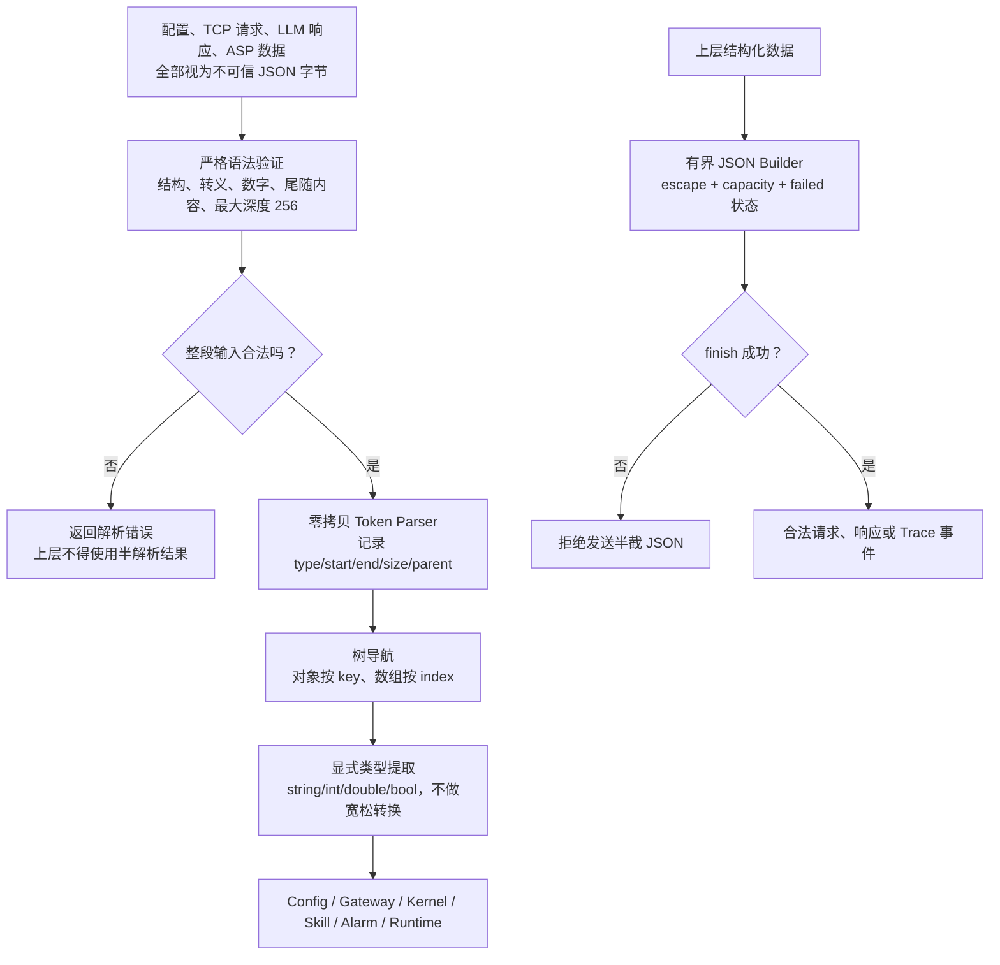
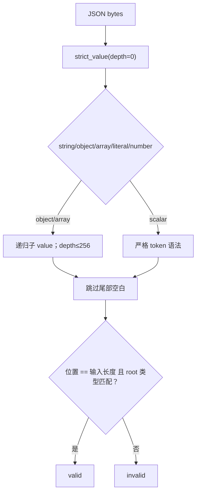
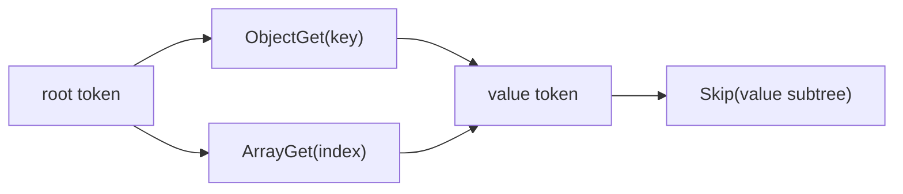
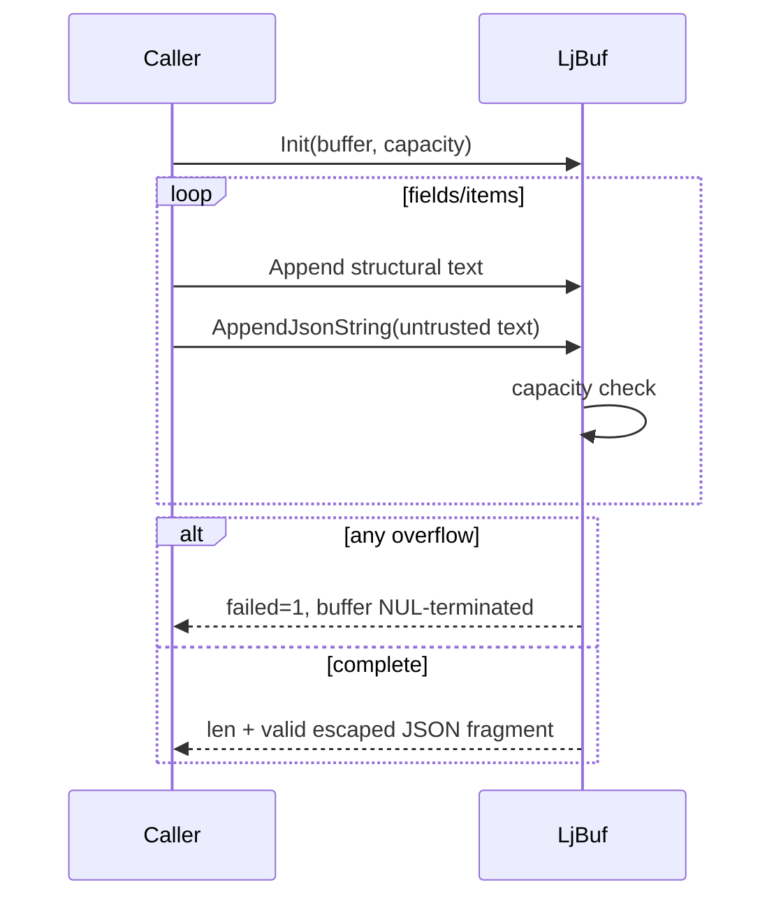
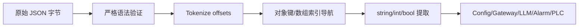

# JSON Utility 模块架构设计

本文描述 `include/litecrab/json.h` 和 `src/util/json.c` 的当前实现。该模块是 Config、Gateway、Kernel、Skill、Session、Alarm、Runtime 和 Observability 共用的无外部依赖 JSON 基础设施。

## 1. 职责和边界

JSON Utility 提供四组子功能：严格语法校验、零拷贝 token 化、类型提取/树遍历、有界 JSON 构建。它不提供 DOM、自动内存管理、schema、对象修改、浮点精度策略或流式解析。



## 2. 数据结构

```text
LjParser
├── pos：当前输入位置
├── next：下一个 token 索引
└── super：当前父 token

LjToken
├── type：OBJECT / ARRAY / STRING / PRIMITIVE
├── start / end：原 JSON 中的半开区间
├── size：直接子 token 数
└── parent：父 token 索引

LjBuf
├── data / size / len
└── failed：首次溢出后保持失败
```

Token 不复制字符串，调用方必须保证原始 JSON 在 token 使用期间仍然有效。

## 3. 严格语法校验

`LjValidate(json, rootType)` 使用独立递归下降校验器，而不是仅依赖宽松 token parser。

| 子功能 | 校验内容 |
|---|---|
| whitespace | 允许 JSON 空白，根值后不允许额外非空字符 |
| object | key 必须是 string；必须有 colon；成员由 comma 分隔；不允许尾逗号 |
| array | 元素由 comma 分隔；不允许尾逗号 |
| string | 拒绝控制字符；只允许标准 escape 或四位 `\u` |
| number | 处理负号、整数、fraction 和 exponent；拒绝前导零和不完整指数 |
| literal | 只接受 `true`、`false`、`null` |
| depth | 最大递归深度 256 |
| root | 可要求根为 object 或 array |



调用方通常先 `LjValidate`，再 `LjParse` 获取 token；不能把 `LjParse` 单独当成严格 JSON 安全校验。

## 4. Token Parser

`LjParse` 单遍扫描输入并由调用方提供固定 token 数组：

- `{`/`[` 分配容器 token 并更新 parent。
- `}`/`]` 从后向前找到未闭合容器并校验类型。
- string 识别 escape 和 `\uXXXX`。
- primitive 扫描到分隔符。
- token 容量不足返回 -1；非法输入返回 -2；未闭合结构返回 -3。

该 parser 不分配内存，因此适合 32 位板端；token 容量由各调用方根据输入尺寸或固定业务上限决定。

## 5. 树导航

| API | 功能 | 复杂度/边界 |
|---|---|---|
| `LjTokenEq` | 比较 string token 与 ASCII key | 不执行 unescape，适合普通字段名 |
| `LjSkip` | 跳到当前 token 子树之后 | 依据 start/end 范围线性跳过 |
| `LjObjectGet` | 找 object 的 key 并返回 value 索引 | 线性扫描当前 object |
| `LjArrayGet` | 返回第 N 个直接元素 | 从首元素线性扫描 |



没有对象 key 索引缓存；大对象或循环随机访问会产生重复线性扫描，当前业务 JSON 规模有界，因此接受这个取舍。

## 6. 类型提取

| API | 输入要求 | 输出规则 |
|---|---|---|
| `LjString` | STRING token | 解码标准 escape、`\uXXXX` 和有效 surrogate pair，输出 UTF-8 |
| `LjInt64` | PRIMITIVE token | `strtoll` 且必须完整消费，无 errno |
| `LjDouble` | PRIMITIVE token | `strtod` 且必须完整消费，无 errno |
| `LjBool` | PRIMITIVE token | 只接受精确 `true`/`false` |

目标缓冲区不足时 `LjString` 返回失败并保持 NUL 结尾。孤立 surrogate 当前会按该 code unit 编码，而严格校验器只验证 `\u` 形式，不验证 Unicode 标量完整性；外部不可信文本仍应由业务层决定是否接受。

## 7. 有界 JSON Builder

`LjBufInit` 绑定调用方缓冲区；`LjAppend` 使用 `vsnprintf`；任一追加溢出后设置 `failed=1`，后续追加全部失败，不返回半成功状态。

`LjAppendJsonString` 负责：

- 转义 quote 和 backslash；
- 把 LF/CR/TAB 写成 escape；
- 其他 C0 控制字符写成 `\u00xx`；
- 非控制 UTF-8 bytes 原样保留。



调用方必须检查 `failed` 或 API 返回值；不能发送一个因溢出而被截断的 JSON 对象。

## 8. 各模块使用方式

| 消费模块 | 使用点 |
|---|---|
| Config | 严格验证配置根对象并读取 typed fields |
| Gateway | 解析请求 string 字段，构建 JSON response |
| Kernel | message tree、Tool schema、Tool call args、LLM response |
| Skill | frontmatter 外的 resolver JSON、history、Trace tool calls |
| Session | 校验和裁剪 messages array |
| Alarm | ASP response、canonical key、occurrence 白名单 |
| Runtime | 统一 ToolResponse 文本中的安全 JSON 片段 |
| Observability | JSONL field escape 和数组嵌入校验 |

## 9. 失败语义和安全要求

- 所有返回值以 0/非负表示成功、负数表示失败，具体 parser 负值只供定位类别。
- Token 数组是调用方内存；parser 不检查业务 schema。
- `LjObjectGet` 返回首个同名 key，严格校验器当前不拒绝重复 key；安全敏感配置应增加业务层重复字段检测。
- Builder 不动态扩容；上层应选择有界容量并在失败时拒绝整条消息。
- JSON Utility 不是 HTML、URL、shell 或日志脱敏器；不同输出上下文仍需独立编码。

## 10. 能力设计与示例

### 10.1 JSON-01：在 token 化前执行严格语法验证

JSON Utility 首先逐字节验证对象、数组、字符串、数字和 literal，拒绝尾随垃圾、非法转义、未闭合结构和超过 256 层的嵌套。这样上层不能因为 token parser 的宽松行为接受非标准输入。

示例：`{"content":"ok"} trailing` 必须整体失败；不能只解析前面的 object。`{"n":01}` 也因数字格式非法而失败。

### 10.2 JSON-02：构造零拷贝 token 树

Parser 不为每个字段复制字符串，而是在原始 JSON 缓冲区上记录 token 的类型、start、end、size 和 parent。调用方必须保证原始缓冲区在 token 使用期间保持有效。



零拷贝降低小型设备上的分配次数，但也带来生命周期约束：不能释放 `ParsedFile.buffer` 后继续保存指向其中内容的 token。

### 10.3 JSON-03：以显式类型读取字段

对象查找和数组索引先验证父节点类型和边界，再返回 token。字符串、整数和布尔提取不会执行宽松隐式转换。例如 JSON 字符串 `"42"` 不能被整数 getter 当作 42。

调用方应区分“字段不存在”和“字段存在但类型错误”。可选字段缺失可以使用默认值；类型错误通常表示配置或协议损坏，应拒绝输入。

### 10.4 JSON-04：使用有界 Builder 生成合法 JSON

Builder 维护 buffer、capacity、length 和 failed 状态。追加字符串时执行必要 escape；任何一次空间不足都会设置 failed，后续操作不再产生看似合法的半截 JSON。调用方只有在 finish 成功后才能发送或落盘。

示例：Tool 输出包含换行和双引号时，Builder 生成 `\n` 和 `\"`。若目标缓冲不足，返回失败而不是截断成无法解析的响应。

### 10.5 JSON-05：作为共享安全边界被多个模块复用

Config 使用它解析启动配置，Gateway 使用它解析客户端协议，LLM 使用它解析 Provider 响应，Alarm/PLC 使用它校验设备数据。同一严格实现减少各模块自写 parser 造成的语义分叉。

限制是当前 parser 不拒绝重复对象 key，也不自动把字符串 token 解码成新缓冲区。调用方处理安全敏感对象时应明确重复键策略；需要实际 Unicode/escape 内容时必须使用对应复制/解码函数，而不是直接比较原始字节。

## 11. 能力状态

| 能力 | 状态 | 当前边界 |
|---|---|---|
| 严格语法、深度和尾随内容校验 | 已实现 | 最大深度 256 |
| 零拷贝 token 和树导航 | 已实现 | 原始缓冲区必须存活 |
| 显式类型提取 | 已实现 | 无通用 schema 引擎 |
| 有界 Builder 和字符串 escape | 已实现 | 调用方负责容量规划 |
| 重复 key 拒绝与覆盖式 fuzz | 未实现 | 后续需要补强 |

## 12. 关键文件和测试

- `include/litecrab/json.h`：公开数据结构和 API。
- `src/util/json.c`：严格校验、token parser、导航、提取和 builder。
- `tests/test_main.c`：通过 Config、Kernel、Runtime、Session、Alarm 和 Trace 场景覆盖 JSON 正反例。
- `skills/PLC_Diagnosis/scripts/tests/test_normalized_output.py`：验证最终领域 JSON 可被标准解析器读取。

当前没有独立 fuzz target。由于该模块处理所有外部 JSON，后续应增加针对 `LjValidate/LjParse/LjString` 的 libFuzzer/AFL corpus，重点覆盖深度、重复键、Unicode surrogate、数值边界和 token 容量。
